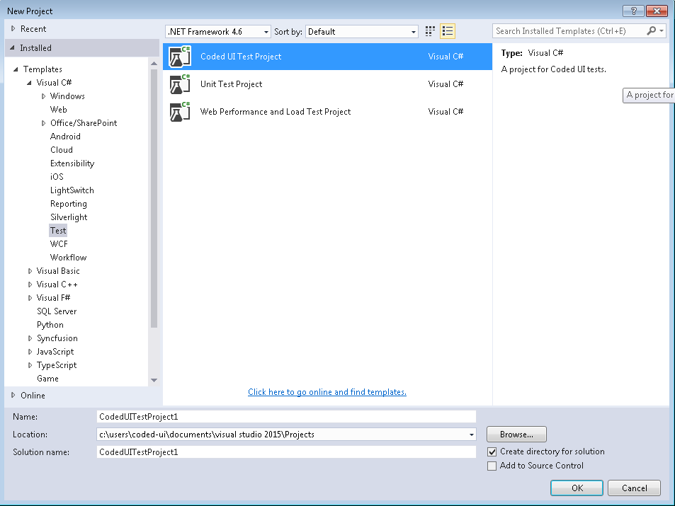
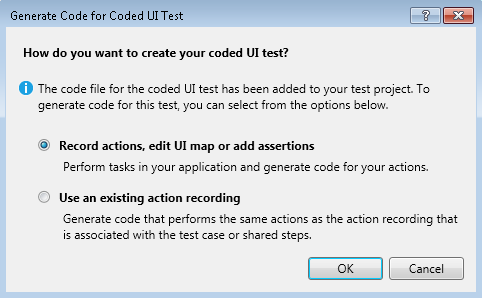
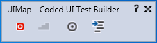
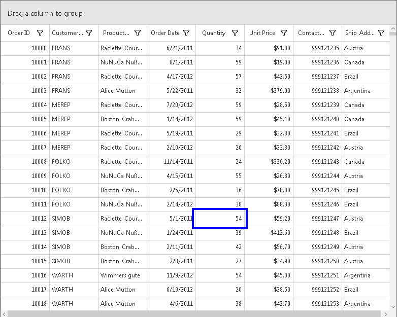
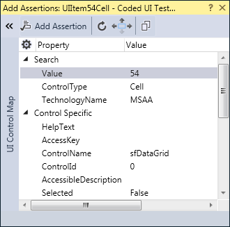

# UI Automation in Windows Forms DataGrid (SfDataGrid)

Microsoft UI automation is a new accessibility Framework for Microsoft Windows available on all the operating systems that support Windows Forms. UI automation provides accessibility to most of the UI elements and provides information about the UI element to the end user. You can interact with UI by using the automated test scripts. To learn more about UI automation, refer to the [MSDN page](https://docs.microsoft.com/en-us/dotnet/framework/ui-automation/ui-automation-overview).

SfDataGrid supports the following types of UI automations:

    1.Coded UI test
    2.Quick test professional

## Coded UI test

Automated tests that drive your application through its user interface (UI) are known as Coded UI Tests (CUITs). These tests include functional testing of the UI controls. SfDataGrid supports CUITs Coded UI automation to create automated tests for the inner elements and records the sequence of actions. When dragging the crosshair shown in CodedUITestBuilder on UI elements, it shows the properties of the respective UI elements. The assertion can also be added for each properties of SfDataGrid.

SfDataGrid supports the following two levels of CUIT automations.

<table>
<tr>
<td>
{{'**Levels**'| markdownify }}
</td>
<td>
{{'**Description**'| markdownify }}
</td>
</tr>
<tr>
<td>
{{'**Level 1**'| markdownify }}
</td>
<td>
Record and playback: Recorder identifies elements involved in an action. Playback is processed based on the generated code via Microsoft Active Accessibility (MSAA).
</td>
</tr>
<tr>
<td>
{{'**Level 2**'| markdownify }}
</td>
<td>
Property validation: A set of default properties are defined based on the MSAA control type for each control where users can add assertions.
</td>
</tr>
</table>

### Requirements and configuration

Coded UI provides support only in Visual Studio Ultimate and Premium. For more information about the platforms and configurations supported by Coded UI tests, refer to this [page](https://docs.microsoft.com/en-us/visualstudio/test/supported-configurations-and-platforms-for-coded-ui-tests-and-action-recordings?view=vs-2015).

### Enable assertion

The Coded UI support for SfDataGrid can be enabled using the `AccessibilityEnabled` property.



//To enable the accessibility.
 this. sfDataGrid1.AccessibilityEnabled = true;


'To enable the accessibility.
Me. sfDataGrid1.AccessibilityEnabled = true



### Getting started

Follow the steps to create a `CodedUITest project` and test the `SfDataGrid` application:

1. Create a new application or open an existing application with `SfDataGrid`.
2. Create a Coded UI Test project. A CUIT file will be added automatically.

    

3. Then, the Generate Code dialog box appears, choose `Record actions, edit UI map or add assertions`.

    

4. Now, the Coded UI project Visual Studio gets minimized and `CodedUITestBuilder` appears in the bottom right corner of the window. Record the actions by clicking Start Recording icon in `CodedUITestBuilder`.

    

5. You can also open the `CodedUITestBuilder` from the existing Coded UI project by right clicking the `CodedUITestMethod1` in CUIT file and clicking the Generate Code for Coded UI Test. The same `CodedUITestBuilder` appears in the bottom right corner of the window.

    

6. Drag the crosshairs on to the UI elements in the `SfDataGrid` application. It shows the available properties of the inner UI elements. 
7. Record the actions made on the UI elements by clicking the `Record` button on `CodedUITestBuilder`.

    

8. Then, click the `GenerateCode` icon in `CodedUITestBuilder` to generate a test method. Close the `CodedUITestBuilder` and see the generated code for the cell value changed action.
9. Create an assertion to check the modified cell value. Drag the crosshair to the modified cell, the `Assertion` window appears. The properties for the control is now listed in the Assertion dialog box. Add the assertion by clicking the Generate Code button in `CodedUITestBuilder`.

    

10. After creating all the tests and assertions, right click the Test method. Click `Run Tests` to run the test.

    

## QTP

You can refer to the UFT/QTP document [here](https://help.syncfusion.com/windowsforms/testing/uft/supported-controls-and-methods).
