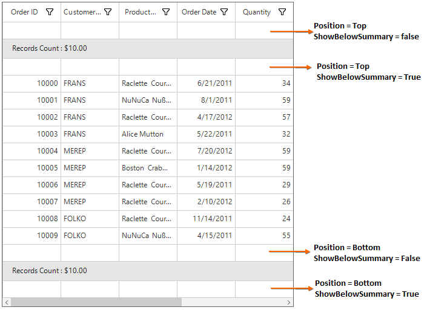
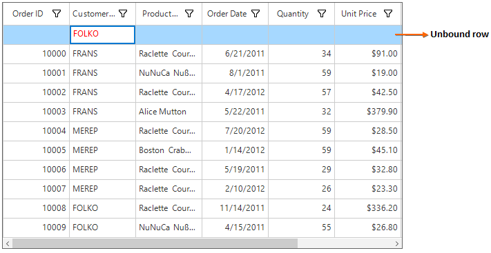
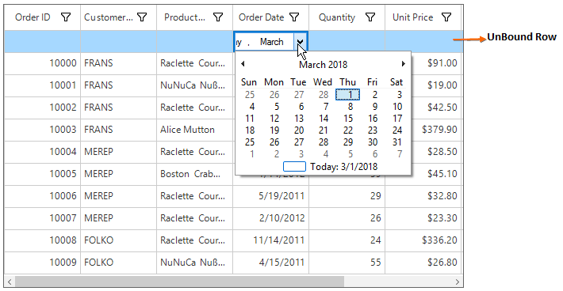
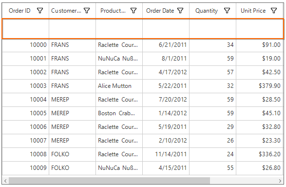

# Unbound Rows in Windows Forms DataGrid (SfDataGrid)
SfDataGrid allows to add **additional rows** at top and also bottom of the SfDataGrid which are **not bound with data object** from underlying data source. The unbound rows can add by using [SfDataGrid.UnboundRows](https://help.syncfusion.com/cr/windowsforms/Syncfusion.WinForms.DataGrid.UnboundRows.html) collection property. SfDataGrid allows to add any number of unbound rows. Unbound rows can be exported to excel and PDF.


this.sfDataGrid.UnboundRows.Add(new GridUnboundRow() { Position = VerticalPosition.Top });


Me.sfDataGrid.UnboundRows.Add(New GridUnboundRow() With {.Position = VerticalPosition.Top})



## Positioning Unbound Rows
Unbound row can be placed in top or bottom of the SfDataGrid. Unbound row positioned based on [GridUnboundRow.Position](https://help.syncfusion.com/cr/windowsforms/Syncfusion.WinForms.DataGrid.GridUnboundRow.html#Syncfusion_WinForms_DataGrid_GridUnboundRow_Position) and [GridUnboundRow.ShowBelowSummary](https://help.syncfusion.com/cr/windowsforms/Syncfusion.WinForms.DataGrid.GridUnboundRow.html#Syncfusion_WinForms_DataGrid_GridUnboundRow_ShowBelowSummary) properties.
Below table shows the unbound row positioning based on property settings of Position and ShowBelowSummary.
<table>
<tr>
<td>
{{'**UnboundRow Position**'| markdownify }}
</td>
<td>
{{'**ShowBelowSummary**'| markdownify }}
</td>
<td>
{{'**Position in DataGrid**'| markdownify }}
</td>
</tr>
<tr>
<td>
Top
</td>
<td>
True
</td>
<td>
Unbound row placed at top, right above the record rows. In this position, unbound row is selectable and {{'**editable**'| markdownify }}.

</td>
</tr>
<tr>
<td>
Top
</td>
<td>
False
</td>
<td>
Unbound row placed at top, right next to Header row. In this position, unbound row is not selectable, {{'**not editable** '| markdownify }}and {{'**frozen** '| markdownify }}when scrolling.

</td>
</tr>
<tr>
<td>
Bottom
</td>
<td>
True
</td>
<td>
Unbound row placed at bottom of SfDataGrid. In this position, unbound row is {{'**not selectable**'| markdownify }}, {{'**not editable** '| markdownify }}and {{'**frozen** '| markdownify }}when scrolling.

</td>
</tr>
<tr>
<td>
Bottom
</td>
<td>
False
</td>
<td>
Unbound row placed at bottom, right below record rows. In this position, unbound row is {{'**selectable** '| markdownify }}and {{'**editable**'| markdownify }}.
</td>
</tr>
</table>


// Add the unbound row at top and above the summary row.
this.sfDataGrid.UnboundRows.Add(new GridUnboundRow() { Position = VerticalPosition.Top, ShowBelowSummary = false });

// Add the unbound row at top and below the summary row.
this.sfDataGrid.UnboundRows.Add(new GridUnboundRow() { Position = VerticalPosition.Top, ShowBelowSummary = true });

// Add the unbound row at bottom and below the summary row.
this.sfDataGrid.UnboundRows.Add(new GridUnboundRow() { Position = VerticalPosition.Bottom, ShowBelowSummary = true });

// Add the unbound row at bottom and above the summary row.
this.sfDataGrid.UnboundRows.Add(new GridUnboundRow() { Position = VerticalPosition.Bottom, ShowBelowSummary = false });



' Add the unbound row at top and above the summary row.
Me.sfDataGrid.UnboundRows.Add(New GridUnboundRow() With {.Position = VerticalPosition.Top, .ShowBelowSummary = False})

' Add the unbound row at top and below the summary row.
Me.sfDataGrid.UnboundRows.Add(New GridUnboundRow() With {.Position = VerticalPosition.Top, .ShowBelowSummary = True})

' Add the unbound row at bottom and below the summary row.
Me.sfDataGrid.UnboundRows.Add(New GridUnboundRow() With {.Position = VerticalPosition.Bottom, .ShowBelowSummary = True})

' Add the unbound row at bottom and above the summary row.
Me.sfDataGrid.UnboundRows.Add(New GridUnboundRow() With {.Position = VerticalPosition.Bottom, .ShowBelowSummary = False})


Below screen shot shows different unbound rows placed in all possible positions,

## Populating Data for Unbound Rows
The data for the unbound row can populated by handling [QueryUnboundRowInfo](https://help.syncfusion.com/cr/windowsforms/Syncfusion.WinForms.DataGrid.SfDataGrid.html) event of SfDataGrid. This event occurs for each cell in unbound row whenever the row gets refreshed. [QueryUnboundRowInfoArgs](https://help.syncfusion.com/cr/windowsforms/Syncfusion.WinForms.DataGrid.Events.QueryUnboundRowInfoArgs.html) of the `QueryUnboundRowInfo` event provides information about the cell triggered this event.
The [QueryUnboundRowInfoArgs.Value](https://help.syncfusion.com/cr/windowsforms/Syncfusion.WinForms.DataGrid.Events.QueryUnboundRowInfoArgs.html#Syncfusion_WinForms_DataGrid_Events_QueryUnboundRowInfoArgs_Value) property can be get or set based on the [UnboundAction](https://help.syncfusion.com/cr/windowsforms/Syncfusion.WinForms.DataGrid.Events.QueryUnboundRowInfoArgs.html#Syncfusion_WinForms_DataGrid_Events_QueryUnboundRowInfoArgs_UnboundAction). If `UnboundAction` is `QueryData` then the value can set for display. If the `UnboundAction` is `CommitData` then able to get the edited value.


//Select some records in SfDataGrid.
this.sfDataGrid.SelectedItems.Add(data.OrdersListDetails[2]);
this.sfDataGrid.SelectedItems.Add(data.OrdersListDetails[3]);
this.sfDataGrid.SelectedItems.Add(data.OrdersListDetails[4]);

//Raise the QueryUnboundRowInfo event
this.sfDataGrid.QueryUnboundRowInfo += sfDataGrid_QueryUnboundRowInfo;

void sfDataGrid_QueryUnboundRowInfo(object sender, QueryUnboundRowInfoArgs e)
{
    if (e.UnboundAction == UnboundActions.QueryData)
    {
        if (e.RowColumnIndex.ColumnIndex == 0)
        {
            e.Value = (sfDataGrid.SelectedItems.OrderBy(item => (item as OrderInfo).OrderID).Last() as OrderInfo).OrderID;
            e.Handled = true;
        }
        else if (e.RowColumnIndex.ColumnIndex == 2)
        {
            e.Value = (sfDataGrid.SelectedItems.First(item => (item as OrderInfo).ProductName.Contains("R")) as OrderInfo).ProductName;
            e.Handled = true;
        }
    }
}



'Select some records in SfDataGrid.
Me.sfDataGrid.SelectedItems.Add(data.OrdersListDetails(2))
Me.sfDataGrid.SelectedItems.Add(data.OrdersListDetails(3))
Me.sfDataGrid.SelectedItems.Add(data.OrdersListDetails(4))

'Raise the QueryUnboundRowInfo event
AddHandler Me.sfDataGrid.QueryUnboundRowInfo, AddressOf sfDataGrid_QueryUnboundRowInfo

void sfDataGrid_QueryUnboundRowInfo(Object sender, QueryUnboundRowInfoArgs e)
	If e.UnboundAction = UnboundActions.QueryData Then
		If e.RowColumnIndex.ColumnIndex = 0 Then
			e.Value = (TryCast(sfDataGrid.SelectedItems.OrderBy(Function(item) (TryCast(item, OrderInfo)).OrderID).Last(), OrderInfo)).OrderID
			e.Handled = True

		ElseIf e.RowColumnIndex.ColumnIndex = 2 Then
			e.Value = (TryCast(sfDataGrid.SelectedItems.First(Function(item) (TryCast(item, OrderInfo)).ProductName.Contains("R")), OrderInfo)).ProductName
			e.Handled = True
		End If
	End If



## Refreshing the Unbound Rows at Runtime
The unbound rows can be add or remove using `UnboundRows` property which reflects in UI immediately. The `QueryUnboundRowInfo` event for the unbound row cells at runtime by invalidating the unbound row by calling [SfDataGrid.InValidateUnboundRow](https://help.syncfusion.com/cr/windowsforms/Syncfusion.WinForms.DataGrid.SfDataGrid.html#Syncfusion_WinForms_DataGrid_SfDataGrid_InValidateUnboundRow_Syncfusion_WinForms_DataGrid_GridUnboundRow_System_Boolean_) method.


this.sfDataGrid.InValidateUnboundRow(sfDataGrid.UnboundRows[0], true);
this.sfDataGrid.TableControl.Invalidate();



this.sfDataGrid.InValidateUnboundRow(sfDataGrid.UnboundRows[0], true);
this.sfDataGrid.TableControl.Invalidate();




## Editing in Unbound Rows

### Cancel the Editing for Unbound Row Cell
The editing of unbound row cell can cancel by handling the [SfDataGrid.CurrentCellBeginEdit](https://help.syncfusion.com/cr/windowsforms/Syncfusion.WinForms.DataGrid.SfDataGrid.html) event with the help of [SfDataGrid.GetUnboundRow](https://help.syncfusion.com/cr/windowsforms/Syncfusion.WinForms.DataGrid.DataGridIndexResolver.html#Syncfusion_WinForms_DataGrid_DataGridIndexResolver_GetUnboundRow_Syncfusion_WinForms_DataGrid_SfDataGrid_System_Int32_) method and row index.


sfDataGrid.CurrentCellBeginEdit += dataGrid_CurrentCellBeginEdit;

void dataGrid_CurrentCellBeginEdit(object sender, CurrentCellBeginEditEventArgs args)
{
    var unboundRow = sfDataGrid.GetUnboundRow(args.DataRow.Index);

    if (unboundRow == null)
        return;
    args.Cancel = true;
}


AddHandler sfDataGrid.CurrentCellBeginEdit, AddressOf dataGrid_CurrentCellBeginEdit

Private Sub dataGrid_CurrentCellBeginEdit(ByVal sender As Object, ByVal args As CurrentCellBeginEditEventArgs)
	Dim unboundRow = sfDataGrid.GetUnboundRow(args.DataRow.Index)

	If unboundRow Is Nothing Then
		Return
	End If
	args.Cancel = True
End Sub



### Saving Edited Unbound Row Cell Value to External Source
The edited value of unbound row cell can get from `QueryUnboundRowInfoArgs.Value` property of QueryUnboundRowInfo event when `UnboundAction` is `CommitData`.


void sfDataGrid_QueryUnboundRowInfo(object sender, QueryUnboundRowInfoArgs e)
{
    if (e.UnboundAction == UnboundActions.CommitData)
    {
        var editedValue = e.Value;
    }
}


Private Sub sfDataGrid_QueryUnboundRowInfo(ByVal sender As Object, ByVal e As QueryUnboundRowInfoArgs)
	If e.UnboundAction = UnboundActions.CommitData Then
		Dim editedValue = e.Value
	End If
End Sub


## Appearance
The appearance of the unbound row can be customized by using the [UnboundRowStyle](https://help.syncfusion.com/cr/windowsforms/Syncfusion.WinForms.DataGrid.Styles.DataGridStyle.html#Syncfusion_WinForms_DataGrid_Styles_DataGridStyle_UnboundRowStyle) property.


sfDataGrid.Style.UnboundRowStyle.BackColor = Color.LightGray;
sfDataGrid.Style.UnboundRowStyle.TextColor = Color.Red;



sfDataGrid.Style.UnboundRowStyle.BackColor = Color.LightGray
sfDataGrid.Style.UnboundRowStyle.TextColor = Color.Red




## Customizing the Unbound Row's Behavior
SfDataGrid allows to customize the operations like key navigation and UI related interactions by overriding the corresponding renderer associated with the unbound row cell. Each renderer have set of virtual methods for handling the behaviors. Creating new renderers also supported.
The renderer of unbound row cell defined by [QueryUnboundRowInfoArgs.CellType](https://help.syncfusion.com/cr/windowsforms/Syncfusion.WinForms.DataGrid.Events.QueryUnboundRowInfoArgs.html#Syncfusion_WinForms_DataGrid_Events_QueryUnboundRowInfoArgs_CellType) property in the `QueryUnboundRowInfo` event. If the `QueryUnboundRowInfoArgs.CellType` not defined then the UnboundRowCell set as default cell type.

### Overriding Existing CellType
SfDataGrid allows to customize the unbound row cell behavior by overriding existing renderer and replace the default one in [UnboundRowCellRenderers](https://help.syncfusion.com/cr/windowsforms/Syncfusion.WinForms.DataGrid.SfDataGrid.html#Syncfusion_WinForms_DataGrid_SfDataGrid_UnboundRowCellRenderers).


public class GridUnboundRowCellTextBoxRendererExt : GridUnboundRowCellRenderer
{
    protected override void OnEditingComplete(DataColumnBase dataColumn, TextBox currentRendererElement)
    {
        base.OnEditingComplete(dataColumn, currentRendererElement);
    }

    protected override void OnInitializeEditElement(DataColumnBase column, RowColumnIndex rowColumnIndex, TextBox uiElement)
    {
        base.OnInitializeEditElement(column, rowColumnIndex, uiElement);
        uiElement.ForeColor = Color.Red;
    }
}


Public Class GridUnboundRowCellTextBoxRendererExt
	Inherits GridUnboundRowCellRenderer
	Protected Overrides Sub OnEditingComplete(ByVal dataColumn As DataColumnBase, ByVal currentRendererElement As TextBox)
		MyBase.OnEditingComplete(dataColumn, currentRendererElement)
	End Sub

	Protected Overrides Sub OnInitializeEditElement(ByVal column As DataColumnBase, ByVal rowColumnIndex As RowColumnIndex, ByVal uiElement As TextBox)
		MyBase.OnInitializeEditElement(column, rowColumnIndex, uiElement)
		uiElement.ForeColor = Color.Red
	End Sub
End Class


In the below code default renderer replaced using the above custom renderer in `SfDataGrid.UnboundRowCellRenderers`.


sfDataGrid.UnboundRowCellRenderers.Remove("UnboundRowCell");

sfDataGrid.UnboundRowCellRenderers.Add("UnboundRowCell", new GridUnboundRowCellTextBoxRendererExt());


sfDataGrid.UnboundRowCellRenderers.Remove("UnboundRowCell")

sfDataGrid.UnboundRowCellRenderers.Add("UnboundRowCell", New GridUnboundRowCellTextBoxRendererExt())



### Custom Renderer
SfDataGrid allows to customize the unbound row cell by creating new renderer, deriving from `GridUnboundRowCellRenderer` and setting the `QueryUnboundRowInfoArgs.CellType` property.
Below code creates **DatePickerRenderer** to load the DatePicker as editor element in the first cell of unbound row.


// The custom unbound row cell renderer.
public class DatePickerRenderer : GridVirtualizingCellRendererBase<DateTimePicker>
{    
    public DatePickerRenderer()
    {
    }
    protected override DateTimePicker OnCreateEditUIElement()
    {
        return new DateTimePicker();
    }
    protected override void OnInitializeEditElement(DataColumnBase dataColumn, RowColumnIndex rowColIndex,
        DateTimePicker uiElement)
    {
        SfDataGrid DataGrid = dataColumn.UnboundRowInfo.OriginalSender as SfDataGrid;
        DateTime time = DateTime.Now;
        if(dataColumn.UnboundRowInfo.Value != null)
        DateTime.TryParse(dataColumn.UnboundRowInfo.Value.ToString(), out time);
        (uiElement as DateTimePicker).Value = time;
        uiElement.Tag = dataColumn;
        Rectangle editorRectangle = this.TableControl.GetCellRectangle(DataGrid.CurrentCell.RowIndex,
            DataGrid.CurrentCell.ColumnIndex, true);
        var borderWeight = DataGrid.Style.CurrentCellStyle.BorderThickness;
        var weight = GetWidthForWeight(borderWeight);

        // Adjusts with border thickness for the editing control bounds.
        editorRectangle = new Rectangle(editorRectangle.X + weight, editorRectangle.Y + weight, editorRectangle.Width -
            (2 * weight), editorRectangle.Height - (2 * weight));

        uiElement.Size = editorRectangle.Size;
        uiElement.Location = editorRectangle.Location;
        uiElement.AutoSize = false;
        uiElement.MinimumSize = editorRectangle.Size;
        uiElement.Format = DateTimePickerFormat.Long;
        this.TableControl.Controls.Add(uiElement);
        uiElement.Focus();
    }
    
    protected override void OnRender(
        Graphics paint,
        Rectangle cellRect,
        string cellValue,
        CellStyleInfo style,
        DataColumnBase column,
        RowColumnIndex rowColumnIndex)
    {
        SfDataGrid DataGrid = column.UnboundRowInfo.OriginalSender as SfDataGrid;
        bool isEditing = DataGrid.CurrentCell != null && DataGrid.CurrentCell.RowIndex == rowColumnIndex.RowIndex
            && DataGrid.CurrentCell.ColumnIndex == rowColumnIndex.ColumnIndex && DataGrid.CurrentCell.IsEditing;
        SolidBrush backColor = new SolidBrush(style.BackColor);
        var fillRect = (style.HasBorders) ? cellRect : cellRect.X == 0 ? new Rectangle(cellRect.X, cellRect.Y + 1, 
            cellRect.Width, cellRect.Height - 1) : new Rectangle(cellRect.X + 1, cellRect.Y + 1, cellRect.Width - 1, cellRect.Height - 1);
        SolidBrush textColor = new SolidBrush(style.TextColor);
        GridFontInfo font = column.GridColumn.CellStyle.Font;;
        StringFormat format = new StringFormat();
        format.LineAlignment = StringAlignment.Center;
        if (isEditing)
        {
            paint.FillRectangle(new SolidBrush(style.BackColor), fillRect);
            this.UpdateEditElement(column, this.CurrentCellRendererElement, cellRect);
            this.CurrentCellRendererElement.Update();
            if (isEditing)
                return;
           cellValue = this.CurrentCellRendererElement.Text;
            textColor = new SolidBrush(style.TextColor);
            font = column.GridColumn.CellStyle.Font;
            cellRect.X = style.HorizontalAlignment == HorizontalAlignment.Left
             ? cellRect.X + 2
             : column.GridColumn.CellStyle.HorizontalAlignment == HorizontalAlignment.Right
                 ? cellRect.X - 2
                 : cellRect.X;
        }

        ////Filling BackColor
        if (backColor != SystemBrushes.Window)
            paint.FillRectangle(backColor, fillRect);

        if (!string.IsNullOrEmpty(cellValue))
        {
            //Draw String
            paint.DrawString(cellValue, font.GetFont(), textColor, cellRect, format);
        }

        format.Dispose();
        base.OnRender(paint, cellRect, cellValue, style, column, rowColumnIndex);
    }

    public override bool CanValidate()
    {
        return false;
    }

    protected override void OnWireEditUIElement(DateTimePicker uiElement)
    {
        base.OnWireEditUIElement(uiElement);
        uiElement.ValueChanged += uiElement_ValueChanged;
    }

    protected override void OnUnwireEditUIElement(DateTimePicker uiElement)
    {
        base.OnUnwireEditUIElement(uiElement);
        uiElement.ValueChanged -= uiElement_ValueChanged;
    }

    void uiElement_ValueChanged(object sender, EventArgs e)
    {
        var datePicker = sender as DateTimePicker;
        if (datePicker.Tag is DataColumn)
        {
            var dataColumn = datePicker.Tag as DataColumnBase;
            dataColumn.UnboundRowInfo.Value = (sender as DateTimePicker).Value;
        }
    }

    private static int GetWidthForWeight(GridBorderWeight weight)
    {
        int width = 1;
        switch (weight)
        {
            case GridBorderWeight.ExtraThin:
                width = 1;
                break;
            case GridBorderWeight.Thin:
                width = 1;
                break;
            case GridBorderWeight.Medium:
                width = 2;
                break;
            case GridBorderWeight.Thick:
                width = 3;
                break;
            case GridBorderWeight.ExtraThick:
                width = 4;
                break;
            case GridBorderWeight.ExtraExtraThick:
                width = 4;
                break;
        }
        return width;
    }

    protected override void OnEditingComplete(DataColumnBase dataColumn, DateTimePicker currentRendererElement)
    {
        dataColumn.UnboundRowInfo.Value = (this.CurrentCellRendererElement as DateTimePicker).Text;
        (dataColumn.UnboundRowInfo.OriginalSender as SfDataGrid).RaiseQueryUnboundRowInfo(dataColumn.UnboundRowInfo.UnboundRow, 
            dataColumn.UnboundRowInfo.UnboundAction, dataColumn.UnboundRowInfo.Value,
            dataColumn.UnboundRowInfo.Column, dataColumn.UnboundRowInfo.CellType, dataColumn.UnboundRowInfo.RowColumnIndex);

        base.OnEditingComplete(dataColumn, currentRendererElement);
    }
}


' The custom unbound row cell renderer.
Public Class DatePickerRenderer
	Inherits GridVirtualizingCellRendererBase(Of DateTimePicker)
	Public Sub New()

	End Sub

	Protected Overrides Function OnCreateEditUIElement() As DateTimePicker
		Return New DateTimePicker()
	End Function

	Protected Overrides Sub OnInitializeEditElement(ByVal dataColumn As DataColumnBase, ByVal rowColIndex As RowColumnIndex, ByVal uiElement As DateTimePicker)
		Dim DataGrid As SfDataGrid = TryCast(dataColumn.UnboundRowInfo.OriginalSender, SfDataGrid)
		Dim time As DateTime = DateTime.Now
		If dataColumn.UnboundRowInfo.Value IsNot Nothing Then
		DateTime.TryParse(dataColumn.UnboundRowInfo.Value.ToString(), time)
		End If
		TryCast(uiElement, DateTimePicker).Value = time
		uiElement.Tag = dataColumn

		Dim editorRectangle As Rectangle = Me.TableControl.GetCellRectangle(DataGrid.CurrentCell.RowIndex, DataGrid.CurrentCell.ColumnIndex, True)
		Dim borderWeight = DataGrid.Style.CurrentCellStyle.BorderThickness
		Dim weight = GetWidthForWeight(borderWeight)

		' Adjusts with border thickness for the editing control bounds.
		editorRectangle = New Rectangle(editorRectangle.X + weight, editorRectangle.Y + weight, editorRectangle.Width - (2 * weight), editorRectangle.Height - (2 * weight))

		uiElement.Size = editorRectangle.Size
		uiElement.Location = editorRectangle.Location
		uiElement.AutoSize = False
		uiElement.MinimumSize = editorRectangle.Size
		uiElement.Format = DateTimePickerFormat.Long
		Me.TableControl.Controls.Add(uiElement)
		uiElement.Focus()
	End Sub

	Protected Overrides Sub OnRender(ByVal paint As Graphics, ByVal cellRect As Rectangle, ByVal cellValue As String, ByVal style As CellStyleInfo, ByVal column As DataColumnBase, ByVal rowColumnIndex As RowColumnIndex)
		Dim DataGrid As SfDataGrid = TryCast(column.UnboundRowInfo.OriginalSender, SfDataGrid)
		Dim isEditing As Boolean = DataGrid.CurrentCell IsNot Nothing AndAlso DataGrid.CurrentCell.RowIndex = rowColumnIndex.RowIndex AndAlso DataGrid.CurrentCell.ColumnIndex = rowColumnIndex.ColumnIndex AndAlso DataGrid.CurrentCell.IsEditing

		Dim backColor As New SolidBrush(style.BackColor)
		Dim fillRect = If((style.HasBorders), cellRect, If(cellRect.X = 0, New Rectangle(cellRect.X, cellRect.Y + 1, cellRect.Width, cellRect.Height - 1), New Rectangle(cellRect.X + 1, cellRect.Y + 1, cellRect.Width - 1, cellRect.Height - 1)))
		Dim textColor As New SolidBrush(style.TextColor)
		Dim font As GridFontInfo = column.GridColumn.CellStyle.Font

		Dim format As New StringFormat()
		format.LineAlignment = StringAlignment.Center
		If isEditing Then
			paint.FillRectangle(New SolidBrush(style.BackColor), fillRect)
			Me.UpdateEditElement(column, Me.CurrentCellRendererElement, cellRect)
			Me.CurrentCellRendererElement.Update()
			If isEditing Then
				Return
			End If

			cellValue = Me.CurrentCellRendererElement.Text
			textColor = New SolidBrush(style.TextColor)
			font = column.GridColumn.CellStyle.Font

			cellRect.X = If(style.HorizontalAlignment = HorizontalAlignment.Left, cellRect.X + 2, If(column.GridColumn.CellStyle.HorizontalAlignment = HorizontalAlignment.Right, cellRect.X - 2, cellRect.X))
		End If

		'//Filling BackColor
		If backColor IsNot SystemBrushes.Window Then
			paint.FillRectangle(backColor, fillRect)
		End If

		If Not String.IsNullOrEmpty(cellValue) Then
			'Draw String
			paint.DrawString(cellValue, font.GetFont(), textColor, cellRect, format)
		End If

		format.Dispose()
		MyBase.OnRender(paint, cellRect, cellValue, style, column, rowColumnIndex)
	End Sub

	Public Overrides Function CanValidate() As Boolean
		Return False
	End Function

	Protected Overrides Sub OnWireEditUIElement(ByVal uiElement As DateTimePicker)
		MyBase.OnWireEditUIElement(uiElement)
		AddHandler uiElement.ValueChanged, AddressOf uiElement_ValueChanged
	End Sub

	Protected Overrides Sub OnUnwireEditUIElement(ByVal uiElement As DateTimePicker)
		MyBase.OnUnwireEditUIElement(uiElement)
		RemoveHandler uiElement.ValueChanged, AddressOf uiElement_ValueChanged
	End Sub

	Private Sub uiElement_ValueChanged(ByVal sender As Object, ByVal e As EventArgs)
		Dim datePicker = TryCast(sender, DateTimePicker)
		If TypeOf datePicker.Tag Is DataColumn Then
			Dim dataColumn = TryCast(datePicker.Tag, DataColumnBase)
			dataColumn.UnboundRowInfo.Value = (TryCast(sender, DateTimePicker)).Value
		End If
	End Sub

	Private Shared Function GetWidthForWeight(ByVal weight As GridBorderWeight) As Integer
		Dim width As Integer = 1
		Select Case weight
			Case GridBorderWeight.ExtraThin
				width = 1
			Case GridBorderWeight.Thin
				width = 1
			Case GridBorderWeight.Medium
				width = 2
			Case GridBorderWeight.Thick
				width = 3
			Case GridBorderWeight.ExtraThick
				width = 4
			Case GridBorderWeight.ExtraExtraThick
				width = 4
		End Select
		Return width
	End Function

	Protected Overrides Sub OnEditingComplete(ByVal dataColumn As DataColumnBase, ByVal currentRendererElement As DateTimePicker)
		dataColumn.UnboundRowInfo.Value = (TryCast(Me.CurrentCellRendererElement, DateTimePicker)).Text
		TryCast(dataColumn.UnboundRowInfo.OriginalSender, SfDataGrid).RaiseQueryUnboundRowInfo(dataColumn.UnboundRowInfo.UnboundRow, dataColumn.UnboundRowInfo.UnboundAction, dataColumn.UnboundRowInfo.Value, dataColumn.UnboundRowInfo.Column, dataColumn.UnboundRowInfo.CellType, dataColumn.UnboundRowInfo.RowColumnIndex)

		MyBase.OnEditingComplete(dataColumn, currentRendererElement)
	End Sub
End Class


In the below code newly created renderer added in `SfDataGrid.UnboundRowCellRenderers`


sfDataGrid.UnboundRowCellRenderers.Add("DateTimeRenderer", new DatePickerRenderer());



sfDataGrid.UnboundRowCellRenderers.Add("DateTimeRenderer", New DatePickerRenderer())



Below code sets the CellType as DateTimeRenderer,


void sfDataGrid_QueryUnboundRowInfo(object sender, QueryUnboundRowInfoArgs e)
{            
    if (e.UnboundAction == UnboundActions.QueryData)
    {
        if (e.Column.MappingName == "OrderDate")
        {
            e.CellType = "DateTimeRenderer";
            e.Handled = true;
        }
   }
}


Private Sub sfDataGrid_QueryUnboundRowInfo(ByVal sender As Object, ByVal e As QueryUnboundRowInfoArgs)
	If e.UnboundAction = UnboundActions.QueryData Then
		If e.Column.MappingName = "OrderDate" Then
			e.CellType = "DateTimeRenderer"
			e.Handled = True
		End If
	End If
End Sub



## Changing Unbound Row Height
The height of unbound row can changed by using [SfDataGrid.QueryRowHeight](https://help.syncfusion.com/cr/windowsforms/Syncfusion.WinForms.DataGrid.SfDataGrid.html) event,


sfDataGrid.QueryRowHeight += dataGrid_QueryRowHeight;  

void dataGrid_QueryRowHeight(object sender, QueryRowHeightEventArgs e)
{
    if (sfDataGrid.IsUnboundRow(e.RowIndex))
    {
        e.Height = 40;
        e.Handled = true;
    }
}


AddHandler sfDataGrid.QueryRowHeight, AddressOf dataGrid_QueryRowHeight

Private Sub dataGrid_QueryRowHeight(ByVal sender As Object, ByVal e As QueryRowHeightEventArgs)

	If sfDataGrid.IsUnboundRow(e.RowIndex) Then
		e.Height = 40
		e.Handled = True
	End If
End Sub



## Exporting Unbound Rows

### Export Unbound Rows to Excel
The unbound rows can export to excel by setting the [ExcelExportingOptions.ExportUnboundRows](https://help.syncfusion.com/cr/windowsforms/Syncfusion.WinForms.DataGridConverter.ExcelExportingOptions.html#Syncfusion_WinForms_DataGridConverter_ExcelExportingOptions_ExportUnboundRows) property.


using Syncfusion.WinForms.DataGridConverter;

ExcelExportingOptions option = new ExcelExportingOptions();
option.ExportUnboundRows = true;


Imports Syncfusion.WinForms.DataGridConverter

Private [option] As New ExcelExportingOptions()
[option].ExportUnboundRows = True



### Export Unbound Rows to PDF
The unbound rows can export to PDF by setting the [PdfExportingOptions.ExportUnboundRows](https://help.syncfusion.com/cr/windowsforms/Syncfusion.WinForms.DataGridConverter.PdfExportingOptions.html#Syncfusion_WinForms_DataGridConverter_PdfExportingOptions_ExportUnboundRows) property.


using Syncfusion.WinForms.DataGridConverter;

PdfExportingOptions pdfExportingOption = new PdfExportingOptions();
pdfExportingOption.ExportUnboundRows = true;


Imports Syncfusion.WinForms.DataGridConverter

Private pdfExportingOption As New PdfExportingOptions()
pdfExportingOption.ExportUnboundRows = True



## Get Unbound Rows
The unbound row of specified row index can get by using [GetUnboundRow](https://help.syncfusion.com/cr/windowsforms/Syncfusion.WinForms.DataGrid.DataGridIndexResolver.html#Syncfusion_WinForms_DataGrid_DataGridIndexResolver_GetUnboundRow_Syncfusion_WinForms_DataGrid_SfDataGrid_System_Int32_) method.


sfDataGrid.GetUnboundRow(1);


sfDataGrid.GetUnboundRow(1)


