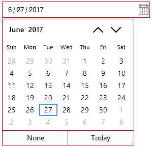
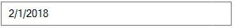
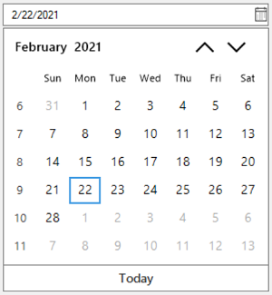

# Customization of DateTimeEdit

The appearance of each and every part in the DateTimeEdit can be customized. The SfDateTimeEdit allows you to customize the drop-down icon, calendar, and up-down buttons by using [Style](https://help.syncfusion.com/cr/windowsforms/Syncfusion.WinForms.Input.SfDateTimeEdit.html#Syncfusion_WinForms_Input_SfDateTimeEdit_Style) properties.

## Customize DateTimeEdit appearance

The BackColor, ForeColor, and BorderColor of the control can be customized by using the following [Style](https://help.syncfusion.com/cr/windowsforms/Syncfusion.WinForms.Input.SfDateTimeEdit.html#Syncfusion_WinForms_Input_SfDateTimeEdit_Style) properties of the SfDateTimeEdit. The up-down and drop-down buttons of the SfDateTimeEdit control can also be customized using the [Style](https://help.syncfusion.com/cr/windowsforms/Syncfusion.WinForms.Input.SfDateTimeEdit.html#Syncfusion_WinForms_Input_SfDateTimeEdit_Style).

* BackColor - To change the background color of DateTimeEdit.
* ForeColor - To change the foreground color of date-time text in DateTimeEdit.
* WatermarkForeColor - To change the color to draw the Watermark Text that displays in DateTimeEdit when the Value is null.
* BorderColor - To change the border color of DateTimeEdit.
* DisabledBackColor - To change the border color of DateTimeEdit in disabled or readonly state.
* DisabledForeColor - To change the foreground color of date-time text in disabled or readonly state.
* FocusedBorderColor - To change the border color of DateTimeEdit in focused state.
* HoverBorderColor - To change the border color of DateTimeEdit in mouse hover state.

The following code snippets illustrates the customization.





sfDateTimeEdit1.Style.BorderColor = Color.Red;





sfDateTimeEdit1.Style.BorderColor = Color.Red



 

## Customize drop-down appearance

The BackColor and ForeColor of drop-down icon to open the calendar can be customized by the following `DropDown` style properties. The following `style` properties of `DropDown` are used to change the color of drop-down icon in different states.

* BackColor - To change the background color of dropdown icon in DateTimeEdit.
* HoverBackColor - To change the background color of dropdown icon in mouse hover state.
* PressedBackColor - To change the background color of dropdown icon in pressed state.
* ForeColor - To change the foreground color of dropdown icon in DateTimeEdit.
* HoverForeColor - To change the foreground color of dropdown icon in mouse hover state.
* PressedForeColor - To change the foreground color of dropdown icon in pressed state.

The following code snippets illustrates the same.





   //Setting the DropDown Fore color

   this.dateTimeEdit.Style.DropDown.ForeColor = Color.Purple;

   this.dateTimeEdit.Style.DropDown.HoverForeColor = Color.Yellow;

   this.dateTimeEdit.Style.DropDown.PressedForeColor = Color.Green;

   //Setting the DropDown Back color

    this.sfDateTimeEdit1.Style.DropDown.BackColor = Color.Aqua;

    this.sfDateTimeEdit1.Style.DropDown.HoverBackColor = Color.Gray;

    this.sfDateTimeEdit1.Style.DropDown.PressedBackColor = Color.Orange;





   'Setting the DropDown Fore color

   Me.dateTimeEdit.Style.DropDown.ForeColor = Color.Purple

   Me.dateTimeEdit.Style.DropDown.HoverForeColor = Color.Yellow

   Me.dateTimeEdit.Style.DropDown.PressedForeColor = Color.Green

   'Setting the DropDown Back color

    Me.sfDateTimeEdit1.Style.DropDown.BackColor = Color.Aqua

    Me.sfDateTimeEdit1.Style.DropDown.HoverBackColor = Color.Gray

    Me.sfDateTimeEdit1.Style.DropDown.PressedBackColor = Color.Orange



 

### Change visibility of dropdown button

The drop-down button in the SfDateTimeEdit allows you to open the pop-up calendar by using the mouse interaction. The visibility of drop-down button can be changed by the [ShowDropDown](https://help.syncfusion.com/cr/windowsforms/Syncfusion.WinForms.Input.SfDateTimeEdit.html#Syncfusion_WinForms_Input_SfDateTimeEdit_ShowDropDown) property.





//Enable the DropDown Button

this.dateTimeEdit.ShowDropDown = true;

//Disable the DropDown Button

this.dateTimeEdit.ShowDropDown = false;





'Enable the DropDown Button

Me.dateTimeEdit.ShowDropDown = true

'Disable the DropDown Button

Me.dateTimeEdit.ShowDropDown = false



 

## Customize up-down appearance

The ForeColor of up-down icon in the `SfDateTimeEdit` can be customized by the following `Style` properties. The following `style` properties of the SfDateTimeEdit can be used to change the color of up-down icon in different states:

* UpDownForeColor - To change the foreground color of updown icon in DateTimeEdit.
* UpDownHoverForeColor - To change the foreground color of updown icon in mouse hover state.
* UpDownBackColor - To change the background color of updown icon in DateTimeEdit.
* UpDownHoverBackColor - To change the background color of updown icon in mouse hover state.

The following code snippets illustrates the same.





//Setting the UpDown Fore color

this.dateTimeEdit.Style.UpDownForeColor = Color.HotPink;

this.dateTimeEdit.Style.UpDownHoverForeColor = Color.Blue;

this.dateTimeEdit.Style.UpDownBackColor = Color.LightGray;

this.dateTimeEdit.Style.UpDownHoverBackColor = Color.Yellow;





'Setting the UpDown Fore color

Me.dateTimeEdit.Style.UpDownForeColor = Color.HotPink

Me.dateTimeEdit.Style.UpDownHoverForeColor = Color.Blue

Me.dateTimeEdit.Style.UpDownBackColor = Color.LightGray

Me.dateTimeEdit.Style.UpDownHoverBackColor = Color.Yellow



 

### Change visibility of up-down

The up-down allows you to change the value by increment or decrement of values of the date, month, and year based on the selected field. The value change by up and down buttons are only applicable when the [DateTimeEditingMode]([DateTimeEditingMode](https://help.syncfusion.com/cr/windowsforms/Syncfusion.WinForms.Input.SfDateTimeEdit.html#Syncfusion_WinForms_Input_SfDateTimeEdit_DateTimeEditingMode)) is mask. The visibility of up-down buttons can be changed by the [ShowUpDown](https://help.syncfusion.com/cr/windowsforms/Syncfusion.WinForms.Input.SfDateTimeEdit.html#Syncfusion_WinForms_Input_SfDateTimeEdit_ShowUpDown) property.





//Enable the UpDown Button

this.dateTimeEdit.ShowUpDown = true;

//Disable the UpDown Button

this.dateTimeEdit.ShowUpDown = false;





'Enable the UpDown Button

Me.dateTimeEdit.ShowUpDown = true

'Disable the UpDown Button

Me.dateTimeEdit.ShowUpDown = false



 

## Customize drop-down calendar appearance

The drop-down calendar of the SfDateTimeEdit can be obtained from the [MonthCalendar](https://help.syncfusion.com/cr/windowsforms/Syncfusion.WinForms.Input.SfDateTimeEdit.html#Syncfusion_WinForms_Input_SfDateTimeEdit_MonthCalendar) property. All the [customization with calendar](/windowsforms/calendar/appearance) will be reflected in drop-down calendar of the SfDateTimeEdit. The following code snippets illustrates how to change the visibility of footer in the drop-down calendar of the SfDateTimeEdit:





dateTimeEdit.MonthCalendar.ShowFooter = false;





dateTimeEdit.MonthCalendar.ShowFooter = false



 

## Drop-down calendar size customization

The size of the drop-down calendar can be customized by using the [DropDownSize](https://help.syncfusion.com/cr/windowsforms/Syncfusion.WinForms.Input.SfDateTimeEdit.html#Syncfusion_WinForms_Input_SfDateTimeEdit_DropDownSize) property.





//Setting DropDownSize

this.dateTimeEdit.DropDownSize = new Size(294, 293);

this.dateTimeEdit.Width = 294;





'Setting DropDownSize

Me.dateTimeEdit.DropDownSize = New Size(294, 293)

Me.dateTimeEdit.Width = 294



 

## Show Week Numbers

Week numbers can be displayed by setting [ShowWeekNumbers](https://help.syncfusion.com/cr/windowsforms/Syncfusion.WinForms.Input.SfCalendar.html#Syncfusion_WinForms_Input_SfCalendar_ShowWeekNumbers) property as `true`.





//Setting ShowWeekNumbers
sfDateTimeEdit1.MonthCalendar.ShowWeekNumbers = true;



 

## Themes

SfDateTimeEdit offers four built in themes for professional representation as follows.

* Office2016Colorful
* Office2016White
* Office2016DarkGray
* Office2016Black

Theme can be applied to SfDateTimeEdit by following the below steps:

1. [Load theme assembly](#load-theme-assembly)
2. [Apply theme](#apply-theme)

### Load theme assembly

**Syncfusion.Office2016Theme.WinForms** assembly should be added as reference to set theme for SfDateTimeEdit in any application:

Before apply theme to SfDateTimeEdit, required theme assembly should be loaded as follows. 





using Syncfusion.WinForms.Controls;

         static class Program
    {
        /// 

        /// The main entry point for the application.
        /// 

        
        static void Main()
        {
            SfSkinManager.LoadAssembly(typeof(Office2016Theme).Assembly);
            Application.EnableVisualStyles();
            Application.SetCompatibleTextRenderingDefault(false);
            Application.Run(new Form1());
        }
    }





Imports Syncfusion.WinForms.Controls

 Friend Module Program
        ''' 

        ''' The main entry point for the application.
        ''' 

        Sub Main()
            SfSkinManager.LoadAssembly(GetType(Office2016Theme).Assembly)
            Application.EnableVisualStyles()
            Application.SetCompatibleTextRenderingDefault(False)
            Application.Run(New Form1())
        End Sub
    End Module





### Apply theme

Appearance of SfDateTimeEdit can be changed by [ThemeName](https://help.syncfusion.com/cr/windowsforms/Syncfusion.WinForms.Input.SfDateTimeEdit.html) of SfDateTimeEdit.

#### Office2016Colorful

This option helps to set the Office2016Colorful Theme.





// Office2016Colorful

 this.dateTimeEdit.ThemeName = "Office2016Colorful";





' Office2016Colorful 

Me.dateTimeEdit.ThemeName = "Office2016Colorful"





#### Office2016White

This option helps to set the Office2016White Theme.





// Office2016White

 this.dateTimeEdit.ThemeName = "Office2016White";





' Office2016White 

Me.dateTimeEdit.ThemeName = "Office2016White"





#### Office2016DarkGray

This option helps to set the Office2016DarkGray Theme.





// Office2016DarkGray

 this.dateTimeEdit.ThemeName = "Office2016DarkGray";





' Office2016DarkGray 

Me.dateTimeEdit.ThemeName = "Office2016DarkGray"





#### Office2016Black

This option helps to set the Office2016Black Theme.





// Office2016Black

 this.dateTimeEdit.ThemeName = "Office2016Black";





' Office2016Black 

Me.dateTimeEdit.ThemeName = "Office2016Black"





