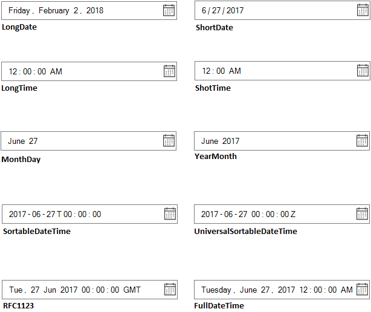

# Display Pattern in Windows Forms DateTimePicker (SfDateTimeEdit)

The [DateTimePattern](https://help.syncfusion.com/cr/windowsforms/Syncfusion.WinForms.Input.SfDateTimeEdit.html#Syncfusion_WinForms_Input_SfDateTimeEdit_DateTimePattern) helps you to specify the date-time display pattern for the SfDateTimeEdit. The display format of the date in the `SfDateTimeEdit` control can be customized by the pattern and custom display pattern properties.

## DateTime format

The `SfDateTimeEdit` control supports the following DateTime format: 

* LongDate
* LongTime
* ShortDate
* ShortTime
* FullDateTime
* MonthDay
* Custom
* SortableDateTime
* UniversalSortableDateTime
* RFC1123
* YearMonth

The different display formats of the DateTime can be set by using the [DateTimePattern](https://help.syncfusion.com/cr/windowsforms/Syncfusion.WinForms.Input.SfDateTimeEdit.html#Syncfusion_WinForms_Input_SfDateTimeEdit_DateTimePattern) property. The following code snippet illustrates how to set the format as LongDate:




using Syncfusion.WinForms.Input;

Syncfusion.WinForms.Input.SfDateTimeEdit dateTimeEdit = new  Syncfusion.WinForms.Input.SfDateTimeEdit();

this.Controls.Add(dateTimeEdit);

dateTimeEdit.Value = new DateTime(2017, 07, 05);

dateTimeEdit.DateTimePattern = DateTimePattern.LongDate;




Imports Syncfusion.WinForms.Input

Dim dateTimeEdit As Syncfusion.WinForms.Input.SfDateTimeEdit = New Syncfusion.WinForms.Input.SfDateTimeEdit

Me.Controls.Add(dateTimeEdit)

dateTimeEdit.Value = New DateTime(2017, 7, 5)

dateTimeEdit.DateTimePattern = DateTimePattern.LongDate



 

## Custom display pattern

The custom pattern can be displayed in the `SfDateTimeEdit` control by using the [Format](https://help.syncfusion.com/cr/windowsforms/Syncfusion.WinForms.Input.SfDateTimeEdit.html#Syncfusion_WinForms_Input_SfDateTimeEdit_Format) property. Refer to the following list to create the custom format for the `SfDateTimeEdit`:

* d: Day of the month.
* ddd: Abbreviated day of the week name.
* dddd: Full name of day of the week.
* M: The month, from 1 to 12.
* MMM: Short name of month.
* MMMM: Long name of the month.
* yy: Last two digits of the year.
* yyyy: Full year.
* hh: Hour.
* mm: Minutes.
* ss: Seconds.
* tt: The AM/PM indicator.




using Syncfusion.WinForms.Input;

Syncfusion.WinForms.Input.SfDateTimeEdit dateTimeEdit = new Syncfusion.WinForms.Input.SfDateTimeEdit();

this.Controls.Add(dateTimeEdit);

dateTimeEdit.Value = new DateTime(2017, 07, 05);

dateTimeEdit.DateTimePattern = DateTimePattern.Custom;

//Setting Custom Pattern

dateTimeEdit.Format = "MM/dd/yy hh:mm:ss";




Imports Syncfusion.WinForms.Input

Dim dateTimeEdit As Syncfusion.WinForms.Input.SfDateTimeEdit = New Syncfusion.WinForms.Input.SfDateTimeEdit

Me.Controls.Add(dateTimeEdit)

dateTimeEdit.Value = New DateTime(2017, 7, 5)

dateTimeEdit.DateTimePattern = DateTimePattern.Custom

'Setting Custom Pattern

dateTimeEdit.Format = "MM/dd/yy hh:mm:ss"



 

N> The CustomPattern support can be enabled by setting the `DateTimePattern` to the `Custom`.
