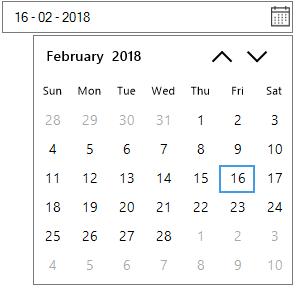

# Right-to-left in Windows Forms DateTimePicker (SfDateTimeEdit)

`SfDateTimeEdit` control elements can be aligned in right-to-left layout. This control can be laid out from right to left when the [RightToLeft](https://help.syncfusion.com/cr/windowsforms/Syncfusion.WinForms.Input.SfDateTimeEdit.html#Syncfusion_WinForms_Input_SfDateTimeEdit_RightToLeft) value is set to `Yes`.





//Enable the Right to Left

this.dateTimeEdit.RightToLeft = RightToLeft.Yes;





'Enable the Right to Left

Me.dateTimeEdit.RightToLeft = RightToLeft.Yes





## Change drop-down calendar alignment

The `SfDateTimeEdit` allows you to change the drop-down opening side of the calendar relative to the control. The [DropDownPopupAlignment](https://help.syncfusion.com/cr/windowsforms/Syncfusion.WinForms.Input.SfDateTimeEdit.html#Syncfusion_WinForms_Input_SfDateTimeEdit_DropDownPopupAlignment) of the SfDateTimeEdit can be used to change the alignment of calendar.





//Setting Left Popup alignment

this.dateTimeEdit.DropDownPopupAlignment = DropDownPopupAlignment.Left;

//Setting Right Popup alignment

this.dateTimeEdit.DropDownPopupAlignment = DropDownPopupAlignment.Right;





'Setting Left Popup alignment

Me.dateTimeEdit.DropDownPopupAlignment = DropDownPopupAlignment.Left

'Setting Right Popup alignment

Me.dateTimeEdit.DropDownPopupAlignment = DropDownPopupAlignment.Right



 

