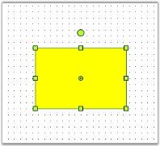
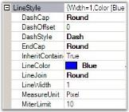
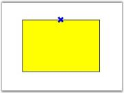
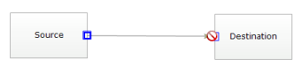
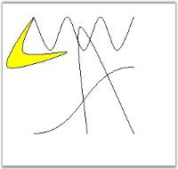
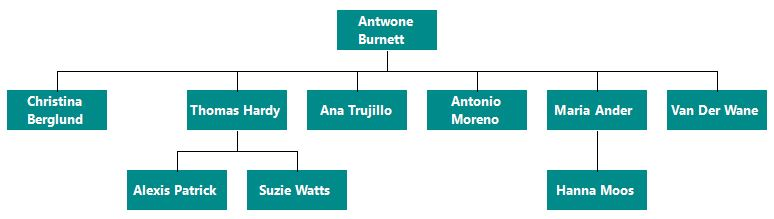
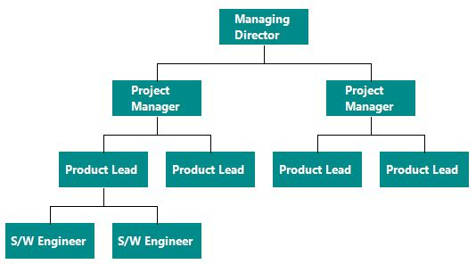
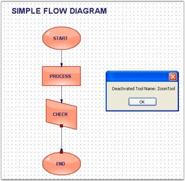
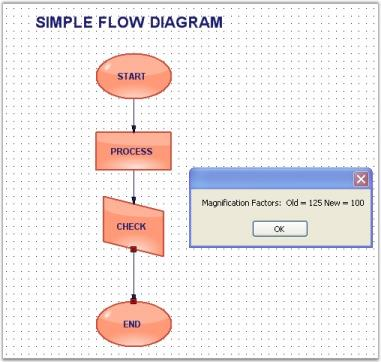

# Advanced Features

This particular feature section covers the below topics.

## Node Selections 

A node's behavior can be customized and modified using the EditStyle collection properties which can be used for the following:

* To prohibit selection, rotation and deletion of nodes, by using AllowSelect, AllowRotate and AllowDelete properties. 
* To restrict a node's movement along the x or y axis, by using AllowMoveX and AllowMoveY properties.
* To prevent re-sizing the height and width of the node, by using AllowChangeHeight and AllowChangeWidth and AllowResize properties.

Node Selections

<table>
<tr>
<th>
EditStyle Property</th><th>
Description</th></tr>
<tr>
<td>
AllowChangeHeight </td><td>
Specifies whether or not to allow the height to be changed. Default value is {{ '_True_' | markdownify }}.</td></tr>
<tr>
<td>
AllowChangeWidth </td><td>
Specifies whether or not to allow the width to be changed. Default value is {{ '_True_' | markdownify }}.</td></tr>
<tr>
<td>
AllowDelete  </td><td>
Specifies whether or not to allow the node to be deleted on clicking the DELETE key. Default value is {{ '_True_' | markdownify }}.</td></tr>
<tr>
<td>
AllowMoveX</td><td>
Specifies whether or not to allow the node to be moved along the x-axis. Default value is {{ '_True_' | markdownify }}.</td></tr>
<tr>
<td>
AllowMoveY</td><td>
Specifies whether or not to allow the node to be moved along the y-axis. Default value is {{ '_True_' | markdownify }}.</td></tr>
<tr>
<td>
AllowRotate</td><td>
Specifies whether or not to rotate the node using the PinPoint. Default value is {{ '_True_' | markdownify }}.</td></tr>
<tr>
<td>
AllowSelect</td><td>
Specifies whether or not to select the node on mouse click. Default value is {{ '_True_' | markdownify }}.</td></tr>
</table>

Programmatically, the properties can be set as follows:



rect.EditStyle.AllowChangeHeight = true;

rect.EditStyle.AllowChangeWidth = true;

rect.EditStyle.AllowDelete = false;

rect.EditStyle.AllowMoveX = true;

rect.EditStyle.AllowMoveY = false;

rect.EditStyle.AllowRotate = true;

rect.EditStyle.AllowSelect = true;





rect.EditStyle.AllowChangeHeight = True

rect.EditStyle.AllowChangeWidth = True

rect.EditStyle.AllowDelete = False

rect.EditStyle.AllowMoveX = True

rect.EditStyle.AllowMoveY = False

rect.EditStyle.AllowRotate = True

rect.EditStyle.AllowSelect = True



In the above code snippets, the properties are set to the Rectangular node (rect) created through the code.

Behavior Settings

_Properties_

<table>
<tr>
<th>
Property </th><th>
Description</th></tr>
<tr>
<td>
AspectRatio</td><td>
Specifies whether to maintain the height and width ratio when the node is resized.</td></tr>
<tr>
<td>
DefaultHandleEditMode</td><td>
Specifies the mode in which the node should be handled. The default value for links and lines is Vertex and for all other nodes and polyline the default value is Resize. To move the nodes, DefaultHandleEditMode should be set to Resize. The options provided are as follows.NoneResizeVertex</td></tr>
<tr>
<td>
Enabled</td><td>
Specifies whether the node is enabled. Default value is {{ '_True_' | markdownify }}.</td></tr>
<tr>
<td>
AllowVertexEdit</td><td>
Specifies whether or not to edit the vertex. Default value is {{ '_True_' | markdownify }}.</td></tr>
<tr>
<td>
HidePinPoint</td><td>
Specifies whether to show or hide the PinPoint. Default value is {{ '_False_' | markdownify }}.</td></tr>
<tr>
<td>
HideRotationHandle</td><td>
Specifies whether to show or hide the RotationHandle in order to control the rotation of the node. Default value is {{ '_False_' | markdownify }}.</td></tr>
</table>

Programmatically these properties can be set as follows:



rect.EditStyle.AspectRatio = true;

rect.EditStyle.DefaultHandleEditMode =HandleEditMode.Resize;

rect.EditStyle.Enabled = true;

rect.EditStyle.AllowVertexEdit = true;

rect.EditStyle.DefaultHandleEditMode =HandleEditMode.Vertex;

rect.EditStyle.HidePinPoint = true;

rect.EditStyle.HideRotationHandle = true;





rect.EditStyle.AspectRatio = True

rect.EditStyle.DefaultHandleEditMode = HandleEditMode.Resize

rect.EditStyle.Enabled = True

rect.EditStyle.AllowVertexEdit = True

rect.EditStyle.DefaultHandleEditMode = HandleEditMode.Vertex

rect.EditStyle.HidePinPoint = True

rect.EditStyle.HideRotationHandle = True



In the above code snippets, the properties are set to the Rectangular node (rect) created through the code.

## Ports And Connections

### Ports

Port is an object used to establish a connection between the node and the link.

#### Central Port

By default, the central port for a diagram is enabled using the EnableCentralPort property available for the node. 

Port Properties

<table>
<tr>
<th>
Property</th><th>
Description</th></tr>
<tr>
<td>
EnableCentralPort</td><td>
Used to enable or disable the CentralPort.</td></tr>
</table>

The central port for a diagram node can be enabled by using the following code snippet.



Ellipse ellips = new Ellipse(100, 100, 200, 100);

ellips.EnableCentralPort = true;





Dim ellips As New Ellipse(100, 100, 200, 100)

ellips.EnableCentralPort = True



In the above code snippets, the Central Port is enabled for an Ellipse node.

Sample diagram is as follows:

#### Custom ports

Custom ports can be defined at any position of the diagram node, thus allowing the creation of any number of connection ports at any position on the node. All the connections can be defined from the required point or port. Unlike the default port, the custom port when set, will be visible. The DrawPorts property must be enabled for custom ports to be created.

N> When a link is drawn to a node or another link and when the EnableCentralPort is set to True, the links cannot be connected to the custom port. Hence make sure to disable that property for the links and the nodes to connect the links to the custom ports.

<table>
<tr>
<th>
Property </th><th>
Description</th></tr>
<tr>
<td>
DrawPorts</td><td>
Specifies whether creation of custom ports is enabled. Default value is True.</td></tr>
</table>

The Syncfusion.Windows.Forms.Diagram.ConnectionPoint class is used to create custom ports and define their properties. For details, see ConnectionPoint Properties.

The following code snippet illustrate the Custom Ports,



Syncfusion.Windows.Forms.Diagram.Rectangle rect = new Syncfusion.Windows.Forms.Diagram.Rectangle(100, 100, 100, 50);

rect.DrawPorts = true;

Syncfusion.Windows.Forms.Diagram.ConnectionPoint cp = new Syncfusion.Windows.Forms.Diagram.ConnectionPoint();

rect.Ports.Add(cp);





Dim rect As New Syncfusion.Windows.Forms.Diagram.Rectangle(100, 100, 100, 50)

rect.DrawPorts = True

Dim cp As New Syncfusion.Windows.Forms.Diagram.ConnectionPoint()

rect.Ports.Add(cp)



Sample diagram is as follows.

#### Port Shapes

The VisualType property available for the port can be used for customizing the shape of the port. There are several types of ports available for customizing the port's shape, each of which differs depending on how they are positioned within the symbol and how they are rendered. For example, a CirclePort can be positioned anywhere within the bounds of a symbol and renders itself as a circle containing cross hairs. Another example is a CenterPort, which always positions itself in the center of the symbol and has no visual representation.

Port Shapes

<table>
<tr>
<th>
Property </th><th>
Description</th></tr>
<tr>
<td>
VisualType</td><td>
The default value is XPort. The options included are as follows:
<ul><li> CirclePort</li><li> XPort</li><li> TrianglePort</li><li>SquarePort</li><li>RhombPort</li><li> Custom</li></ul></td></tr>
</table>

The visual types for a port can be defined using the following code snippet.



port.VisualType = PortVisualType.RhombPort;





port.VisualType = PortVisualType.RhombPort



Sample diagram is as follows,

### Connection Point Properties

ConnectionPoint class provides points to connect to other nodes using a connector. It is available in different custom appearance and in different sizes.

The ConnectionPointType and ConnectionsLimit properties are available for the ports to define their nature.

ConnectionPointType

<table>
<tr>
<th>
Property </th><th>
Description</th></tr>
<tr>
<td>
ConnectionPointType</td><td>
Specifies the type of connection to be used. The values included are as follows:IncomingOutgoing (default)OutgoingIncoming</td></tr>
<tr>
<td>
ConnectionsLimit</td><td>
Specifies the number of connections to be allowed. Default value is 10.</td></tr>
</table>

The following code snippet demonstrates their usage.



Syncfusion.Windows.Forms.Diagram.ConnectionPoint cp = new Syncfusion.Windows.Forms.Diagram.ConnectionPoint();

cp.ConnectionPointType = ConnectionPointType.Incoming;

cp.ConnectionsLimit = 12;





Dim cp As New Syncfusion.Windows.Forms.Diagram.ConnectionPoint()

cp.ConnectionPointType = ConnectionPointType.Incoming

cp.ConnectionsLimit = 12



Sample diagram  is as follows:

Some important properties are discussed below:

#### FillStyle

FillStyle property is used to create brushes for filling the interior region of the Connection Points.



FillStyle m_styleFill = new FillStyle();

m_styleFill.Color = Color.Transparent;

m_styleFill.Type = FillStyleType.Solid;

m_styleFill.ColorAlphaFactor = 60;





Dim m_styleFill As New FillStyle()

m_styleFill.Color = Color.Transparent

m_styleFill.Type = FillStyleType.Solid

m_styleFill.ColorAlphaFactor = 60



The following image illustrates the above settings.

#### LineStyle

This property in turn has customization properties to set the style for the Connection Point Lines, similar to the other line types.



m_styleLine = new LineStyle();

m_styleLine.LineColor = Color.Blue;

m_styleLine.LineWidth = 0;

m_styleLine.DashStyle = DashStyle.Dash;




m_styleLine = New LineStyle()

m_styleLine.LineColor = Color.Blue

m_styleLine.LineWidth = 0

m_styleLine.DashStyle = DashStyle.Dash



The below images illustrates the above settings.

#### ConnectionPointSize

This property allows us to set the size of the Ports for current ConnectionPoint. This property accepts a ConnectionPointSize enumerator which has three predefined sizes as follows.

Large(12 * 12), Medium (9 *9) & Small (6 * 6).

Position

The point at which the connection should be established can be easily customized by setting the Position property to one of the options. This automatically associates the link to the desired position. Offset values can be specified through OffsetX and OffsetY properties, which will be inherited when the Position is set to Custom. 

Properties

<table>
<tr>
<th>
Properties</th><th>
Description</th></tr>
<tr>
<td>
OffsetX</td><td>
Specifies the position which takes the x value of the node. It positions the link with respect to the x value of the node.</td></tr>
<tr>
<td>
OffsetY</td><td>
Specifies the Y offset value where the link should be aligned.  It positions the link with respect to the Y value of the node.</td></tr>
<tr>
<td>
Position</td><td>
Specifies the position where the links should be connected to the node. Default value is Center. The options included are as follows:
<ul><li> Center</li><li> TopLeft</li><li> TopCenter</li><li> TopRight</li><li> MiddleLeft</li><li>MiddleRight</li><li>BottomLeft</li><li> BottomCenter</li><li>BottomRight</li><li> Custom</li></ul></td></tr>
</table>

The following code snippet defines the setting of the position values for a node's port.



Syncfusion.Windows.Forms.Diagram.ConnectionPoint cp = new Syncfusion.Windows.Forms.Diagram.ConnectionPoint();

cp.Position = Position.BottomLeft;

cp.OffsetX = 50;

cp.OffsetY = 10;





Dim cp As New Syncfusion.Windows.Forms.Diagram.ConnectionPoint()

cp.Position = Position.BottomLeft

cp.OffsetX = 50

cp.OffsetY = 10



Sample diagram is as follows,

#### Reject Connections

This feature allows the ConnectionPoint to discard the incoming or outgoing connections to or from that point by setting the ConnectionPointType as Reject. The prohibition sign will be shown when users attempt to connect a line connector to it.

The following code sample illustrates how to reject the incoming and outgoing connections from the ConnectionPoint:



ConnectionPoint port = new ConnectionPoint();

port.Position = Position.MiddleLeft;

// Sets the ConnectionPointType as Reject, which rejects the incoming and outgoing connections.

port.ConnectionPointType = ConnectionPointType.Reject;

rect1.Ports.Add(port);  





Dim port As New ConnectionPoint()

port.Position = Position.MiddleLeft

'Sets the ConnectionPointType as Reject, which rejects the incoming and outgoing connections.

port.ConnectionPointType = ConnectionPointType.Reject

rect1.Ports.Add(port)



## Undo / Redo

The actions can be recorded into the history manager such that the undo and redo operations can be performed. The recording can be controlled and the undo and redo actions can be performed using the following tools.

Undo / Redo Properties

<table>
<tr>
<th>
History Manager Tool </th><th>
Description</th></tr>
<tr>
<td>
Undo</td><td>
Undo the previous action.</td></tr>
<tr>
<td>
Redo</td><td>
Redo the previous action. Redo action can be performed only after an undo action.</td></tr>
<tr>
<td>
StartAtomicAction</td><td>
Stops recording the actions and hence will not be added to the undo history manager.</td></tr>
<tr>
<td>
EndAtomicAction</td><td>
Cancels the StartAtomicAction process and turns on the recording of actions in the history manager.</td></tr>
</table>

Programmatically, it is implemented as follows:



this.diagram1.Model.HistoryManager.Undo(); 

this.diagram1.Model.HistoryManager.Redo();

this.diagram1.Model.HistoryManager.StartAtomicAction("Custom Action");

this.diagram1.Model.HistoryManager.EndAtomicAction();





Me.diagram1.Model.HistoryManager.Undo()

Me.diagram1.Model.HistoryManager.Redo()

Me.diagram1.Model.HistoryManager.StartAtomicAction("Custom Action")

Me.diagram1.Model.HistoryManager.EndAtomicAction()



## Layers

Layers are transparent sheets that can be added to the model and the objects are added to it. Layers allow to categorically arrange a set of nodes onto the diagram.

#### Sample Layers

A layer organizes graphical objects into groups that share a common set of default properties and Z-order. Users can add any number of layers to the model and move objects between layers. Objects in a layer have the same Z-order, which can be relatively controlled with respect to other layers. 

Layers are used when the user wants to separate text and links from other nodes. The nodes created can be added to their respective layers. The following code snippet demonstrates the creation of three layers and assigning them to the various nodes.

Layers are used to group nodes in collections and then show or hide layers with all nodes. One node can be assigned to many layers. Node will be visible, if all layers are visible; even if one layer is hidden, node will not be drawn.

Programmatically layers can be implemented as follows.



// Layer 1

PointF[] pts1 = { new PointF(50, 25), new PointF(75, 75), new PointF(100, 25), new PointF(125, 75), new PointF(150, 25), new PointF(175, 75), new PointF(200, 25) };CurveNode cn = new CurveNode(pts1);

diagram1.Model.AppendChild(cn);

Layer layer1 = new Layer();

cn.Layers.Add(layer1);

// Layer 2

PointF[] pts = { new PointF(10, 100), new PointF(50, 25), new PointF(34, 78), new PointF(100, 78) };

ClosedCurveNode ccn = new ClosedCurveNode(pts);

diagram1.Model.AppendChild(ccn);

Layer layer2 = new Layer();

ccn.Layers.Add(layer2);

// Layer 3

PointF pt = new PointF(50F, 200F);

PointF pt1 = new PointF(200F, 100F);

BezierCurve bc = new BezierCurve(pt, pt1);

diagram1.Model.AppendChild(bc);

SplineNode sp = new SplineNode(new PointF(130, 200), new PointF(200, 200), new PointF(120, 40));

diagram1.Model.AppendChild(sp);

Layer layer3 = new Layer();

bc.Layers.Add(layer3);

sp.Layers.Add(layer3);





' Layer 1

Dim pts1 As PointF() = {New PointF(50, 25), New PointF(75, 75), New PointF(100, 25), New PointF(125, 75), New PointF(150, 25), New PointF(175, 75), _

 New PointF(200, 25)}

Dim cn As New CurveNode(pts1)

diagram1.Model.AppendChild(cn)

Dim layer1 As New Layer()

cn.Layers.Add(layer1)

' Layer 2

Dim pts As PointF() = {New PointF(10, 100), New PointF(50, 25), New PointF(34, 78), New PointF(100, 78)}

Dim ccn As New ClosedCurveNode(pts)

diagram1.Model.AppendChild(ccn)

Dim layer2 As New Layer()

ccn.Layers.Add(layer2)

' Layer 3

Dim pt As New PointF(50.0F, 200.0F)

Dim pt1 As New PointF(200.0F, 100.0F)

Dim bc As New BezierCurve(pt, pt1)

diagram1.Model.AppendChild(bc)

Dim sp As New SplineNode(New PointF(130, 200), New PointF(200, 200), New PointF(120, 40))

diagram1.Model.AppendChild(sp)

Dim layer3 As New Layer()

bc.Layers.Add(layer3)

sp.Layers.Add(layer3)



#### Adding Layers

Layers can be added to the model through LayersCollectionEditor, which can be opened by selecting the Layers Collection property.

Layers

<table>
<tr>
<th>
Properties </th><th>
Description</th></tr>
<tr>
<td>
Enabled</td><td>
Indicates whether the layer should be active or not. Default value is False.</td></tr>
<tr>
<td>
Name</td><td>
Indicates whether the unit should be inherited.</td></tr>
<tr>
<td>
Visible</td><td>
Indicates whether the objects on the layer should be visible.</td></tr>
</table>

### Adding Objects to a Layer

To add objects to a layer, that layer must be active. If an object is added to the model, it will be automatically added to that active layer. The layer can be made active only on setting the Enabled property of that layer. 

The objects can be added to more than one layer by setting the Enabled property of all the layers to which it is added.

To add an object only to a single layer, make sure that only a single layer is enabled at a time.

### Object Visibility 

The visibility of the layer can be handled to control the visibility of all the objects on that layer.



Layer layer0 = new Layer();

this.diagram1.Model.Layers.Add(layer0);

layer0.Enabled = true;

layer0.Visible = true;

layer1.Visible = true;





Dim layer0 As New Layer()

Me.diagram1.Model.Layers.Add(layer0)

layer0.Enabled = True

layer0.Visible = True

layer1.Visible = True



## Rulers

Rulers can be enabled by setting the ShowRulers property for the diagram control. The rulers will automatically inherit the MeasurementUnit set for the diagram model and get converted accordingly.

The height of the ruler can be set through RulersHeight property.

RulersHeight

<table>
<tr>
<th>
Property</th><th>
Description</th></tr>
<tr>
<td>
ShowRulers</td><td>
Specifies whether to display ruler for the diagram control.</td></tr>
<tr>
<td>
RulersHeight</td><td>
Specifies the height of the ruler.</td></tr>
</table>

Programmatically the ruler properties can be set as follows.



this.diagram1.ShowRulers = true;

this.diagram1.RulersHeight = 25;





Me.diagram1.ShowRulers = True

Me.diagram1.RulersHeight = 25



Sample diagram is as follows,

### Diagram With Rulers

Horizontal and vertical rulers can be displayed by setting the ShowRulers property. Both the horizontal and vertical rulers can be customized using various properties, which can be separately applied for each of the rulers.

Diagram With Rulers

<table>
<tr>
<th>
Ruler Property </th><th>
Description</th></tr>
<tr>
<td>
BackgroundColor</td><td>
Specifies the back color for the ruler.</td></tr>
<tr>
<td>
HighlightColor</td><td>
Specifies the highlight color.</td></tr>
<tr>
<td>
MajorLinesColor</td><td>
Specifies the color for the main line in the ruler.</td></tr>
<tr>
<td>
MarkerColor</td><td>
Specifies the marker color in the ruler.</td></tr>
<tr>
<td>
MinorLinesColor</td><td>
Specifies the color for the sub-division lines.</td></tr>
<tr>
<td>
TextStyle</td><td>
Specifies the text style.</td></tr>
</table>
Programmatically the properties can be set as follows for vertical lines.



this.diagram1.VerticalRuler.BackgroundColor = System.Drawing.Color.Beige;

this.diagram1.VerticalRuler.HighlightColor = System.Drawing.Color.Yellow;

this.diagram1.VerticalRuler.MajorLinesColor = System.Drawing.Color.YellowGreen;

this.diagram1.VerticalRuler.MarkerColor = System.Drawing.Color.Thistle;

this.diagram1.VerticalRuler.MinorLinesColor = System.Drawing.Color.Turquoise;

this.diagram1.VerticalRuler.TextStyle.Bold = true;

this.diagram1.VerticalRuler.TextStyle.Italic = true;

this.diagram1.VerticalRuler.TextStyle.PointSize = 20;

this.diagram1.VerticalRuler.TextStyle.Strikeout = true;

this.diagram1.VerticalRuler.TextStyle.Style = System.Drawing.FontStyle.Bold;

this.diagram1.VerticalRuler.TextStyle.Underline = true;

this.diagram1.VerticalRuler.TextStyle.Unit = MeasureUnits.Point;





Me.diagram1.VerticalRuler.BackgroundColor = System.Drawing.Color.Beige

Me.diagram1.VerticalRuler.HighlightColor = System.Drawing.Color.Yellow

Me.diagram1.VerticalRuler.MajorLinesColor = System.Drawing.Color.YellowGreen

Me.diagram1.VerticalRuler.MarkerColor = System.Drawing.Color.Thistle

Me.diagram1.VerticalRuler.MinorLinesColor = System.Drawing.Color.Turquoise

Me.diagram1.VerticalRuler.TextStyle.Bold = True

Me.diagram1.VerticalRuler.TextStyle.Italic = True

Me.diagram1.VerticalRuler.TextStyle.PointSize = 20

Me.diagram1.VerticalRuler.TextStyle.Strikeout = True

Me.diagram1.VerticalRuler.TextStyle.Style = System.Drawing.FontStyle.Bold

Me.diagram1.VerticalRuler.TextStyle.Underline = True

Me.diagram1.VerticalRuler.TextStyle.Unit = MeasureUnits.Point



Sample diagram is as follows,

These properties can be set separately for the horizontal ruler by using HorizontalRuler instead of VerticalRuler as follows.



this.diagram1.HorizontalRuler.BackgroundColor = System.Drawing.Color.Beige;

this.diagram1.HorizontalRuler.HighlightColor = System.Drawing.Color.Yellow;

this.diagram1.HorizontalRuler.MajorLinesColor = System.Drawing.Color.YellowGreen;

this.diagram1.HorizontalRuler.MarkerColor = System.Drawing.Color.Thistle;

this.diagram1.HorizontalRuler.MinorLinesColor = System.Drawing.Color.Turquoise;

this.diagram1.HorizontalRuler.TextStyle.Bold = true;

this.diagram1.HorizontalRuler.TextStyle.Italic = true;

this.diagram1.HorizontalRuler.TextStyle.PointSize = 20;

this.diagram1.HorizontalRuler.TextStyle.Strikeout = true;

this.diagram1.HorizontalRuler.TextStyle.Style = System.Drawing.FontStyle.Bold;

this.diagram1.HorizontalRuler.TextStyle.Underline = true;

this.diagram1.HorizontalRuler.TextStyle.Unit = MeasureUnits.Point;





Me.diagram1.HorizontalRuler.BackgroundColor = System.Drawing.Color.Beige

Me.diagram1.HorizontalRuler.HighlightColor = System.Drawing.Color.Yellow

Me.diagram1.HorizontalRuler.MajorLinesColor = System.Drawing.Color.YellowGreen

Me.diagram1.HorizontalRuler.MarkerColor = System.Drawing.Color.Thistle

Me.diagram1.HorizontalRuler.MinorLinesColor = System.Drawing.Color.Turquoise

Me.diagram1.HorizontalRuler.TextStyle.Bold = True

Me.diagram1.HorizontalRuler.TextStyle.Italic = True

Me.diagram1.HorizontalRuler.TextStyle.PointSize = 20

Me.diagram1.HorizontalRuler.TextStyle.Strikeout = True

Me.diagram1.HorizontalRuler.TextStyle.Style = System.Drawing.FontStyle.Bold

Me.diagram1.HorizontalRuler.TextStyle.Underline = True

Me.diagram1.HorizontalRuler.TextStyle.Unit = MeasureUnits.Point



Sample diagram is as follows,

## Grouping

A group is a node that acts as a transparent container for other nodes. A group is a composite node that controls a set of child nodes. The bounding rectangle of a group is the union of the bounds of its children. The group renders itself by iterating through its children and rendering them. Child nodes cannot be selected or manipulated individually. Members of the group are added and removed through the ICompositeNode interface.

There are two ways available to add a Group in diagram control:

1. Add the children to the group manually with the help of Group class methods. The below code snippet creates a group with two nodes.

   ~~~ cs

		//Node 1

		Syncfusion.Windows.Forms.Diagram.Rectangle nodeRect = new Syncfusion.Windows.Forms.Diagram.Rectangle(50, 100, 125, 75);

		nodeRect.FillStyle.Color = Color.FromArgb(255, 223, 189);

		nodeRect.LineStyle.LineColor = Color.Orange;

		Syncfusion.Windows.Forms.Diagram.Label lbl = new Syncfusion.Windows.Forms.Diagram.Label(nodeRect, "Rectangle");

		lbl.FontStyle.Size = 12;

		lbl.FontStyle.Bold = true;

		nodeRect.Labels.Add(lbl);

		//Node 2

		Syncfusion.Windows.Forms.Diagram.Rectangle nodeRect1 = new Syncfusion.Windows.Forms.Diagram.Rectangle(150, 100, 125, 75);

		nodeRect1.FillStyle.Color = Color.FromArgb(255, 223, 189);

		nodeRect1.LineStyle.LineColor = Color.Orange;

		Syncfusion.Windows.Forms.Diagram.Label lbl1 = new Syncfusion.Windows.Forms.Diagram.Label(nodeRect1, "Rectangle1");

		lbl1.FontStyle.Size = 12;

		lbl1.FontStyle.Bold = true;

		nodeRect1.Labels.Add(lbl1);

		//Grouping Nodes

		Syncfusion.Windows.Forms.Diagram.Group grp = new Group();

		grp.AppendChild(nodeRect);

		grp.AppendChild(nodeRect1);

		this.DiagramWebControl1.Model.AppendChild(grp);

   ~~~
   {:.prettyprint }

2. Diagram control support two direct methods for Grouping and UnGrouping as follows.

   ~~~ cs

		this.diagram1.Controller.Group();     //Method to Group the nodes

		this.diagram1.Controller.UnGroup();   //Method to UnGroup the nodes

   ~~~
   {:.prettyprint }

#### How to access the child nodes in a Group, and how to delete / remove the node?

The first step is to check whether the node is a Group.



if (node is Group)

{

    // Your code here

}



If the node is a Group, then following are some special methods.



public Node GetChild(int childIndex);

public Node GetChildByName(string childName);

public void RemoveAllChildren();

public bool RemoveChild(int childIndex);

public bool RemoveChild(Node nodeToRemove);

public void InsertChild(Node child, int childIndex);



Also, Group has an int ChildCount property, which returns the child count in a Group. To delete the first element in a Group, use the below code.



foreach (Node node in Diagram1.Model.Nodes)

{

    if (node is Group) // Check for Group

    {

        Group groupNode = (Group)node;

        if (groupNode.ChildCount > 0) // Group has sub nodes

        {

            Node nodeToRemove = groupNode.GetChild(0);

            groupNode.RemoveChild(nodeToRemove);

        }

    }

}



### Positioning nodes in Group

#### Positioning support

Diagram Group node supports absolute and relative positioning.

#### Positioning Group node’s Child

Group Node has an enum property called GroupNodePosition of type GroupNodePositions to position its child nodes. GroupNodePositions has two values Absolute and Relative. The Absolute will place the nodes inside a group based on their actual pinpoint whereas the Relative will place the nodes based on their default pinpoint. Default value is _Relative_.



//Group

Group group = new Group();

//Absolute positioning

group.GroupNodePosition = GroupNodePositions.Absolute;





'Group

Dim group As Group = New Group ()

'Absolute positioning

group.GroupNodePosition = GroupNodePositions.Absolute



Properties

<table>
<tr>
<th>
Name</th><th>
Description</th><th>
Type</th><th>
Default value</th><th>
Value Accepted</th><th>
Reference</th></tr>
<tr>
<td>
GroupNodePosition</td><td>
Specifies the mode in which the group node’s child should be positioned.</td><td>
GroupNodePositions</td><td>
Relative</td><td>
Absolute,Relative</td><td>
GroupNodePosition</td></tr>
</table>

## Diagram Data Binding

### Populating the Data

*	Diagram can be populated with the nodes and connectors based on the information provided from an external data source.
*	Diagram exposes its specific data-related properties allowing you to specify the data source fields from where the node information has to be retrieved from.

To explore those properties, see [Data source settings](http://help.syncfusion.com/cr/cref_files/windowsforms/diagram/Syncfusion.Diagram.Windows~Syncfusion.Windows.Forms.Diagram.Binding_properties.html)

### Xml Data Binding

Diagram can be populated based on the user defined XML data by mapping the relevant data source fields.
To map the user defined XML data with Diagram, you have to configure the fields of DataSource. The following code example illustrates how to bind XML data with the Diagram.



<?xml version="1.0" encoding="UTF-8"?>
<dataroot xmlns:od="urn:schemas-microsoft-com:officedata" xmlns:xsi="http://www.w3.org/2001/XMLSchema-instance"  xsi:noNamespaceSchemaLocation="Employees.xsd" generated="2005-01-18T15:03:23">
  <Employees EmployeeID="113001">
   <Name>Antwone Burnett</Name>
    <Designation>Chief Executive Officer</Designation>
  </Employees>  
  
  <Employees EmployeeID="113002">
   <Name>Christina Berglund</Name>
    <Designation>Vice President of sales</Designation>
    <ManagerID>113001</ManagerID>
  </Employees>
  <Employees EmployeeID="113003">
   <Name>Thomas Hardy</Name>
    <Designation>Vice President of Engineering</Designation>
    <ManagerID>113001</ManagerID>
  </Employees>
  <Employees  EmployeeID="113004">
   <Name>Ana Trujillo</Name>
    <Designation>Vice President of Production</Designation>
    <ManagerID>113001</ManagerID>
  </Employees>
  <Employees  EmployeeID="113005">
   <Name>Antonio Moreno</Name>
    <Designation>Information Services Manager</Designation>
    <ManagerID>113001</ManagerID>
  </Employees>
  <Employees  EmployeeID="113006">
   <Name>Maria Anders</Name>
    <Designation>Chief Financial Officer</Designation>
    <ManagerID>113001</ManagerID>
  </Employees>
  <Employees  EmployeeID="113007">
   <Name>Van Der Wane</Name>
    <Designation>Marketing Manager</Designation>
    <ManagerID>113001</ManagerID>
  </Employees>
   <Employees  EmployeeID="113008">
   <Name>Alexis Patrick</Name>
    <Designation>Production Supervisor</Designation>
    <ManagerID>113003</ManagerID>
  </Employees>
    <Employees  EmployeeID="113009">
   <Name>Suzie Watts</Name>
    <Designation>Quality Assurance Manager</Designation>
    <ManagerID>113003</ManagerID>
  </Employees>  
  <Employees  EmployeeID="113010">
   <Name>Hanna Moos</Name>
    <Designation>Account Manager</Designation>
    <ManagerID>113006</ManagerID>
  </Employees>
 </dataroot>
 




//Binds the XML(local data) with node

diagram1.Binding.DefaultNode = rect;

diagram1.Binding.ParentId = "ManagerID";

diagram1.Binding.Id = "EmployeeID";

diagram1.Binding.DataSource = diagram1.GetDataSourceFromXML("..\\..\\XML Binding1.xml");





'Binds the XML(local data) with node

diagram1.Binding.DefaultNode = rect

diagram1.Binding.ParentId = "ManagerID"

diagram1.Binding.Id = "EmployeeID"

diagram1.Binding.DataSource = diagram1.GetDataSourceFromXML("..\..\XML Binding1.xml")



Sample diagram is as follows,

### DataBase Binding

You can bind the Diagram with DataBase data by using SqlConnection.
The following code illustrates how to bind the data to the Diagram.



diagram1.Binding.Id = "Id";

diagram1.Binding.ParentId = "ParentId";

DataTable table = new DataTable("alldata");

string command = "SELECT * FROM databind ";

diagramDataSetTableAdapters.databindTableAdapter cbn = new diagramDataSetTableAdapters.databindTableAdapter();

using (SqlConnection conn = new SqlConnection(cbn.Connection.ConnectionString))

{

using (SqlCommand cmd = new SqlCommand(command, conn))

{

SqlDataAdapter adapt = new SqlDataAdapter(cmd);

conn.Open();

adapt.Fill(table);

//Passing the table data to DataSource

diagram1.Binding.DataSource = table;

conn.Close();

}

}




diagram1.Binding.Id = "Id"

diagram1.Binding.ParentId = "ParentId"

Dim table As New DataTable("alldata")

Dim cbn As New diagramDataSetTableAdapters.databindTableAdapter()

Dim command As String = "SELECT * FROM databind "

Using conn As New SqlConnection(cbn.Connection.ConnectionString)

Using cmd As New SqlCommand(command, conn)

Dim adapt As New SqlDataAdapter(cmd)

conn.Open()

adapt.Fill(table)

'Passing the table data to DataSource

diagram1.Binding.DataSource = table

conn.Close()

End Using

End Using



Sample diagram is as follows,

## Scrolling, Zooming And Panning Support

The interactive features like scrolling, zooming and panning support are discussed in this section:

### Scroll Support

The horizontal and vertical scrollbars can be displayed or hidden by handling the HScroll and VScroll properties.

Scroll Support

<table>
<tr>
<th>
Properties</th><th>
Description</th></tr>
<tr>
<td>
HScroll</td><td>
Specifies whether to display the horizontal scroll bar.</td></tr>
<tr>
<td>
VScroll</td><td>
Specifies whether to display the vertical scroll bar.</td></tr>
</table>

Programmatically, these properties can be set as follows.



this.diagram1.HScroll = true;

this.diagram1.VScroll = true;





Me.diagram1.HScroll = True

Me.diagram1.VScroll = True



Sample diagram is as follows,

ScrollGranularity determines the level of granularity for scrolling. The value of this property must be greater than 0. This value is multiplied by virtual size of the view in order to get the scroll range. For example, if the virtual size of the view is 100x50 and this property is set to 0.5f, then the horizontal scroll range is set to 0.50 and the vertical scroll range is set to 0.25.

SmoothMouseWheelScrolling specifies whether the control should perform one scroll command (faster) or if it should perform multiple scroll commands with smaller increments (smoother) when user rolls mouse wheel.

Properties

<table>
<tr>
<th>
Property</th><th>
Description</th></tr>
<tr>
<td>
EnableIntelliMouse</td><td>
Toggles support for Intelli-Mouse panning. When the user presses the middle-mouse button and drags the mouse, the window will scroll.</td></tr>
<tr>
<td>
ScrollGranularity</td><td>
Specifies the level of granularity for scrolling. This value is to scale the scroll range of the scrollbars.</td></tr>
<tr>
<td>
SmoothMouseWheelScrolling</td><td>
Specifies whether the control should perform one scroll command (faster) or if it should perform multiple scroll commands with smaller increments (smoother) when user rolls mouse wheel.</td></tr>
<tr>
<td>
HScrollBar</td><td>
Returns a reference to an object with horizontal scrollbar settings of the control.</td></tr>
</table>

Programmatically these properties can be set as follows.



this.diagram1.EnableIntelliMouse = true;

this.diagram1.ScrollGranularity = .9F;

this.diagram1.SmoothMouseWheelScrolling = false;

this.diagram1.HScrollBar.SmallChange = 200;





Me.diagram1.EnableIntelliMouse = True

Me.diagram1.ScrollGranularity = .9F

Me.diagram1.SmoothMouseWheelScrolling = False

Me.diagram1.HScrollBar.SmallChange = 200



#### Scrollable Area

Diagram has ScrollVirtualBounds property, which determines the bounds of the scrollable area. This sets the Diagram control's virtual space i.e, gray area around the control. Sometimes, we may need to remove that area and use Diagram control area alone.



 this.diagram1.ScrollVirtualBounds = new RectangleF(0, 0, 0, 0);




Me.diagram1.ScrollVirtualBounds = New RectangleF(0, 0, 0, 0)



#### Scroll Behavior

Scrolling behavior can be controlled by setting the AccelerateScrolling property.

Scroll Behavior

<table>
<tr>
<th>
Property</th><th>
Description</th></tr>
<tr>
<td>
AccelerateScrolling</td><td>
Specifies the scrolling behavior. The options included are as follows:* None* Default* Fast* Immediate</td></tr>
<tr>
<td>
 AllowIncreaseSmallChange</td><td>
Specifies if the scroll control can increase the ScrollBar.SmallChange property during accelerated scrolling.</td></tr>
</table>

Here, setting the AccelerateScrolling to Fast, will increase the scroll speed when the horizontal or vertical thumb is pressed continuously.



this.diagram1.AccelerateScrolling = Syncfusion.Windows.Forms.AccelerateScrollingBehavior.Fast;

this.diagram1.AllowIncreaseSmallChange = true;





Me.diagram1.AccelerateScrolling = Syncfusion.Windows.Forms.AccelerateScrollingBehavior.Fast

Me.diagram1.AllowIncreaseSmallChange = True



#### ThumbTrack

The HorizontalThumbTrack and VerticalThumbTrack properties allows to handle whether the scroll bar thumb should be used for scrolling.

ThumbTrack

<table>
<tr>
<th>
Property</th><th>
Description</th></tr>
<tr>
<td>
HorizontalThumbTrack</td><td>
Specifies if the control should scroll while the user is dragging a horizontal scrollbar thumb.</td></tr>
<tr>
<td>
VerticalThumbTrack</td><td>
Specifies if the control should scroll while the user is dragging a vertical scrollbar thumb.</td></tr>
</table>

Programmatically, these properties can be set as follows.



this.diagram1.HorizontalThumbTrack = true;

this.diagram1.VerticalThumbTrack = true;





Me.diagram1.HorizontalThumbTrack = True

Me.diagram1.VerticalThumbTrack = True



#### ScrollTips

ScrollTips can be enabled or disabled for horizontal and vertical scroll bars individually by setting the HorizontalScrollTips and VerticalScrollTips properties.

The format in which the ScrollTip should be displayed can be specified using the ScrollTipFormat property. The default format is 'Position{0}'.

ScrollTips

<table>
<tr>
<th>
Properties</th><th>
Description</th></tr>
<tr>
<td>
HorizontalScrollTips</td><td>
Specifies whether to display the horizontal scroll bar.</td></tr>
<tr>
<td>
VerticalScrollTips</td><td>
Specifies whether to display the vertical scroll bar.</td></tr>
<tr>
<td>
ScrollTipFormat</td><td>
Specifies the format for the ScrollTip to be displayed.</td></tr>
</table>

Programmatically these properties can be set as follows.



this.diagram1.HorizontalScrollTips = true;

this.diagram1.VerticalScrollTips = true;

this.diagram1.ScrollTipFormat = "Offset{0}";





Me.diagram1.HorizontalScrollTips = True

Me.diagram1.VerticalScrollTips = True

Me.diagram1.ScrollTipFormat = "Offset{0}"



#### Using Splitter control

When splitter control is used and one or more diagram controls are added, setting the FillSplitterPane docks the diagram control inside the splitter control and fills the entire space.

Splitter

<table>
<tr>
<th>
Property</th><th>
Description</th></tr>
<tr>
<td>
FillSplitterPane</td><td>
Specifies whether to fill the splitter control with diagram.</td></tr>
</table>

Programmatically these properties can be set as follows.



this.diagram1.FillSplitterPane = true;





Me.diagram1.FillSplitterPane = True



### Zoom Support

One of the interactive features of Essential Diagram is its zooming capabilities. This feature allows you to interactively zoom in and out of the diagram in the following ways:

* Zoom to the center of the diagram.
* Zoom to the top left of the diagram.
* Zoom to the pointer position using Ctrl and the mouse wheel.

#### Use Case Scenarios

Users can zoom in and out of diagram content based on their requirements.

Properties

<table>
<tr>
<th>
Property </th><th>
Description </th><th>
Data Type </th></tr>
<tr>
<td>
ZoomType </td><td>
Gets or sets the type of zooming to be performed. </td><td>
enum</td></tr>
<tr>
<td>
ZoomIncrement</td><td>
Specifies the amount to zoom each time the diagram is zoomed in or out.</td><td>
float</td></tr>
</table>

Methods

<table>
<tr>
<th>
Method </th><th>
Description </th><th>
Parameters </th><th>
Return Type </th></tr>
<tr>
<td>
ZoomIn</td><td>
Zoom in on the diagram document.</td><td>
NA</td><td>
void</td></tr>
<tr>
<td>
ZoomOut</td><td>
Zoom out of the diagram document. </td><td>
NA</td><td>
void</td></tr>
<tr>
<td>
ZoomToSelection</td><td>
Zoom the diagram document to the specified selection bounds.</td><td>
RectangleF  </td><td>
void</td></tr>
<tr>
<td>
ZoomToActual</td><td>
Zoom the document to its actual size.</td><td>
NA</td><td>
void</td></tr>
</table>

#### ZoomIn, ZoomOut, ZoomToActual, ZoomToSelection

The diagram document can be zoomed in, zoomed out, zoomed to its original size, and zoomed to a selected area based on the ZoomIncrement. You can use the following methods to zoom in the diagram document.

* ZoomIn()
* ZoomOut()
* ZoomToSelection(RectangleF)
* ZoomToActual()

The following code samples explain how to use the zoom methods to zoom in the diagram programmatically:



//Sets the zoom increment value.

this.diagram1.View.ZoomIncrement = 20;

// Zoom in on the document.

this.diagram1.View.ZoomIn();

// Zoom out of the document.

this.diagram1.View.ZoomOut();  

// Zoom the document to its actual size.

this.diagram1.View.ZoomToActual();  

// Zoom the document to the selection.

this.diagram1.View.ZoomToSelection(new RectangleF(100,100,100,100));   





‘Sets the zoom increment value.

Me.diagram1.View.ZoomIncrement = 20

‘Zoom in on the document.

Me.diagram1.View.ZoomIn() 

‘Zoom out of the document.

Me.diagram1.View.ZoomOut() 

‘Zoom the document to its actual size.

Me.diagram1.View.ZoomToActual()    

‘Zoom the document to the selection.

Me.diagram1.View.ZoomToSelection(New RectangleF(100,100,100,100))



#### Zooming to the Center of the Diagram

The diagram document can be zoomed to the center of the current viewport by setting the ZoomType as Center. The default value of ZoomType is Center. 

The following code sample demonstrates how to use the zoom to center feature in a diagram:



// Sets the ZoomType as ‘center’. 

this.diagram1.View.ZoomType = ZoomType.Center;  





'Sets the ZoomType as ‘center’. 

Me.diagram1.View.ZoomType = ZoomType.Center



#### Zooming to the Top-Left of the Diagram

The diagram document can be zoomed to the top-left corner of the viewport by setting the ZoomType as TopLeft. 

The following code shows how to use the zoom to top-left feature:



// Sets the ZoomType as TopLeft. 

this.diagram1.View.ZoomType = ZoomType.TopLeft;  





' Sets the ZoomType as TopLeft. 

Me.diagram1.View.ZoomType = ZoomType.TopLeft



#### Zooming to the Pointer Position

Essential Diagram supports zooming the diagram document to the pointer position using Ctrl and the mouse wheel. 

#### ZoomTool

Essential Diagram supports a UI tool called ZoomTool which is used to zoom and select the diagram document interactively. Users can use the ZoomTool’s MaximumMagnification and MinimumMagnification properties to restrict the document’s maximum or minimum zoom levels and use the ZoomIncrement property to specify the amount to zoom each time the diagram is zoomed in or out.

Zoom Tool Properties

<table>
<tr>
<th>
 Property </th><th>
Description </th><th>
Data Type </th></tr>
<tr>
<td>
MaximumMagnification</td><td>
Specifies the maximum magnification value for zooming. Default value is 1000.</td><td>
float</td></tr>
<tr>
<td>
MinimumMagnification</td><td>
Specifies the minimum magnification value for zooming. Default value is 10.</td><td>
float</td></tr>
<tr>
<td>
ZoomIncrement</td><td>
Specifies the amount to zoom each time the mouse is clicked.</td><td>
float</td></tr>
</table>

The following code demonstrates how to activate the zoom tool:



diagram1.Controller.ActivateTool("ZoomTool");

ZoomTool zoomTool = (ZoomTool)diagram1.Controller.ActiveTool;

zoomTool.MaximumMagnification = 100;

zoomTool.MinimumMagnification = 50;

zoomTool.ZoomIncrement = 10;





diagram1.Controller.ActivateTool("ZoomTool")

Dim zoomTool As ZoomTool = CType(diagram1.Controller.ActiveTool, ZoomTool)

zoomTool.MaximumMagnification = 100

zoomTool.MinimumMagnification = 50

zoomTool.ZoomIncrement = 10



### Pan Support

Pan tool allows the user to drag the diagram and hence scroll it in any direction. 

Programmatically, it is implemented as follows.



this.diagram1.Controller.ActivateTool("PanTool");





Me.diagram1.Controller.ActivateTool("PanTool")



Sample diagram is as follows.

## Event Handlers

This section elaborates on the following:

### Diagram Events

DiagramViewerEventSink class contains the events specific to the diagram. The various events that can be invoked using this class are discussed in the following topics.

#### Node Collection Events

This topic discusses the events that are fired while adding or removing the node to or from the node collection. The below table discusses all the available node collection events.

Node Collection Events

<table>
<tr>
<th>
DiagramViewerEventSink</th><th>
Description</th></tr>
<tr>
<td>
NodeCollectionChanged</td><td>
Triggered after the node collection changes are completed.</td></tr>
<tr>
<td>
NodeCollectionChanging</td><td>
Triggered when the node collection is edited.</td></tr>
</table>

EventArgs members can be accessed using the following members.

Properties

<table>
<tr>
<th>
NodeCollection EventArgs Member</th><th>
Description</th></tr>
<tr>
<td>
Cancel</td><td>
Indicates whether the NodeCollectionChanged event should be canceled.</td></tr>
<tr>
<td>
ChangeType</td><td>
It returns the following possible values:Insert - whether the node is insertedRemove – whether the node is removed</td></tr>
<tr>
<td>
Element</td><td>
Returns whether the head or tail end is moved.</td></tr>
<tr>
<td>
Elements</td><td>
Returns the elements collection on which the event occurs.</td></tr>
<tr>
<td>
Index</td><td>
Returns the zero-based index into the collection on which the event occurred.</td></tr>
<tr>
<td>
Owner</td><td>
Returns the base class onto which the node is added.</td></tr>
</table>

Inside the NodeCollectionChanged event handler, user can identify whether a node is added or removed from the node collection using simple message box as follows.



private void Form1_Load(object sender, EventArgs e)

{

    ((DiagramViewerEventSink)diagram1.EventSink).NodeCollectionChanged += new CollectionExEventHandler(Form1_NodeCollectionChanged)((DiagramViewerEventSink)diagram1.EventSink).NodeCollectionChanging += new CollectionExEventHandler(Form1_NodeCollectionChanging);

    RectangleF rect = new RectangleF(100, 100, 100, 100);

    RichTextNode richText = new RichTextNode("", rect);

    richText.Text = "Rich text box";

    NodeCollection nodeStack = new NodeCollection();

    nodeStack.Add(richText);

    MessageBox.Show(nodeStack.Count.ToString());

}

private void Form1_NodeCollectionChanging(CollectionExEventArgs e)

{

    MessageBox.Show("NodeCollectionChanging event fired");

}





Private Sub Form1_Load(ByVal sender As Object, ByVal e As EventArgs)

    DirectCast(diagram1.EventSink, DiagramViewerEventSink).NodeCollectionChanged += New CollectionExEventHandler(Form1_NodeCollectionChanged)(DirectCast(diagram1.EventSink, DiagramViewerEventSink)).NodeCollectionChanging += New CollectionExEventHandler(Form1_NodeCollectionChanging)

    Dim rect As New RectangleF(100, 100, 100, 100)

    Dim richText As New RichTextNode("", rect)

    richText.Text = "Rich text box"

    Dim nodeStack As New NodeCollection()

    nodeStack.Add(richText)

    MessageBox.Show(nodeStack.Count.ToString())

End Sub

Private Sub Form1_NodeCollectionChanging(ByVal e As CollectionExEventArgs)

    MessageBox.Show("NodeCollectionChanging event fired")

End Sub



Sample diagrams are as follows,

#### Tool Events

The below events gets fired while activating or deactivating the UI tools (Zoom, Pan, Select etc) in the diagram.

The below table shows all the Tool Events.

Tool Events

<table>
<tr>
<th>
DiagramViewerEventSink</th><th>
Description</th></tr>
<tr>
<td>
ToolActivated</td><td>
Triggered when UI tool is activated.</td></tr>
<tr>
<td>
ToolDeactivated</td><td>
Triggered when UI tool is deactivated.</td></tr>
</table>

Data can be retrieved or set using the following members.

Members

<table>
<tr>
<th>
ToolActivated / Deactivated EventArgs Members      </th><th>
Description</th></tr>
<tr>
<td>
Tool</td><td>
Returns the tools object that generated the event. It has following properties,Name - Name of the Tool.</td></tr>
</table>
In the below code sample, when a tool is activated or deactivated the corresponding event will be raised, and the tool name along with the status will be displayed.



private void Form1_Load(object sender, EventArgs e)

{

    ((DiagramViewerEventSink)diagram1.EventSink).ToolActivated += new ToolEventHandler(DiagramForm_ToolActivated);

    ((DiagramViewerEventSink)diagram1.EventSink).ToolDeactivated += new ToolEventHandler(Form1_ToolDeactivated);

    diagram1.Controller.ActivateTool("ZoomTool");

}

void Form1_ToolDeactivated(ToolEventArgs e)

{

    MessageBox.Show("Deactivated Tool Name: " + e.Tool.Name);

}

private void DiagramForm_ToolActivated(ToolEventArgs e)

{

    MessageBox.Show("Activated Tool Name: " + e.Tool.Name + "\n" + "Status: " + e.Tool.InAction);

}





Private Sub Form1_Load(ByVal sender As Object, ByVal e As EventArgs)

    AddHandler DirectCast(diagram1.EventSink, DiagramViewerEventSink).ToolActivated, AddressOf DiagramForm_ToolActivated

    AddHandler DirectCast(diagram1.EventSink, DiagramViewerEventSink).ToolDeactivated, AddressOf Form1_ToolDeactivated

    diagram1.Controller.ActivateTool("ZoomTool")

End Sub

Private Sub Form1_ToolDeactivated(ByVal e As ToolEventArgs)

    MessageBox.Show("Deactivated Tool Name: " & e.Tool.Name)

End Sub

Private Sub DiagramForm_ToolActivated(ByVal e As ToolEventArgs)

    MessageBox.Show(("Activated Tool Name: " & e.Tool.Name & vbLf & "Status: ") + e.Tool.InAction)

End Sub



Sample diagrams are as follows,

#### Origin Events

The origin changes when the diagram window is scrolled either horizontally or vertically.

Origin events are as follows,

Origin Events

<table>
<tr>
<th>
DiagramViewerEventSink</th><th>
Description</th></tr>
<tr>
<td>
OriginChanged</td><td>
Triggered when the origin is changed.</td></tr>
</table>

Data can be retrieved or set by using the following members.

Members

<table>
<tr>
<th>
Origin EventArgs Member</th><th>
Description</th></tr>
<tr>
<td>
NewOrigin</td><td>
Returns the new X and Y origin values after moving the origin.</td></tr>
<tr>
<td>
Offset</td><td>
Returns the difference between the old and new origin.</td></tr>
<tr>
<td>
OriginalOrigin</td><td>
Returns the X and Y values before moving the origin.</td></tr>
</table>

In the following code sample, when the OriginChanged event is handled, the various member values are listed in a text box as the control is scrolled accordingly.



public void Form1_Load(object sender, EventArgs e)

{

    ((DiagramViewerEventSink)diagram1.EventSink).OriginChanged += new ViewOriginEventHandler(Form1_OriginChanged);

    NodeCollection nodeStack = new NodeCollection();

    // Circle

    Syncfusion.Windows.Forms.Diagram.Ellipse circle = new Syncfusion.Windows.Forms.Diagram.Ellipse(0, 0, 96, 72);

    circle.Name = "Circle";

    circle.FillStyle.Type = FillStyleType.LinearGradient;

    circle.FillStyle.ForeColor = Color.AliceBlue;

    circle.ShadowStyle.Visible = true;

    nodeStack.Add(circle);

    // Polygon

    PointF[] pts ={ new Point(6, 36), new Point(48, 6), new Point(90, 36), new Point(48, 66) };

    Polygon polygon = new Polygon(pts);

    polygon.Name = "Polygon";

    polygon.FillStyle.ForeColor = Color.DarkSeaGreen;

    polygon.FillStyle.Color = Color.DarkSeaGreen;

    nodeStack.Add(polygon);

    int i = 0;

    this.model4.AppendChildren(nodeStack, out i);

    MessageBox.Show("Node count =" + "\n" + nodeStack.Count.ToString());

    textBox1.Text = model4.Nodes.Last.Name;

    this.diagram1.HScroll = true;

    this.diagram1.VScroll = true;

}

private void Form1_OriginChanged(ViewOriginEventArgs e)

{

    textBox1.Text = "X = " + e.OriginalOrigin.X + "," + "Y = " + e.OriginalOrigin.Y + "  " + "New X= " + e.NewOrigin.X + "," + "New 	Y= " + e.NewOrigin.Y;

}





Public Sub Form1_Load(ByVal sender As Object, ByVal e As EventArgs)

    AddHandler DirectCast(diagram1.EventSink, DiagramViewerEventSink).OriginChanged, AddressOf Form1_OriginChanged

    Dim nodeStack As New NodeCollection()

    ' Circle

    Dim circle As New Syncfusion.Windows.Forms.Diagram.Ellipse(0, 0, 96, 72)

    circle.Name = "Circle"

    circle.FillStyle.Type = FillStyleType.LinearGradient

    circle.FillStyle.ForeColor = Color.AliceBlue

    circle.ShadowStyle.Visible = True

    nodeStack.Add(circle)

    ' Polygon

    Dim pts As PointF() = {New Point(6, 36), New Point(48, 6), New Point(90, 36), New Point(48, 66)}

    Dim polygon As New Polygon(pts)

    polygon.Name = "Polygon"

    polygon.FillStyle.ForeColor = Color.DarkSeaGreen

    polygon.FillStyle.Color = Color.DarkSeaGreen

    nodeStack.Add(polygon)

    Dim i As Integer = 0

    Me.model4.AppendChildren(nodeStack, i)

    MessageBox.Show(("Node count =" & vbLf) + nodeStack.Count.ToString())

    textBox1.Text = model4.Nodes.Last.Name

    Me.diagram1.HScroll = True

    Me.diagram1.VScroll = True

End Sub

Private Sub Form1_OriginChanged(ByVal e As ViewOriginEventArgs)

    textBox1.Text = ((("X = " & e.OriginalOrigin.X & "," & "Y = ") + e.OriginalOrigin.Y & "  " & "New X= ") + e.NewOrigin.X & "," & "New " & vbTab & "Y= ") + e.NewOrigin.Y

End Sub



Sample diagrams are as follows.

#### Magnification Event 

When the control is zoomed in or out, the magnification events will be fired displaying the old and new magnification factors.

Magnification Events are as follows,

Magnification Events

<table>
<tr>
<th>
DiagramViewerEventSink</th><th>
Description</th></tr>
<tr>
<td>
MagnificationChanged</td><td>
Fired when magnification value is changed.</td></tr>
</table>

Data can be retrieved or set using the following members.

Member properties

<table>
<tr>
<th>
Magnification EventArgs Member</th><th>
Description</th></tr>
<tr>
<td>
NewMagnification</td><td>
Returns the new magnification value.</td></tr>
<tr>
<td>
OriginalMagnification</td><td>
Returns the old magnification value before the event occurred.</td></tr>
</table>



private void Form1_Load(object sender, EventArgs e)

{

    ((DiagramViewerEventSink)diagram1.EventSink).MagnificationChanged += new ViewMagnificationEventHandler(Form1_MagnificationChanged);

}

[EventHandlerPriorityAttribute(true)]

private void Form1_MagnificationChanged(ViewMagnificationEventArgs evtArgs)

{

    MessageBox.Show("Old Factor: " + evtArgs.OriginalMagnification.ToString() + "New Factor: " + evtArgs.NewMagnification.ToString());

}





Private Sub Form1_Load(ByVal sender As Object, ByVal e As EventArgs)

    AddHandler DirectCast(diagram1.EventSink, DiagramViewerEventSink).MagnificationChanged, AddressOf Form1_MagnificationChanged

End Sub

<EventHandlerPriorityAttribute(True)> _

Private Sub Form1_MagnificationChanged(ByVal evtArgs As ViewMagnificationEventArgs)

    MessageBox.Show(("Old Factor: " & evtArgs.OriginalMagnification.ToString() & "New Factor: ") + evtArgs.NewMagnification.ToString())

End Sub



Sample diagrams are as follows,

#### Editor Events

Diagram control provides support to notify users when the text in the Text Editor and Label Editor are changed. The following table lists the Editor events associated with Diagram control.

Editor Events

<table>
<tr>
<th>
Event Name</th><th>
Description</th></tr>
<tr>
<td>
TextChanged</td><td>
This event is raised when the text in the text editor is changed. </td></tr>
<tr>
<td>
LabelTextChanged</td><td>
This event is raised when the text in the label editor is changed.</td></tr>
</table>

The following code example illustrates how the TextChanged and LabelTextChanged events are raised when the text in the text editor and label editor are changed respectively.



private void Form1_Load(object sender, EventArgs e)

{

     diagram1.Controller.TextEditor.TextChanged += new EventHandler(TextEditor_TextChanged);

     diagram1.Controller.InPlaceEditor.LabelTextChanged += new EventHandler(InPlaceEditor_LabelTextChanged); 

}

void TextEditor_TextChanged(object sender, EventArgs e)

{

    MessageBox.Show("Text :" + this.diagram1.Controller.TextEditor.Text);       

}

void InPlaceEditor_LabelTextChanged(object sender, EventArgs e)

{

    MessageBox.Show("Text :" + this.diagram1.Controller.InPlaceEditor.Text);        

}  





Private Sub Form1_Load(sender As Object, e As EventArgs)

        diagram1.Controller.TextEditor.TextChanged += New EventHandler(AddressOf TextEditor_TextChanged)

        diagram1.Controller.InPlaceEditor.LabelTextChanged += New EventHandler(AddressOf InPlaceEditor_LabelTextChanged)

End Sub

Private Sub TextEditor_TextChanged(sender As Object, e As EventArgs)

        MessageBox.Show("Text :" & Convert.ToString(Me.diagram1.Controller.TextEditor.Text))

End Sub

Private Sub InPlaceEditor_LabelTextChanged(sender As Object, e As EventArgs)

        MessageBox.Show("Text :" & Convert.ToString(Me.diagram1.Controller.InPlaceEditor.Text))

End Sub



### Model Events

DocumentEventSink class contains the events specific to the document. The various events that can be invoked using this class are discussed in the following topics.

#### Vertex Events

Vertex Events are as follows,

Vertex Events

<table>
<tr>
<th>
DocumentEventSink</th><th>
Description</th></tr>
<tr>
<td>
VertexChanged</td><td>
Gets fired after the vertex of the node has been changed.</td></tr>
<tr>
<td>
VertexChanging</td><td>
Gets fired when the vertex of the node is changed.</td></tr>
</table>

Data can be retrieved or set using the following members.

Description

<table>
<tr>
<th>
Vertex EventArgs Member</th><th>
Description</th></tr>
<tr>
<td>
Cancel</td><td>
Cancels the Vertex Changed event from being fired.</td></tr>
<tr>
<td>
ChangeType</td><td>
It returns the following possible value:Set - whether the vertex is set for the node.</td></tr>
<tr>
<td>
NodeAffected</td><td>
Returns the node's name by which the node was  affected.</td></tr>
<tr>
<td>
VertexIndex</td><td>
Returns the index of the current vertex.</td></tr>
<tr>
<td>
Vertex EventArgs Member</td><td>
Description</td></tr>
<tr>
<td>
VertexLocation</td><td>
Returns the position of the vertex.</td></tr>
</table>

Programmatically the events are written as follows,



public void Form1_Load(object sender, EventArgs e)

{

    ((DocumentEventSink)model1.EventSink).VertexChanged += new VertexChangedEventHandler(Form1_VertexChanged);

    ((DocumentEventSink)model1.EventSink).VertexChanging += new VertexChangingEventHandler(Form1_VertexChanging);

    LineConnector line = new LineConnector(circle.PinPoint, polygon.PinPoint);

    polygon.CentralPort.TryConnect(line.HeadEndPoint);

    circle.CentralPort.TryConnect(line.TailEndPoint);

    model1.AppendChild(line);

}

private void Form1_VertexChanging(VertexChangingEventArgs vertexChange)

{

    MessageBox.Show("VertexChanging fired");

    model1.LineStyle.LineWidth = 2;

}

private void Form1_VertexChanged(VertexChangedEventArgs vertexChange)

{

    MessageBox.Show("Target Node - " + vertexChange.NodeAffected.FullName + "\n" + vertexChange.VertexLocation.ToString());

}




Public Sub Form1_Load(ByVal sender As Object, ByVal e As EventArgs)

    AddHandler DirectCast(model1.EventSink, DocumentEventSink).VertexChanged, AddressOf Form1_VertexChanged

    AddHandler DirectCast(model1.EventSink, DocumentEventSink).VertexChanging, AddressOf Form1_VertexChanging

    Dim line As New LineConnector(circle.PinPoint, polygon.PinPoint)

    polygon.CentralPort.TryConnect(line.HeadEndPoint)

    circle.CentralPort.TryConnect(line.TailEndPoint)

    model1.AppendChild(line)

End Sub

Private Sub Form1_VertexChanging(ByVal vertexChange As VertexChangingEventArgs)

    MessageBox.Show("VertexChanging fired")

    model1.LineStyle.LineWidth = 2

End Sub

Private Sub Form1_VertexChanged(ByVal vertexChange As VertexChangedEventArgs)

    MessageBox.Show(("Target Node - " & vertexChange.NodeAffected.FullName & vbLf) + vertexChange.VertexLocation.ToString())

End Sub



Sample diagrams are as follows,

#### PinPoint Events

 When changing the node's location, the pinpoint of the node will be reset. The below table contains pinpoint events and descriptions. 

Pinpoint Events

<table>
<tr>
<th>
DocumentEventSink</th><th>
Description</th></tr>
<tr>
<td>
PinOffsetChanged</td><td>
Triggered after the offset of the pinpoint is reset.</td></tr>
<tr>
<td>
PinOffsetChanging</td><td>
Triggered when the offset of the pinpoint is changed.</td></tr>
<tr>
<td>
PinPointChanged</td><td>
Triggered after the pinpoint is repositioned.</td></tr>
<tr>
<td>
PinPointChanging</td><td>
Triggered when the pinpoint is moved.</td></tr>
</table>

Data can be retrieved or set using the following members.

Members

<table>
<tr>
<th>
PinPoint / PinPointOffset EventArgs Member</th><th>
Description</th></tr>
<tr>
<td>
Cancel</td><td>
Cancels the PinPoint Changing events.</td></tr>
<tr>
<td>
NodeAffected</td><td>
Returns the node's name by which the node was affected.</td></tr>
<tr>
<td>
Offset</td><td>
Returns the X and Y values.</td></tr>
</table>

Programmatically the events are written as follows,



public void Form1_Load(object sender, EventArgs e)

{

    ((DocumentEventSink)model4.EventSink).PinOffsetChanged += new PinOffsetChangedEventHandler(Form1_PinOffsetChanged);

    ((DocumentEventSink)model4.EventSink).PinOffsetChanging += new PinOffsetChangingEventHandler(Form1_PinOffsetChanging);

    ((DocumentEventSink)model4.EventSink).PinPointChanged += new PinPointChangedEventHandler(Form1_PinPointChanged);

    ((DocumentEventSink)model4.EventSink).PinPointChanging += new PinPointChangingEventHandler(Form1_PinPointChanging);

    // Circle

    Syncfusion.Windows.Forms.Diagram.Ellipse circle = new Syncfusion.Windows.Forms.Diagram.Ellipse(0, 0, 96, 72);

    circle.Name = "Circle";

    circle.FillStyle.Type = FillStyleType.LinearGradient;

    circle.FillStyle.ForeColor = Color.AliceBlue;

    circle.ShadowStyle.Visible = true;

    model4.AppendChild(circle);

}

void Form1_PinPointChanging(PinPointChangingEventArgs evtArgs)

{

    MessageBox.Show("PinpointChanging event is fired" + "\n" + "Node name: " + evtArgs.NodeAffected.Name.ToString());

}

void Form1_PinPointChanged(PinPointChangedEventArgs evtArgs)

{

    MessageBox.Show("PinPointChanged event is fired" + "\n" + "Offset values: " + evtArgs.Offset.ToString());

}

void Form1_PinOffsetChanging(PinOffsetChangingEventArgs evtArgs)

{

    MessageBox.Show("PinOffsetChanging event is fired" + "\n" + "Node name: " + evtArgs.NodeAffected.Name);

}

void Form1_PinOffsetChanged(PinOffsetChangedEventArgs evtArgs)

{

    MessageBox.Show("PinOffsetChanged event is fired" + "\n" + "Offset values: " + evtArgs.Offset.ToString());

}





Public Sub Form1_Load(ByVal sender As Object, ByVal e As EventArgs)

    AddHandler DirectCast(model4.EventSink, DocumentEventSink).PinOffsetChanged, AddressOf Form1_PinOffsetChanged

    AddHandler DirectCast(model4.EventSink, DocumentEventSink).PinOffsetChanging, AddressOf Form1_PinOffsetChanging

    AddHandler DirectCast(model4.EventSink, DocumentEventSink).PinPointChanged, AddressOf Form1_PinPointChanged

    AddHandler DirectCast(model4.EventSink, DocumentEventSink).PinPointChanging, AddressOf Form1_PinPointChanging

    ' Circle

    Dim circle As New Syncfusion.Windows.Forms.Diagram.Ellipse(0, 0, 96, 72)

    circle.Name = "Circle"

    circle.FillStyle.Type = FillStyleType.LinearGradient

    circle.FillStyle.ForeColor = Color.AliceBlue

    circle.ShadowStyle.Visible = True

    model4.AppendChild(circle)

End Sub

Private Sub Form1_PinPointChanging(ByVal evtArgs As PinPointChangingEventArgs)

    MessageBox.Show(("PinpointChanging event is fired" & vbLf & "Node name: ") + evtArgs.NodeAffected.Name.ToString())

End Sub

Private Sub Form1_PinPointChanged(ByVal evtArgs As PinPointChangedEventArgs)

    MessageBox.Show(("PinPointChanged event is fired" & vbLf & "Offset values: ") + evtArgs.Offset.ToString())

End Sub

Private Sub Form1_PinOffsetChanging(ByVal evtArgs As PinOffsetChangingEventArgs)

    MessageBox.Show(("PinOffsetChanging event is fired" & vbLf & "Node name: ") + evtArgs.NodeAffected.Name)

End Sub

Private Sub Form1_PinOffsetChanged(ByVal evtArgs As PinOffsetChangedEventArgs)

    MessageBox.Show(("PinOffsetChanged event is fired" & vbLf & "Offset values: ") + evtArgs.Offset.ToString())

End Sub



Sample diagrams are as follows,

#### Rotation Events

When the control is rotated horizontally or vertically, the rotation events will be fired displaying the rotation offsets.

The below table discusses the available rotation events with descriptions.

Rotation Events

<table>
<tr>
<th>
DocumentEventSink</th><th>
Description</th></tr>
<tr>
<td>
FlipChanged</td><td>
Triggered after the node is rotated using Flip property.</td></tr>
<tr>
<td>
FlipChanging</td><td>
Triggered when the node is rotated using Flip property.</td></tr>
<tr>
<td>
RotationChanged</td><td>
Triggered after the node is rotated.</td></tr>
<tr>
<td>
RotationChanging</td><td>
Triggered on rotating the node in any direction.</td></tr>
</table>

Data can be retrieved or set using the following members.

Members

<table>
<tr>
<th>
Rotation EventArgs Member</th><th>
Description</th></tr>
<tr>
<td>
NodeAffected</td><td>
Returns the node's name by which the node was affected.</td></tr>
<tr>
<td>
RotationOffset</td><td>
Returns the angle by which the node was rotated.</td></tr>
</table>

Flip EventArgs Member

<table>
<tr>
<th>
Flip EventArgs Member</th><th>
Description</th></tr>
<tr>
<td>
Cancel</td><td>
Cancels the FlipChanging event.</td></tr>
<tr>
<td>
FlipAxis</td><td>
Returns the axis around which the node was rotated.</td></tr>
<tr>
<td>
FlipValue</td><td>
Returns the boolean value of the Flip property.</td></tr>
<tr>
<td>
NodeAffected</td><td>
Returns the node's name by which the node was affected.</td></tr>
</table>

Programmatically, the events are written as follows:



public void Form1_Load(object sender, EventArgs e)

{

    ((DocumentEventSink)model1.EventSink).FlipChanged += new FlipChangedEventHandler(Form1_FlipChanged);

    ((DocumentEventSink)model1.EventSink).FlipChanging += new FlipChangingEventHandler(Form1_FlipChanging);

    ((DocumentEventSink)model1.EventSink).RotationChanged += new RotationChangedEventHandler(Form1_RotationChanged);

    ((DocumentEventSink)model1.EventSink).RotationChanging += new RotationChangingEventHandler(Form1_RotationChanging);

    // Circle

    Syncfusion.Windows.Forms.Diagram.Ellipse circle = new Syncfusion.Windows.Forms.Diagram.Ellipse(0, 0, 96, 72);

    circle.Name = "Circle";

    circle.FillStyle.Type = FillStyleType.LinearGradient;

    circle.FillStyle.ForeColor = Color.AliceBlue;

    circle.ShadowStyle.Visible = true;

    model4.AppendChild(circle);

}

void Form1_RotationChanged(RotationChangedEventArgs evtArgs)

{

    MessageBox.Show("RotationChanged event is fired" + "\n" + evtArgs.RotationOffset.ToString());

}

void Form1_FlipChanging(FlipChangingEventArgs evtArgs)

{

    MessageBox.Show("FlipChanging event is fired");

    textBox1.Text = evtArgs.NodeAffected.BoundingRectangle.ToString();

}

void Form1_FlipChanged(FlipChangedEventArgs evtArgs)

{

    MessageBox.Show("FlipChanged event is fired" + "\n" + "Flip Axis:" + evtArgs.FlipAxis.ToString() + "\n" + "Node: " + evtArgs.NodeAffected.Name.ToString());

    evtArgs.NodeAffected.EditStyle.Enabled = false;

}





Public Sub Form1_Load(ByVal sender As Object, ByVal e As EventArgs)

    AddHandler DirectCast(model1.EventSink, DocumentEventSink).FlipChanged, AddressOf Form1_FlipChanged

    AddHandler DirectCast(model1.EventSink, DocumentEventSink).FlipChanging, AddressOf Form1_FlipChanging

    AddHandler DirectCast(model1.EventSink, DocumentEventSink).RotationChanged, AddressOf Form1_RotationChanged

    AddHandler DirectCast(model1.EventSink, DocumentEventSink).RotationChanging, AddressOf Form1_RotationChanging

    ' Circle

    Dim circle As New Syncfusion.Windows.Forms.Diagram.Ellipse(0, 0, 96, 72)

    circle.Name = "Circle"

    circle.FillStyle.Type = FillStyleType.LinearGradient

    circle.FillStyle.ForeColor = Color.AliceBlue

    circle.ShadowStyle.Visible = True

    model4.AppendChild(circle)

End Sub

Private Sub Form1_RotationChanged(ByVal evtArgs As RotationChangedEventArgs)

    MessageBox.Show(("RotationChanged event is fired" & vbLf) + evtArgs.RotationOffset.ToString())

End Sub

Private Sub Form1_FlipChanging(ByVal evtArgs As FlipChangingEventArgs)

    MessageBox.Show("FlipChanging event is fired")

    textBox1.Text = evtArgs.NodeAffected.BoundingRectangle.ToString()

End Sub

Private Sub Form1_FlipChanged(ByVal evtArgs As FlipChangedEventArgs)

    MessageBox.Show((("FlipChanged event is fired" & vbLf & "Flip Axis:") + evtArgs.FlipAxis.ToString() & vbLf & "Node: ") + evtArgs.NodeAffected.Name.ToString())

    evtArgs.NodeAffected.EditStyle.Enabled = False

End Sub



Sample diagrams are as follows:

#### Z-Order Events

When the node order is changed from front-to-back or back-to-front, the Z-order value gets changed and triggers the Z-order events listed in the below table.

Z-order events

<table>
<tr>
<th>
DocumentEventSink</th><th>
Description</th></tr>
<tr>
<td>
ZOrderChanged</td><td>
Gets fired after the Z-order value is changed.</td></tr>
<tr>
<td>
ZOrderChanging</td><td>
Gets fired when the Z-order of the node is changed.</td></tr>
</table>

Data can be retrieved / set by using the following members.

Members

<table>
<tr>
<th>
Z-order EventArgs Members</th><th>
Description</th></tr>
<tr>
<td>
Cancel</td><td>
Cancels the Z-order changing event.</td></tr>
<tr>
<td>
ChangeType</td><td>
It returns the following possible values,* Front-whether the controller bring the node to the front* Back-whether the controller send the node to the back</td></tr>
<tr>
<td>
 NodeAffected</td><td>
Returns the node's name by which the node was affected.</td></tr>
<tr>
<td>
Z-order</td><td>
Returns the current Z-order value.</td></tr>
</table>

Programmatically, the events are written as follows:



public void Form1_Load(object sender, EventArgs e)

{

    ((DocumentEventSink)model1.EventSink).ZOrderChanged += new ZOrderChangedEventHandler(Form1_ZOrderChanged);

    ((DocumentEventSink)model1.EventSink).ZOrderChanging += new ZOrderChangingEventHandler(Form1_ZOrderChanging);

    diagram1.Controller.BringToFront();

}

void Form1_ZOrderChanging(ZOrderChangingEventArgs evtArgs)

{

    MessageBox.Show("ZOrderChanging event is fired" + "\n" + "Node: " + evtArgs.NodeAffected.Name.ToString());

}

void Form1_ZOrderChanged(ZOrderChangedEventArgs evtArgs)

{

    MessageBox.Show("ZOrderChanged event is fired" + "\n" + "New ZOrder: " + evtArgs.ZOrder.ToString());

}




Public Sub Form1_Load(ByVal sender As Object, ByVal e As EventArgs)

    AddHandler DirectCast(model1.EventSink, DocumentEventSink).ZOrderChanged, AddressOf Form1_ZOrderChanged

    AddHandler DirectCast(model1.EventSink, DocumentEventSink).ZOrderChanging, AddressOf Form1_ZOrderChanging

    diagram1.Controller.BringToFront()

End Sub

Private Sub Form1_ZOrderChanging(ByVal evtArgs As ZOrderChangingEventArgs)

   MessageBox.Show(("ZOrderChanging event is fired" & vbLf & "Node: ") + evtArgs.NodeAffected.Name.ToString())

End Sub

Private Sub Form1_ZOrderChanged(ByVal evtArgs As ZOrderChangedEventArgs)

    MessageBox.Show(("ZOrderChanged event is fired" & vbLf & "New ZOrder: ") + evtArgs.ZOrder.ToString())

End Sub



Sample diagram are as follows:

#### Connections And Ports Events

The below events gets fired while the connection is created between two nodes.

The below table explains the Connections and Ports events.

Connections and Ports Events

<table>
<tr>
<th>
DocumentEventSink</th><th>
Description</th></tr>
<tr>
<td>
ConnectionsChanged</td><td>
Triggered after the connection is changed.</td></tr>
<tr>
<td>
PortsChanged</td><td>
Triggered when ports are added or changed.</td></tr>
</table>

Data can be retrieved or set using the following members.

Members

<table>
<tr>
<th>
Connection and Port EventArgs Member</th><th>
Description</th></tr>
<tr>
<td>
Cancel</td><td>
Cancels the ConnectionChanging event.</td></tr>
<tr>
<td>
ChangeType</td><td>
It returns the following possible values:Insert-Whether the node is insertedRemove–Whether the node is removed</td></tr>
<tr>
<td>
Element</td><td>
Returns whether the head or tail end is moved.</td></tr>
<tr>
<td>
Elements</td><td>
Returns the elements collection on which the event occurs.</td></tr>
<tr>
<td>
Index</td><td>
Returns the zero-based index into the collection on which the event occurred.</td></tr>
<tr>
<td>
Owner</td><td>
Returns the owner object. This is a read-only boolean value.</td></tr>
</table>

Connection Events

Programmatically, the Connection Event is handled as follows.



public void Form1_Load(object sender, EventArgs e)

{

    ((DocumentEventSink)model1.EventSink).ConnectionsChanged += new CollectionExEventHandler(Form1_ConnectionsChanged);

    LineConnector line = new LineConnector(circle.PinPoint, polygon.PinPoint);

    polygon.CentralPort.TryConnect(line.HeadEndPoint);

    circle.CentralPort.TryConnect(line.TailEndPoint);

    model1.AppendChild(line);

}

void Form1_ConnectionsChanged(CollectionExEventArgs evtArgs)

{

    MessageBox.Show(evtArgs.ChangeType.ToString());

}





Public Sub Form1_Load(ByVal sender As Object, ByVal e As EventArgs)

    AddHandler DirectCast(model1.EventSink, DocumentEventSink).ConnectionsChanged, AddressOf Form1_ConnectionsChanged

    Dim line As New LineConnector(circle.PinPoint, polygon.PinPoint)

    polygon.CentralPort.TryConnect(line.HeadEndPoint)

    circle.CentralPort.TryConnect(line.TailEndPoint)

    model1.AppendChild(line)

End Sub

Private Sub Form1_ConnectionsChanged(ByVal evtArgs As CollectionExEventArgs)

    MessageBox.Show(evtArgs.ChangeType.ToString())

End Sub



Sample diagram is as follows.

Ports Events

Programmatically, the events are handled as follows.



public void Form1_Load(object sender, EventArgs e)

{

    ((DocumentEventSink)model1.EventSink).PortsChanged += new CollectionExEventHandler(Form1_PortsChanged);

    node.EnableCentralPort = false;

}

void Form1_PortsChanged(CollectionExEventArgs evtArgs)

{

    MessageBox.Show("Port is changed");

}





Public Sub Form1_Load(ByVal sender As Object, ByVal e As EventArgs)

    AddHandler DirectCast(model1.EventSink, DocumentEventSink).PortsChanged, AddressOf Form1_PortsChanged

    node.EnableCentralPort = False

End Sub

Private Sub Form1_PortsChanged(ByVal evtArgs As CollectionExEventArgs)

    MessageBox.Show("Port is changed")

End Sub



Sample diagram is as follows.

#### Property Events

Each node has different properties (Name,Color,Size etc). The below events are handled when changing these properties.

Property Events are as follows.

Property Events

<table>
<tr>
<th>
DocumentEventSink</th><th>
Description</th></tr>
<tr>
<td>
PropertyChanged</td><td>
Triggered after the property of any node is changed.</td></tr>
<tr>
<td>
PropertyChanging</td><td>
Triggered when the property value is changed.</td></tr>
</table>

Data can be retrieved or set using the following members.

Members

<table>
<tr>
<th>
PropertyChanging EventArgs Member</th><th>
Description</th></tr>
<tr>
<td>
Cancel</td><td>
Cancels the PropertyChanged event.</td></tr>
<tr>
<td>
NewValue</td><td>
Returns the new value assigned to the property.</td></tr>
<tr>
<td>
PropertyContainer</td><td>
Returns the container for the property.</td></tr>
<tr>
<td>
PropertyName</td><td>
Returns name of the property whose value is changed.</td></tr>
</table>

Members

<table>
<tr>
<th>
PropertyChanged EventArgs Member</th><th>
Description</th></tr>
<tr>
<td>
NodeAffected</td><td>
Returns the name of the node whose property is changed.</td></tr>
<tr>
<td>
PropertyName</td><td>
Returns the name of the property whose value is changed.</td></tr>
</table>

Programmatically the events are written as follows,



public void Form1_Load(object sender, EventArgs e)

{

    ((DocumentEventSink)model1.EventSink).PropertyChanged += new Syncfusion.Windows.Forms.Diagram.PropertyChangedEventHandler

        (Form1_PropertyChanged);

    ((DocumentEventSink)model1.EventSink).PropertyChanging += new PropertyChangingEventHandler(Form1_PropertyChanging);

}

private void Form1_PropertyChanged(Syncfusion.Windows.Forms.Diagram.PropertyChangedEventArgs evtArgs)

{

    MessageBox.Show("PropertyChanged event is fired" + "\n" + "Property Name: " + evtArgs.PropertyName);

}

private void Form1_PropertyChanging(Syncfusion.Windows.Forms.Diagram.PropertyChangingEventArgs eprop)

{

    MessageBox.Show("PropertyChanging event is fired" + "\n" + "Property Name: " + eprop.PropertyName + "\n" + "new 				Value: " + eprop.NewValue);

}





Public Sub Form1_Load(ByVal sender As Object, ByVal e As EventArgs)

    AddHandler DirectCast(model1.EventSink, DocumentEventSink).PropertyChanged, AddressOf Form1_PropertyChanged

    AddHandler DirectCast(model1.EventSink, DocumentEventSink).PropertyChanging, AddressOf Form1_PropertyChanging

End Sub

Private Sub Form1_PropertyChanged(ByVal evtArgs As Syncfusion.Windows.Forms.Diagram.PropertyChangedEventArgs)

    MessageBox.Show(("PropertyChanged event is fired" & vbLf & "Property Name: ") + evtArgs.PropertyName)

End Sub

Private Sub Form1_PropertyChanging(ByVal eprop As Syncfusion.Windows.Forms.Diagram.PropertyChangingEventArgs)

    MessageBox.Show((("PropertyChanging event is fired" & vbLf & "Property Name: ") + eprop.PropertyName & vbLf & "new " & vbTab & vbTab & vbTab & vbTab & "Value: ") + eprop.NewValue)

End Sub



Sample diagrams are as follows.

#### Labels And Layers Events

The below mentioned events are fired, when adding or removing the labels and layers to or from the diagram.

The following table shows the label events:

Labels And Layers Events

<table>
<tr>
<th>
DocumentEventSink</th><th>
Description</th></tr>
<tr>
<td>
LabelsChanged</td><td>
Triggered when labels are added.</td></tr>
<tr>
<td>
LayersChanged</td><td>
Triggered when layers are added to the model.</td></tr>
</table>

Data can be retrieved or set using the following members.

<table>
<tr>
<th>
Label / Layers EventArgs Member</th><th>
Description</th></tr>
<tr>
<td>
Cancel</td><td>
Cancels the LabelChanging event.</td></tr>
<tr>
<td>
ChangeType</td><td>
It returns the following possible values:Insert-Whether the label is insertedRemove–Whether the label is removed</td></tr>
<tr>
<td>
Element</td><td>
Returns whether the head or tail end is moved.</td></tr>
<tr>
<td>
Elements</td><td>
Returns the elements collection on which the event occurs.</td></tr>
<tr>
<td>
Index</td><td>
Returns the zero-based index into the collection on which the event occurred.</td></tr>
<tr>
<td>
Owner</td><td>
Returns the owner object.</td></tr>
</table>

Label Events

Whenever labels are added to the label collection, this event will be triggered.

Programmatically, the events are written as follows:



public void Form1_Load(object sender, EventArgs e)

{

    ((DocumentEventSink)model1.EventSink).LabelsChanged += new CollectionExEventHandler(Form1_LabelsChanged);

}

void Form1_LabelsChanged(CollectionExEventArgs evtArgs)

{

    MessageBox.Show("LabelsChanged event is fired" + evtArgs.ChangeType.ToString() + evtArgs.Owner.ToString());

}





Public Sub Form1_Load(ByVal sender As Object, ByVal e As EventArgs)

    AddHandler DirectCast(model1.EventSink, DocumentEventSink).LabelsChanged, AddressOf Form1_LabelsChanged

End Sub

Private Sub Form1_LabelsChanged(ByVal evtArgs As CollectionExEventArgs)

    MessageBox.Show(("LabelsChanged event is fired" & evtArgs.ChangeType.ToString()) + evtArgs.Owner.ToString())

End Sub



Layers Events

Programmatically, the events are written as follows:



public void Form1_Load(object sender, EventArgs e)

{

    ((DocumentEventSink)model1.EventSink).LayersChanged += new CollectionExEventHandler(Form1_LayersChanged);

    Layer layer0 = new Layer();

    this.diagram1.Model.Layers.Add(layer0);

    layer0.Enabled = true;

    layer0.Visible = true;

}

void Form1_LayersChanged(CollectionExEventArgs evtArgs)

{

    MessageBox.Show("LayersChanged event is fired." + "\n" + "Owner: " + evtArgs.Owner.ToString());

}




Public Sub Form1_Load(ByVal sender As Object, ByVal e As EventArgs)

    AddHandler DirectCast(model1.EventSink, DocumentEventSink).LayersChanged, AddressOf Form1_LayersChanged

    Dim layer0 As New Layer()

    Me.diagram1.Model.Layers.Add(layer0)

    layer0.Enabled = True

    layer0.Visible = True

End Sub

Private Sub Form1_LayersChanged(ByVal evtArgs As CollectionExEventArgs)

    MessageBox.Show(("LayersChanged event is fired." & vbLf & "Owner: ") + evtArgs.Owner.ToString())

End Sub



Sample diagram is as follows,

## Built-In Context Menu

Essential Diagram for Windows Forms provides Built-in Context Menu support for Diagram.

All available tools for Diagram control, File options, Edit options, Action options, Layout, Connectors and Shapes will be listed in the Built-in Context Menu. 

Use Case Scenarios

This feature enables easy access of frequently used options. 

Properties_

<table>
<tr>
<th>
Property </th><th>
Description </th><th>
Type </th><th>
Data Type </th><th>
Reference links </th></tr>
<tr>
<td>
DefaultContextMenuEnabled</td><td>
Used to enable default context menu. </td><td>
NA </td><td>
Boolean  </td><td>
NA </td></tr>
</table>

Enabling Default Context Menu

You can enable the default context menu using the _DefaultContextMenuEnabled_ property.

The following code illustrates how to enable the default context menu:



//show default context menu

            diagram1.DefaultContextMenuEnabled = true;




'show default context menu

            diagram1.DefaultContextMenuEnabled = True

The following code illustrates how to disable the default context menu:




//hide default context menu

            diagram1.DefaultContextMenuEnabled = false;




'hide default context menu

            diagram1.DefaultContextMenuEnabled = False



Sample Link

To view a sample:

1. Open the Syncfusion Dashboard.
2. Click the Windows Forms drop-down list and select Run Locally Installed Samples.
3. Navigate to Diagram Samples > Product Showcase > Diagram Builder.

## Adding Shapes by Clicking the Diagram Page

Essential Diagram enables you to draw the selected node by clicking the Diagram page instead of dragging from the Symbol Palette. 

Property Table

<table>
<tr>
<th>
Property </th><th>
Description </th><th>
Type </th><th>
Data Type </th><th>
Reference links </th></tr>
<tr>
<td>
Diagram</td><td>
Reference to enable drawing the selected node by clicking on the diagram page.</td><td>
NA </td><td>
Diagram</td><td>
NA. </td></tr>
</table>

Enabling Adding Shapes by Clicking Support

You can enable drawing shapes by clicking the diagram page using the _Diagram_ property. 



//Palette group view

paletteGroupView1.Diagram = diagram1;

           // Platte group bar 	

paletteGroupBar1.Diagram = diagram1;




'Palette group view

paletteGroupView1.Diagram = diagram1;

           'Platte group bar 	

paletteGroupBar1.Diagram = diagram1;



N> Click the Diagram page to add the selected node. Click and drag to get the required size. 

Sample Link

To view a sample:

1. Open the Syncfusion Dashboard.
2. Click the Windows Forms drop-down list and select Run Locally Installed Samples.
3. Navigate to Diagram Samples > Product Showcase > Diagram Builder.

## Preview for Symbol Palette Item

Essential Diagram for Windows Forms provides preview support for Symbol Palette. When you drag an item from Symbol Palette to Diagram View, Preview of the dragged item will be displayed. You can enable or disable the preview support. 

### Use Case Scenario

This feature displays a preview of the item you drag from Symbol Palette, thus enables you to identify the item you are dragging from the symbol palette to Diagram view.

Property Table

<table>
<tr>
<th>
Property </th><th>
Description </th><th>
Type </th><th>
Data Type </th><th>
Reference links </th></tr>
<tr>
<td>
ShowDragNodeCue</td><td>
Gets or sets a value indicating whether preview is visible.The default value is true.</td><td>
NA</td><td>
Boolean </td><td>
NA</td></tr>
<tr>
<td>
DragNodeCueEnabled</td><td>
Gets or sets a value indicating whether preview is enabled.The default value is true.</td><td>
NA</td><td>
Boolean</td><td>
NA</td></tr>
</table>

### Enabling Preview Support

To enable preview for the dragged item from Symbol Palette, set the _DragNodeCueEnabled_ property of _PaletteGroupBar/PaletteGroupView_ to true. To disable preview set this to false. By default this is set to true.  

Following code example illustrates how to enable preview support:  



      //enable dragged node cue

            paletteGroupBar1.DragNodeCueEnabled = true;

            paletteGroupView1.DragNodeCueEnabled = true;

      //show dragged node cue

            paletteGroupBar1.ShowDragNodeCue = true;

            paletteGroupView1.ShowDragNodeCue = true;




  //enable dragged node cue

            paletteGroupBar1.DragNodeCueEnabled = True;		

            paletteGroupView1.DragNodeCueEnabled = True

  //show dragged node cue

            paletteGroupBar1.ShowDragNodeCue = True;		

            paletteGroupView1.ShowDragNodeCue = True;



The following code illustrates how to disable preview support: 



      //hide dragged node cue

            paletteGroupBar1.ShowDragNodeCue = false;

            paletteGroupView1.ShowDragNodeCue = false;




              //hide dragged node cue

            paletteGroupBar1.ShowDragNodeCue = False;

      paletteGroupView1.ShowDragNodeCue = False;



Sample Link

To view a sample:

1. Open the Syncfusion Dashboard.
2. Click the Windows Forms drop-down list and select Run Locally Installed Samples.
3. Navigate to Diagram Samples > Product Showcase > Diagram Builder.
## Dragging, Resizing, and Rotation Styles for Nodes

Essential Diagram for Windows Forms provides dragging, resizing, and rotation styles such as ghost copy, filled rectangle, solid outline, and dashed outline for nodes. These styles provide better visual effects for your diagram and increase the performance speed of the diagram while dragging, rotating, or resizing nodes.

Properties Table

<table>
<tr>
<th>
Property </th><th>
Description </th><th>
Type </th><th>
Data Type </th></tr>
<tr>
<td>
ResizingStyle</td><td>
Gets or sets resizing style for the rendering helper</td><td>
NA</td><td>
RenderingHelperStyle</td></tr>
<tr>
<td>
DraggingStyle</td><td>
Gets or sets dragging style for the rendering helper</td><td>
NA</td><td>
RenderingHelperStyle</td></tr>
<tr>
<td>
RotatingStyle</td><td>
Gets or sets rotating style for the rendering helper</td><td>
NA</td><td>
RenderingHelperStyle</td></tr>
</table>

### Applying Styles to Rendering Helper

The following code example illustrates how to apply styles to the rendering helper while resizing, dragging, and rotating nodes.



  //Specify dragging, resizing, and rotation styles to the rendering helper

            diagram1.Controller.DraggingStyle = RenderingHelperStyle.SolidOutline;

            diagram1.Controller.ResizingStyle = RenderingHelperStyle.GhostCopy;

            diagram1.Controller.RotatingStyle = RenderingHelperStyle.DashedOutline;





  'Specify dragging, resizing, and rotation styles to the rendering helper

diagram1.Controller.DraggingStyle = RenderingHelperStyle.SolidOutline

diagram1.Controller.ResizingStyle = RenderingHelperStyle.GhostCopy

diagram1.Controller.RotatingStyle = RenderingHelperStyle.DashedOutline



## Guides

Guides for the Diagram control are viewable, non printing guidelines used to align a diagram node with other nodes. They provide support to align a diagram node with the boundary, center, or margin of other nodes.

You can also change the visual style of Guides by using its LineStyle property.

### Properties

The following table describes the various properties associated with Diagram Guides.

Guides Properties

<table>
<tr>
<th>
Property Name</th><th>
Description</th></tr>
<tr>
<td>
Guides</td><td>
Gets the Diagram Guides.</td></tr>
<tr>
<td>
Enable</td><td>
Specifies whether to turn on/off Diagram Guides.</td></tr>
<tr>
<td>
LineStyle</td><td>
Gets or sets the visual style for Diagram Guides.</td></tr>
<tr>
<td>
Type</td><td>
Specifies the Guide Type for nodes. The options included are as follows:{{ '_Boundary_' | markdownify }} {{ '_Center_' | markdownify }} {{ '_Margin_' | markdownify }} {{ '_All_' | markdownify }}</td></tr>
<tr>
<td>
Margin</td><td>
Gets or sets the margin between nodes.</td></tr>
</table>

The following code example illustrates how to turn on Guides for Diagram Nodes while dragging or resizing nodes.



// Turns on Guides in Diagram.

diagram1.Controller.Guides.Enable = true;

// Shows All Types of Guides.

diagram1.Controller.Guides.Type = GuideTypes.All;

// Specifies Line Color for Guides.

diagram1.Controller.Guides.LineStyle.LineColor = Color.FromArgb(255, 153, 51);

// Sets the Margin between Nodes.

diagram1.Controller.Guides.Margin = 50;





' Turns on Guides in Diagram.

diagram1.Controller.Guides.Enable = True

' Shows All Types of Guides.

diagram1.Controller.Guides.Type = GuideTypes.All

' Specifies Line Color for Guides.

diagram1.Controller.Guides.LineStyle.LineColor = Color.FromArgb(255, 153, 51)

' Sets the Margin between Nodes.

diagram1.Controller.Guides.Margin = 50



## Touch Support

Touch support for Diagram control helps to create sophisticated diagrams quickly and easily by interacting with Diagram nodes through touch gestures such as Tap, Double Tap, Long Press, Pinch, and more. These touch gestures help you perform actions such as select, label text editing, open the context menu, zoom in, and zoom out.

### Properties

The following table describes the property associated with turning on/off touch support in Diagram control.

Touch support Properties

<table>
<tr>
<th>
Property Name</th><th>
Description</th></tr>
<tr>
<td>
TouchMode</td><td>
Specifies whether to turn on/off touch support in Diagram control.</td></tr>
</table>

The following code example illustrates how to turn on touch support for Diagram control.



// Specifies whether to turn on/off touch mode in Diagram.

diagram1.TouchMode = true;




' Specifies whether to turn on/off touch mode in Diagram.

diagram1.TouchMode = True



## Dynamic Properties

This feature lets the user add additional properties or data to the nodes and connectors. Any type of data can be added as additional data or properties.

The node’s PropertyBag property, which is a key value pair, is used to add, edit, and remove the additional properties or data and can be serialized when saving the diagram.

The diagram has built-in UI dialogs to add, edit, and remove the dynamic properties. 

Use Case Scenario:

It is used to store additional data to the nodes or connectors as needed.

Properties

<table>
<tr>
<th>
Property </th><th>
Description </th><th>
Data Type </th></tr>
<tr>
<td>
PropertyBag </td><td>
Gets or sets the dynamic property data dictionary.</td><td>
Dictionary<string, object></td></tr>
</table>

The following code shows how to add additional data to a node by using the PropertyBag property:



node.PropertyBag.Add("Name", emply.EmployeeName);

node.PropertyBag.Add("ID", emply.EmployeeID);

node.PropertyBag.Add("Designation", emply.Designation);





node.PropertyBag.Add("Name", emply.EmployeeName)

node.PropertyBag.Add("ID", emply.EmployeeID)

node.PropertyBag.Add("Designation", emply.Designation)



