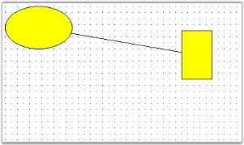
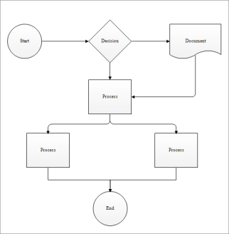

# Connectors or Links in Windows Forms Diagram

Connectors and lines have the following decorators:

* Circle
* CircleCross
* CircleReverseArrow
* Cross45
* Cross90
* CrossReverseArrow
* Custom
* Diamond
* DimensionLine
* DoubleArrow
* DoubleCross
* Filled45Arrow
* Filled60Arrow
* FilledCircle
* FilledDiamond
* FilledFancyArrow
* FilledSquare
* None
* Open45Arrow
* Open60Arrow
* OpenFancyArrow
* ReverseArrow
* ReverseDoubleArrow
* Square

## Connecting Two Nodes with Line Connector

The following code example illustrates how to create links between two nodes.




protected void Page_Load(object sender, EventArgs e)
{
	Syncfusion.Windows.Forms.Diagram.Ellipse ellipse = new Syncfusion.Windows.Forms.Diagram.Ellipse(10, 10, 110, 70);
	Syncfusion.Windows.Forms.Diagram.Rectangle rectangle = new Syncfusion.Windows.Forms.Diagram.Rectangle(300, 50, 50, 80);
	Syncfusion.Windows.Forms.Diagram.LineConnector lineconnector = new Syncfusion.Windows.Forms.Diagram.LineConnector(new System.Drawing.PointF(10, 200), new System.Drawing.PointF(300, 250));
	this.DiagramWebControl1.Model.AppendChild(ellipse);
	this.DiagramWebControl1.Model.AppendChild(rectangle);
	ellipse.CentralPort.TryConnect(lineconnector.HeadEndPoint);
	rectangle.CentralPort.TryConnect(lineconnector.TailEndPoint);
	this.DiagramWebControl1.Model.AppendChild(lineconnector);
}





Protected Sub Page_Load(ByVal sender As Object, ByVal e As EventArgs)
Dim ellipse As New Syncfusion.Windows.Forms.Diagram.Ellipse(10, 10, 110, 70)
Dim rectangle As New Syncfusion.Windows.Forms.Diagram.Rectangle(300, 50, 50, 80)
Dim lineconnector As New Syncfusion.Windows.Forms.Diagram.LineConnector(New System.Drawing.PointF(10, 200), New System.Drawing.PointF(300, 250))
Me.DiagramWebControl1.Model.AppendChild(ellipse)
Me.DiagramWebControl1.Model.AppendChild(rectangle)
ellipse.CentralPort.TryConnect(lineconnector.HeadEndPoint)
rectangle.CentralPort.TryConnect(lineconnector.TailEndPoint)
Me.DiagramWebControl1.Model.AppendChild(lineconnector)
End Sub




You can change the appearance of the connectors using its properties through code. The following code example illustrates the line properties.




protected void Page_Load(object sender, EventArgs e)
{
	Syncfusion.Windows.Forms.Diagram.Ellipse ellipse = new Syncfusion.Windows.Forms.Diagram.Ellipse(160, 60, 100, 60);
	Syncfusion.Windows.Forms.Diagram.Rectangle rectangle = new Syncfusion.Windows.Forms.Diagram.Rectangle(150, 250, 120, 100);
	Syncfusion.Windows.Forms.Diagram.LineConnector lineconnector = new Syncfusion.Windows.Forms.Diagram.LineConnector(new System.Drawing.PointF(10, 200), new System.Drawing.PointF(300, 250));
	this.diagram1.Model.AppendChild(ellipse);
	this.diagram1.Model.AppendChild(rectangle);
	ellipse.CentralPort.TryConnect(lineconnector.TailEndPoint);
	rectangle.CentralPort.TryConnect(lineconnector.HeadEndPoint);
	this.diagram1.Model.AppendChild(lineconnector);
	lineconnector.HeadDecorator.DecoratorShape = DecoratorShape.Filled45Arrow;
	lineconnector.LineStyle.LineColor = Color.MidnightBlue;
	lineconnector.HeadDecorator.FillStyle.Color = Color.MidnightBlue;
	lineconnector.HeadDecorator.Size = new SizeF(10, 5);
}




Protected Sub Page_Load(ByVal sender As Object, ByVal e As EventArgs)
Dim ellipse As New Syncfusion.Windows.Forms.Diagram.Ellipse(160, 60, 100, 60)
Dim rectangle As New Syncfusion.Windows.Forms.Diagram.Rectangle(150, 250, 120, 100)
Dim lineconnector As New Syncfusion.Windows.Forms.Diagram.LineConnector(New System.Drawing.PointF(10, 200), New System.Drawing.PointF(300, 250))
Me.diagram1.Model.AppendChild(ellipse)
Me.diagram1.Model.AppendChild(rectangle)
ellipse.CentralPort.TryConnect(lineconnector.TailEndPoint)
rectangle.CentralPort.TryConnect(lineconnector.HeadEndPoint)
Me.diagram1.Model.AppendChild(lineconnector)
lineconnector.HeadDecorator.DecoratorShape = DecoratorShape.Filled45Arrow
lineconnector.LineStyle.LineColor = Color.MidnightBlue
lineconnector.HeadDecorator.FillStyle.Color = Color.MidnightBlue
lineconnector.HeadDecorator.Size = New SizeF(10, 5)
End Sub




## Rounded Corner

You can now change the look of connectors ([Orthogonal](https://help.syncfusion.com/cr/windowsforms/Syncfusion.Windows.Forms.Diagram.OrthogonalConnector.html#), [OrgLine](https://help.syncfusion.com/cr/windowsforms/Syncfusion.Windows.Forms.Diagram.OrgLineConnector.html#), [Polyline](https://help.syncfusion.com/cr/windowsforms/Syncfusion.Windows.Forms.Diagram.Polyline.html#)) by providing rounded corners to connectors.

The [EnableRoundedCorner](https://help.syncfusion.com/cr/windowsforms/Syncfusion.Windows.Forms.Diagram.ConnectorBase.html#Syncfusion_Windows_Forms_Diagram_ConnectorBase_EnableRoundedCorner) is used to to enable rounded corner for a connector, and the [CurveRadius](https://help.syncfusion.com/cr/windowsforms/Syncfusion.Windows.Forms.Diagram.OrgLineConnector.html#Syncfusion_Windows_Forms_Diagram_OrgLineConnector_CurveRadius) connector property is used and set the radius for the rounded corner curve respectively.

### Use Case Scenario

This is used to change the visual style of connectors.

<table>
<tr>
<th>
Property</th><th>
Description </th><th>
Data Type </th></tr>
<tr>
<td>
{{'[EnableRoundedCorner](https://help.syncfusion.com/cr/windowsforms/Syncfusion.Windows.Forms.Diagram.ConnectorBase.html#Syncfusion_Windows_Forms_Diagram_ConnectorBase_EnableRoundedCorner)'| markdownify }}</td><td>
Enables or disables rounded corner for a connector.</td><td>
bool</td></tr>
<tr>
<td>
{{'[CurveRadius](https://help.syncfusion.com/cr/windowsforms/Syncfusion.Windows.Forms.Diagram.OrgLineConnector.html#Syncfusion_Windows_Forms_Diagram_OrgLineConnector_CurveRadius)'| markdownify }}</td><td>
Gets or sets the radius for the rounded corner curve of a connector.</td><td>
float</td></tr>
</table>

The following code illustrates how to change the look of a connector by using the [EnableRoundedCorner](https://help.syncfusion.com/cr/windowsforms/Syncfusion.Windows.Forms.Diagram.ConnectorBase.html#Syncfusion_Windows_Forms_Diagram_ConnectorBase_EnableRoundedCorner) and [CurveRadius](https://help.syncfusion.com/cr/windowsforms/Syncfusion.Windows.Forms.Diagram.OrgLineConnector.html#Syncfusion_Windows_Forms_Diagram_OrgLineConnector_CurveRadius) properties.




OrthogonalConnector orthogonal = new OrthogonalConnector(new PointF(100, 100), new PointF(300, 300));

// Enables rounded corner for the connector.
orthogonal.EnableRoundedCorner = true;

// Sets the radius of the rounded corner curve.
orthogonal.CurveRadius = 10;

diagram1.Model.AppendChild(orthogonal);




Dim orthogonal As New OrthogonalConnector(New PointF(100, 100), New PointF(300, 300))

'Enables rounded corner for the connector.
orthogonal.EnableRoundedCorner = True

'Sets the radius of the rounded corner curve.
orthogonal.CurveRadius = 10

diagram1.Model.AppendChild(orthogonal)




## Line Bridging

Line bridging provides the visual effect such that the links jump over other links that are found in it's way with lower [Z-order](https://help.syncfusion.com/cr/windowsforms/Syncfusion.Windows.Forms.Diagram.Node.html#Syncfusion_Windows_Forms_Diagram_Node_ZOrder), thereby avoiding the links from intersecting each other and providing a hassle-free view to clearly state the various connections between the nodes.It will also create the same visual effect when it jumps over any port. This is done by enabling the [LineBridgingEnabled](https://help.syncfusion.com/cr/windowsforms/Syncfusion.Windows.Forms.Diagram.ConnectorBase.html#Syncfusion_Windows_Forms_Diagram_ConnectorBase_LineBridgingEnabled) property. Default value is _false_.

The below table lists the properties which controls the appearance of the bridge.

<table>
<tr>
<th>
Property</th><th>
Description</th></tr>
<tr>
<td>
{{'[LineBridgeSize](https://help.syncfusion.com/cr/windowsforms/Syncfusion.Windows.Forms.Diagram.Model.html#Syncfusion_Windows_Forms_Diagram_Model_LineBridgeSize)'| markdownify }}</td><td>
Allows to set the size of the bridge when the links intersect each other. Default value is 16.</td></tr>
<tr>
<td>
BridgeStyle</td><td>
Specifies the type of bridge to be applied. Default value is 'Arc'. The value when set, applies to all the links that are drawn on the diagram. The links will bridge over the other link only when it's {{'[Z-order](https://help.syncfusion.com/cr/windowsforms/Syncfusion.Windows.Forms.Diagram.Node.html#Syncfusion_Windows_Forms_Diagram_Node_ZOrder)'| markdownify }} value is high. The options include the following:
<ul><li> Arc</li><li> Gap</li><li> Square</li><li> Side2</li><li>Side3</li><li>Side4</li><li>Side5</li><li>Side6</li><li>Side7</li></ul></td></tr>
</table>

Programmatically it can be set as follows:




this.diagram1.Model.LineBridgeSize = 5;

//enabling for model
this.diagram1.Model.LineBridgingEnabled = true;

LineConnector link = new LineConnector(PointF.Empty, new PointF(200,200));

//enabling for link object
link.LineBridgingEnabled = true;

this.diagram1.Model.BridgeStyle = BridgeStyle.Square;




Me.diagram1.Model.LineBridgeSize = 5

'enabling for model
Me.diagram1.Model.LineBridgingEnabled = True

Dim link As LineConnector = New LineConnector(PointF.Empty, New PointF(200, 200))

'enabling for link object
link.LineBridgingEnabled = True

Me.diagram1.Model.BridgeStyle = BridgeStyle.Square




N> In the above code snippets, link refers to the instance of the Link node.

## Line Routing

When a link is drawn between two nodes, by enabling the [LineRoutingEnabled](https://help.syncfusion.com/cr/windowsforms/Syncfusion.Windows.Forms.Diagram.ConnectorBase.html#Syncfusion_Windows_Forms_Diagram_ConnectorBase_LineRoutingEnabled) property of that link and the diagram view, and if any other node is found in between them, the line will be automatically re-routed around those nodes.

<table>
<tr>
<th>
Property</th><th>
Description</th></tr>
<tr>
<td>
{{'[LineRoutingEnabled](https://help.syncfusion.com/cr/windowsforms/Syncfusion.Windows.Forms.Diagram.ConnectorBase.html#Syncfusion_Windows_Forms_Diagram_ConnectorBase_LineRoutingEnabled)'| markdownify }}</td><td>
Specifies whether the links must be re-routed when nodes are found in the path. Default value is false.</td></tr>
</table>

Programmatically it can be set as follows: 




//enabling for model
this.diagram1.Model.LineRoutingEnabled = true;

LineConnector link = new LineConnector(PointF.Empty, new PointF(200,200));
//enabling for link object
link.LineRoutingEnabled = true;




'enabling for model
Me.diagram1.Model.LineRoutingEnabled = True

Dim link As LineConnector = New LineConnector(PointF.Empty, New PointF(200, 200))
'enabling for link object
link.LineRoutingEnabled = True




N>  In the above code snippet, link refers to the instance of the Link node.
N>
N>  Only when [LineRoutingEnabled](https://help.syncfusion.com/cr/windowsforms/Syncfusion.Windows.Forms.Diagram.ConnectorBase.html#Syncfusion_Windows_Forms_Diagram_ConnectorBase_LineRoutingEnabled) property is set to true, [LineRouter](https://help.syncfusion.com/cr/windowsforms/Syncfusion.Windows.Forms.Diagram.Model.html#Syncfusion_Windows_Forms_Diagram_Model_LineRouter) properties will be enabled.

### Distance and Routing Mode Settings

To customize the distance between the connectors and the obstacles, and the type of routing to use, the [LineRouter](https://help.syncfusion.com/cr/windowsforms/Syncfusion.Windows.Forms.Diagram.Model.html#Syncfusion_Windows_Forms_Diagram_Model_LineRouter) collection property should be handled. The below properties are available for the [LineRouter](https://help.syncfusion.com/cr/windowsforms/Syncfusion.Windows.Forms.Diagram.Model.html#Syncfusion_Windows_Forms_Diagram_Model_LineRouter) Collection property.

<table>
<tr>
<th>
Line Router Property</th><th>
Description</th></tr>
<tr>
<td>
{{'[DistanceToObstacle](https://help.syncfusion.com/cr/windowsforms/Syncfusion.Windows.Forms.Diagram.LineRouter.html#Syncfusion_Windows_Forms_Diagram_LineRouter_DistanceToObstacles)'| markdownify }}</td><td>
Specifies the distance from routing connector to the obstacle.</td></tr>
<tr>
<td>
{{'[RoutingMode](https://help.syncfusion.com/cr/windowsforms/Syncfusion.Windows.Forms.Diagram.LineRouter.html#Syncfusion_Windows_Forms_Diagram_LineRouter_RoutingMode)'| markdownify }}</td><td>
Specifies the type of LineRouting engine routing mode to be used. The default value is 'Inactive'. The options includes, Inactive, Automatic and SemiAutomatic.</td></tr>
</table>

Programmatically it can be set as follows.




this.diagram1.Model.LineRouter.DistanceToObstacles = 20;
this.diagram1.Model.LineRouter.RoutingMode = RoutingMode.Automatic;




Me.diagram1.Model.LineRouter.DistanceToObstacles = 20
Me.diagram1.Model.LineRouter.RoutingMode = RoutingMode.Automatic




The [LineBridgingEnabled](https://help.syncfusion.com/cr/windowsforms/Syncfusion.Windows.Forms.Diagram.ConnectorBase.html#Syncfusion_Windows_Forms_Diagram_ConnectorBase_LineBridgingEnabled), [LineRoutingEnabled](https://help.syncfusion.com/cr/windowsforms/Syncfusion.Windows.Forms.Diagram.ConnectorBase.html#Syncfusion_Windows_Forms_Diagram_ConnectorBase_LineRoutingEnabled) properties can be set for the diagram, in which case it will be automatically applied to all the links added to the model. Else it can be enabled only for the required links individually.

### Node Settings

When line routing is enabled make sure to set the [TreatAsObstacle](https://help.syncfusion.com/cr/windowsforms/Syncfusion.Windows.Forms.Diagram.Node.html#Syncfusion_Windows_Forms_Diagram_Node_TreatAsObstacle) property of the objects to true, to avoid the links running over them. If not set for an object, then that node will not be considered as an obstacle and the link will pass over it.

Programmatically it can be set as follows: 




circle.TreatAsObstacle = true;




circle.TreatAsObstacle = True




In the above code snippets, the [TreatAsObstacle](https://help.syncfusion.com/cr/windowsforms/Syncfusion.Windows.Forms.Diagram.Node.html#Syncfusion_Windows_Forms_Diagram_Node_TreatAsObstacle) property is set to the circle object.
