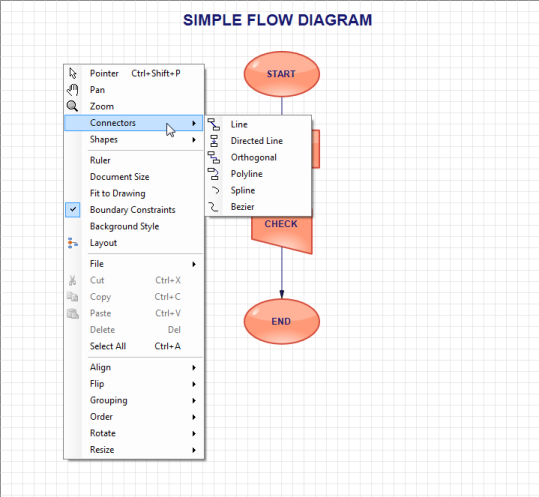

# Context Menu in Windows Forms Diagram

### Built-in context menu

The Essential® Diagram of Windows Forms provides built-in context menu support to the Diagram.

All available tools for the Diagram control such as File options, Edit options, Action options, Layout, Connectors, and Shapes are listed in the built-in context menu. 

Use Case Scenarios

This feature enables easy access of frequently used options. 

Properties_

<table>
<tr>
<th>
Property </th><th>
Description </th><th>
Type </th><th>
Data Type </th><th>
Reference links </th></tr>
<tr>
<td>
{{'[DefaultContextMenuEnabled](https://help.syncfusion.com/cr/windowsforms/Syncfusion.Windows.Forms.Diagram.DiagramProperties.html#Syncfusion_Windows_Forms_Diagram_DiagramProperties_DefaultContextMenuEnabled)'| markdownify }}</td><td>
Used to enable default context menu. </td><td>
NA </td><td>
Boolean  </td><td>
NA </td></tr>
</table>

Enabling Default Context Menu

You can enable the default context menu using the [_DefaultContextMenuEnabled_](https://help.syncfusion.com/cr/windowsforms/Syncfusion.Windows.Forms.Diagram.DiagramProperties.html#Syncfusion_Windows_Forms_Diagram_DiagramProperties_DefaultContextMenuEnabled) property.

The following code illustrates how to enable the default context menu:




//show default context menu
diagram1.DefaultContextMenuEnabled = true;



'show default context menu
diagram1.DefaultContextMenuEnabled = True




The following code illustrates how to disable the default context menu:




//hide default context menu
diagram1.DefaultContextMenuEnabled = false;




'hide default context menu
diagram1.DefaultContextMenuEnabled = False




Sample Link

To view a sample:

1. Open the Syncfusion® Dashboard.
2. Click the Windows Forms drop-down list and select Run Locally Installed Samples.
3. Navigate to Diagram Samples > Product Showcase > Diagram Builder.

## Conditionally show or hide context menu items at run time

You can conditionally show or hide context menu items at run time. In this, you can make a custom context menu by clearing the default context menu items.The following code example illustrates how to create the context menu item based on diagram elements selection.

The following code example illustrates how to define those.




//Used to clear the default contextmenu items
diagram1.ContextMenuStrip.Items.Clear();

//To initalize custom menus for diagram context menu items
System.Windows.Forms.ToolStripMenuItem fillToolStripMenuItem = new System.Windows.Forms.ToolStripMenuItem();
System.Windows.Forms.ToolStripMenuItem blueToolStripMenuItem = new System.Windows.Forms.ToolStripMenuItem();
System.Windows.Forms.ToolStripMenuItem strokeToolStripMenuItem = new System.Windows.Forms.ToolStripMenuItem();
System.Windows.Forms.ToolStripMenuItem blueToolStripMenuItem1 = new System.Windows.Forms.ToolStripMenuItem();

fillToolStripMenuItem.DropDownItems.AddRange(new System.Windows.Forms.ToolStripItem[] {blueToolStripMenuItem});

//adding properties to the items
fillToolStripMenuItem.Name = "fillToolStripMenuItem";
fillToolStripMenuItem.Size = new System.Drawing.Size(210, 24);
fillToolStripMenuItem.Text = "Fill";
blueToolStripMenuItem.Name = "blueToolStripMenuItem";
blueToolStripMenuItem.Size = new System.Drawing.Size(121, 26);
blueToolStripMenuItem.Text = "Blue";
blueToolStripMenuItem.Click += new System.EventHandler(blueToolStripMenuItem_Click);
blueToolStripMenuItem1.Name = "blueToolStripMenuItem1";
blueToolStripMenuItem1.Size = new System.Drawing.Size(121, 26);
blueToolStripMenuItem1.Text = "Blue";
blueToolStripMenuItem1.Click += new System.EventHandler(blueToolStripMenuItem1_Click);
strokeToolStripMenuItem.DropDownItems.AddRange(new System.Windows.Forms.ToolStripItem[] {blueToolStripMenuItem1});
strokeToolStripMenuItem.Name = "strokeToolStripMenuItem";
strokeToolStripMenuItem.Size = new System.Drawing.Size(210, 24);
strokeToolStripMenuItem.Text = "Stroke";
this.diagram1.ContextMenuStrip.Items.AddRange(new System.Windows.Forms.ToolStripItem[] {fillToolStripMenuItem,        strokeToolStripMenuItem});

//To register NodeMouseEnter event to diagram controller
diagram1.EventSink.NodeMouseEnter += EventSink_NodeMouseEnter;

private void EventSink_NodeMouseEnter(NodeMouseEventArgs evtArgs)
{
    //To show/hide context menu item based on selected objects in diagram
    if (evtArgs.Node is Node)
    {
        diagram1.ContextMenuStrip.Items[0].Visible = true;
        diagram1.ContextMenuStrip.Items[1].Visible = false;
    }
    if (evtArgs.Node is ConnectorBase)
    {
        diagram1.ContextMenuStrip.Items[0].Visible = false;
        diagram1.ContextMenuStrip.Items[1].Visible = true;

    }
}
        


