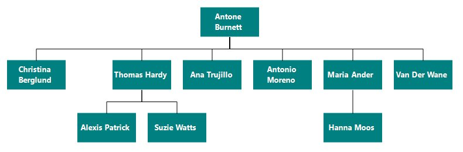
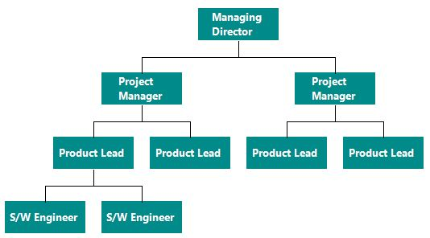

# Data Binding in Windows Forms Diagram

## Populating the data

* [WinForms Diagram](https://www.syncfusion.com/diagram-sdk/winforms-diagram) can be populated with the nodes and connectors based on the information provided from an external data source.
* Diagram exposes its specific data-related properties, which allow you specify the data source fields from which the node information has to be retrieved.

To explore those properties, refer to the [Data source settings](https://help.syncfusion.com/cr/windowsforms/Syncfusion.Windows.Forms.Diagram.Binding.html).

The following table lists the Binding properties used to map data source fields to the diagram:

<table>
<tr>
<th>Property</th><th>Description</th><th>Data Type</th></tr>
<tr>
<td>DefaultNode</td><td>Gets or sets the default node used as a template for each data-bound node.</td><td>Node</td></tr>
<tr>
<td>DefaultConnector</td><td>Gets or sets the default conennector.</td><td>ConnectorBase </td></tr>
<tr>
<td>Diagram</td><td>Gets or sets the Diagram.</td><td>Diagram </td></tr>
<tr>
<td>Label</td><td>Gets the collection of data source field names whose values are displayed as node labels.</td><td>Collection&lt;string&gt;</td></tr>
<tr>
<td>Id</td><td>Gets or sets the data source field name that uniquely identifies each node.</td><td>string</td></tr>
<tr>
<td>ParentId</td><td>Gets or sets the data source field name that identifies the parent node of each node.</td><td>string</td></tr>
<tr>
<td>DataSource</td><td>Gets or sets the data source (XML, DataTable, or object collection) from which node information is retrieved.</td><td>object</td></tr>
</table>

## XML data binding

Diagram can be populated based on the user-defined XML data by mapping the relevant data source fields.
To map the user-defined XML data with Diagram, you have to configure the [DataSource](https://help.syncfusion.com/cr/windowsforms/Syncfusion.Windows.Forms.Diagram.Binding.html#Syncfusion_Windows_Forms_Diagram_Binding_DataSource) fields. The following code example illustrates how to bind XML data to the Diagram.

### Sample XML Data



<?xml version="1.0" encoding="UTF-8"?>
<dataroot xmlns:od="urn:schemas-microsoft-com:officedata" xmlns:xsi="http://www.w3.org/2001/XMLSchema-instance"  xsi:noNamespaceSchemaLocation="Employees.xsd" generated="2005-01-18T15:03:23">
  <Employees EmployeeID="113001">
   <Name>Antone Burnett</Name>
    <Designation>Chief Executive Officer</Designation>
  </Employees>  
  
  <Employees EmployeeID="113002">
   <Name>Christina Berglund</Name>
    <Designation>Vice President of sales</Designation>
    <ManagerID>113001</ManagerID>
  </Employees>
  <Employees EmployeeID="113003">
   <Name>Thomas Hardy</Name>
    <Designation>Vice President of Engineering</Designation>
    <ManagerID>113001</ManagerID>
  </Employees>
  <Employees  EmployeeID="113004">
   <Name>Ana Trujillo</Name>
    <Designation>Vice President of Production</Designation>
    <ManagerID>113001</ManagerID>
  </Employees>
  <Employees  EmployeeID="113005">
   <Name>Antonio Moreno</Name>
    <Designation>Information Services Manager</Designation>
    <ManagerID>113001</ManagerID>
  </Employees>
  <Employees  EmployeeID="113006">
   <Name>Maria Anders</Name>
    <Designation>Chief Financial Officer</Designation>
    <ManagerID>113001</ManagerID>
  </Employees>
  <Employees  EmployeeID="113007">
   <Name>Van Der Wane</Name>
    <Designation>Marketing Manager</Designation>
    <ManagerID>113001</ManagerID>
  </Employees>
   <Employees  EmployeeID="113008">
   <Name>Alexis Patrick</Name>
    <Designation>Production Supervisor</Designation>
    <ManagerID>113003</ManagerID>
  </Employees>
    <Employees  EmployeeID="113009">
   <Name>Suzie Watts</Name>
    <Designation>Quality Assurance Manager</Designation>
    <ManagerID>113003</ManagerID>
  </Employees>  
  <Employees  EmployeeID="113010">
   <Name>Hanna Moos</Name>
    <Designation>Account Manager</Designation>
    <ManagerID>113006</ManagerID>
  </Employees>
 </dataroot>
 


The following code must be placed inside the form's `Load` event handler or constructor.




//Binds the XML(local data) with node
Syncfusion.Windows.Forms.Diagram.Rectangle rect = new Syncfusion.Windows.Forms.Diagram.Rectangle(100, 100, 100, 40, MeasureUnits.Pixel); 
rect.LineStyle.LineWidth = 0; 
rect.FillStyle.Color = Color.DarkCyan; 
// Default Label  
Syncfusion.Windows.Forms.Diagram.Label label = new Syncfusion.Windows.Forms.Diagram.Label(); 
label.FontStyle.Family = "Segoe UI"; 
label.FontStyle.Size = 9; 
label.FontStyle.Bold = true; 
label.FontColorStyle.Color = Color.White; 
label.UpdatePosition = true; 
rect.Labels.Add(label); 
//Initializing Data Binding properties 
diagram1.Binding.DefaultNode = rect; 
diagram1.Binding.Label.Add("Name"); 
diagram1.Binding.ParentId = "ManagerID"; 
diagram1.Binding.Id = "EmployeeID";
diagram1.Binding.DataSource = diagram1.GetDataSourceFromXML("..\\..\\XML Binding1.xml"); 




'Binds the XML(local data) with node
Dim rect As New Syncfusion.Windows.Forms.Diagram.Rectangle(100, 100, 100, 40, MeasureUnits.Pixel)
rect.LineStyle.LineWidth = 0
rect.FillStyle.Color = Color.DarkCyan
' Default Label 
Dim label As New Syncfusion.Windows.Forms.Diagram.Label()
label.FontStyle.Family = "Segoe UI"
label.FontStyle.Size = 9
label.FontStyle.Bold = True
label.FontColorStyle.Color = Color.White
label.UpdatePosition = True
rect.Labels.Add(label)
'Initializing Data Binding properties
diagram1.Binding.DefaultNode = rect
diagram1.Binding.Label.Add("Name")
diagram1.Binding.ParentId = "ManagerID"
diagram1.Binding.Id = "EmployeeID"
diagram1.Binding.DataSource = diagram1.GetDataSourceFromXML("..\..\XML Binding1.xml")




The following is a sample diagram.

## Database Binding

You can bind the Diagram with database data by using `SqlConnection`.
The following code illustrates how to bind the data to the Diagram.

The connection string used by `cbn.Connection.ConnectionString` is configured through the typed DataSet designer. To configure it manually, set the connection string directly, for example:

`string connectionString = "Data Source=SERVER_NAME;Initial Catalog=DATABASE_NAME;Integrated Security=True";`

The following code must be placed inside the form's `Load` event handler or constructor.




Syncfusion.Windows.Forms.Diagram.Rectangle rect = new Syncfusion.Windows.Forms.Diagram.Rectangle(100, 100, 100, 40, MeasureUnits.Pixel);
rect.LineStyle.LineWidth = 0;
rect.FillStyle.Color = Color.DarkCyan;
// Default Label 
Syncfusion.Windows.Forms.Diagram.Label label = new Syncfusion.Windows.Forms.Diagram.Label();
label.FontStyle.Family = "Segoe UI";
label.FontStyle.Size = 10;
label.FontStyle.Bold = true;
label.FontColorStyle.Color = Color.White;
label.UpdatePosition = true;
rect.Labels.Add(label);
//Initializing Data Binding properties            
diagram1.Binding.DefaultNode = rect;
diagram1.Binding.Id = "Id";
diagram1.Binding.ParentId = "ParentId";
DataTable table = new DataTable("alldata");
string command = "SELECT * FROM databind ";
diagramDataSetTableAdapters.databindTableAdapter cbn = new diagramDataSetTableAdapters.databindTableAdapter();
using (SqlConnection conn = new SqlConnection(cbn.Connection.ConnectionString))
{
  using (SqlCommand cmd = new SqlCommand(command, conn))
  {
    SqlDataAdapter adapt = new SqlDataAdapter(cmd);
    conn.Open();
    adapt.Fill(table);
    //Passing the table data to DataSource
    diagram1.Binding.DataSource = table;
    conn.Close();
  }
}




Dim rect As New Syncfusion.Windows.Forms.Diagram.Rectangle(100, 100, 100, 40, MeasureUnits.Pixel)
rect.LineStyle.LineWidth = 0
rect.FillStyle.Color = Color.DarkCyan
' Default Label 
Dim label As New Syncfusion.Windows.Forms.Diagram.Label()
label.FontStyle.Family = "Segoe UI"
label.FontStyle.Size = 10
label.FontStyle.Bold = True
label.FontColorStyle.Color = Color.White
label.UpdatePosition = True
rect.Labels.Add(label)
'Initializing Data Binding properties
diagram1.Binding.DefaultNode = rect
diagram1.Binding.Id = "Id"
diagram1.Binding.ParentId = "ParentId"
Dim table As New DataTable("alldata")
Dim cbn As New diagramDataSetTableAdapters.databindTableAdapter()
Dim command As String = "SELECT * FROM databind "
Using conn As New SqlConnection(cbn.Connection.ConnectionString)
Using cmd As New SqlCommand(command, conn)
Dim adapt As New SqlDataAdapter(cmd)
conn.Open()
adapt.Fill(table)
'Passing the table data to DataSource
diagram1.Binding.DataSource = table
conn.Close()
End Using
End Using




The following is a sample diagram.

