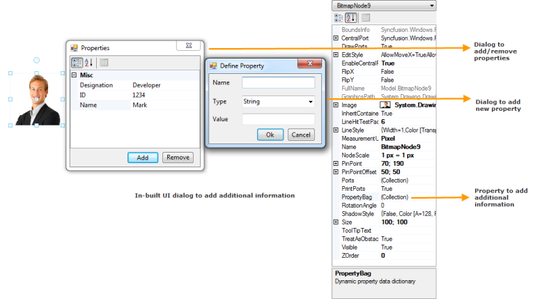

# Dynamic Properties in Windows Forms Diagram

## Overview

This feature lets users add additional properties or data to the nodes and connectors. Any type of data can be added as additional data or properties.

The node's [PropertyBag](https://help.syncfusion.com/cr/windowsforms/Syncfusion.Windows.Forms.Diagram.Node.html#Syncfusion_Windows_Forms_Diagram_Node_PropertyBag) property, which is a key-value pair, is used to add, edit, and remove the additional properties or data, which can be serialized when saving the diagram.

The [WinForms Diagram](https://www.syncfusion.com/diagram-sdk/winforms-diagram) has built-in UI dialogs to add, edit, and remove the dynamic properties. 

## Use Case Scenario

It is used to store additional data to the nodes or connectors as needed.

## Properties

<table>
<tr>
<th>
Property </th><th>
Description </th><th>
Data Type </th></tr>
<tr>
<td>
PropertyBag </td><td>
Gets or sets the dynamic property data dictionary.</td><td>
Dictionary<string, object></td></tr>
</table>

## Code Example

The following code shows how to add additional data to a node by using the [PropertyBag](https://help.syncfusion.com/cr/windowsforms/Syncfusion.Windows.Forms.Diagram.Node.html#Syncfusion_Windows_Forms_Diagram_Node_PropertyBag) property.




// Assumes a diagram node and an employee source object have been created beforehand.
Syncfusion.Windows.Forms.Diagram.Node node = new Syncfusion.Windows.Forms.Diagram.Node();
Employee employee = new Employee { EmployeeName = "John Doe", EmployeeID = 1001, Designation = "Developer" };

node.PropertyBag.Add("Name", employee.EmployeeName);
node.PropertyBag.Add("ID", employee.EmployeeID);
node.PropertyBag.Add("Designation", employee.Designation);




' Assumes a diagram node and an employee source object have been created beforehand.
Dim node As New Syncfusion.Windows.Forms.Diagram.Node()
Dim employee As New Employee() With { .EmployeeName = "John Doe", .EmployeeID = 1001, .Designation = "Developer" }

node.PropertyBag.Add("Name", employee.EmployeeName)
node.PropertyBag.Add("ID", employee.EmployeeID)
node.PropertyBag.Add("Designation", employee.Designation)




