# Event Handlers in Windows Forms Diagram

This section elaborates on the following:

### Diagram Events

[DiagramViewerEventSink](https://help.syncfusion.com/cr/windowsforms/Syncfusion.Windows.Forms.Diagram.DiagramViewerEventSink.html#) class contains the events specific to the diagram. The various events that can be invoked using this class are discussed in the following topics.

#### Node Collection Events

This topic discusses the events that are fired while adding or removing the node to or from the node collection. The below table discusses all the available node collection events.

Node Collection Events

<table>
<tr>
<th>
{{'[DiagramViewerEventSink](https://help.syncfusion.com/cr/windowsforms/Syncfusion.Windows.Forms.Diagram.DiagramViewerEventSink.html#"")'| markdownify }}</th><th>
Description</th></tr>
<tr>
<td>
{{'[NodeCollectionChanged](https://help.syncfusion.com/cr/windowsforms/Syncfusion.Windows.Forms.Diagram.EventSink.html)'| markdownify }}</td><td>
Triggered after the node collection changes are completed.</td></tr>
<tr>
<td>
{{'[NodeCollectionChanging](https://help.syncfusion.com/cr/windowsforms/Syncfusion.Windows.Forms.Diagram.EventSink.html)'| markdownify }}</td><td>
Triggered when the node collection is edited.</td></tr>
</table>

EventArgs members can be accessed using the following members.

Properties

<table>
<tr>
<th>
NodeCollection EventArgs Member</th><th>
Description</th></tr>
<tr>
<td>
Cancel</td><td>
Indicates whether the {{'[NodeCollectionChanged](https://help.syncfusion.com/cr/windowsforms/Syncfusion.Windows.Forms.Diagram.EventSink.html)'| markdownify }} event should be canceled.</td></tr>
<tr>
<td>
{{'[ChangeType](https://help.syncfusion.com/cr/windowsforms/Syncfusion.Windows.Forms.Diagram.CollectionExEventArgs.html#"")'| markdownify }}</td><td>
It returns the following possible values:Insert - whether the node is insertedRemove – whether the node is removed</td></tr>
<tr>
<td>
{{'[Element](https://help.syncfusion.com/cr/windowsforms/Syncfusion.Windows.Forms.Diagram.EndPointChangingEventArgs.html#Syncfusion_Windows_Forms_Diagram_EndPointChangingEventArgs_Element)'| markdownify }}</td><td>
Returns whether the head or tail end is moved.</td></tr>
<tr>
<td>
{{'[Elements](https://help.syncfusion.com/cr/windowsforms/Syncfusion.Windows.Forms.Diagram.CollectionExEventArgs.html#Syncfusion_Windows_Forms_Diagram_CollectionExEventArgs_Elements)'| markdownify }}</td><td>
Returns the elements collection on which the event occurs.</td></tr>
<tr>
<td>
{{'[Index](https://help.syncfusion.com/cr/windowsforms/Syncfusion.Windows.Forms.Diagram.CollectionExEventArgs.html#Syncfusion_Windows_Forms_Diagram_CollectionExEventArgs_Index)'| markdownify }}</td><td>
Returns the zero-based index into the collection on which the event occurred.</td></tr>
<tr>
<td>
{{'[Owner](https://help.syncfusion.com/cr/windowsforms/Syncfusion.Windows.Forms.Diagram.CollectionEx.html#Syncfusion_Windows_Forms_Diagram_CollectionEx_Owner)'| markdownify }}</td><td>
Returns the base class onto which the node is added.</td></tr>
</table>

Inside the [NodeCollectionChanged](https://help.syncfusion.com/cr/windowsforms/Syncfusion.Windows.Forms.Diagram.EventSink.html) event handler, user can identify whether a node is added or removed from the node collection using simple message box as follows.




private void Form1_Load(object sender, EventArgs e)
{
	((DiagramViewerEventSink)diagram1.EventSink).NodeCollectionChanged += new CollectionExEventHandler(Form1_NodeCollectionChanged)((DiagramViewerEventSink)diagram1.EventSink).NodeCollectionChanging += new CollectionExEventHandler(Form1_NodeCollectionChanging);
	RectangleF rect = new RectangleF(100, 100, 100, 100);
	RichTextNode richText = new RichTextNode("", rect);
	richText.Text = "Rich text box";
	NodeCollection nodeStack = new NodeCollection();
	nodeStack.Add(richText);
	MessageBox.Show(nodeStack.Count.ToString());
}

private void Form1_NodeCollectionChanging(CollectionExEventArgs e)
{
	MessageBox.Show("NodeCollectionChanging event fired");
}




Private Sub Form1_Load(ByVal sender As Object, ByVal e As EventArgs)
DirectCast(diagram1.EventSink, DiagramViewerEventSink).NodeCollectionChanged += New CollectionExEventHandler(Form1_NodeCollectionChanged)(DirectCast(diagram1.EventSink, DiagramViewerEventSink)).NodeCollectionChanging += New CollectionExEventHandler(Form1_NodeCollectionChanging)
Dim rect As New RectangleF(100, 100, 100, 100)
Dim richText As New RichTextNode("", rect)
richText.Text = "Rich text box"
Dim nodeStack As New NodeCollection()
nodeStack.Add(richText)
MessageBox.Show(nodeStack.Count.ToString())
End Sub

Private Sub Form1_NodeCollectionChanging(ByVal e As CollectionExEventArgs)
MessageBox.Show("NodeCollectionChanging event fired")
End Sub




Sample diagrams are as follows,

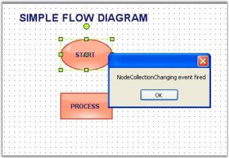

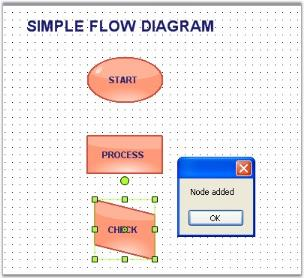

#### Node Mouse Events

This topic discusses the events that are raised when mouse entering or leaving the node. The below table discusses all the available node mouse events.

Node Mouse Events

<table>
<tr>
<th>
DiagramViewerEventSink</th><th>
Description</th></tr>
<tr>
<td>
{{'[NodeClick](https://help.syncfusion.com/cr/windowsforms/Syncfusion.Windows.Forms.Diagram.ViewerEventSink.html)'| markdownify }}</td><td>
Triggered when mouse clicked on the node.</td></tr>
<tr>
<td>
{{'[NodeDoubleClick](https://help.syncfusion.com/cr/windowsforms/Syncfusion.Windows.Forms.Diagram.ViewerEventSink.html)'| markdownify }}</td><td>
Triggered when mouse double clicked on the node.</td></tr>
<tr>
<td>
{{'[NodeMouseEnter](https://help.syncfusion.com/cr/windowsforms/Syncfusion.Windows.Forms.Diagram.ViewerEventSink.html)'| markdownify }}</td><td>
Triggered when mouse enter into the node.</td></tr>
<tr>
<td>
{{'[NodeMouseLeave](https://help.syncfusion.com/cr/windowsforms/Syncfusion.Windows.Forms.Diagram.ViewerEventSink.html)'| markdownify }}</td><td>
Triggered when mouse leaves the node.</td></tr>
</table>

EventArgs members can be accessed using the following members.

Properties

<table>
<tr>
<th>
NodeMouse EventArgs Member</th><th>
Description</th></tr>
<tr>
<td>
{{'[Node](https://help.syncfusion.com/cr/windowsforms/Syncfusion.Windows.Forms.Diagram.NodeMouseEventArgs.html#Syncfusion_Windows_Forms_Diagram_NodeMouseEventArgs__ctor_Syncfusion_Windows_Forms_Diagram_Node_)'| markdownify }}</td><td>
Gets the node clicked. If a single node is clicked that node will be returned. If a node is clicked from a group it will return that group as a node.</td></tr>
<tr>
<td>
{{'[Actual Node](https://help.syncfusion.com/cr/windowsforms/Syncfusion.Windows.Forms.Diagram.NodeMouseEventArgs.html#Syncfusion_Windows_Forms_Diagram_NodeMouseEventArgs_ActualNode)'| markdownify }}</td><td>
Actual Nodes gets the exact node. If we click a node from group it will retrieve the exact node clicked.</td></tr>
</table>




private void Form1_Load(object sender, EventArgs e)
{
	this.diagram1.EventSink.NodeMouseEnter += EventSink_NodeMouseEnter;
	this.diagram1.EventSink.NodeMouseLeave += EventSink_NodeMouseLeave; 
	this.diagram1.EventSink.NodeClick += EventSink_NodeClick;
    this.diagram1.EventSink.NodeDoubleClick += EventSink_NodeDoubleClick;      
}

void EventSink_NodeMouseEnter(Syncfusion.Windows.Forms.Diagram.NodeMouseEventArgs evtArgs)
{    
	MessageBox.Show("Node: " + evtArgs.Node.Name.ToString() +" , "+ "Actual Node: " + evtArgs.ActualNode.Name.ToString());    
}

void EventSink_NodeMouseLeave(Syncfusion.Windows.Forms.Diagram.NodeMouseEventArgs evtArgs)
{    
	MessageBox.Show("Node: " + evtArgs.Node.Name.ToString() + " , " + "Actual Node: " + evtArgs.ActualNode.Name.ToString());    
}
void EventSink_NodeDoubleClick(Syncfusion.Windows.Forms.Diagram.NodeMouseEventArgs evtArgs)
{
    MessageBox.Show("Node: " + evtArgs.Node.Name.ToString()); 
}

void EventSink_NodeClick(Syncfusion.Windows.Forms.Diagram.NodeMouseEventArgs evtArgs)
{
    MessageBox.Show("Node: " + evtArgs.Node.Name.ToString()); 
}




Private Sub Form1_Load(ByVal sender As Object, ByVal e As EventArgs)
AddHandler Me.diagram1.EventSink.NodeMouseEnter, AddressOf EventSink_NodeMouseEnter
AddHandler Me.diagram1.EventSink.NodeMouseLeave, AddressOf EventSink_NodeMouseLeave
AddHandler Me.diagram1.EventSink.NodeClick, AddressOf EventSink_NodeClick
AddHandler Me.diagram1.EventSink.NodeDoubleClick, AddressOf EventSink_NodeDoubleClick
End Sub

Private Sub EventSink_NodeMouseEnter(ByVal evtArgs As Syncfusion.Windows.Forms.Diagram.NodeMouseEventArgs)
MessageBox.Show("Node: " & evtArgs.Node.Name.ToString() & " , " & "Actual Node: " & evtArgs.ActualNode.Name.ToString())
End Sub

Private Sub EventSink_NodeMouseLeave(ByVal evtArgs As Syncfusion.Windows.Forms.Diagram.NodeMouseEventArgs)
MessageBox.Show("Node: " & evtArgs.Node.Name.ToString() & " , " & "Actual Node: " & evtArgs.ActualNode.Name.ToString())
End Sub

Private Sub EventSink_NodeClick(ByVal evtArgs As Syncfusion.Windows.Forms.Diagram.NodeMouseEventArgs)
MessageBox.Show("Node: " & evtArgs.Node.Name.ToString())
End Sub

Private Sub EventSink_NodeDoubleClick(ByVal evtArgs As Syncfusion.Windows.Forms.Diagram.NodeMouseEventArgs)
MessageBox.Show("Node: " & evtArgs.Node.Name.ToString())
End Sub




#### Tool Events

The below events gets fired while activating or deactivating the UI tools ([Zoom](https://help.syncfusion.com/cr/windowsforms/Syncfusion.Windows.Forms.Diagram.ZoomTool.html), [Pan](https://help.syncfusion.com/cr/windowsforms/Syncfusion.Windows.Forms.Diagram.PanTool.html), [Select](https://help.syncfusion.com/cr/windowsforms/Syncfusion.Windows.Forms.Diagram.SelectTool.html) etc) in the diagram.

The below table shows all the Tool Events.

Tool Events

<table>
<tr>
<th>
DiagramViewerEventSink</th><th>
Description</th></tr>
<tr>
<td>
{{'[ToolActivated](https://help.syncfusion.com/cr/windowsforms/Syncfusion.Windows.Forms.Diagram.DiagramViewerEventSink.html)'| markdownify }}</td><td>
Triggered when UI tool is activated.</td></tr>
<tr>
<td>
{{'[ToolDeactivated](https://help.syncfusion.com/cr/windowsforms/Syncfusion.Windows.Forms.Diagram.DiagramViewerEventSink.html)'| markdownify }}</td><td>
Triggered when UI tool is deactivated.</td></tr>
</table>

Data can be retrieved or set using the following members.

Members

<table>
<tr>
<th>
ToolActivated / Deactivated EventArgs Members      </th><th>
Description</th></tr>
<tr>
<td>
Tool</td><td>
Returns the tools object that generated the event. It has following properties,Name - Name of the Tool.</td></tr>
</table>

In the below code sample, when a tool is activated or deactivated the corresponding event will be raised, and the tool name along with the status will be displayed.




private void Form1_Load(object sender, EventArgs e)
{
	((DiagramViewerEventSink)diagram1.EventSink).ToolActivated += new ToolEventHandler(DiagramForm_ToolActivated);
	((DiagramViewerEventSink)diagram1.EventSink).ToolDeactivated += new ToolEventHandler(Form1_ToolDeactivated);
	diagram1.Controller.ActivateTool("ZoomTool");
}

void Form1_ToolDeactivated(ToolEventArgs e)
{
	MessageBox.Show("Deactivated Tool Name: " + e.Tool.Name);
}

private void DiagramForm_ToolActivated(ToolEventArgs e)
{
	MessageBox.Show("Activated Tool Name: " + e.Tool.Name + "\n" + "Status: " + e.Tool.InAction);
}




Private Sub Form1_Load(ByVal sender As Object, ByVal e As EventArgs)
AddHandler DirectCast(diagram1.EventSink, DiagramViewerEventSink).ToolActivated, AddressOf DiagramForm_ToolActivated
AddHandler DirectCast(diagram1.EventSink, DiagramViewerEventSink).ToolDeactivated, AddressOf Form1_ToolDeactivated
diagram1.Controller.ActivateTool("ZoomTool")
End Sub

Private Sub Form1_ToolDeactivated(ByVal e As ToolEventArgs)
MessageBox.Show("Deactivated Tool Name: " & e.Tool.Name)
End Sub

Private Sub DiagramForm_ToolActivated(ByVal e As ToolEventArgs)
MessageBox.Show(("Activated Tool Name: " & e.Tool.Name & vbLf & "Status: ") + e.Tool.InAction)
End Sub




Sample diagrams are as follows,

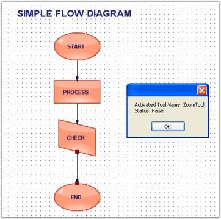

#### Origin Events

The [Origin](https://help.syncfusion.com/cr/windowsforms/Syncfusion.Windows.Forms.Diagram.View.html#Syncfusion_Windows_Forms_Diagram_View_Origin) changes when the diagram window is scrolled either horizontally or vertically.

[Origin](https://help.syncfusion.com/cr/windowsforms/Syncfusion.Windows.Forms.Diagram.View.html#Syncfusion_Windows_Forms_Diagram_View_Origin) events are as follows,

Origin Events

<table>
<tr>
<th>
DiagramViewerEventSink</th><th>
Description</th></tr>
<tr>
<td>
{{'[OriginChanged](https://help.syncfusion.com/cr/windowsforms/Syncfusion.Windows.Forms.Diagram.ViewerEventSink.html)'| markdownify }}</td><td>
Triggered when the origin is changed.</td></tr>
</table>

Data can be retrieved or set by using the following members.

Members

<table>
<tr>
<th>
Origin EventArgs Member</th><th>
Description</th></tr>
<tr>
<td>
{{'[NewOrigin](https://help.syncfusion.com/cr/windowsforms/Syncfusion.Windows.Forms.Diagram.ViewOriginEventArgs.html#Syncfusion_Windows_Forms_Diagram_ViewOriginEventArgs_NewOrigin)'| markdownify }}</td><td>
Returns the new X and Y origin values after moving the origin.</td></tr>
<tr>
<td>
{{'[Offset](https://help.syncfusion.com/cr/windowsforms/Syncfusion.Windows.Forms.Diagram.ViewOriginEventArgs.html#Syncfusion_Windows_Forms_Diagram_ViewOriginEventArgs_Offset)'| markdownify }}</td><td>
Returns the difference between the old and new origin.</td></tr>
<tr>
<td>
{{'[OriginalOrigin](https://help.syncfusion.com/cr/windowsforms/Syncfusion.Windows.Forms.Diagram.ViewOriginEventArgs.html#Syncfusion_Windows_Forms_Diagram_ViewOriginEventArgs_OriginalOrigin)'| markdownify }}</td><td>
Returns the X and Y values before moving the origin.</td></tr>
</table>

In the following code sample, when the [OriginChanged](https://help.syncfusion.com/cr/windowsforms/Syncfusion.Windows.Forms.Diagram.ViewerEventSink.html) event is handled, the various member values are listed in a text box as the control is scrolled accordingly.




public void Form1_Load(object sender, EventArgs e)
{
	((DiagramViewerEventSink)diagram1.EventSink).OriginChanged += new ViewOriginEventHandler(Form1_OriginChanged);
	NodeCollection nodeStack = new NodeCollection();
	
	// Circle
	Syncfusion.Windows.Forms.Diagram.Ellipse circle = new Syncfusion.Windows.Forms.Diagram.Ellipse(0, 0, 96, 72);
	circle.Name = "Circle";
	circle.FillStyle.Type = FillStyleType.LinearGradient;
	circle.FillStyle.ForeColor = Color.AliceBlue;
	circle.ShadowStyle.Visible = true;
	nodeStack.Add(circle);
	
	// Polygon
	PointF[] pts ={ new Point(6, 36), new Point(48, 6), new Point(90, 36), new Point(48, 66) };
	Polygon polygon = new Polygon(pts);
	polygon.Name = "Polygon";
	polygon.FillStyle.ForeColor = Color.DarkSeaGreen;
	polygon.FillStyle.Color = Color.DarkSeaGreen;
	nodeStack.Add(polygon);
	
	int i = 0;
	this.model4.AppendChildren(nodeStack, out i);
	MessageBox.Show("Node count =" + "\n" + nodeStack.Count.ToString());
	textBox1.Text = model4.Nodes.Last.Name;
	this.diagram1.HScroll = true;
	this.diagram1.VScroll = true;
}

private void Form1_OriginChanged(ViewOriginEventArgs e)
{
	textBox1.Text = "X = " + e.OriginalOrigin.X + "," + "Y = " + e.OriginalOrigin.Y + "  " + "New X= " + e.NewOrigin.X + "," + "New 	Y= " + e.NewOrigin.Y;
}




Public Sub Form1_Load(ByVal sender As Object, ByVal e As EventArgs)
AddHandler DirectCast(diagram1.EventSink, DiagramViewerEventSink).OriginChanged, AddressOf Form1_OriginChanged
Dim nodeStack As New NodeCollection()

' Circle
Dim circle As New Syncfusion.Windows.Forms.Diagram.Ellipse(0, 0, 96, 72)
circle.Name = "Circle"
circle.FillStyle.Type = FillStyleType.LinearGradient
circle.FillStyle.ForeColor = Color.AliceBlue
circle.ShadowStyle.Visible = True
nodeStack.Add(circle)

' Polygon
Dim pts As PointF() = {New Point(6, 36), New Point(48, 6), New Point(90, 36), New Point(48, 66)}
Dim polygon As New Polygon(pts)
polygon.Name = "Polygon"
polygon.FillStyle.ForeColor = Color.DarkSeaGreen
polygon.FillStyle.Color = Color.DarkSeaGreen
nodeStack.Add(polygon)

Dim i As Integer = 0
Me.model4.AppendChildren(nodeStack, i)
MessageBox.Show(("Node count =" & vbLf) + nodeStack.Count.ToString())
textBox1.Text = model4.Nodes.Last.Name
Me.diagram1.HScroll = True
Me.diagram1.VScroll = True
End Sub

Private Sub Form1_OriginChanged(ByVal e As ViewOriginEventArgs)
textBox1.Text = ((("X = " & e.OriginalOrigin.X & "," & "Y = ") + e.OriginalOrigin.Y & "  " & "New X= ") + e.NewOrigin.X & "," & "New " & vbTab & "Y= ") + e.NewOrigin.Y
End Sub




Sample diagrams are as follows.

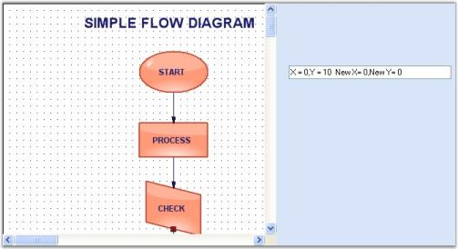

#### Magnification Event 

When the control is zoomed in or out, the magnification events will be fired displaying the old and new magnification factors.

[Magnification](https://help.syncfusion.com/cr/windowsforms/Syncfusion.Windows.Forms.Diagram.View.html#Syncfusion_Windows_Forms_Diagram_View_Magnification) Events are as follows,

Magnification Events

<table>
<tr>
<th>
DiagramViewerEventSink</th><th>
Description</th></tr>
<tr>
<td>
{{'[MagnificationChanged](https://help.syncfusion.com/cr/windowsforms/Syncfusion.Windows.Forms.Diagram.ViewerEventSink.html)'| markdownify }}</td><td>
Fired when magnification value is changed.</td></tr>
</table>

Data can be retrieved or set using the following members.

Member properties

<table>
<tr>
<th>
Magnification EventArgs Member</th><th>
Description</th></tr>
<tr>
<td>
{{'[NewMagnification](https://help.syncfusion.com/cr/windowsforms/Syncfusion.Windows.Forms.Diagram.ViewMagnificationEventArgs.html#Syncfusion_Windows_Forms_Diagram_ViewMagnificationEventArgs_NewMagnification)'| markdownify }}</td><td>
Returns the new magnification value.</td></tr>
<tr>
<td>
{{'[OriginalMagnification](https://help.syncfusion.com/cr/windowsforms/Syncfusion.Windows.Forms.Diagram.ViewMagnificationEventArgs.html#Syncfusion_Windows_Forms_Diagram_ViewMagnificationEventArgs_OriginalMagnification)'| markdownify }}</td><td>
Returns the old magnification value before the event occurred.</td></tr>
</table>




private void Form1_Load(object sender, EventArgs e)
{
((DiagramViewerEventSink)diagram1.EventSink).MagnificationChanged += new ViewMagnificationEventHandler(Form1_MagnificationChanged);
}

[EventHandlerPriorityAttribute(true)]
private void Form1_MagnificationChanged(ViewMagnificationEventArgs evtArgs)
{
MessageBox.Show("Old Factor: " + evtArgs.OriginalMagnification.ToString() + "New Factor: " + evtArgs.NewMagnification.ToString());
}




Private Sub Form1_Load(ByVal sender As Object, ByVal e As EventArgs)
AddHandler DirectCast(diagram1.EventSink, DiagramViewerEventSink).MagnificationChanged, AddressOf Form1_MagnificationChanged
End Sub

Private Sub Form1_MagnificationChanged(ByVal evtArgs As ViewMagnificationEventArgs)
MessageBox.Show(("Old Factor: " & evtArgs.OriginalMagnification.ToString() & "New Factor: ") + evtArgs.NewMagnification.ToString())
End Sub




Sample diagrams are as follows,

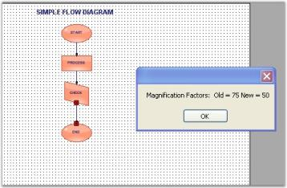

#### Editor Events

Diagram control provides support to notify users when the text in the [Text Editor](https://help.syncfusion.com/cr/windowsforms/Syncfusion.Windows.Forms.Diagram.DiagramController.html#Syncfusion_Windows_Forms_Diagram_DiagramController_TextEditor) and Label Editor are changed. The following table lists the Editor events associated with Diagram control.

Editor Events

<table>
<tr>
<th>
Event Name</th><th>
Description</th></tr>
<tr>
<td>
{{'[TextChanged](https://help.syncfusion.com/cr/windowsforms/Syncfusion.Windows.Forms.Diagram.TextEditor.html)'| markdownify }}</td><td>
This event is raised when the text in the text editor is changed. </td></tr>
<tr>
<td>
{{'[LabelTextChanged](https://help.syncfusion.com/cr/windowsforms/Syncfusion.Windows.Forms.Diagram.InPlaceEditor.html)'| markdownify }}</td><td>
This event is raised when the text in the label editor is changed.</td></tr>
<tr>
<td>
{{'[KeyDown](https://help.syncfusion.com/cr/windowsforms/Syncfusion.Windows.Forms.Diagram.TextEditor.html)'| markdownify }}</td><td>
This event is raised whenever a key is pressed in the text editor. </td></tr>
<tr>
<td>
{{'[TextEditingCompleted](https://help.syncfusion.com/cr/windowsforms/Syncfusion.Windows.Forms.Diagram.TextEditor.html)'| markdownify }}</td><td>
This event is raised when the text editing in the text editor is completed. </td></tr>
</table>

The following code example illustrates how the [TextChanged](https://help.syncfusion.com/cr/windowsforms/Syncfusion.Windows.Forms.Diagram.TextEditor.html) and [LabelTextChanged](https://help.syncfusion.com/cr/windowsforms/Syncfusion.Windows.Forms.Diagram.InPlaceEditor.html) events are raised when the text in the text editor and label editor are changed respectively.




private void Form1_Load(object sender, EventArgs e)
{
	diagram1.Controller.TextEditor.TextChanged += new EventHandler(TextEditor_TextChanged);
	diagram1.Controller.InPlaceEditor.LabelTextChanged += new EventHandler(InPlaceEditor_LabelTextChanged); 
	diagram1.Controller.TextEditor.KeyDown += TextEditor_KeyDown;
	diagram1.Controller.TextEditor.TextEditingCompleted += TextEditor_TextEditingCompleted;
}

void TextEditor_TextChanged(object sender, EventArgs e)
{
	MessageBox.Show("Text :" + this.diagram1.Controller.TextEditor.Text);
}

void InPlaceEditor_LabelTextChanged(object sender, EventArgs e)
{
	MessageBox.Show("Text :" + this.diagram1.Controller.InPlaceEditor.Text);
}  

void TextEditor_KeyDown(object sender, KeyEventArgs e)
{
	MessageBox.Show("Key Down:" + e.KeyData);
}

void TextEditor_TextEditingCompleted(object sender, Syncfusion.Windows.Forms.Diagram.LabelEditingCompletedEventArgs evtArgs)
{
	MessageBox.Show("Text Edit Completed:" + evtArgs.Value.ToString());
}




Private Sub Form1_Load(sender As Object, e As EventArgs)    
diagram1.Controller.TextEditor.TextChanged += New EventHandler(AddressOf TextEditor_TextChanged)
diagram1.Controller.InPlaceEditor.LabelTextChanged += New EventHandler(AddressOf InPlaceEditor_LabelTextChanged)        
diagram1.Controller.TextEditor.KeyDown += New EventHandler(AddressOf TextEditor_KeyDown)
diagram1.Controller.TextEditor.TextEditingCompleted += New EventHandler(AddressOf TextEditor_TextEditingCompleted)    
End Sub

Private Sub TextEditor_TextChanged(sender As Object, e As EventArgs)
MessageBox.Show("Text :" & Convert.ToString(Me.diagram1.Controller.TextEditor.Text))
End Sub

Private Sub InPlaceEditor_LabelTextChanged(sender As Object, e As EventArgs)
MessageBox.Show("Text :" & Convert.ToString(Me.diagram1.Controller.InPlaceEditor.Text))
End Sub

Private Sub TextEditor_KeyDown(ByVal sender As Object, ByVal e As KeyEventArgs)
MessageBox.Show("Key Down:" & e.KeyData)
End Sub

Private Sub TextEditor_TextEditingCompleted(ByVal sender As Object, ByVal evtArgs As Syncfusion.Windows.Forms.Diagram.LabelEditingCompletedEventArgs)
MessageBox.Show("Text Edit Completed:" & evtArgs.Value.ToString())
End Sub




### Model Events

[DocumentEventSink](https://help.syncfusion.com/cr/windowsforms/Syncfusion.Windows.Forms.Diagram.DocumentEventSink.html#) class contains the events specific to the document. The various events that can be invoked using this class are discussed in the following topics.

#### Vertex Events

Vertex Events are as follows,

Vertex Events

<table>
<tr>
<th>
DocumentEventSink</th><th>
Description</th></tr>
<tr>
<td>
{{'[VertexChanged](https://help.syncfusion.com/cr/windowsforms/Syncfusion.Windows.Forms.Diagram.DocumentEventSink.html)'| markdownify }}</td><td>
Gets fired after the vertex of the node has been changed.</td></tr>
<tr>
<td>
{{'[VertexChanging](https://help.syncfusion.com/cr/windowsforms/Syncfusion.Windows.Forms.Diagram.DocumentEventSink.html)'| markdownify }}</td><td>
Gets fired when the vertex of the node is changed.</td></tr>
</table>

Data can be retrieved or set using the following members.

Description

<table>
<tr>
<th>
Vertex EventArgs Member</th><th>
Description</th></tr>
<tr>
<td>
{{'[Cancel](https://help.syncfusion.com/cr/windowsforms/Syncfusion.Windows.Forms.Diagram.VertexChangingEventArgs.html#Syncfusion_Windows_Forms_Diagram_VertexChangingEventArgs_Cancel)'| markdownify }}</td><td>
Cancels the Vertex Changed event from being fired.</td></tr>
<tr>
<td>
{{'[ChangeType](https://help.syncfusion.com/cr/windowsforms/Syncfusion.Windows.Forms.Diagram.VertexChangedEventArgs.html#Syncfusion_Windows_Forms_Diagram_VertexChangedEventArgs_ChangeType)'| markdownify }}</td><td>
It returns the following possible value:Set - whether the vertex is set for the node.</td></tr>
<tr>
<td>
{{'[NodeAffected](https://help.syncfusion.com/cr/windowsforms/Syncfusion.Windows.Forms.Diagram.VertexChangedEventArgs.html#Syncfusion_Windows_Forms_Diagram_VertexChangedEventArgs_NodeAffected)'| markdownify }}</td><td>
Returns the node's name by which the node was  affected.</td></tr>
<tr>
<td>
{{'[VertexIndex](https://help.syncfusion.com/cr/windowsforms/Syncfusion.Windows.Forms.Diagram.VertexChangedEventArgs.html#Syncfusion_Windows_Forms_Diagram_VertexChangedEventArgs_VertexIndex)'| markdownify }}</td><td>
Returns the index of the current vertex.</td></tr>
<tr>
<td>
Vertex EventArgs Member</td><td>
Description</td></tr>
<tr>
<td>
{{'[VertexLocation](https://help.syncfusion.com/cr/windowsforms/Syncfusion.Windows.Forms.Diagram.VertexChangedEventArgs.html#Syncfusion_Windows_Forms_Diagram_VertexChangedEventArgs_VertexLocation)'| markdownify }}</td><td>
Returns the position of the vertex.</td></tr>
</table>

Programmatically the events are written as follows,




public void Form1_Load(object sender, EventArgs e)
{
	((DocumentEventSink)model1.EventSink).VertexChanged += new VertexChangedEventHandler(Form1_VertexChanged);
	((DocumentEventSink)model1.EventSink).VertexChanging += new VertexChangingEventHandler(Form1_VertexChanging);
	LineConnector line = new LineConnector(circle.PinPoint, polygon.PinPoint);
	polygon.CentralPort.TryConnect(line.HeadEndPoint);
	circle.CentralPort.TryConnect(line.TailEndPoint);
	model1.AppendChild(line);
}

private void Form1_VertexChanging(VertexChangingEventArgs vertexChange)
{
	MessageBox.Show("VertexChanging fired");
	model1.LineStyle.LineWidth = 2;
}

private void Form1_VertexChanged(VertexChangedEventArgs vertexChange)
{
	MessageBox.Show("Target Node - " + vertexChange.NodeAffected.FullName + "\n" + vertexChange.VertexLocation.ToString());
}




Public Sub Form1_Load(ByVal sender As Object, ByVal e As EventArgs)
AddHandler DirectCast(model1.EventSink, DocumentEventSink).VertexChanged, AddressOf Form1_VertexChanged
AddHandler DirectCast(model1.EventSink, DocumentEventSink).VertexChanging, AddressOf Form1_VertexChanging
Dim line As New LineConnector(circle.PinPoint, polygon.PinPoint)
polygon.CentralPort.TryConnect(line.HeadEndPoint)
circle.CentralPort.TryConnect(line.TailEndPoint)
model1.AppendChild(line)
End Sub

Private Sub Form1_VertexChanging(ByVal vertexChange As VertexChangingEventArgs)
MessageBox.Show("VertexChanging fired")
model1.LineStyle.LineWidth = 2
End Sub

Private Sub Form1_VertexChanged(ByVal vertexChange As VertexChangedEventArgs)
MessageBox.Show(("Target Node - " & vertexChange.NodeAffected.FullName & vbLf) + vertexChange.VertexLocation.ToString())
End Sub




Sample diagrams are as follows,

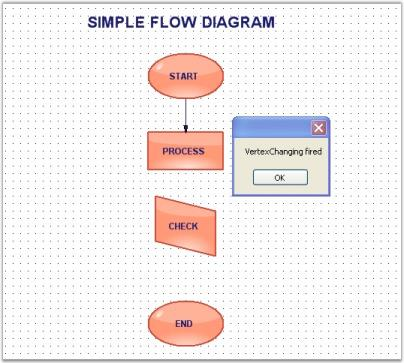

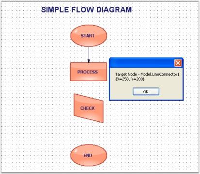

#### PinPoint Events

 When changing the node's location, the pinpoint of the node will be reset. The below table contains pinpoint events and descriptions. 

Pinpoint Events

<table>
<tr>
<th>
DocumentEventSink</th><th>
Description</th></tr>
<tr>
<td>
{{'[PinOffsetChanged](https://help.syncfusion.com/cr/windowsforms/Syncfusion.Windows.Forms.Diagram.DocumentEventSink.html)'| markdownify }}</td><td>
Triggered after the offset of the pinpoint is reset.</td></tr>
<tr>
<td>
{{'[PinOffsetChanging](https://help.syncfusion.com/cr/windowsforms/Syncfusion.Windows.Forms.Diagram.DocumentEventSink.html)'| markdownify }}</td><td>
Triggered when the offset of the pinpoint is changed.</td></tr>
<tr>
<td>
{{'[PinPointChanged](https://help.syncfusion.com/cr/windowsforms/Syncfusion.Windows.Forms.Diagram.DocumentEventSink.html)'| markdownify }}</td><td>
Triggered after the pinpoint is repositioned.</td></tr>
<tr>
<td>
{{'[PinPointChanging](https://help.syncfusion.com/cr/windowsforms/Syncfusion.Windows.Forms.Diagram.DocumentEventSink.html)'| markdownify }}</td><td>
Triggered when the pinpoint is moved.</td></tr>
</table>

Data can be retrieved or set using the following members.

Members

<table>
<tr>
<th>
PinPoint / PinPointOffset EventArgs Member</th><th>
Description</th></tr>
<tr>
<td>
{{'[Cancel](https://help.syncfusion.com/cr/windowsforms/Syncfusion.Windows.Forms.Diagram.OffsetChangingEventArgs.html#Syncfusion_Windows_Forms_Diagram_OffsetChangingEventArgs_Cancel)'| markdownify }}</td><td>
Cancels the PinPoint Changing events.</td></tr>
<tr>
<td>
{{'[NodeAffected](https://help.syncfusion.com/cr/windowsforms/Syncfusion.Windows.Forms.Diagram.OffsetChangedEventArgs.html#Syncfusion_Windows_Forms_Diagram_OffsetChangedEventArgs_NodeAffected)'| markdownify }}</td><td>
Returns the node's name by which the node was affected.</td></tr>
<tr>
<td>
{{'[Offset](https://help.syncfusion.com/cr/windowsforms/Syncfusion.Windows.Forms.Diagram.OffsetChangedEventArgs.html#Syncfusion_Windows_Forms_Diagram_OffsetChangedEventArgs_Offset)'| markdownify }}</td><td>
Returns the X and Y values.</td></tr>
</table>

Programmatically the events are written as follows,




public void Form1_Load(object sender, EventArgs e)
{
	((DocumentEventSink)model4.EventSink).PinOffsetChanged += new PinOffsetChangedEventHandler(Form1_PinOffsetChanged);
	((DocumentEventSink)model4.EventSink).PinOffsetChanging += new PinOffsetChangingEventHandler(Form1_PinOffsetChanging);
	((DocumentEventSink)model4.EventSink).PinPointChanged += new PinPointChangedEventHandler(Form1_PinPointChanged);
	((DocumentEventSink)model4.EventSink).PinPointChanging += new PinPointChangingEventHandler(Form1_PinPointChanging);
	
	// Circle
	Syncfusion.Windows.Forms.Diagram.Ellipse circle = new Syncfusion.Windows.Forms.Diagram.Ellipse(0, 0, 96, 72);
	circle.Name = "Circle";
	circle.FillStyle.Type = FillStyleType.LinearGradient;
	circle.FillStyle.ForeColor = Color.AliceBlue;
	circle.ShadowStyle.Visible = true;
	model4.AppendChild(circle);
}

void Form1_PinPointChanging(PinPointChangingEventArgs evtArgs)
{
	MessageBox.Show("PinpointChanging event is fired" + "\n" + "Node name: " + evtArgs.NodeAffected.Name.ToString());
}

void Form1_PinPointChanged(PinPointChangedEventArgs evtArgs)
{
	MessageBox.Show("PinPointChanged event is fired" + "\n" + "Offset values: " + evtArgs.Offset.ToString());
}

void Form1_PinOffsetChanging(PinOffsetChangingEventArgs evtArgs)
{
	MessageBox.Show("PinOffsetChanging event is fired" + "\n" + "Node name: " + evtArgs.NodeAffected.Name);
}

void Form1_PinOffsetChanged(PinOffsetChangedEventArgs evtArgs)
{
	MessageBox.Show("PinOffsetChanged event is fired" + "\n" + "Offset values: " + evtArgs.Offset.ToString());
}




Public Sub Form1_Load(ByVal sender As Object, ByVal e As EventArgs)
AddHandler DirectCast(model4.EventSink, DocumentEventSink).PinOffsetChanged, AddressOf Form1_PinOffsetChanged
AddHandler DirectCast(model4.EventSink, DocumentEventSink).PinOffsetChanging, AddressOf Form1_PinOffsetChanging
AddHandler DirectCast(model4.EventSink, DocumentEventSink).PinPointChanged, AddressOf Form1_PinPointChanged
AddHandler DirectCast(model4.EventSink, DocumentEventSink).PinPointChanging, AddressOf Form1_PinPointChanging

' Circle
Dim circle As New Syncfusion.Windows.Forms.Diagram.Ellipse(0, 0, 96, 72)
circle.Name = "Circle"
circle.FillStyle.Type = FillStyleType.LinearGradient
circle.FillStyle.ForeColor = Color.AliceBlue
circle.ShadowStyle.Visible = True
model4.AppendChild(circle)
End Sub

Private Sub Form1_PinPointChanging(ByVal evtArgs As PinPointChangingEventArgs)
MessageBox.Show(("PinpointChanging event is fired" & vbLf & "Node name: ") + evtArgs.NodeAffected.Name.ToString())
End Sub

Private Sub Form1_PinPointChanged(ByVal evtArgs As PinPointChangedEventArgs)
MessageBox.Show(("PinPointChanged event is fired" & vbLf & "Offset values: ") + evtArgs.Offset.ToString())
End Sub

Private Sub Form1_PinOffsetChanging(ByVal evtArgs As PinOffsetChangingEventArgs)
MessageBox.Show(("PinOffsetChanging event is fired" & vbLf & "Node name: ") + evtArgs.NodeAffected.Name)
End Sub

Private Sub Form1_PinOffsetChanged(ByVal evtArgs As PinOffsetChangedEventArgs)
MessageBox.Show(("PinOffsetChanged event is fired" & vbLf & "Offset values: ") + evtArgs.Offset.ToString())
End Sub




Sample diagrams are as follows,

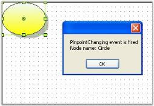

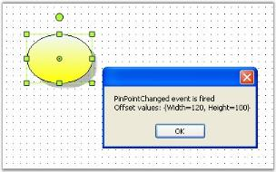

#### Rotation Events

When the control is rotated horizontally or vertically, the rotation events will be fired displaying the rotation offsets.

The below table discusses the available rotation events with descriptions.

Rotation Events

<table>
<tr>
<th>
DocumentEventSink</th><th>
Description</th></tr>
<tr>
<td>
{{'[FlipChanged](https://help.syncfusion.com/cr/windowsforms/Syncfusion.Windows.Forms.Diagram.DocumentEventSink.html)'| markdownify }}</td><td>
Triggered after the node is rotated using Flip property.</td></tr>
<tr>
<td>
{{'[FlipChanging](https://help.syncfusion.com/cr/windowsforms/Syncfusion.Windows.Forms.Diagram.DocumentEventSink.html)'| markdownify }}</td><td>
Triggered when the node is rotated using Flip property.</td></tr>
<tr>
<td>
{{'[RotationChanged](https://help.syncfusion.com/cr/windowsforms/Syncfusion.Windows.Forms.Diagram.DocumentEventSink.html)'| markdownify }}</td><td>
Triggered after the node is rotated.</td></tr>
<tr>
<td>
{{'[RotationChanging](https://help.syncfusion.com/cr/windowsforms/Syncfusion.Windows.Forms.Diagram.DocumentEventSink.html)'| markdownify }}</td><td>
Triggered on rotating the node in any direction.</td></tr>
</table>

Data can be retrieved or set using the following members.

Members

<table>
<tr>
<th>
Rotation EventArgs Member</th><th>
Description</th></tr>
<tr>
<td>
{{'[NodeAffected](https://help.syncfusion.com/cr/windowsforms/Syncfusion.Windows.Forms.Diagram.RotationChangedEventArgs.html#Syncfusion_Windows_Forms_Diagram_RotationChangedEventArgs_NodeAffected)'| markdownify }}</td><td>
Returns the node's name by which the node was affected.</td></tr>
<tr>
<td>
{{'[RotationOffset](https://help.syncfusion.com/cr/windowsforms/Syncfusion.Windows.Forms.Diagram.RotationChangedEventArgs.html#Syncfusion_Windows_Forms_Diagram_RotationChangedEventArgs_RotationOffset)'| markdownify }}</td><td>
Returns the angle by which the node was rotated.</td></tr>
</table>

Flip EventArgs Member

<table>
<tr>
<th>
Flip EventArgs Member</th><th>
Description</th></tr>
<tr>
<td>
{{'[Cancel](https://help.syncfusion.com/cr/windowsforms/Syncfusion.Windows.Forms.Diagram.FlipChangingEventArgs.html#Syncfusion_Windows_Forms_Diagram_FlipChangingEventArgs_Cancel)'| markdownify }}</td><td>
Cancels the FlipChanging event.</td></tr>
<tr>
<td>
{{'[FlipAxis](https://help.syncfusion.com/cr/windowsforms/Syncfusion.Windows.Forms.Diagram.FlipChangedEventArgs.html#Syncfusion_Windows_Forms_Diagram_FlipChangedEventArgs__ctor_Syncfusion_Windows_Forms_Diagram_Node_Syncfusion_Windows_Forms_Diagram_FlipAxis_System_Boolean_)'| markdownify }}</td><td>
Returns the axis around which the node was rotated.</td></tr>
<tr>
<td>
{{'[FlipValue](https://help.syncfusion.com/cr/windowsforms/Syncfusion.Windows.Forms.Diagram.FlipChangedEventArgs.html#Syncfusion_Windows_Forms_Diagram_FlipChangedEventArgs_FlipValue)'| markdownify }}</td><td>
Returns the boolean value of the Flip property.</td></tr>
<tr>
<td>
{{'[NodeAffected](https://help.syncfusion.com/cr/windowsforms/Syncfusion.Windows.Forms.Diagram.FlipChangedEventArgs.html#Syncfusion_Windows_Forms_Diagram_FlipChangedEventArgs_NodeAffected)'| markdownify }}</td><td>
Returns the node's name by which the node was affected.</td></tr>
</table>

Programmatically, the events are written as follows:




public void Form1_Load(object sender, EventArgs e)
{
	((DocumentEventSink)model1.EventSink).FlipChanged += new FlipChangedEventHandler(Form1_FlipChanged);
	((DocumentEventSink)model1.EventSink).FlipChanging += new FlipChangingEventHandler(Form1_FlipChanging);
	((DocumentEventSink)model1.EventSink).RotationChanged += new RotationChangedEventHandler(Form1_RotationChanged);
	((DocumentEventSink)model1.EventSink).RotationChanging += new RotationChangingEventHandler(Form1_RotationChanging);
	
	// Circle
	Syncfusion.Windows.Forms.Diagram.Ellipse circle = new Syncfusion.Windows.Forms.Diagram.Ellipse(0, 0, 96, 72);
	circle.Name = "Circle";
	circle.FillStyle.Type = FillStyleType.LinearGradient;
	circle.FillStyle.ForeColor = Color.AliceBlue;
	circle.ShadowStyle.Visible = true;
	model4.AppendChild(circle);
}

void Form1_RotationChanged(RotationChangedEventArgs evtArgs)
{
	MessageBox.Show("RotationChanged event is fired" + "\n" + evtArgs.RotationOffset.ToString());
}

void Form1_FlipChanging(FlipChangingEventArgs evtArgs)
{
	MessageBox.Show("FlipChanging event is fired");
	textBox1.Text = evtArgs.NodeAffected.BoundingRectangle.ToString();
}

void Form1_FlipChanged(FlipChangedEventArgs evtArgs)
{
	MessageBox.Show("FlipChanged event is fired" + "\n" + "Flip Axis:" + evtArgs.FlipAxis.ToString() + "\n" + "Node: " + evtArgs.NodeAffected.Name.ToString());
	evtArgs.NodeAffected.EditStyle.Enabled = false;
}




Public Sub Form1_Load(ByVal sender As Object, ByVal e As EventArgs)
AddHandler DirectCast(model1.EventSink, DocumentEventSink).FlipChanged, AddressOf Form1_FlipChanged
AddHandler DirectCast(model1.EventSink, DocumentEventSink).FlipChanging, AddressOf Form1_FlipChanging
AddHandler DirectCast(model1.EventSink, DocumentEventSink).RotationChanged, AddressOf Form1_RotationChanged
AddHandler DirectCast(model1.EventSink, DocumentEventSink).RotationChanging, AddressOf Form1_RotationChanging

' Circle
Dim circle As New Syncfusion.Windows.Forms.Diagram.Ellipse(0, 0, 96, 72)
circle.Name = "Circle"
circle.FillStyle.Type = FillStyleType.LinearGradient
circle.FillStyle.ForeColor = Color.AliceBlue
circle.ShadowStyle.Visible = True
model4.AppendChild(circle)
End Sub

Private Sub Form1_RotationChanged(ByVal evtArgs As RotationChangedEventArgs)
MessageBox.Show(("RotationChanged event is fired" & vbLf) + evtArgs.RotationOffset.ToString())
End Sub

Private Sub Form1_FlipChanging(ByVal evtArgs As FlipChangingEventArgs)
MessageBox.Show("FlipChanging event is fired")
textBox1.Text = evtArgs.NodeAffected.BoundingRectangle.ToString()
End Sub

Private Sub Form1_FlipChanged(ByVal evtArgs As FlipChangedEventArgs)
MessageBox.Show((("FlipChanged event is fired" & vbLf & "Flip Axis:") + evtArgs.FlipAxis.ToString() & vbLf & "Node: ") + evtArgs.NodeAffected.Name.ToString())
evtArgs.NodeAffected.EditStyle.Enabled = False
End Sub




Sample diagrams are as follows:

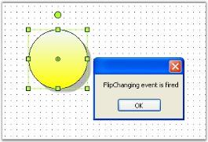

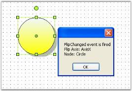

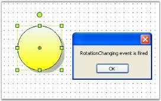

#### Z-Order Events

When the node order is changed from front-to-back or back-to-front, the Z-order value gets changed and triggers the Z-order events listed in the below table.

Z-order events

<table>
<tr>
<th>
DocumentEventSink</th><th>
Description</th></tr>
<tr>
<td>
{{'[ZOrderChanged](https://help.syncfusion.com/cr/windowsforms/Syncfusion.Windows.Forms.Diagram.DocumentEventSink.html)'| markdownify }}</td><td>
Gets fired after the Z-order value is changed.</td></tr>
<tr>
<td>
{{'[ZOrderChanging](https://help.syncfusion.com/cr/windowsforms/Syncfusion.Windows.Forms.Diagram.DocumentEventSink.html)'| markdownify }}</td><td>
Gets fired when the Z-order of the node is changed.</td></tr>
</table>

Data can be retrieved / set by using the following members.

Members

<table>
<tr>
<th>
Z-order EventArgs Members</th><th>
Description</th></tr>
<tr>
<td>
{{'[Cancel](https://help.syncfusion.com/cr/windowsforms/Syncfusion.Windows.Forms.Diagram.ZOrderChangingEventArgs.html#Syncfusion_Windows_Forms_Diagram_ZOrderChangingEventArgs_Cancel)'| markdownify }}</td><td>
Cancels the Z-order changing event.</td></tr>
<tr>
<td>
{{'[ChangeType](https://help.syncfusion.com/cr/windowsforms/Syncfusion.Windows.Forms.Diagram.ZOrderChangedEventArgs.html#Syncfusion_Windows_Forms_Diagram_ZOrderChangedEventArgs_ChangeType)'| markdownify }}</td><td>
It returns the following possible values,* Front-whether the controller bring the node to the front* Back-whether the controller send the node to the back</td></tr>
<tr>
<td>
{{'[NodeAffected](https://help.syncfusion.com/cr/windowsforms/Syncfusion.Windows.Forms.Diagram.ZOrderChangedEventArgs.html#Syncfusion_Windows_Forms_Diagram_ZOrderChangedEventArgs_NodeAffected)'| markdownify }}</td><td>
Returns the node's name by which the node was affected.</td></tr>
<tr>
<td>
{{'[Z-order](https://help.syncfusion.com/cr/windowsforms/Syncfusion.Windows.Forms.Diagram.ZOrderChangedEventArgs.html#Syncfusion_Windows_Forms_Diagram_ZOrderChangedEventArgs_ZOrder)'| markdownify }}</td><td>
Returns the current Z-order value.</td></tr>
</table>

Programmatically, the events are written as follows:




public void Form1_Load(object sender, EventArgs e)
{
	((DocumentEventSink)model1.EventSink).ZOrderChanged += new ZOrderChangedEventHandler(Form1_ZOrderChanged);
	((DocumentEventSink)model1.EventSink).ZOrderChanging += new ZOrderChangingEventHandler(Form1_ZOrderChanging);
	diagram1.Controller.BringToFront();
}

void Form1_ZOrderChanging(ZOrderChangingEventArgs evtArgs)
{
	MessageBox.Show("ZOrderChanging event is fired" + "\n" + "Node: " + evtArgs.NodeAffected.Name.ToString());
}

void Form1_ZOrderChanged(ZOrderChangedEventArgs evtArgs)
{
	MessageBox.Show("ZOrderChanged event is fired" + "\n" + "New ZOrder: " + evtArgs.ZOrder.ToString());
}




Public Sub Form1_Load(ByVal sender As Object, ByVal e As EventArgs)
AddHandler DirectCast(model1.EventSink, DocumentEventSink).ZOrderChanged, AddressOf Form1_ZOrderChanged
AddHandler DirectCast(model1.EventSink, DocumentEventSink).ZOrderChanging, AddressOf Form1_ZOrderChanging
diagram1.Controller.BringToFront()
End Sub

Private Sub Form1_ZOrderChanging(ByVal evtArgs As ZOrderChangingEventArgs)
MessageBox.Show(("ZOrderChanging event is fired" & vbLf & "Node: ") + evtArgs.NodeAffected.Name.ToString())
End Sub

Private Sub Form1_ZOrderChanged(ByVal evtArgs As ZOrderChangedEventArgs)
MessageBox.Show(("ZOrderChanged event is fired" & vbLf & "New ZOrder: ") + evtArgs.ZOrder.ToString())
End Sub




Sample diagram are as follows:

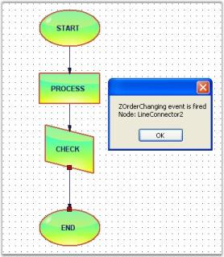

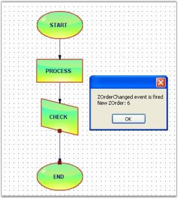

#### Connections And Ports Events

The below events gets fired while the connection is created between two nodes.

The below table explains the [Connections](https://help.syncfusion.com/cr/windowsforms/Syncfusion.Windows.Forms.Diagram.ConnectionPoint.html#Syncfusion_Windows_Forms_Diagram_ConnectionPoint_Connections) and [Ports](https://help.syncfusion.com/cr/windowsforms/Syncfusion.Windows.Forms.Diagram.Node.html#Syncfusion_Windows_Forms_Diagram_Node_Ports) events.

Connections and Ports Events

<table>
<tr>
<th>
DocumentEventSink</th><th>
Description</th></tr>
<tr>
<td>
{{'[ConnectionsChanged](https://help.syncfusion.com/cr/windowsforms/Syncfusion.Windows.Forms.Diagram.DocumentEventSink.html)'| markdownify }}</td><td>
Triggered after the connection is changed.</td></tr>
<tr>
<td>
{{'[PortsChanged](https://help.syncfusion.com/cr/windowsforms/Syncfusion.Windows.Forms.Diagram.DocumentEventSink.html)'| markdownify }}</td><td>
Triggered when ports are added or changed.</td></tr>
</table>

Data can be retrieved or set using the following members.

Members

<table>
<tr>
<th>
Connection and Port EventArgs Member</th><th>
Description</th></tr>
<tr>
<td>
{{'[Cancel](https://help.syncfusion.com/cr/windowsforms/Syncfusion.Windows.Forms.Diagram.CollectionExEventArgs.html#Syncfusion_Windows_Forms_Diagram_CollectionExEventArgs_Cancel)'| markdownify }}</td><td>
Cancels the ConnectionChanging event.</td></tr>
<tr>
<td>
{{'[ChangeType](https://help.syncfusion.com/cr/windowsforms/Syncfusion.Windows.Forms.Diagram.CollectionExEventArgs.html#Syncfusion_Windows_Forms_Diagram_CollectionExEventArgs_ChangeType)'| markdownify }}</td><td>
It returns the following possible values:Insert-Whether the node is insertedRemove–Whether the node is removed</td></tr>
<tr>
<td>
{{'[Element](https://help.syncfusion.com/cr/windowsforms/Syncfusion.Windows.Forms.Diagram.CollectionExEventArgs.html#Syncfusion_Windows_Forms_Diagram_CollectionExEventArgs_Element)'| markdownify }}</td><td>
Returns whether the head or tail end is moved.</td></tr>
<tr>
<td>
{{'[Elements](https://help.syncfusion.com/cr/windowsforms/Syncfusion.Windows.Forms.Diagram.CollectionExEventArgs.html#Syncfusion_Windows_Forms_Diagram_CollectionExEventArgs_Elements)'| markdownify }}</td><td>
Returns the elements collection on which the event occurs.</td></tr>
<tr>
<td>
{{'[Index](https://help.syncfusion.com/cr/windowsforms/Syncfusion.Windows.Forms.Diagram.CollectionExEventArgs.html#Syncfusion_Windows_Forms_Diagram_CollectionExEventArgs_Index)'| markdownify }}</td><td>
Returns the zero-based index into the collection on which the event occurred.</td></tr>
<tr>
<td>
{{'[Owner](https://help.syncfusion.com/cr/windowsforms/Syncfusion.Windows.Forms.Diagram.CollectionExEventArgs.html#Syncfusion_Windows_Forms_Diagram_CollectionExEventArgs_Owner)'| markdownify }}</td><td>
Returns the owner object. This is a read-only boolean value.</td></tr>
</table>

Connection Events

Programmatically, the Connection Event is handled as follows.




public void Form1_Load(object sender, EventArgs e)
{
	((DocumentEventSink)model1.EventSink).ConnectionsChanged += new CollectionExEventHandler(Form1_ConnectionsChanged);
	LineConnector line = new LineConnector(circle.PinPoint, polygon.PinPoint);
	polygon.CentralPort.TryConnect(line.HeadEndPoint);
	circle.CentralPort.TryConnect(line.TailEndPoint);
	model1.AppendChild(line);
}

void Form1_ConnectionsChanged(CollectionExEventArgs evtArgs)
{
	MessageBox.Show(evtArgs.ChangeType.ToString());
}




Public Sub Form1_Load(ByVal sender As Object, ByVal e As EventArgs)
AddHandler DirectCast(model1.EventSink, DocumentEventSink).ConnectionsChanged, AddressOf Form1_ConnectionsChanged
Dim line As New LineConnector(circle.PinPoint, polygon.PinPoint)
polygon.CentralPort.TryConnect(line.HeadEndPoint)
circle.CentralPort.TryConnect(line.TailEndPoint)
model1.AppendChild(line)
End Sub

Private Sub Form1_ConnectionsChanged(ByVal evtArgs As CollectionExEventArgs)
MessageBox.Show(evtArgs.ChangeType.ToString())
End Sub




Sample diagram is as follows.

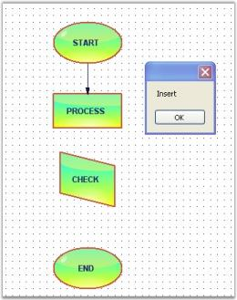

Ports Events

Programmatically, the events are handled as follows.




public void Form1_Load(object sender, EventArgs e)
{
	((DocumentEventSink)model1.EventSink).PortsChanged += new CollectionExEventHandler(Form1_PortsChanged);
	node.EnableCentralPort = false;
}

void Form1_PortsChanged(CollectionExEventArgs evtArgs)
{
	MessageBox.Show("Port is changed");
}




Public Sub Form1_Load(ByVal sender As Object, ByVal e As EventArgs)
AddHandler DirectCast(model1.EventSink, DocumentEventSink).PortsChanged, AddressOf Form1_PortsChanged
node.EnableCentralPort = False
End Sub

Private Sub Form1_PortsChanged(ByVal evtArgs As CollectionExEventArgs)
MessageBox.Show("Port is changed")
End Sub




Sample diagram is as follows.

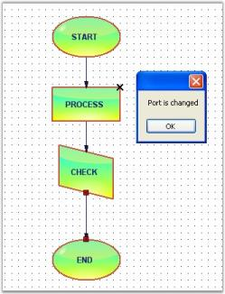

#### Property Events

Each node has different properties (Name,Color,Size etc). The below events are handled when changing these properties.

Property Events are as follows.

Property Events

<table>
<tr>
<th>
DocumentEventSink</th><th>
Description</th></tr>
<tr>
<td>
{{'[PropertyChanged](https://help.syncfusion.com/cr/windowsforms/Syncfusion.Windows.Forms.Diagram.EventSink.html)'| markdownify }}</td><td>
Triggered after the property of any node is changed.</td></tr>
<tr>
<td>
{{'[PropertyChanging](https://help.syncfusion.com/cr/windowsforms/Syncfusion.Windows.Forms.Diagram.EventSink.html)'| markdownify }}</td><td>
Triggered when the property value is changed.</td></tr>
</table>

Data can be retrieved or set using the following members.

Members

<table>
<tr>
<th>
PropertyChanging EventArgs Member</th><th>
Description</th></tr>
<tr>
<td>
{{'[Cancel](https://help.syncfusion.com/cr/windowsforms/Syncfusion.Windows.Forms.Diagram.PropertyChangingEventArgs.html#Syncfusion_Windows_Forms_Diagram_PropertyChangingEventArgs_Cancel)'| markdownify }}</td><td>
Cancels the PropertyChanged event.</td></tr>
<tr>
<td>
{{'[NewValue](https://help.syncfusion.com/cr/windowsforms/Syncfusion.Windows.Forms.Diagram.PropertyChangingEventArgs.html#Syncfusion_Windows_Forms_Diagram_PropertyChangingEventArgs_NewValue)'| markdownify }}</td><td>
Returns the new value assigned to the property.</td></tr>
<tr>
<td>
{{'[PropertyContainer](https://help.syncfusion.com/cr/windowsforms/Syncfusion.Windows.Forms.Diagram.PropertyChangingEventArgs.html#Syncfusion_Windows_Forms_Diagram_PropertyChangingEventArgs_PropertyContainer)'| markdownify }}</td><td>
Returns the container for the property.</td></tr>
<tr>
<td>
{{'[PropertyName](https://help.syncfusion.com/cr/windowsforms/Syncfusion.Windows.Forms.Diagram.PropertyChangingEventArgs.html#Syncfusion_Windows_Forms_Diagram_PropertyChangingEventArgs_PropertyName)'| markdownify }}</td><td>
Returns name of the property whose value is changed.</td></tr>
</table>

Members

<table>
<tr>
<th>
PropertyChanged EventArgs Member</th><th>
Description</th></tr>
<tr>
<td>
{{'[NodeAffected](https://help.syncfusion.com/cr/windowsforms/Syncfusion.Windows.Forms.Diagram.PropertyChangedEventArgs.html#Syncfusion_Windows_Forms_Diagram_PropertyChangedEventArgs_NodeAffected)'| markdownify }}</td><td>
Returns the name of the node whose property is changed.</td></tr>
<tr>
<td>
{{'[PropertyName](https://help.syncfusion.com/cr/windowsforms/Syncfusion.Windows.Forms.Diagram.PropertyChangedEventArgs.html#Syncfusion_Windows_Forms_Diagram_PropertyChangedEventArgs_PropertyName)'| markdownify }}</td><td>
Returns the name of the property whose value is changed.</td></tr>
</table>

Programmatically the events are written as follows,




public void Form1_Load(object sender, EventArgs e)
{
	((DocumentEventSink)model1.EventSink).PropertyChanged += new Syncfusion.Windows.Forms.Diagram.PropertyChangedEventHandler
	(Form1_PropertyChanged);
	((DocumentEventSink)model1.EventSink).PropertyChanging += new PropertyChangingEventHandler(Form1_PropertyChanging);
}

private void Form1_PropertyChanged(Syncfusion.Windows.Forms.Diagram.PropertyChangedEventArgs evtArgs)
{
	MessageBox.Show("PropertyChanged event is fired" + "\n" + "Property Name: " + evtArgs.PropertyName);
}

private void Form1_PropertyChanging(Syncfusion.Windows.Forms.Diagram.PropertyChangingEventArgs eprop)
{
	MessageBox.Show("PropertyChanging event is fired" + "\n" + "Property Name: " + eprop.PropertyName + "\n" + "new 				Value: " + eprop.NewValue);
}




Public Sub Form1_Load(ByVal sender As Object, ByVal e As EventArgs)
AddHandler DirectCast(model1.EventSink, DocumentEventSink).PropertyChanged, AddressOf Form1_PropertyChanged
AddHandler DirectCast(model1.EventSink, DocumentEventSink).PropertyChanging, AddressOf Form1_PropertyChanging
End Sub

Private Sub Form1_PropertyChanged(ByVal evtArgs As Syncfusion.Windows.Forms.Diagram.PropertyChangedEventArgs)
MessageBox.Show(("PropertyChanged event is fired" & vbLf & "Property Name: ") + evtArgs.PropertyName)
End Sub

Private Sub Form1_PropertyChanging(ByVal eprop As Syncfusion.Windows.Forms.Diagram.PropertyChangingEventArgs)
MessageBox.Show((("PropertyChanging event is fired" & vbLf & "Property Name: ") + eprop.PropertyName & vbLf & "new " & vbTab & vbTab & vbTab & vbTab & "Value: ") + eprop.NewValue)
End Sub




Sample diagrams are as follows.

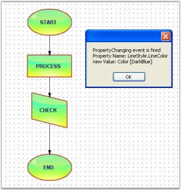

#### Labels And Layers Events

The below mentioned events are fired, when adding or removing the labels and layers to or from the diagram.

The following table shows the label events:

Labels And Layers Events

<table>
<tr>
<th>
DocumentEventSink</th><th>
Description</th></tr>
<tr>
<td>
{{'[LabelsChanged](https://help.syncfusion.com/cr/windowsforms/Syncfusion.Windows.Forms.Diagram.DocumentEventSink.html)'| markdownify }}</td><td>
Triggered when labels are added.</td></tr>
<tr>
<td>
{{'[LayersChanged](https://help.syncfusion.com/cr/windowsforms/Syncfusion.Windows.Forms.Diagram.DocumentEventSink.html)'| markdownify }}</td><td>
Triggered when layers are added to the model.</td></tr>
</table>

Data can be retrieved or set using the following members.

<table>
<tr>
<th>
Label / Layers EventArgs Member</th><th>
Description</th></tr>
<tr>
<td>
{{'[Cancel](https://help.syncfusion.com/cr/windowsforms/Syncfusion.Windows.Forms.Diagram.CollectionExEventArgs.html#Syncfusion_Windows_Forms_Diagram_CollectionExEventArgs_Cancel)'| markdownify }}</td><td>
Cancels the LabelChanging event.</td></tr>
<tr>
<td>
{{'[ChangeType](https://help.syncfusion.com/cr/windowsforms/Syncfusion.Windows.Forms.Diagram.CollectionExEventArgs.html#Syncfusion_Windows_Forms_Diagram_CollectionExEventArgs_ChangeType)'| markdownify }}</td><td>
It returns the following possible values:Insert-Whether the label is insertedRemove–Whether the label is removed</td></tr>
<tr>
<td>
{{'[Element](https://help.syncfusion.com/cr/windowsforms/Syncfusion.Windows.Forms.Diagram.CollectionExEventArgs.html#Syncfusion_Windows_Forms_Diagram_CollectionExEventArgs_Element)'| markdownify }}</td><td>
Returns whether the head or tail end is moved.</td></tr>
<tr>
<td>
{{'[Elements](https://help.syncfusion.com/cr/windowsforms/Syncfusion.Windows.Forms.Diagram.CollectionExEventArgs.html#Syncfusion_Windows_Forms_Diagram_CollectionExEventArgs_Elements)'| markdownify }}</td><td>
Returns the elements collection on which the event occurs.</td></tr>
<tr>
<td>
{{'[Index](https://help.syncfusion.com/cr/windowsforms/Syncfusion.Windows.Forms.Diagram.CollectionExEventArgs.html#Syncfusion_Windows_Forms_Diagram_CollectionExEventArgs_Index)'| markdownify }}</td><td>
Returns the zero-based index into the collection on which the event occurred.</td></tr>
<tr>
<td>
{{'[Owner](https://help.syncfusion.com/cr/windowsforms/Syncfusion.Windows.Forms.Diagram.CollectionExEventArgs.html#Syncfusion_Windows_Forms_Diagram_CollectionExEventArgs_Owner)'| markdownify }}</td><td>
Returns the owner object.</td></tr>
</table>

Label Events

Whenever labels are added to the label collection, this event will be triggered.

Programmatically, the events are written as follows:




public void Form1_Load(object sender, EventArgs e)
{
	((DocumentEventSink)model1.EventSink).LabelsChanged += new CollectionExEventHandler(Form1_LabelsChanged);
}

void Form1_LabelsChanged(CollectionExEventArgs evtArgs)
{
	MessageBox.Show("LabelsChanged event is fired" + evtArgs.ChangeType.ToString() + evtArgs.Owner.ToString());
}




Public Sub Form1_Load(ByVal sender As Object, ByVal e As EventArgs)
AddHandler DirectCast(model1.EventSink, DocumentEventSink).LabelsChanged, AddressOf Form1_LabelsChanged
End Sub

Private Sub Form1_LabelsChanged(ByVal evtArgs As CollectionExEventArgs)
MessageBox.Show(("LabelsChanged event is fired" & evtArgs.ChangeType.ToString()) + evtArgs.Owner.ToString())
End Sub




Layers Events

Programmatically, the events are written as follows:




public void Form1_Load(object sender, EventArgs e)
{
	((DocumentEventSink)model1.EventSink).LayersChanged += new CollectionExEventHandler(Form1_LayersChanged);
	Layer layer0 = new Layer();
	this.diagram1.Model.Layers.Add(layer0);
	layer0.Enabled = true;
	layer0.Visible = true;
}

void Form1_LayersChanged(CollectionExEventArgs evtArgs)
{
	MessageBox.Show("LayersChanged event is fired." + "\n" + "Owner: " + evtArgs.Owner.ToString());
}




Public Sub Form1_Load(ByVal sender As Object, ByVal e As EventArgs)
AddHandler DirectCast(model1.EventSink, DocumentEventSink).LayersChanged, AddressOf Form1_LayersChanged
Dim layer0 As New Layer()
Me.diagram1.Model.Layers.Add(layer0)
layer0.Enabled = True
layer0.Visible = True
End Sub

Private Sub Form1_LayersChanged(ByVal evtArgs As CollectionExEventArgs)
MessageBox.Show(("LayersChanged event is fired." & vbLf & "Owner: ") + evtArgs.Owner.ToString())
End Sub




Sample diagram is as follows,

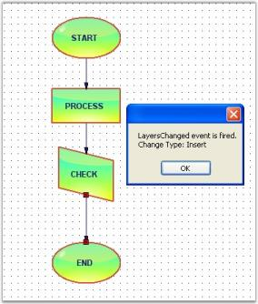

