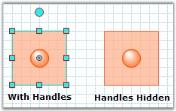

# How to hide handles completely from nodes in Windows Forms Diagram

This page explains about How To Hide Handles Completely From the Nodes and more details.

## How To Hide Handles Completely From the Nodes

We can hide the handles completely by setting the HandleColor and HandleOutlineColor properties to 'Transparent' as follows.





this.diagram1.View.HandleColor = Color.Transparent;

this.diagram1.View.HandleOutlineColor = Color.Transparent;





Me.diagram1.View.HandleColor = Color.Transparent

Me.diagram1.View.HandleOutlineColor = Color.Transparent





Illustrates Hiding Handles
{:.captionttext }

