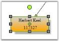
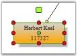

# Custom Handles For Nodes Using the Custom Diagram

This page explains about How To Draw Custom Handles For Nodes Using the CustomHandleRenderer Property and more details.

## How To Draw Custom Handles For Nodes Using the CustomHandleRenderer Property

Syncfusion® Diagram provides users with the facility to draw their own handles for nodes using the CustomHandleRenderer property which is available in the View class. This property accepts the instances of the UserHandleRenderer class which acts as a base class for the custom Handle Renderer. By using this class, we can derive a class to create our own Handle Renderer and assign it to the View.CustomHandleRenderer property. If this property is assigned as 'Null', it will render the default style of the Handle.

Default Appearance
{:.captiontext }

UserHandleRenderer class methods are made as public virtual; this class duplicates the HandleRenderer functionality but has more convenient structure for overriding the default appearance, and it provides an option to implement the new handle renderer with minimal changes by deriving it. If you are having a source code license, you can see the complete source UserHandleRenderer in the following location for understanding more about handle renderers: Diagram.Base\Src\Utility\HandleRenderer.cs.

Here is a sample code snippet.





public class MyHandleRenderer : UserHandleRenderer

{
    /// &lt;summary&gt;

    /// Draws endpoint outline and background.

    /// Override this method to change endpoint outline and background.

    /// &lt;/summary&gt;

    /// &lt;param name="gfx"&gt;&lt;/param&gt;

    /// &lt;param name="rectHandle"&gt;&lt;/param&gt;

    /// &lt;param name="endpoint"&gt;&lt;/param&gt;

    public override void OnDrawEndPointOutline(Graphics gfx, RectangleF rectHandle, EndPoint endpoint)

    {

        using (Pen pen = new Pen(Color.Black))

        {

            pen.Width = 1f / gfx.PageScale;

            pen.DashStyle = DashStyle.Dot;

            // Create brush to fill PinPoint interiors

            using (SolidBrush brush = new SolidBrush(Color.Yellow))

            {

                // if endpoint is connected with port -- fill its interiors with red

                if (endpoint.Port != null)

                {

                    brush.Color = Color.Orange;

                }

                if (!endpoint.AllowMoveX && !endpoint.AllowMoveY)

                    brush.Color = Color.Gray;

                // Fill handle interiors

                gfx.FillRectangle(brush, rectHandle);

                // Outline handle

                gfx.DrawRectangle(pen,

                    rectHandle.X, rectHandle.Y, rectHandle.Width, rectHandle.Height);

            }

        }

    }

    /// &lt;summary&gt;

    /// Method creates and returns GraphicsPath that represents rotation handle

    /// Override this method to change rotation handle appearance

    /// &lt;/summary&gt;

    /// <param name="location">Location of rotation handle</param>

    /// <param name="handleSize">size of rotation handle</param>

    /// &lt;returns&gt;&lt;/returns&gt;

    public override GraphicsPath CreateRotationHandleShape(PointF location, SizeF handleSize)

    {

        RectangleF rect = Geometry.CreateRect(location, handleSize);

        return PathFactory.CreateRoundRectangle(rect, 2);

    }
	/// &lt;summary&gt;

    /// Renders resize handle.

    /// Override this method to change appearance of resize handle.

    /// &lt;/summary&gt;

    /// <param name="gfx">Target Graphics</param>

    /// <param name="size">size of outlining rectangle</param>

    public override void OnDrawResizeHandleShape(Graphics gfx, BoxPosition handle, Node node, RectangleF rectHandle)

    {

        using (Pen pen = new Pen(m_handleOutlineColor))

        {

            pen.Width = 1f / gfx.PageScale;

            pen.DashStyle = DashStyle.Solid;

            pen.Color = HandleOutlineColor;

            // Create brush to fill PinPoint interiors

            using (Brush brush =

                (!Enabled(handle, node) ? new SolidBrush(Color.Red) :

                new SolidBrush(Color.Green)))

            {

                using (GraphicsPath gp = PathFactory.CreateRoundRectangle(rectHandle, 3))

                {

                    gfx.FillPath(brush, gp);

                    // Outline handle

                    gfx.DrawPath(pen, gp);

                }

            }

        }

    }

}
	




Public Class MyHandleRenderer

Inherits UserHandleRenderer

''' &lt;summary&gt; 

''' Draws endpoint outline and background. 

''' Override this method to change endpoint outline and background. 

''' &lt;/summary&gt; 

''' &lt;param name="gfx"&gt;&lt;/param&gt; 

''' &lt;param name="rectHandle"&gt;&lt;/param&gt; 

''' &lt;param name="endpoint"&gt;&lt;/param&gt; 

Public Overloads Sub OnDrawEndPointOutline(ByVal gfx As Graphics, ByVal rectHandle As RectangleF, ByVal endpoint As Net.EndPoint)

	Using pen As New Pen(Color.Black)

		pen.Width = 1.0F / gfx.PageScale

		pen.DashStyle = DashStyle.Dot

		' Create brush to fill PinPoint interiors 

		Using brush As New SolidBrush(Color.Yellow)

			' if endpoint is connected with port -- fill its interiors with red 

			If endpoint.Port IsNot Nothing Then

				brush.Color = Color.Orange

			End If

			If Not endpoint.AllowMoveX AndAlso Not endpoint.AllowMoveY Then

				brush.Color = Color.Gray

			End If

			' Fill handle interiors 

			gfx.FillRectangle(brush, rectHandle)

			' Outline handle 

			gfx.DrawRectangle(pen, rectHandle.X, rectHandle.Y, rectHandle.Width, rectHandle.Height)

		End Using

	End Using

End Sub

	''' &lt;summary&gt; 

	''' Method creates and returns GraphicsPath that represents rotation handle 

	''' Override this method to change rotation handle appearance 

	''' &lt;/summary&gt; 

	''' <param name="location">Location of rotation handle</param> 

	''' <param name="handleSize">size of rotation handle</param> 

	''' &lt;returns&gt;&lt;/returns&gt; 

	Public Overloads Function CreateRotationHandleShape(ByVal location As PointF, ByVal handleSize As SizeF) As Drawing2D.GraphicsPath

		Dim rect As RectangleF = Geometry.CreateRect(location, handleSize)

		Return PathFactory.CreateRoundRectangle(rect, 2)

	End Function

	''' &lt;summary&gt; 

	''' Renders resize handle. 

	''' Override this method to change appearance of resize handle. 

	''' &lt;/summary&gt; 

	''' <param name="gfx">Target Graphics</param> 

	''' <param name="size">size of outlining rectangle</param> 

	Public Overloads Sub OnDrawResizeHandleShape(ByVal gfx As Graphics, ByVal handle As Syncfusion.Windows.Forms.Diagram.BoxPosition, ByVal node As Syncfusion.Windows.Forms.Diagram.Node, ByVal rectHandle As RectangleF)

		Using pen As New Pen(m_handleOutlineColor)

			pen.Width = 1.0F / gfx.PageScale

			pen.DashStyle = DashStyle.Solid

			pen.Color = HandleOutlineColor

			' Create brush to fill PinPoint interiors 

			Using brush As Brush = (IIf(Not Enabled(handle, node), New SolidBrush(Color.Red), New SolidBrush(Color.Green)))

				Using gp As Drawing2D.GraphicsPath = PathFactory.CreateRoundRectangle(rectHandle, 3)

					gfx.FillPath(brush, gp)

					' Outline handle 

					gfx.DrawPath(pen, gp)

				End Using

			End Using

		End Using

	End Sub

End Class





Customized Appearance
{:.captiontext }

A sample which demonstrates this feature is available in the below sample installation location.

..\My Documents\Syncfusion\EssentialStudio\Version Number\Windows\Diagram.Windows\Samples\2.0\Getting Started\CustomSelectionHandle

