# Getting Started with Windows Forms Diagram

This section helps you understand and quickly get started using Essential® Diagram in your Windows Forms applications. Control appearance and structure are defined, and the relevant classes are depicted.

## Assembly deployment

Refer to [control dependencies](https://help.syncfusion.com/windowsforms/control-dependencies#diagram) section to get the list of assemblies or NuGet package needs to be added as reference to use the Diagram control in any application.

## Structure of Essential® Diagram 

The Essential® Diagram package is comprised of the following controls:

* Diagram
* Overview
* PaletteGroupBar
* PaletteGroupView
* PropertyEditor
* DocumentExplorer

### Diagram

The [WinForms Diagram](https://www.syncfusion.com/winforms-ui-controls/diagram) control is an interactive two-dimensional graphics control for diagramming, technical drawing, visualization, and simulation applications. It provides a surface for rendering and manipulating 2-D shapes, text, images, and Windows Form controls.  The UI supports drag-and-drop, scaling, zooming, rotation, grouping, ungrouping, connection points, layouts, and many other features.

The Diagram control’s architecture is composed of three objects, namely Model, View, and Controller and it provides a clear separation between data, visualization, and user interface. One advantage of model-view-controller architecture is that the parts are interchangeable. The model, view, and controller can be swapped in and out independently.

The model contains the data (node/connector) portion of a diagram. The view is responsible for rendering the diagram, and the controller handles user interaction. The Diagram control supports both horizontal and vertical rulers.

### Overview

The Overview control provides a perspective view of a diagram model and allows users to dynamically pan/zoom the diagram. It features a viewport window that can be moved and/or resized using the mouse to modify the diagram’s origin and magnification properties at run time.

### PaletteGroupBar

The PaletteGroupBar control provides a way for users to drag symbols onto a diagram. It is based on the GroupBar control of Essential® Tools. Each symbol palette loaded in the PaletteGroupBar control occupies a panel that can be selected by a bar button. The bar button is labeled with the name of the symbol palette. Each symbol palette is a list of symbols that have an icon and a label. The symbols in the palette are shown as icons that can be dragged onto the diagram. This control allows users to add symbols to a palette, and save or load the palette whenever necessary. It provides a way to classify and maintain symbols. It also provides preview of symbol during drag-and-drop operation.

### PaletteGroupView

The PaletteGroupView control provides an easy way to serialize a symbol palette to and from a resource file of a form. At design time, users can attach a symbol palette to the PaletteGroupView control in the form. Selecting PaletteGroupView and clicking the Palette property in the Visual Studio .NET Properties window will open a standard Open File dialog, which allows the user to select a symbol palette file that has been created with the Symbol Designer.

It displays the symbol models belonging to a symbol palette in the GroupView control of Essential® Tools for Windows Forms. It contains a list of icons and labels that can be hosted in the PaletteGroupBar control. The symbol models can be dragged from this control and dropped onto the diagram. It also provides preview of symbols during drag-and-drop operation.

### PropertyEditor

The PropertyEditor control displays and edits the properties of diagram models, and nodes on the diagram. It contains an embedded PropertyGrid control which is used to edit the properties of selected objects on the diagram. A combo box is added to this control for listing out the names of objects and selecting the objects on the diagram. 

### DocumentExplorer

The DocumentExplorer control allows you to visualize the details of the various objects that are added onto the diagram model. The layers will be listed under the Layers node, and other objects like shapes, links, lines, and text editors will be listed under the Nodes node. The nodes and layers can be renamed, deleted, and hidden, and a new layer can be added through this control.

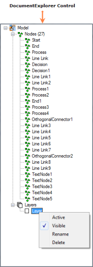

## Essential® Diagram in Windows Forms Application

This section helps you to create the Diagram, PaletteGroupBar, PaletteGroupView, Overview, PropertyEditor, and DocumentExplorer controls through the designer and code in a Windows Forms application.

### Diagram

#### Creating a Diagram Control through Designer

This section depicts the step-by-step procedure to create a Diagram control through the Visual Studio designer in a .NET Windows Forms application.

To create a Diagram control using the designer:

1. Create a new Windows Forms application.
2. Open the Designer Form window.
3. Drag Diagram from the Toolbox window and drop it to the Designer Form window.

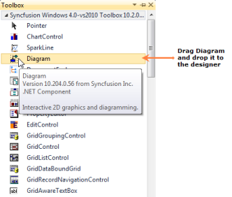

The Diagram control will be added to the designer and its dependent assemblies will be added to the project once you dropped it to the Designer Form window.

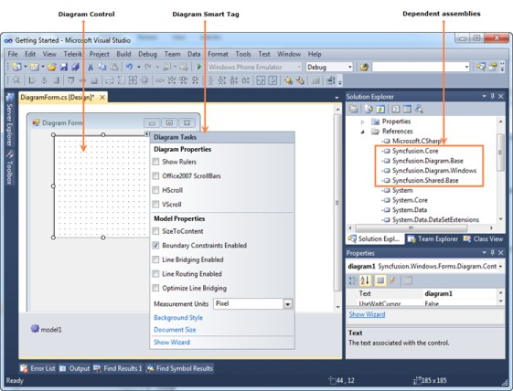

#### Creating a Diagram Control through Code

This section shows the step-by-step procedure to create a Diagram control programmatically in a .NET Windows Forms application.

To create a Diagram control using code:

1. Create a new Windows Forms application.
2. Add the following basic dependent Syncfusion® assemblies to the project:
   * Syncfusion.Core.dll
   * Syncfusion.Diagram.Base.dll
   * Syncfusion.Diagram.Windows.dll
   * Syncfusion.Shared.Base.dll
3. Create a Diagram control using the following code.





//Imports the Diagram control’s namespaces
using Syncfusion.Windows.Forms.Diagram.Controls;
using Syncfusion.Windows.Forms.Diagram;

//Create an instance
Diagram diagram = new Diagram();

//Enable scroll bars
diagram.HScroll = true;
diagram.VScroll = true;

//Sizing the diagram
diagram.Size = new Size(400, 400);

//Positioning the diagram
diagram.Location = new Point(20, 5);




'Imports the Diagram control’s namespaces
Imports Syncfusion.Windows.Forms.Diagram
Imports Syncfusion.Windows.Forms.Diagram.Controls

'Create an instance
Dim diagram As New Diagram()

'Enable Scrollbars
diagram.HScroll = True
diagram.VScroll = True

'Sizing the diagram
diagram.Size = New Size(400, 400)

'Positioning the diagram
diagram.Location = New Point(20, 5)




{{ codesnippet1 | OrderList_Indent_Level_1 }}

4. Add a model to the Diagram control.





//Create a model
Model model = new Model();

//Add the model to the Diagram control
diagram.Model = model;




'Create a model
Dim model As New Model()

'Add the model to the Diagram control
diagram.Model = model




{{ codesnippet2 | OrderList_Indent_Level_1 }}

5. Add the Diagram control to the Diagram Form window.





//Add the Diagram control to Diagram Form
this.Controls.Add(diagram);




'Add the Diagram control to the Diagram Form
Me.Controls.Add(diagram)
            



{{ codesnippet3 | OrderList_Indent_Level_1 }}

#### Adding Nodes to the Model

The Diagram control has a list of predefined basic shapes ([nodes](https://help.syncfusion.com/cr/windowsforms/Syncfusion.Windows.Forms.Diagram.Model.html#Syncfusion_Windows_Forms_Diagram_Model_Nodes)) which help you to draw diagrams according to your requirement. You can create your own shapes by inheriting the existing shape’s class and the Symbol Designer utility tool which is shipped with the Essential® Diagram package. 

The following code creates a rectangular node and adds it to the model.




//Enable diagram rulers
diagram.ShowRulers = true;

//Create a rectangular node
Syncfusion.Windows.Forms.Diagram.Rectangle rectangle
    = new Syncfusion.Windows.Forms.Diagram.Rectangle(120, 120, 100, 70);

//Style the rectangular node
rectangle.FillStyle.Type = FillStyleType.LinearGradient;
rectangle.FillStyle.Color = Color.FromArgb(128, 0, 0);
rectangle.FillStyle.ForeColor = Color.FromArgb(225, 0, 0);

rectangle.ShadowStyle.Visible = true;

//Border style
rectangle.LineStyle.LineColor = Color.RosyBrown;
rectangle.LineStyle.LineWidth = 2.0f;
rectangle.LineStyle.LineJoin = LineJoin.Miter;

//Add a label to the rectangular node
 Syncfusion.Windows.Forms.Diagram.Label label
    = new Syncfusion.Windows.Forms.Diagram.Label();
label.Text = "Hello!";
label.FontStyle.Family = "Arial";
label.FontColorStyle.Color = Color.White;
rectangle.Labels.Add(label);

//Add the rectangular node to the model
diagram.Model.AppendChild(rectangle);




'Enable diagram rulers
diagram.ShowRulers = True

'Create a rectangular node
Dim rectangle As New Rectangle(120, 120, 100, 70)

'Style the rectangular node
rectangle.FillStyle.Type = FillStyleType.LinearGradient
rectangle.FillStyle.Color = Color.FromArgb(128, 0, 0)
rectangle.FillStyle.ForeColor = Color.FromArgb(225, 0, 0)
rectangle.ShadowStyle.Visible = True

'Border style
rectangle.LineStyle.LineColor = Color.RosyBrown
rectangle.LineStyle.LineWidth = 2.0F
rectangle.LineStyle.LineJoin = Drawing2D.LineJoin.Miter

'Add a label to the rectangular node
Dim label As New Syncfusion.Windows.Forms.Diagram.Label()
label.Text = "Hello!"
label.FontStyle.Family = "Arial"
label.FontColorStyle.Color = Color.White
rectangle.Labels.Add(label)

'Add the rectangular node to the model
diagram.Model.AppendChild(rectangle)




#### Connecting Nodes

The Diagram control has a set of predefined links (connectors) which help you to connect the nodes with each other. You can create your own connectors by inheriting the ConnectorBase class.

The following code illustrates how to connect a process node to a decision node by OrthogonalConnector.




//Create a process node
Syncfusion.Windows.Forms.Diagram.Rectangle process
    = new Syncfusion.Windows.Forms.Diagram.Rectangle(50, 50, 100, 70);

//Style the process node
process.FillStyle.Type = FillStyleType.LinearGradient;
process.FillStyle.Color = Color.FromArgb(128, 0, 0);
process.FillStyle.ForeColor = Color.FromArgb(225, 0, 0);

//Border style
process.LineStyle.LineColor = Color.RosyBrown;
process.LineStyle.LineWidth = 2.0f;
process.LineStyle.LineJoin = LineJoin.Miter;

//Add a label to the process node
Syncfusion.Windows.Forms.Diagram.Label label
    = new Syncfusion.Windows.Forms.Diagram.Label();
label.Text = "Process";
label.FontStyle.Family = "Arial";
label.FontColorStyle.Color = Color.White;
process.Labels.Add(label);

//Add the process node to the model
diagram.Model.AppendChild(process);

//Create a decision node
Polygon decision = new Polygon(new PointF[] {
  new PointF(0,50), new PointF(50,0),
  new PointF(100,50), new PointF(50,100),
  new PointF(0,50)});

//Style the decision node
decision.FillStyle.Type = FillStyleType.LinearGradient;
decision.FillStyle.Color = Color.FromArgb(128, 0, 0);
decision.FillStyle.ForeColor = Color.FromArgb(225, 0, 0);

//Border style
decision.LineStyle.LineColor = Color.RosyBrown;
decision.LineStyle.LineWidth = 2.0f;
decision.LineStyle.LineJoin = LineJoin.Miter;

//Add a label to the decision node
label = new Syncfusion.Windows.Forms.Diagram.Label();
label.Text = "Decision";
label.FontStyle.Family = "Arial";
label.FontColorStyle.Color = Color.White;
decision.Labels.Add(label);

//Position the decision node
decision.PinPoint = new PointF(250, 250);

//Add decision node to the Model
diagram.Model.AppendChild(decision);

//Create an orthogonal connector
OrthogonalConnector link = 
    new OrthogonalConnector(process.PinPoint, decision.PinPoint);

//Style the link
link.LineStyle.LineColor = Color.RosyBrown;
link.LineStyle.LineWidth = 2f;

//Head decorator style
link.HeadDecorator.DecoratorShape = DecoratorShape.Filled45Arrow;
link.HeadDecorator.Size = new SizeF(8, 8);
link.HeadDecorator.FillStyle.Color = Color.RosyBrown;
link.HeadDecorator.LineStyle.LineColor = Color.RosyBrown;

//Connect a tail node to a head node
process.CentralPort.TryConnect(link.TailEndPoint); //process is tail node
decision.CentralPort.TryConnect(link.HeadEndPoint); //decision is head node

//Add a link to the model
diagram.Model.AppendChild(link);




'Create a process node
Dim process As New Rectangle(50, 50, 100, 70)

'Style the process node
process.FillStyle.Type = FillStyleType.LinearGradient
process.FillStyle.Color = Color.FromArgb(128, 0, 0)
process.FillStyle.ForeColor = Color.FromArgb(225, 0, 0)

'Border style
process.LineStyle.LineColor = Color.RosyBrown
process.LineStyle.LineWidth = 2.0F
process.LineStyle.LineJoin = Drawing2D.LineJoin.Miter

'Add a label to the process node
Dim label As New Syncfusion.Windows.Forms.Diagram.Label()
label.Text = "Process"
label.FontStyle.Family = "Arial"
label.FontColorStyle.Color = Color.White
process.Labels.Add(label)

'Add process node to the model
diagram.Model.AppendChild(process)

'Create a decision node
Dim decision As New Polygon(
    New PointF() {
    New PointF(0, 50),
    New PointF(50, 0),
    New PointF(100, 50),
    New PointF(50, 100),
    New PointF(0, 50)
   })

'Style the decision node
decision.FillStyle.Type = FillStyleType.LinearGradient
decision.FillStyle.Color = Color.FromArgb(128, 0, 0)
decision.FillStyle.ForeColor = Color.FromArgb(225, 0, 0)

'Border style
decision.LineStyle.LineColor = Color.RosyBrown
decision.LineStyle.LineWidth = 2.0F
decision.LineStyle.LineJoin = Drawing2D.LineJoin.Miter

'Add a label to the decision node
label = New Syncfusion.Windows.Forms.Diagram.Label()
label.Text = "Decision"
label.FontStyle.Family = "Arial"
label.FontColorStyle.Color = Color.White
decision.Labels.Add(label)

'Position the decision node
decision.PinPoint = New PointF(250, 250)
'Add decision node to the model
diagram.Model.AppendChild(decision)

'Create an orthogonal connector
Dim link As New OrthogonalConnector(process.PinPoint, decision.PinPoint)

'Style the link
link.LineStyle.LineColor = Color.RosyBrown
link.LineStyle.LineWidth = 2.0F

'Head decorator style
link.HeadDecorator.DecoratorShape = DecoratorShape.Filled45Arrow
link.HeadDecorator.Size = New SizeF(8, 8)
link.HeadDecorator.FillStyle.Color = Color.RosyBrown
link.HeadDecorator.LineStyle.LineColor = Color.RosyBrown

'Connect a tail node to a head node
process.CentralPort.TryConnect(link.TailEndPoint) 'process is tail node
decision.CentralPort.TryConnect(link.HeadEndPoint) 'decision is head node

'Add a link to the model
diagram.Model.AppendChild(link)




### PaletteGroupBar

#### Creating a PaletteGroupBar Control through Designer

This section depicts the step-by-step procedure to create a [PaletteGroupBar](https://help.syncfusion.com/cr/windowsforms/Syncfusion.Windows.Forms.Diagram.Controls.PaletteGroupBar.html#) control through the Visual Studio designer in a .NET Windows Forms application.

To create a [PaletteGroupBar](https://help.syncfusion.com/cr/windowsforms/Syncfusion.Windows.Forms.Diagram.Controls.PaletteGroupBar.html#) control through the designer:

1. Create a new Windows Forms application.
2. Open the Designer Form window.
3. Drag [PaletteGroupBar](https://help.syncfusion.com/cr/windowsforms/Syncfusion.Windows.Forms.Diagram.Controls.PaletteGroupBar.html#) from Toolbox and drop it to the Designer Form window.

The PaletteGroupBar control will be added to the designer and its dependent assemblies will be added to the project once you dropped it to the Designer Form window.

#### Creating a PaletteGroupBar Control through code

This section shows the step-by-step procedure to create a PaletteGroupBar control programmatically in a .NET Windows Forms application.

To create a PaletteGroupBar control using code:

1. Create a new Windows Forms application.
2. Add the following basic dependent Syncfusion® assemblies to the project:
   * Syncfusion.Core.dll
   * Syncfusion.Diagram.Base.dll
   * Syncfusion.Diagram.Windows.dll
   * Syncfusion.Shared.Base.dll
3. Create a PaletteGroupBar control using the following code.





//Imports the Diagram control’s namespace
using Syncfusion.Windows.Forms.Diagram.Controls;

//Creates a PaletteGroupBar instance
PaletteGroupBar paletteBar = new PaletteGroupBar();
paletteBar.Dock = DockStyle.Fill;
paletteBar.Font = new Font("Arial", 9);
paletteBar.BorderStyle = BorderStyle.None;

//Apply visual styles
paletteBar.VisualStyle = Syncfusion.Windows.Forms.VisualStyle.Office2007;
paletteBar.TextAlign = Syncfusion.Windows.Forms.Tools.TextAlignment.Left;

//Load palettes to paletteBar
paletteBar.LoadPalette("..//..//Basic Shapes.edp");
paletteBar.LoadPalette("..//..//Flowchart Symbols.edp");

//Add paletteBar to the form
this.Controls.Add(paletteBar);




'Imports the Diagram control’s namespace
Imports Syncfusion.Windows.Forms.Diagram.Controls

'Creates a PaletteGroupBar instance
Dim paletteBar As New PaletteGroupBar()
paletteBar.Dock = DockStyle.Fill
paletteBar.Font = New Font("Arial", 9)
paletteBar.BorderStyle = BorderStyle.None

'Apply visual styles
paletteBar.VisualStyle = Syncfusion.Windows.Forms.VisualStyle.Office2007
paletteBar.TextAlign = Syncfusion.Windows.Forms.Tools.TextAlignment.Left

'Load palettes to paletteBar
paletteBar.LoadPalette("..//..//Basic Shapes.edp")
paletteBar.LoadPalette("..//..//Flowchart Symbols.edp")

'Add paletteBar to the form
Me.Controls.Add(paletteBar)




{{ codesnippet4 | OrderList_Indent_Level_1 }}

### PaletteGroupView

#### Creating a PaletteGroupView Control through Designer

This section depicts the step-by-step procedure to create a [PaletteGroupView](https://help.syncfusion.com/cr/windowsforms/Syncfusion.Windows.Forms.Diagram.Controls.PaletteGroupView.html#) control through the Visual Studio designer in a .NET Windows Forms application.

To create a [PaletteGroupView](https://help.syncfusion.com/cr/windowsforms/Syncfusion.Windows.Forms.Diagram.Controls.PaletteGroupView.html#) control using the designer:

1. Create a new Windows Forms application.
2. Open the Designer Form window.
3. Drag [PaletteGroupView](https://help.syncfusion.com/cr/windowsforms/Syncfusion.Windows.Forms.Diagram.Controls.PaletteGroupView.html#) from Toolbox and drop it to the Designer Form window.

The PaletteGroupView control will be added to the designer and its dependent assemblies will be added to the project once you dropped it to the Designer Form window.

#### Creating a PaletteGroupView Control through Code

This section shows the step-by-step procedure to create a PaletteGroupView control programmatically in a .NET Windows Form application.

To create a PaletteGroupView control using code:

1. Create a new Windows Form application.
2. Add the following basic dependent Syncfusion® assemblies to the project:
   * Syncfusion.Core.dll
   * Syncfusion.Diagram.Base.dll
   * Syncfusion.Diagram.Windows.dll
   * Syncfusion.Shared.Base.dll
3. Create a PaletteGroupView control using the following code.





//Imports the Diagram control’s namespace
using Syncfusion.Windows.Forms.Diagram.Controls;

//Creates a PaletteGroupView instance
PaletteGroupView paletteView = new PaletteGroupView();

//paletteView settings
paletteView.Dock = DockStyle.Fill;
paletteView.FlatLook = true;
paletteView.BackColor = Color.White;
paletteView.Font = new System.Drawing.Font("Arial", 9);

//Load palette to paletteView
paletteView.LoadPalette("..//..//Basic Shapes.edp");

//Add the paletteView to the form
this.Controls.Add(paletteView);




'Imports the Diagram control’s namespace
Imports Syncfusion.Windows.Forms.Diagram.Controls

'Creates a PaletteGroupView instance
Dim paletteView As New PaletteGroupView()

'paletteView settings
paletteView.Dock = DockStyle.Fill
paletteView.FlatLook = True
paletteView.BackColor = Color.White
paletteView.Font = New System.Drawing.Font("Arial", 9)

'Load palette to paletteView
paletteView.LoadPalette("..//..//Basic Shapes.edp")

'Add the paletteView to the form
Me.Controls.Add(paletteView)




{{ codesnippet5 | OrderList_Indent_Level_1 }}

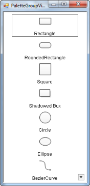

### Overview Control

#### Creating an Overview Control through Designer

This section depicts the step-by-step procedure to create an [Overview control](https://help.syncfusion.com/cr/windowsforms/Syncfusion.Windows.Forms.Diagram.Controls.OverviewControl.html#) through the Visual Studio designer in a .NET Windows Forms application.

To create an Overview control using the designer:

1. Create a new Windows Forms application.
2. Open the Designer Form window.
3. Drag [OverviewControl](https://help.syncfusion.com/cr/windowsforms/Syncfusion.Windows.Forms.Diagram.Controls.OverviewControl.html#) from Toolbox and drop it to the Designer Form window.

The Overview control will be added to the designer and its dependent assemblies will be added to the project once you dropped it to the Designer Form window.

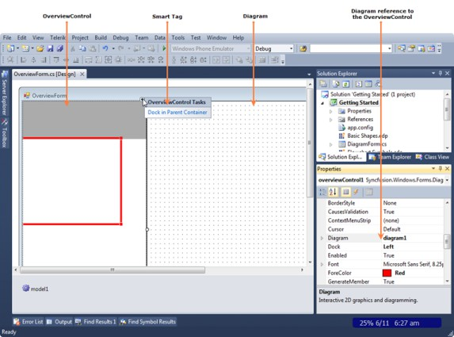

#### Creating an Overview Control through Code

This section shows the step-by-step procedure to create an Overview control programmatically in a .NET Windows Forms application.

To create an Overview control using code:

1. Create a new Windows Forms application.
2. Add the following basic dependent Syncfusion® assemblies to the project:
   * Syncfusion.Core.dll
   * Syncfusion.Diagram.Base.dll
   * Syncfusion.Diagram.Windows.dll
   * Syncfusion.Shared.Base.dll
3. Create an Overview control using the following code.





//Imports the Diagram control’s namespace
using Syncfusion.Windows.Forms.Diagram.Controls;

//Creates an OverviewControl instance
OverviewControl overviewControl = new OverviewControl();
overviewControl.Dock = DockStyle.Left;

//Set the diagram reference to overviewControl
overviewControl.Diagram = diagram1;

//Add overviewControl to the form
this.Controls.Add(overviewControl);




'Imports the Diagram control’s namespace
Imports Syncfusion.Windows.Forms.Diagram.Controls

'Creates an OverviewControl instance
Dim overviewControl As New OverviewControl()
overviewControl.Dock = DockStyle.Left

'Set the diagram reference to overviewControl
overviewControl.Diagram = Diagram1

'Add overviewControl to the form
Me.Controls.Add(overviewControl)




{{ codesnippet6 | OrderList_Indent_Level_1 }}

### PropertyEditor

#### Creating a PropertyEditor Control through Designer

This section depicts the step-by-step procedure to create a [PropertyEditor](https://help.syncfusion.com/cr/windowsforms/Syncfusion.Windows.Forms.Diagram.Controls.PropertyEditor.html#) control through the Visual Studio designer in a .NET Windows Forms application.

To create a [PropertyEditor](https://help.syncfusion.com/cr/windowsforms/Syncfusion.Windows.Forms.Diagram.Controls.PropertyEditor.html#) control using code:

1. Create a new Windows Forms application.
2. Open the Designer Form window.
3. Drag [PropertyEditor](https://help.syncfusion.com/cr/windowsforms/Syncfusion.Windows.Forms.Diagram.Controls.PropertyEditor.html#) from Toolbox and drop it to the Designer Form window.

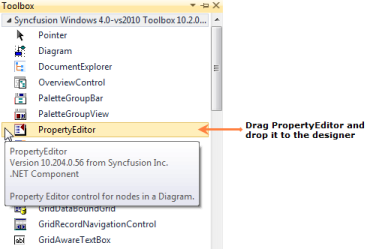

The PropertyEditor control will be added to the designer and its dependent assemblies will be added to the project once you dropped it to the Designer Form window.

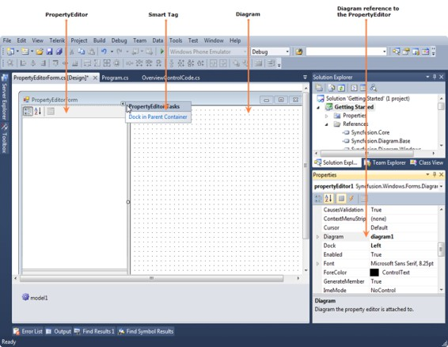

#### Creating a PropertyEditor Control through Code

This section shows the step-by-step procedure to create a PropertyEditor control programmatically in a .NET Windows Forms application.

To create a PropertyEditor control using code:

1. Create a new Windows Forms application.
2. Add the following basic dependent Syncfusion® assemblies to the project:
   * Syncfusion.Core.dll
   * Syncfusion.Diagram.Base.dll
   * Syncfusion.Diagram.Windows.dll
   * Syncfusion.Shared.Base.dll
3. Create a PropertyEditor control using the following code.





//Imports the Diagram control’s namespace
using Syncfusion.Windows.Forms.Diagram.Controls;      

//Creates a PropertyEditor instance
PropertyEditor propertyEditor = new PropertyEditor();
propertyEditor.Dock = DockStyle.Left;
propertyEditor.ShowCombo = true;

//Set the diagram reference to propertyEditor
propertyEditor.Diagram = diagram1;

//Add propertyEditor to the form
this.Controls.Add(propertyEditor);




'Imports the Diagram control’s namespace
Imports Syncfusion.Windows.Forms.Diagram.Controls

'Creates a PropertyEditor instance
Dim propertyEditor As New PropertyEditor()
propertyEditor.Dock = DockStyle.Left
propertyEditor.ShowCombo = True

'Set the diagram reference to propertyEditor
propertyEditor.Diagram = Diagram1

'Add propertyEditor to the form
Me.Controls.Add(propertyEditor)




{{ codesnippet7 | OrderList_Indent_Level_1 }}

### DocumentExplorer

#### Creating a DocumentExplorer Control through Designer

This section depicts the step-by-step procedure to create a [DocumentExplorer](https://help.syncfusion.com/cr/windowsforms/Syncfusion.Windows.Forms.Diagram.Controls.DocumentExplorer.html#) control through the Visual Studio designer in a .NET Windows Forms application.

To create a [DocumentExplorer](https://help.syncfusion.com/cr/windowsforms/Syncfusion.Windows.Forms.Diagram.Controls.DocumentExplorer.html#) control using the designer:

1. Create a new Windows Forms application.
2. Open the Designer Form window.
3. Drag [DocumentExplorer](https://help.syncfusion.com/cr/windowsforms/Syncfusion.Windows.Forms.Diagram.Controls.DocumentExplorer.html#) from Toolbox and drop it to the Designer Form window.

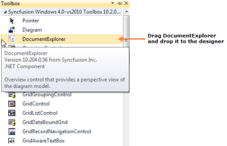

The DocumentExplorer control will be added to the designer and its dependent assemblies will be added to the project once you dropped it to the Designer Form window.

#### Creating a DocumentExplorer Control through Code

This section shows the step-by-step procedure to create a DocumentExplorer control programmatically in a .NET Windows Forms application.

To create a DocumentExplorer control using code:

1. Create a new Windows Forms application.
2. Add the following basic dependent Syncfusion® assemblies to the project:
   * Syncfusion.Core.dll
   * [Syncfusion.Diagram.Base.dll](https://help.syncfusion.com/cr/windowsforms/Syncfusion.Diagram.Base.Wizard.html)
   * [Syncfusion.Diagram.Windows.dll](https://help.syncfusion.com/cr/windowsforms/Syncfusion.DiagramWindowsAssembly.html)
   * Syncfusion.Shared.Base.dll
3. Create a DocumentExplorer control using the following code.





//Imports the Diagram control’s namespace
using Syncfusion.Windows.Forms.Diagram.Controls;

//Creates a DocumentExplorer instance
DocumentExplorer documentExplorer = new DocumentExplorer();           
documentExplorer.Dock = DockStyle.Left;

//Attach a diagram model to documentExplorer
documentExplorer.AttachModel(diagram1.Model);

//Add documentExplorer to the form
this.Controls.Add(documentExplorer);




'Imports the Diagram control’s namespace
Imports Syncfusion.Windows.Forms.Diagram.Controls

'Creates a DocumentExplorer instance
Dim documentExplorer As New DocumentExplorer()
documentExplorer.Dock = DockStyle.Left

'Attach a diagram model to documentExplorer
documentExplorer.AttachModel(Diagram1.Model)

'Add documentExplorer to the form
Me.Controls.Add(documentExplorer)




{{ codesnippet8 | OrderList_Indent_Level_1 }}

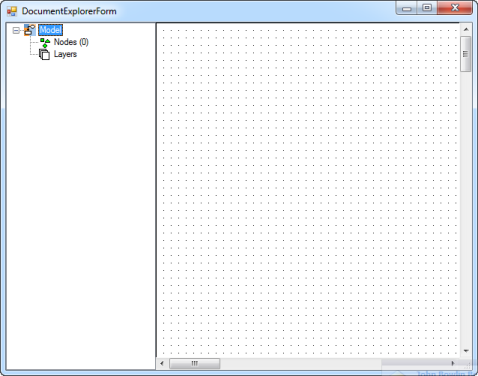

## Diagram Builder

Diagram Builder application allows the user to create new diagrams and also modify the existing ones. This application has *.edd extension. The user can use this diagram in their applications. 

The main difference between the diagram builder and symbol palette is as follows: 

* In Diagram Builder, user creates diagram documents 
* In Symbol Designer, user creates palettes. 

Software Path

"[Installed Drive]:\Program Files\Syncfusion\Essential Studio\{{ site.releaseversion }}\Utilities\Diagram\Windows Forms\DiagramBuilder"

1. Overview Control

Overview Control provides a perspective view of a diagram model, and allows users to dynamically pan and zoom the diagrams. The control features a view port window that can be moved and / or resized using the mouse to modify the diagrams' origin and magnification properties at run-time. The properties of this control is discussed in the Overview Control topic.

2. Palette GroupBar and GroupView

The PaletteGroupBar control provides a way for users to drag and drop symbols onto a diagram. It is based on the Syncfusion® Essential® Tools GroupBar control. Each symbol palette loaded in thePaletteGroupBar occupies a panel that can be selected by a bar button. The bar button is labeled with the name of the symbol palette. The symbols in the palette are shown as icons that can be dragged and dropped onto the diagram. This control allows users to add symbols to a palette, and save or load the palette whenever necessary. It provides a way to classify and maintain symbols.

The PaletteGroupView control provides an easy way to serialize a symbol palette to and from the resource file of a form. At design-time, users can attach a symbol palette to a PaletteGroupView control in the form. Selecting the PaletteGroupView and clicking the Palette property in the Visual Studio .NET Properties window will open a standard Open File dialog, which allows the user to select a symbol palette file that has been created with the Symbol Designer.
For more details about these diagram controls, refer to the Palette GroupBar and GroupView topic.

3. Property Editor

The Property Editor in Essential® Diagram displays properties of the currently selected object(s) in the diagram. It is a Windows Forms control that can be added to the Visual Studio .NET Toolbox. It also allows users to set or modify various properties of the objects or the model. The Property Editor provides an easy interface to set and view the various property settings. To know about the control's properties see Property Editor topic.

4. Document Explorer

Document Explorer allows you to visualize the details of the various objects that are added onto the diagram control at run-time. The layers will be listed under the _Layers_ node and other objects like shapes, links, lines and text editor will be listed under _Nodes_ node.

5. Diagram Document

The [DiagramDocument](https://help.syncfusion.com/cr/windowsforms/Syncfusion.Windows.Forms.Diagram.DiagramDocument.html#) is a serializable document type that encapsulates the model and view data for the diagram. The grid area of the diagram document is the diagram view object area. The nodes dragged from the PaletteGroupBar will be dropped here.

For more details, see Diagram Grid topic.

Diagram Builder Functionalities

1. How to Open an Existing Diagram Document

Follow the below steps in order to open an existing diagram document

1. Add OpenFileDialog control to the Form. 
2. Set the Filter property of OpenFileDialog as Essential® Diagram Palettes|*.edp|Visio Stencils|*.vss; *.vsx|Visio    Drawings(Shapes only)|*.vsd; *.vdx|All files|*.*. 
3. Add the below code snippet in your button click event.





// Checking whether "OK" button is clicked in OpenFileDialog
if (this.openFileDialog1.ShowDialog(this) == DialogResult.OK)
{
string FileName = this.openFileDialog1.FileName;
this.diagram1.LoadBinary(FileName);
this.diagram1.Refresh();
}




{{ codesnippet9 | OrderList_Indent_Level_1 }}

The diagram1.LoadBinary() method loads the selected diagram file into diagram document.

2. How to Save a Diagram Document

   Below are the steps to save a diagram document.

   1.  Add SaveFileDialog control to the Form.
   2.  Set the Filter property of SaveFileDialog as  Essential® Diagram Files|*.edd|All files|*.*.
   3.  Add the following code snippet in your button click event.





// Checking whether "OK" button is clicked in SaveFileDialog
if (this.saveFileDialog1.ShowDialog(this) == DialogResult.OK)
{
this.FileName = this.saveFileDialog1.FileName;
this.diagram1.SaveBinary(this.FileName);
}




{{ codesnippet10 | OrderList_Indent_Level_1 }}

   The diagram1.SaveBinary() method saves the diagram file in the given filename.

   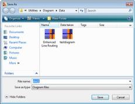

3. How to print a Diagram Document

Following are the steps to print a diagram document:

1. Page Setup

   The Page Setup dialog modifies the [Page Settings](https://help.syncfusion.com/cr/windowsforms/Syncfusion.Windows.Forms.Diagram.View.html#Syncfusion_Windows_Forms_Diagram_View_PageSettings) and [Printer Settings](https://help.syncfusion.com/cr/windowsforms/Syncfusion.Windows.Forms.Diagram.PageSizeControl.html#Syncfusion_Windows_Forms_Diagram_PageSizeControl_PrinterSettings) information for a given document. The user can enable sections of the dialog to manipulate printing, margins, paper orientation, size, source and to show help and network buttons. MinMargins defines the minimum margins a user can select.

   The following code snippet can be used for setting the page set up for diagram document.




if (diagram1 == null || diagram1.Model == null)
return;

using (PageSetupDialog dlgPageSetup = new
    PageSetupDialog(diagram1.View))
{
if (dlgPageSetup.ShowDialog() == DialogResult.OK)
    {
        diagram1.UpdateView();
    }
}




   

2. Page Borders

   The Page Borders dialog provides an interactive form-based interface, for setting the page borders of a diagram, initializing the dialog's   Syncfusion.Windows.Forms.Diagram.PageBorderDialog. The PageBorderStyle property with the corresponding Syncfusion.Windows.Forms.Diagram.View.PageBorderStyle member of the diagram's view, will let the users to configure the page border settings using the dialog controls.  

   The following code snippet can be used for setting the page border for diagram document.




if (diagram1 != null && diagram1.Model != null)
{
    PageBorderDialog borderDialog = new PageBorderDialog();
    borderDialog.PageBorderStyle = diagram1.View.PageBorderStyle; // It will show existing border set up
    if (borderDialog.ShowDialog() == DialogResult.OK)
    {
        diagram1.View.PageBorderStyle = borderDialog.PageBorderStyle; // It will update the modified set up.
        diagram1.View.RefreshPageSettings();
        diagram1.UpdateView();
    }
}
        



   

3. Header and Footers

   The [Header](https://help.syncfusion.com/cr/windowsforms/Syncfusion.Windows.Forms.Diagram.Header.html#) and [Footer](https://help.syncfusion.com/cr/windowsforms/Syncfusion.Windows.Forms.Diagram.Footer.html#) dialog provides an interactive form-based interface for initializing the Header and Footer settings of a diagram. 

   The following code snippet can be used for creating the [Header and Footer dialog](https://help.syncfusion.com/cr/windowsforms/Syncfusion.Windows.Forms.Diagram.HeaderFooterDialog.html#). 




if (diagram1 != null && diagram1.Model != null)
{
    HeaderFooterDialog dlgHF = new HeaderFooterDialog();
    dlgHF.Header = diagram1.Model.HeaderFooterData.Header;
    dlgHF.Footer = diagram1.Model.HeaderFooterData.Footer;
    dlgHF.MeasurementUnits = diagram1.Model.MeasurementUnits;
    if (dlgHF.ShowDialog() == DialogResult.OK)
    {
        diagram1.Model.HeaderFooterData.Header = dlgHF.Header;
        diagram1.Model.HeaderFooterData.Footer = dlgHF.Footer;
    }
}
            



   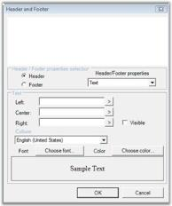

4. Print Preview

   It will show a preview of the page which will appear when printed. The Print Preview dialog shows the preview of the page with the following: 

   * Page setup 
   * Page border set up 
   * Header and footers in the page

   The following code snippet can be used for creating Print Preview dialog.




if (diagram1 != null)
{
    PrintDocument printDoc = diagram1.CreatePrintDocument();
    PrintPreviewDialog printPreviewDlg = new PrintPreviewDialog();
    printPreviewDlg.StartPosition = FormStartPosition.CenterScreen;
    printDoc.PrinterSettings.FromPage = 0;
    printDoc.PrinterSettings.ToPage = 0;
    printDoc.PrinterSettings.PrintRange = PrintRange.AllPages;
    printPreviewDlg.Document = printDoc;
    printPreviewDlg.ShowDialog(this);
}




   

    
5. Print

   This option will send the diagram document to the printer.

   The following code snippet can be used for sending the document for printing.




if (diagram1 != null)
{
    PrintDocument printDoc = diagram1.CreatePrintDocument();
    PrintDialog printDlg = new PrintDialog();
    printDlg.Document = printDoc;
    printDlg.AllowSomePages = true;
    if (printDlg.ShowDialog(this) == DialogResult.OK)
    {
        printDoc.PrinterSettings = printDlg.PrinterSettings;
        printDoc.Print();
    }
}




Diagram Builder Tools

Editing Options

<table>
<tr>
<th>
Edit Menu Items</th><th>
Description</th><th>
Code Snippet</th></tr>
<tr>
<td>
Undo</td><td>
Reverts the latest modification done.</td><td>
Diagram1.Model.HistoryManager.Undo();</td></tr>
<tr>
<td>
Redo</td><td>
Steps forward to operation history records and redoes the last undone task.</td><td>
Diagram1.Model.HistoryManager.Redo();</td></tr>
<tr>
<td>
Cut</td><td>
Removes the currently selected nodes from the diagram and move them to the clipboard.</td><td>
Diagram1.Controller.Cut();</td></tr>
<tr>
<td>
Copy </td><td>
Copies the currently selected nodes to the clipboard.</td><td>
Diagram1.Controller.Copy();</td></tr>
<tr>
<td>
Paste </td><td>
Pastes the contents of the clipboard to the diagram.</td><td>
Diagram1.Controller.Paste();</td></tr>
<tr>
<td>
Select All</td><td>
Adds all nodes in the diagram  model to the SelectionList.</td><td>
Diagram1.Controller.SelectAll();</td></tr>
</table>

#### Pan & Zoom Tool

The following screenshot illustrates the pan and zoom tools.

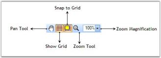

Pan & Zoom Tool

<table>
<tr>
<th>
Tool Name</th><th>
Description</th><th>
Code Snippet</th>
</tr>
<tr>
<td>
{{'[Pan Tool](https://help.syncfusion.com/cr/windowsforms/Syncfusion.Windows.Forms.Diagram.PanTool.html#"")'| markdownify }}</td><td>
Pan tool allows the user to drag the diagram and hence scroll it in any direction.</td><td>
diagram1.Controller.ActivateTool("PanTool");</td>
</tr>
<tr>
<td>
{{'[Zoom Tool](https://help.syncfusion.com/cr/windowsforms/Syncfusion.Windows.Forms.Diagram.ZoomTool.html#"")'| markdownify }}</td><td>
Zoom tool allows the user to zoom the diagram with minimum and maximum [magnification](https://help.syncfusion.com/cr/windowsforms/Syncfusion.Windows.Forms.Diagram.View.html#Syncfusion_Windows_Forms_Diagram_View_Magnification)'| markdownify }}.</td><td>
diagram1.Controller.ActivateTool("ZoomTool");</td></tr>
<tr>
<td>
{{'[Magnification](https://help.syncfusion.com/cr/windowsforms/Syncfusion.Windows.Forms.Diagram.View.html#Syncfusion_Windows_Forms_Diagram_View_Magnification)'| markdownify }}</td><td>
This value is used to zoom the view in and out. The x and y axes can be scaled independently. Normally, the x and y axes will have the same magnification value.</td><td>
int magVal = 30;diagram1.View.Magnification= magVal;</td></tr>
<tr>
<td>
ShowGrid</td><td>
This will show / hide the diagram view grid.</td><td>
Diagram1.View.Grid.Visible = true;</td></tr>
<tr>
<td>
{{'[SnapToGrid](https://help.syncfusion.com/cr/windowsforms/Syncfusion.Windows.Forms.Diagram.LayoutGrid.html#Syncfusion_Windows_Forms_Diagram_LayoutGrid_SnapToGrid)'| markdownify }}</td><td>
Specifies whether the snap to grid feature is enabled.</td><td>
Diagram1.View.Grid.SnapToGrid =true; </td></tr>
<tr>
<td>
{{'[Rulers](https://help.syncfusion.com/cr/windowsforms/Syncfusion.Windows.Forms.Diagram.Ruler.html#"")'| markdownify }}</td><td>
Diagram control supports rulers similar to that in Microsoft Word. For details see Rulers</td><td>
Diagram1.ShowRulers=true;</td></tr>
</table>

#### Alignment Tool

The following screen shot illustrates the Alignment tools.

Alignment Tool

<table>
<tr>
<th>
Tool Name</th><th>
Description</th><th>
Code Snippet</th></tr>
<tr>
<td>
{{'[AlignLeft](https://help.syncfusion.com/cr/windowsforms/Syncfusion.Windows.Forms.Diagram.Controls.Diagram.html#Syncfusion_Windows_Forms_Diagram_Controls_Diagram_AlignLeft)'| markdownify }}</td><td>
Aligns the selected nodes along the left edge of the first node.</td><td>
diagram1.AlignLeft();</td></tr>
<tr>
<td>
{{'[AlignCenter](https://help.syncfusion.com/cr/windowsforms/Syncfusion.Windows.Forms.Diagram.Controls.Diagram.html#Syncfusion_Windows_Forms_Diagram_Controls_Diagram_AlignCenter)'| markdownify }}</td><td>
Aligns the selected nodes along the vertical center of the first node.</td><td>
diagram1.AlignCenter();</td></tr>
<tr>
<td>
{{'[AlignRight](https://help.syncfusion.com/cr/windowsforms/Syncfusion.Windows.Forms.Diagram.Controls.Diagram.html#Syncfusion_Windows_Forms_Diagram_Controls_Diagram_AlignRight)'| markdownify }}</td><td>
Aligns the selected nodes along the right edge of the first node.</td><td>
diagram1.AlignRight();</td></tr>
<tr>
<td>
{{'[AlignTop](https://help.syncfusion.com/cr/windowsforms/Syncfusion.Windows.Forms.Diagram.Controls.Diagram.html#Syncfusion_Windows_Forms_Diagram_Controls_Diagram_AlignTop)'| markdownify }}</td><td>
Aligns the selected nodes along the top edge of the first node.</td><td>
diagram1.AlignTop();</td></tr>
<tr>
<td>
{{'[AlignMiddle](https://help.syncfusion.com/cr/windowsforms/Syncfusion.Windows.Forms.Diagram.Controls.Diagram.html#Syncfusion_Windows_Forms_Diagram_Controls_Diagram_AlignMiddle)'| markdownify }}</td><td>
Aligns the selected nodes along the horizontal center of the first node.</td><td>
diagram1.AlignMiddle();</td></tr>
<tr>
<td>
{{'[AlignBottom](https://help.syncfusion.com/cr/windowsforms/Syncfusion.Windows.Forms.Diagram.Controls.Diagram.html#Syncfusion_Windows_Forms_Diagram_Controls_Diagram_AlignBottom)'| markdownify }}</td><td>
Aligns the selected nodes along the bottom edge of the first node.</td><td>
diagram1.AlignBottom();</td></tr>
</table>

#### Rotate Tool

The following screen shot illustrates the Rotate tools.

Rotate Tools

<table>
<tr>
<th>
Tool Name</th><th>
Description</th><th>
Code Snippet</th></tr>
<tr>
<td>
{{'[RotateLeft](https://help.syncfusion.com/cr/windowsforms/Syncfusion.Windows.Forms.Diagram.Controls.Diagram.html#Syncfusion_Windows_Forms_Diagram_Controls_Diagram_Rotate_System_Single_)'| markdownify }}</td><td>
Rotates the selected nodes about their local origin by -90 degrees.</td><td>
diagram1.Rotate(-90);</td></tr>
<tr>
<td>
{{'[RotateRight](https://help.syncfusion.com/cr/windowsforms/Syncfusion.Windows.Forms.Diagram.Controls.Diagram.html#Syncfusion_Windows_Forms_Diagram_Controls_Diagram_Rotate_System_Single_)'| markdownify }}</td><td>
Rotates the selected nodes about their local origin by 90 degrees.</td><td>
diagram1.Rotate(90);</td></tr>
<tr>
<td>
{{'[FlipVertical](https://help.syncfusion.com/cr/windowsforms/Syncfusion.Windows.Forms.Diagram.Controls.Diagram.html#Syncfusion_Windows_Forms_Diagram_Controls_Diagram_FlipVertical)'| markdownify }}</td><td>
Flips the selected nodes about their vertical (Y) axis.</td><td>
diagram1.FlipVertical();</td></tr>
<tr>
<td>
{{'[FlipHorizontal](https://help.syncfusion.com/cr/windowsforms/Syncfusion.Windows.Forms.Diagram.Controls.Diagram.html#Syncfusion_Windows_Forms_Diagram_Controls_Diagram_FlipHorizontal)'| markdownify }}</td><td>
Flips the selected nodes about their horizontal (X) axis.</td><td>
diagram1.FlipHorizontal();</td></tr>
</table>

#### Resize Tool

The following screen shot illustrates the Resize tools.

Resize Tools

<table>
<tr>
<th>
Tool Name</th><th>
Description</th><th>
Code Snippet</th></tr>
<tr>
<td>
{{'[SpaceAcross](https://help.syncfusion.com/cr/windowsforms/Syncfusion.Windows.Forms.Diagram.Controls.Diagram.html#Syncfusion_Windows_Forms_Diagram_Controls_Diagram_SpaceAcross)'| markdownify }}</td><td>
Positions the selected nodes for equal horizontal spacing</td><td>
diagram1.SpaceAcross();</td></tr>
<tr>
<td>
{{'[SpaceDown](https://help.syncfusion.com/cr/windowsforms/Syncfusion.Windows.Forms.Diagram.Controls.Diagram.html#Syncfusion_Windows_Forms_Diagram_Controls_Diagram_SpaceDown)'| markdownify }}</td><td>
Positions the selected nodes for equal vertical spacing</td><td>
diagram1.SpaceDown();</td></tr>
<tr>
<td>
{{'[SameSize](https://help.syncfusion.com/cr/windowsforms/Syncfusion.Windows.Forms.Diagram.Controls.Diagram.html#Syncfusion_Windows_Forms_Diagram_Controls_Diagram_SameSize)'| markdownify }}</td><td>
Sets the width and height of the selected nodes to be equal.</td><td>
diagram1.SameSize();</td></tr>
<tr>
<td>
{{'[SameHeight](https://help.syncfusion.com/cr/windowsforms/Syncfusion.Windows.Forms.Diagram.Controls.Diagram.html#Syncfusion_Windows_Forms_Diagram_Controls_Diagram_SameHeight)'| markdownify }}</td><td>
Sets the height of the selected nodes to be equal.</td><td>
diagram1.SameHeight();</td></tr>
<tr>
<td>
{{'[SameWidth](https://help.syncfusion.com/cr/windowsforms/Syncfusion.Windows.Forms.Diagram.Controls.Diagram.html#Syncfusion_Windows_Forms_Diagram_Controls_Diagram_SameWidth)'| markdownify }}</td><td>
Sets the width of the selected nodes to be equal.</td><td>
diagram1.SameWidth();</td></tr>
</table>

#### Nudge Tool

The following screen shot illustrates the Nudge tools.

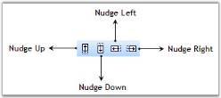

Nudge Tools

<table>
<tr>
<th>
Tool Name</th><th>
Description</th><th>
Code Snippet</th></tr>
<tr>
<td>
{{'[NudgeUp](https://help.syncfusion.com/cr/windowsforms/Syncfusion.Windows.Forms.Diagram.Controls.Diagram.html#Syncfusion_Windows_Forms_Diagram_Controls_Diagram_NudgeUp)'| markdownify }}</td><td>
Nudge the selected components up by Syncfusion.Windows.Forms.Diagram.Controls.Diagram.NudgeIncrement units.</td><td>
diagram1.NudgeUp();</td></tr>
<tr>
<td>
{{'[NudgeDown](https://help.syncfusion.com/cr/windowsforms/Syncfusion.Windows.Forms.Diagram.Controls.Diagram.html#Syncfusion_Windows_Forms_Diagram_Controls_Diagram_NudgeDown)'| markdownify }}</td><td>
Nudge the selected components down by Syncfusion.Windows.Forms.Diagram.Controls.Diagram.NudgeIncrement units.</td><td>
diagram1.NudgeDown();</td></tr>
<tr>
<td>
{{'[NudgeLeft](https://help.syncfusion.com/cr/windowsforms/Syncfusion.Windows.Forms.Diagram.Controls.Diagram.html#Syncfusion_Windows_Forms_Diagram_Controls_Diagram_NudgeLeft)'| markdownify }}</td><td>
Nudge the selected components to the left by Syncfusion.Windows.Forms.Diagram.Controls.Diagram.NudgeIncrement units.</td><td>
diagram1.NudgeLeft();</td></tr>
<tr>
<td>
{{'[NudgeRight](https://help.syncfusion.com/cr/windowsforms/Syncfusion.Windows.Forms.Diagram.Controls.Diagram.html#Syncfusion_Windows_Forms_Diagram_Controls_Diagram_NudgeRight)'| markdownify }}</td><td>
Nudge the selected components to the right by Syncfusion.Windows.Forms.Diagram.Controls.Diagram.NudgeIncrement units.</td><td>
diagram1.NudgeRight();</td></tr>
</table>

Text Formatting Tool

The following screen shot illustrates the Text Formatting tools.

 Text Formatting Tools

<table>
<tr>
<th>
Tool Name</th><th>
Description</th><th>
Code Snippet</th></tr>
<tr>
<td>
{{'[Font Family](https://help.syncfusion.com/cr/windowsforms/Syncfusion.Windows.Forms.Diagram.TextEdit.html#Syncfusion_Windows_Forms_Diagram_TextEdit_FontFamily)'| markdownify }}</td><td>
The FamilyName property is used to  get or set the font family name.</td><td>
string name = this.comboBoxBarItemFontFamily.ListBox.SelectedItem.ToString();if(this.diagram1.Controller.TextEditor.FamilyName != name )this.diagram1.Controller.TextEditor.FamilyName = name;</td></tr>
<tr>
<td>
Font Size</td><td>
Gets or sets the size of the point.</td><td>
int ptSize = 10; this.diagram1.Controller.TextEditor.PointSize = ptSize;</td></tr>
<tr>
<td>
{{'[Bold](https://help.syncfusion.com/cr/windowsforms/Syncfusion.Windows.Forms.Diagram.TextEditor.html#Syncfusion_Windows_Forms_Diagram_TextEditor_Bold)'| markdownify }}</td><td>
Gets or sets a value indicating whether the Syncfusion.Windows.Forms.Diagram.TextEditor is bold.</td><td>
bool newValue = !( this.diagram1.Controller.TextEditor.Bold );this.diagram1.Controller.TextEditor.Bold = newValue; </td></tr>
<tr>
<td>
{{'[Italic](https://help.syncfusion.com/cr/windowsforms/Syncfusion.Windows.Forms.Diagram.TextEdit.html#Syncfusion_Windows_Forms_Diagram_TextEdit_Italic)'| markdownify }}</td><td>
Gets or sets a value indicating whether the Syncfusion.Windows.Forms.Diagram.TextEditor is italic.</td><td>
bool newValue = !( this.diagram1.Controller.TextEditor.Italic );this.diagram1.Controller.TextEditor.Italic = newValue;</td></tr>
<tr>
<td>
{{'[Underline](https://help.syncfusion.com/cr/windowsforms/Syncfusion.Windows.Forms.Diagram.TextEditor.html#Syncfusion_Windows_Forms_Diagram_TextEditor_Underline)'| markdownify }}</td><td>
Gets or sets a value indicating whether the Syncfusion.Windows.Forms.Diagram.TextEditor is underline.</td><td>
bool newValue = !( this.diagram1.Controller.TextEditor.Underline );this.diagram1.Controller.TextEditor.Underline = newValue;</td></tr>
<tr>
<td>
{{'[StrikeOut](https://help.syncfusion.com/cr/windowsforms/Syncfusion.Windows.Forms.Diagram.TextEditor.html#Syncfusion_Windows_Forms_Diagram_TextEditor_Strikeout)'| markdownify }}</td><td>
Gets or sets a value indicating whether the Syncfusion.Windows.Forms.Diagram.TextEditor is strikeout.</td><td>
bool newValue = !( this.diagram1.Controller.TextEditor.Strikeout );this.diagram1.Controller.TextEditor.Strikeout = newValue;</td></tr>
<tr>
<td>
{{'[TextColor](https://help.syncfusion.com/cr/windowsforms/Syncfusion.Windows.Forms.Diagram.TextEditor.html#Syncfusion_Windows_Forms_Diagram_TextEditor_TextColor)'| markdownify }}</td><td>
Gets or sets the color of the text.</td><td>
ColorDialog dialog = new ColorDialog( );dialog.Color = this.diagram1.Controller.TextEditor.TextColor; if ( dialog.ShowDialog( this ) == DialogResult.OK ){this.diagram1.Controller.TextEditor.TextColor = dialog.Color; }</td></tr>
<tr>
<td>
Align Text Left</td><td>
Gets or sets the {{'[horizontal alignment](https://help.syncfusion.com/cr/windowsforms/Syncfusion.Windows.Forms.Diagram.TextEditor.html#Syncfusion_Windows_Forms_Diagram_TextEditor_HorizontalAlignment)'| markdownify }} to Near.</td><td>
this.diagram1.Controller.TextEditor.HorizontalAlignment = StringAlignment.Near;</td></tr>
<tr>
<td>
Align Text Right</td><td>
Gets or sets the horizontal alignment to Far.</td><td>
this.diagram1.Controller.TextEditor.HorizontalAlignment= StringAlignment.Far;</td></tr>
<tr>
<td>
Align Text Center</td><td>
Gets or sets the {{'[horizontal alignment](https://help.syncfusion.com/cr/windowsforms/Syncfusion.Windows.Forms.Diagram.TextEditor.html#Syncfusion_Windows_Forms_Diagram_TextEditor_HorizontalAlignment)'| markdownify }} to Center</td><td>
this.diagram1.Controller.TextEditor.HorizontalAlignment = StringAlignment.Center;</td></tr>
<tr>
<td>
{{'[Subscript](https://help.syncfusion.com/cr/windowsforms/Syncfusion.Windows.Forms.Diagram.TextEditor.html#Syncfusion_Windows_Forms_Diagram_TextEditor_Subscript)'| markdownify }}</td><td>
Gets or sets a value indicating whether the Syncfusion.Windows.Forms.Diagram.TextEditor is {{'[subscript](https://help.syncfusion.com/cr/windowsforms/Syncfusion.Windows.Forms.Diagram.TextEditor.html#Syncfusion_Windows_Forms_Diagram_TextEditor_Subscript)'| markdownify }}.</td><td>
bool newValue = !( this.diagram1.Controller.TextEditor.Subscript );this.diagram1.Controller.TextEditor.Subscript = newValue;</td></tr>
<tr>
<td>
{{'[Superscript](https://help.syncfusion.com/cr/windowsforms/Syncfusion.Windows.Forms.Diagram.TextEditor.html#Syncfusion_Windows_Forms_Diagram_TextEditor_Superscript)'| markdownify }}</td><td>
Gets or sets a value indicating whether the Syncfusion.Windows.Forms.Diagram.TextEditor is {{'[superscript](https://help.syncfusion.com/cr/windowsforms/Syncfusion.Windows.Forms.Diagram.TextEditor.html#Syncfusion_Windows_Forms_Diagram_TextEditor_Superscript)'| markdownify }}.</td><td>
bool nValue = !( this.diagramComponent.Controller.TextEditor.Superscript );this.diagramComponent.Controller.TextEditor.Superscript = newValue;</td></tr>
<tr>
<td>
Lower Text</td><td>
Decreases the char offset value.</td><td>
int nCurrentOffset = this.diagramComponent.Controller.TextEditor.CharOffset;nCurrentOffset--;this.diagram1.Controller.TextEditor.CharOffset = nCurrentOffset;</td></tr>
<tr>
<td>
Upper Text</td><td>
Increases the char offset value.</td><td>
int nCurrentOffset = this.diagram1.Controller.TextEditor.CharOffset;nCurrentOffset++;this.diagram1.Controller.TextEditor.CharOffset = nCurrentOffset;</td></tr>
</table>

#### Group & Order Tool

The following screen shot illustrates the Group and Order tools.

Group & Order Tools

<table>
<tr>
<th>
Tool Name</th><th>
Description</th><th>
Code Snippet</th></tr>
<tr>
<td>
{{'[Group](https://help.syncfusion.com/cr/windowsforms/Syncfusion.Windows.Forms.Diagram.Controller.html#Syncfusion_Windows_Forms_Diagram_Controller_Group)'| markdownify }}</td><td>
Groups the currently selected nodes in a diagram Group.</td><td>
diagram1.Controller.Group();</td></tr>
<tr>
<td>
{{'[UnGroup](https://help.syncfusion.com/cr/windowsforms/Syncfusion.Windows.Forms.Diagram.Controller.html#Syncfusion_Windows_Forms_Diagram_Controller_UnGroup)'| markdownify }}</td><td>
Ungroup the currently selected group in a diagram.</td><td>
diagram1.Controller.UnGroup();</td></tr>
<tr>
<td>
{{'[BringToFront](https://help.syncfusion.com/cr/windowsforms/Syncfusion.Windows.Forms.Diagram.Controller.html#Syncfusion_Windows_Forms_Diagram_Controller_BringToFront)'| markdownify }}</td><td>
Brings the selected nodes to the front of the Z-order.</td><td>
diagram1.Controller.BringToFront();</td></tr>
<tr>
<td>
{{'[SendToBack](https://help.syncfusion.com/cr/windowsforms/Syncfusion.Windows.Forms.Diagram.Controller.html#Syncfusion_Windows_Forms_Diagram_Controller_SendToBack)'| markdownify }}</td><td>
Sends the selected nodes to the back of the Z-order.</td><td>
diagram1.Controller.SendToBack();</td></tr>
<tr>
<td>
{{'[BringForward](https://help.syncfusion.com/cr/windowsforms/Syncfusion.Windows.Forms.Diagram.Controller.html#Syncfusion_Windows_Forms_Diagram_Controller_BringForward)'| markdownify }}</td><td>
Brings the selected nodes forward in the Z-order.</td><td>
Diagram1.Controller.BringForward();</td></tr>
<tr>
<td>
{{'[SendBackward](https://help.syncfusion.com/cr/windowsforms/Syncfusion.Windows.Forms.Diagram.Controller.html#Syncfusion_Windows_Forms_Diagram_Controller_SendBackward)'| markdownify }}</td><td>
Sends the selected nodes backward in the Z-order.</td><td>
Diagram1.Controller.SendBackward();</td></tr>
</table>

#### Drawing Tools

The following screen shot illustrates the drawing tools.

<table>
<tr>
<th>
Tool Name</th><th>
Description</th><th>
Code Snippet</th></tr>
<tr>
<td>
{{'[SelectTool](https://help.syncfusion.com/cr/windowsforms/Syncfusion.Windows.Forms.Diagram.SelectTool.html#"")'| markdownify }}</td><td>
Specifies the selection mode.</td><td>
diagram1.Controller.ActivateTool("SelectTool");</td></tr>
<tr>
<td>
{{'[LineTool](https://help.syncfusion.com/cr/windowsforms/Syncfusion.Windows.Forms.Diagram.LineTool.html#"")'| markdownify }}</td><td>
Draws straight line with start and end point.</td><td>
diagram1.Controller.ActivateTool("LineTool");</td></tr>
<tr>
<td>
{{'[PolyLineTool](https://help.syncfusion.com/cr/windowsforms/Syncfusion.Windows.Forms.Diagram.PolyLineTool.html#"")'| markdownify }}</td><td>
Interactive tool for drawing polylines.</td><td>
diagram1.Controller.ActivateTool("PolyLineTool");</td></tr>
<tr>
<td>
{{'[RectangleTool](https://help.syncfusion.com/cr/windowsforms/Syncfusion.Windows.Forms.Diagram.RectangleTool.html#"")'| markdownify }}</td><td>
Interactive tool for drawing rectangles.</td><td>
diagram1.Controller.ActivateTool("RectangleTool");</td></tr>
<tr>
<td>
{{'[RoundRectTool](https://help.syncfusion.com/cr/windowsforms/Syncfusion.Windows.Forms.Diagram.RoundRectTool.html#"")'| markdownify }}</td><td>
Interactive tool for drawing   rounded rectangles.</td><td>
diagram1.Controller.ActivateTool("RoundRectTool");</td></tr>
<tr>
<td>
{{'[EllipseTool](https://help.syncfusion.com/cr/windowsforms/Syncfusion.Windows.Forms.Diagram.EllipseTool.html#"")'| markdownify }}</td><td>
Interactive tool for drawing ellipses.</td><td>
diagram1.Controller.ActivateTool("EllipseTool");</td></tr>
<tr>
<td>
{{'[PolygonTool](https://help.syncfusion.com/cr/windowsforms/Syncfusion.Windows.Forms.Diagram.PolygonTool.html#"")'| markdownify }}</td><td>
Interactive tool for drawing polygons.</td><td>
diagram1.Controller.ActivateTool("PolygonTool");</td></tr>
<tr>
<td>
{{'[CurveTool](https://help.syncfusion.com/cr/windowsforms/Syncfusion.Windows.Forms.Diagram.CurveTool.html#"")'| markdownify }}</td><td>
Interactive tool for drawing curves.</td><td>
diagram1.Controller.ActivateTool("CurveTool");</td></tr>
<tr>
<td>
{{'[ClosedCurveTool](https://help.syncfusion.com/cr/windowsforms/Syncfusion.Windows.Forms.Diagram.ClosedCurveTool.html#"")'| markdownify }}</td><td>
Interactive tool for drawing closed curves.</td><td>
diagram1.Controller.ActivateTool("ClosedCurveTool");</td></tr>
<tr>
<td>
{{'[PencilTool](https://help.syncfusion.com/cr/windowsforms/Syncfusion.Windows.Forms.Diagram.PencilTool.html#"")'| markdownify }}</td><td>
Draws the user defined shape similar to Microsoft Paint.</td><td>
diagram1.Controller.ActivateTool("PencilTool");</td></tr>
<tr>
<td>
{{'[SplineTool](https://help.syncfusion.com/cr/windowsforms/Syncfusion.Windows.Forms.Diagram.SplineTool.html#"")'| markdownify }}</td><td>
Interactive tool for drawing spline.</td><td>
diagram1.Controller.ActivateTool("SplineTool");</td></tr>
<tr>
<td>
{{'[BezierTool](https://help.syncfusion.com/cr/windowsforms/Syncfusion.Windows.Forms.Diagram.BezierTool.html#"")'| markdownify }}</td><td>
Interactive tool for drawing bezier.</td><td>
diagram1.Controller.ActivateTool("BezierTool");</td></tr>
<tr>
<td>
{{'[TextTool](https://help.syncfusion.com/cr/windowsforms/Syncfusion.Windows.Forms.Diagram.TextTool.html#"")'| markdownify }}</td><td>
Interactive tool for inserting text nodes into a diagram and editing existing text nodes.This tool manages the insertion of new text nodes into a diagram and editing existing ones. Activating this tool causes it to track mouse-down, mouse-move, and mouse-up events and draw a tracking rectangle.The rectangle drawn is used as the bounds of a new text node, which is inserted into the diagram using an InsertNodesCmd.This tool also listens to the double-click events. If the user double-clicks a text node, this tool opens a text editor allowing the user to edit the text.</td><td>
diagram1.Controller.ActivateTool("TextTool");</td></tr>
<tr>
<td>
{{'[RichTextTool](https://help.syncfusion.com/cr/windowsforms/Syncfusion.Windows.Forms.Diagram.RichTextTool.html#"")'| markdownify }}</td><td>
Interactive tool for inserting and editing rich text objects.This tool manages the insertion of new rich text nodes into a diagram and editing of existing rich text nodes. Activating this tool causes it to track mouse-down, mouse-move, and mouse-up events and draw a tracking rectangle. The rectangle drawn is used as the bounds of a new rich text node, which is inserted into the diagram using an InsertNodesCmd command.This tool also listens to the double-click events. If the user double-clicks a rich text node, this tool opens a text editor allowing the user to edit the text.</td><td>
  diagram1.Controller.ActivateTool("RichTextTool");</td></tr>
<tr>
<td>
{{'[BitmapTool](https://help.syncfusion.com/cr/windowsforms/Syncfusion.Windows.Forms.Diagram.BitmapTool.html#"")'| markdownify }}</td><td>
Interactive tool for inserting bitmaps into a diagram.</td><td>
diagram1.Controller.ActivateTool("BitmapTool");</td></tr>
<tr>
<td>
{{'[ConnectionPointTool](https://help.syncfusion.com/cr/windowsforms/Syncfusion.Windows.Forms.Diagram.ConnectionPointTool.html#"")'| markdownify }}</td><td>
The connection point tool is an interactive tool for inserting and deleting connection points on diagram nodes. You can insert a connection point by clicking the node and delete a connection point by holding CTRL and clicking the node.</td><td>
diagram1.Controller.ActivateTool("ConnectionPointTool");</td></tr>
</table>

#### Diagram Connector Tools

The following screen shot illustrates the Diagram Connector tools.

#### LineConnectorTool  

Line Connector Tool is used to connect nodes in a straight line. It creates line shape nodes. The name of the [LineConnectorTool](https://help.syncfusion.com/cr/windowsforms/Syncfusion.Windows.Forms.Diagram.LineConnectorTool.html#) is LineLinkTool.

The below table lists the properties of the tool.

<table>
<tr>
<th>
Property</th><th>
Description</th></tr>
<tr>
<td>
{{'[HeadDecorator](https://help.syncfusion.com/cr/windowsforms/Syncfusion.Windows.Forms.Diagram.LineBase.html#Syncfusion_Windows_Forms_Diagram_LineBase_HeadDecorator)'| markdownify }}</td><td>
Sets the Head Decorator applied to the created node.</td></tr>
<tr>
<td>
{{'[TailDecorator](https://help.syncfusion.com/cr/windowsforms/Syncfusion.Windows.Forms.Diagram.LineBase.html#Syncfusion_Windows_Forms_Diagram_LineBase_TailDecorator)'| markdownify }}</td><td>
Sets the Tail Decorator applied to the created node.</td></tr>
<tr>
<td>
{{'[InAction](https://help.syncfusion.com/cr/windowsforms/Syncfusion.Windows.Forms.Diagram.Tool.html#Syncfusion_Windows_Forms_Diagram_Tool_InAction)'| markdownify }}</td><td>
Sets the distance from the start of the line to the dash pattern. It accepts Float value.</td></tr>
<tr>
<td>
{{'[Name](https://help.syncfusion.com/cr/windowsforms/Syncfusion.Windows.Forms.Diagram.Tool.html#Syncfusion_Windows_Forms_Diagram_Tool_Name)'| markdownify }}</td><td>
Sets the Name for the Tool.</td></tr>
<tr>
<td>
{{'[Preceding Tool](https://help.syncfusion.com/cr/windowsforms/Syncfusion.Windows.Forms.Diagram.Tool.html#Syncfusion_Windows_Forms_Diagram_Tool_PrecedingTool)'| markdownify }}</td><td>
Gets the Preceding Tool.</td></tr>
</table>




diagram1.Controller.ActivateTool("LineLinkTool");
Tool t = diagram1.Controller.ActiveTool;
if (t is Syncfusion.Windows.Forms.Diagram.LineConnectorTool)
{
    LineConnectorTool l = (LineConnectorTool)t;
    l.HeadDecorator.DecoratorShape = DecoratorShape.Filled45Arrow;
    l.TailDecorator.DecoratorShape = DecoratorShape.Filled45Arrow;
}




#### Orthogonal Connector Tool

Orthogonal Connector Tool is used to connect nodes in an orthogonal manner by providing its start point and end point. It creates the Orthogonal Line Shape node. The name of the Orthogonal Connector Tool is [OrthogonalLinkTool](https://help.syncfusion.com/cr/windowsforms/Syncfusion.Windows.Forms.Diagram.OrthogonalLinkTool.html#). The below table lists the properties of the tool.

<table>
<tr>
<th>
Property</th><th>
Description</th></tr>
<tr>
<td>
{{'[HeadDecorator](https://help.syncfusion.com/cr/windowsforms/Syncfusion.Windows.Forms.Diagram.LineBase.html#Syncfusion_Windows_Forms_Diagram_LineBase_HeadDecorator)'| markdownify }}</td><td>
Sets the Head Decorator applied to the created node.</td></tr>
<tr>
<td>
{{'[TailDecorator](https://help.syncfusion.com/cr/windowsforms/Syncfusion.Windows.Forms.Diagram.LineBase.html#Syncfusion_Windows_Forms_Diagram_LineBase_TailDecorator)'| markdownify }}</td><td>
Sets the Tail Decorator applied to the created node.</td></tr>
<tr>
<td>
{{'[InAction](https://help.syncfusion.com/cr/windowsforms/Syncfusion.Windows.Forms.Diagram.Tool.html#Syncfusion_Windows_Forms_Diagram_Tool_InAction)'| markdownify }}</td><td>
Sets the distance from the start of the line to the dash pattern. It accepts Float value.</td></tr>
<tr>
<td>
{{'[Name](https://help.syncfusion.com/cr/windowsforms/Syncfusion.Windows.Forms.Diagram.Tool.html#Syncfusion_Windows_Forms_Diagram_Tool_Name)'| markdownify }}</td><td>
Sets the Name for the Tool.</td></tr>
<tr>
<td>
{{'[Preceding Tool](https://help.syncfusion.com/cr/windowsforms/Syncfusion.Windows.Forms.Diagram.Tool.html#Syncfusion_Windows_Forms_Diagram_Tool_PrecedingTool)'| markdownify }}</td><td>
Gets the Preceding Tool.</td></tr>
</table>




diagram1.Controller.ActivateTool("OrthogonalLinkTool");
Tool t = diagram1.Controller.ActiveTool;
if (t is Syncfusion.Windows.Forms.Diagram.OrthogonalConnectorTool)
{
    OrthogonalConnectorTool l = (OrthogonalConnectorTool)t;
    l.HeadDecorator.DecoratorShape = DecoratorShape.Filled45Arrow;
    l.TailDecorator.DecoratorShape = DecoratorShape.Filled45Arrow;
}
    



#### DirectedLineConnector Tool

DirectedLineConnector Tool is used to connect the nodes in a directed line. It creates the directed line shape node. The name of the [DirectedLineConnectorTool](https://help.syncfusion.com/cr/windowsforms/Syncfusion.Windows.Forms.Diagram.DirectedLineConnectorTool.html#) is [DirectedLineLinkTool](https://help.syncfusion.com/cr/windowsforms/Syncfusion.Windows.Forms.Diagram.DirectedLineLinkTool.html#). The below table lists the properties of the tool.

<table>
<tr>
<th>
Property</th><th>
Description</th></tr>
<tr>
<td>
{{'[HeadDecorator](https://help.syncfusion.com/cr/windowsforms/Syncfusion.Windows.Forms.Diagram.LineBase.html#Syncfusion_Windows_Forms_Diagram_LineBase_HeadDecorator)'| markdownify }}</td><td>
Sets the Head Decorator applied to the created node.</td></tr>
<tr>
<td>
{{'[TailDecorator](https://help.syncfusion.com/cr/windowsforms/Syncfusion.Windows.Forms.Diagram.LineBase.html#Syncfusion_Windows_Forms_Diagram_LineBase_TailDecorator)'| markdownify }}</td><td>
Sets the Tail Decorator applied to the created node.</td></tr>
<tr>
<td>
{{'[InAction](https://help.syncfusion.com/cr/windowsforms/Syncfusion.Windows.Forms.Diagram.Tool.html#Syncfusion_Windows_Forms_Diagram_Tool_InAction)'| markdownify }}</td><td>
Sets the distance from the start of the line to the dash pattern. It accepts Float value.</td></tr>
<tr>
<td>
{{'[Name](https://help.syncfusion.com/cr/windowsforms/Syncfusion.Windows.Forms.Diagram.Tool.html#Syncfusion_Windows_Forms_Diagram_Tool_Name)'| markdownify }}</td><td>
Sets the Name for the Tool.</td></tr>
<tr>
<td>
{{'[Preceding Tool](https://help.syncfusion.com/cr/windowsforms/Syncfusion.Windows.Forms.Diagram.Tool.html#Syncfusion_Windows_Forms_Diagram_Tool_PrecedingTool)'| markdownify }}</td><td>
Gets the Preceding Tool.</td></tr>
</table>




diagram1.Controller.ActivateTool("DirectedLineLinkTool");
Tool t = diagram1.Controller.ActiveTool;
if (t is Syncfusion.Windows.Forms.Diagram.DirectedLineConnectorTool)
{
    DirectedLineConnectorTool l = (DirectedLineConnectorTool)t;
    l.HeadDecorator.DecoratorShape = DecoratorShape.Filled45Arrow;
    l.TailDecorator.DecoratorShape = DecoratorShape.Filled45Arrow;
}




#### PolyLineConnector Tool

This is an interactive tool for drawing Polyline Connector. The name of the tool is "PolyLineLinkTool". The below table lists the properties of the [PolyLine tool](https://help.syncfusion.com/cr/windowsforms/Syncfusion.Windows.Forms.Diagram.PolyLineTool.html#).

<table>
<tr>
<th>
Property</th><th>
Description</th></tr>
<tr>
<td>
{{'[HeadDecorator](https://help.syncfusion.com/cr/windowsforms/Syncfusion.Windows.Forms.Diagram.LineBase.html#Syncfusion_Windows_Forms_Diagram_LineBase_HeadDecorator)'| markdownify }}</td><td>
Sets the Head Decorator applied to the created node.</td></tr>
<tr>
<td>
{{'[TailDecorator](https://help.syncfusion.com/cr/windowsforms/Syncfusion.Windows.Forms.Diagram.LineBase.html#Syncfusion_Windows_Forms_Diagram_LineBase_TailDecorator)'| markdownify }}</td><td>
Sets the Tail Decorator applied to the created node.</td></tr>
<tr>
<td>
{{'[InAction](https://help.syncfusion.com/cr/windowsforms/Syncfusion.Windows.Forms.Diagram.Tool.html#Syncfusion_Windows_Forms_Diagram_Tool_InAction)'| markdownify }}</td><td>
Sets the distance from the start of the line to the dash pattern. It accepts Float value.</td></tr>
<tr>
<td>
{{'[Name](https://help.syncfusion.com/cr/windowsforms/Syncfusion.Windows.Forms.Diagram.Tool.html#Syncfusion_Windows_Forms_Diagram_Tool_Name)'| markdownify }}</td><td>
Sets the Name for the Tool.</td></tr>
<tr>
<td>
{{'[Preceding Tool](https://help.syncfusion.com/cr/windowsforms/Syncfusion.Windows.Forms.Diagram.Tool.html#Syncfusion_Windows_Forms_Diagram_Tool_PrecedingTool)'| markdownify }}</td><td>
Gets the Preceding Tool.</td></tr>
</table>




diagram1.Controller.ActivateTool("PolyLineLinkTool");
Tool t = diagram1.Controller.ActiveTool;
if (t is Syncfusion.Windows.Forms.Diagram.PolyLineConnectorTool)
{
    PolyLineConnectorTool l = (PolyLineConnectorTool)t;
    l.HeadDecorator.DecoratorShape = DecoratorShape.Filled45Arrow;
    l.TailDecorator.DecoratorShape = DecoratorShape.Filled45Arrow;
}




Creating a Diagram using Diagram Builder

To create your own diagram in the diagram builder, follow the below given procedure.

1. Go to the File menu and click New. The new window is displayed as in the following screen shot.

   

  
2. To add symbols into the symbol palette, select Add SymbolPalette in the File menu. 
3. Select the symbol palette, which you created previously using symbol designer from the list of Symbol Palettes displayed.

   

4. On placing the symbol into the diagram area, the Diagram Builder displays a dialog for adding the symbol palette into the Associated Palettes. To add, click OK. Click Cancel if not required.
5. Place the symbols and change their properties according to the requirements. Finally save the file with .edd extension. 

A diagram is created using the Diagram Builder. You can use this diagram (.edd) file for developing your application.

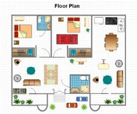

## Symbol Designer

Symbol Designer application allows you to create new palettes with symbols, and also modify the existing palettes. These palettes have the *.edp extension. You can use these palettes in your applications, and also in the Diagram Builder. 

Software Path

"[Installed Drive:]\Program Files\Syncfusion\Essential Studio\{{ site.releaseversion }}\Utilities\Diagram\Windows Forms\ Symbol Designer"

#### Creating EDP File

To create our own custom symbols in the symbol designer, follow the procedure given below.

* Open the Symbol Designer tool which is available in the above software path.
* Symbol designer contains below three sections,
1. Symbol palette
2. Object model
3. Properties Window

* If you want to create a new palette, select New option in the File menu. Type a name for the palette as shown in the below sample and click OK.

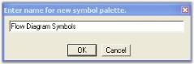

* A new symbol palette is created with the given name. Now, you can add your own symbols into this palette. 

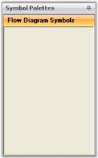

* For creating a new symbol, click Add Symbol option in the Symbol menu. The symbol designer window changes to a new format as shown in the below screen shot.

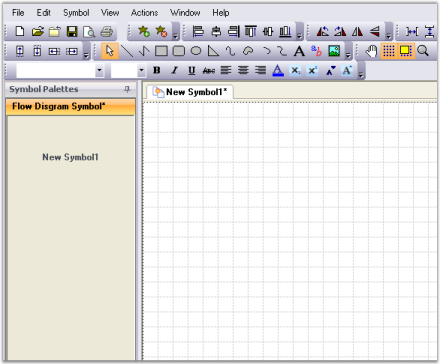

* Draw the desired shapes in the grid area. Change the properties of the shapes using Property window (Example: Color, Size etc).

* After modifying the default settings, we have to save this symbol into the symbol palette. Go to the File menu and click Save. A Save SymbolPalette dialog will appear as in the following screen shot.

* Give a relevant file name for the palette and click Save. As the palette is saved, new symbol is automatically loaded into the symbol palette.
* You can modify the custom symbols by using the Properties window. Click the New Symbol1 in the Symbol Palettes to view the properties. Change the name of the symbol by using the Name property. 

* Repeat the steps 3 to 7 for creating more symbols.
* If you create symbols using more than one shapes, you need to group all the shapes into single symbol using the Group option in symbol designer.

 

 

* The above symbols are added to the symbol palette. You will get a symbol palette as shown in the following screen shot.

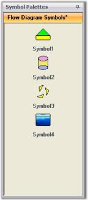

* Finally Save the Flow Diagram Symbol Palette. Now the above symbols will be available in .edp file format. You can re-use this in your applications and in the Diagram Builder.

## Create your first Diagram

1. You can create the Diagram in two ways.
   
   * Creating a diagram control by using Designer

   Drag and Drop the Diagram control from the toolbox into the designer form to create a diagram using Designer.  

   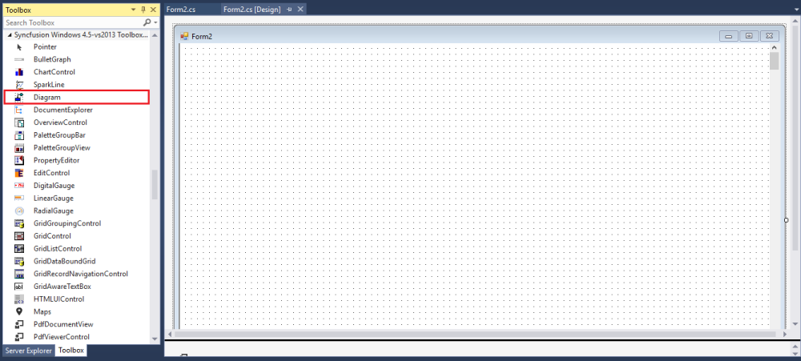

   * Creating a diagram control by using code.

   To create a Diagram control using code, create a new Windows Forms application and add the following basic dependent Syncfusion® assemblies to the project:

   * Syncfusion.Core.dll
   * Syncfusion.Diagram.Base.dll
   * Syncfusion.Diagram.Windows.dll
   * Syncfusion.Shared.Base.dll

   Create a Diagram control using the following code.




//Imports the Diagram control’s namespaces

using Syncfusion.Windows.Forms.Diagram.Controls;
using Syncfusion.Windows.Forms.Diagram;

//Create an instance
Diagram diagram = new Diagram();

//Enable scroll bars            
diagram.HScroll = true;
diagram.VScroll = true;

//Sizing the diagram
diagram.Size = new Size(400, 400);

//Positioning the diagram
diagram.Location = new Point(20, 5);




#### Establishing Database Connectivity

2. You can populate Nodes and Connectors in diagram automatically based on content from database by using binding APIs. To achieve this, you need a table in a database that have 2 columns, one representing ‘Id’ to uniquely identify objects, and one ‘ParentId’ representing relationship with the parent object. The following code example explains how to bind diagram with data from database by initializing the binding properties.





//Windows Form Load

private void Form1_Load(object sender, EventArgs e)
{
diagram1.BeginUpdate();
this.diagram1.Model.BoundaryConstraintsEnabled = false;

//Binding the Node column Name
diagram1.Binding.Id = "Name";

//Binding the Parents Nodes column Name
diagram1.Binding.ParentId = "ParentName";

//Binding the Label
diagram1.Binding.Label.Add("Name");

//Binding connector type
diagram1.Binding.DefaultConnector = new OrgLineConnector(new PointF(10, 10), new PointF(20, 20));

//Binding Node type
diagram1.Binding.DefaultNode = DefaultNode();

// Binding the DataTable to the DataSource
diagram1.Binding.DataSource = DataSource();

//Applying Layout to the diagram
LayoutNode();

DiagramAppearance();
diagram1.EndUpdate();
}




{{ codesnippet11 | OrderList_Indent_Level_1 }}

3. Use the following code example to establish the connection with the Database and retrieve the data in the form of DataTable.





private DataTable DataSource()
{
DataTable dataTable = new DataTable();
//Querying from DB
SqlConnection sqlConnection = new SqlConnection(connectionString);
SqlDataAdapter sqlDataAdapter = new SqlDataAdapter(new                SqlCommand("select * from Employees", sqlConnection));
sqlConnection.Open();
sqlDataAdapter.Fill(dataTable);
sqlConnection.Close();
return dataTable;
}




{{ codesnippet12 | OrderList_Indent_Level_1 }}

The following code example explains how to apply the layout for the data retrieved from the Database.




private void LayoutNode()
{
    HierarchicLayoutManager hierarchicalLayout = new HierarchicLayoutManager(this.diagram1.Model, 0, 70, 40);
    hierarchicalLayout.LeftMargin = 50;
    hierarchicalLayout.TopMargin = 50;
    this.diagram1.LayoutManager = hierarchicalLayout;
    this.diagram1.LayoutManager.UpdateLayout(null);
}




The following screenshot displays the organizational flow of diagram.

N> You can also explore our [WinForms Diagram example](https://github.com/syncfusion/winforms-demos/tree/master/diagram) that shows you how to render and configure the Diagram.