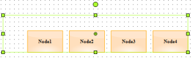
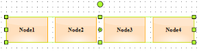

# Grouping in Windows Forms Diagram

A group is a node that acts as a transparent container for other nodes. A group is a composite node that controls a set of child nodes. The bounding rectangle of a group is the union of the bounds of its children. The group renders itself by iterating through its children and rendering them. Child nodes cannot be selected or manipulated individually. Members of the group are added and removed through the ICompositeNode interface.

There are two ways available to add a Group in diagram control:

1. Add the children to the group manually with the help of Group class methods. The below code snippet creates a group with two nodes.





//Node 1
Syncfusion.Windows.Forms.Diagram.Rectangle nodeRect = new Syncfusion.Windows.Forms.Diagram.Rectangle(50, 100, 125, 75);
nodeRect.FillStyle.Color = Color.FromArgb(255, 223, 189);
nodeRect.LineStyle.LineColor = Color.Orange;
Syncfusion.Windows.Forms.Diagram.Label lbl = new Syncfusion.Windows.Forms.Diagram.Label(nodeRect, "Rectangle");
lbl.FontStyle.Size = 12;
lbl.FontStyle.Bold = true;
nodeRect.Labels.Add(lbl);

//Node 2
Syncfusion.Windows.Forms.Diagram.Rectangle nodeRect1 = new Syncfusion.Windows.Forms.Diagram.Rectangle(150, 100, 125, 75);
nodeRect1.FillStyle.Color = Color.FromArgb(255, 223, 189);
nodeRect1.LineStyle.LineColor = Color.Orange;
Syncfusion.Windows.Forms.Diagram.Label lbl1 = new Syncfusion.Windows.Forms.Diagram.Label(nodeRect1, "Rectangle1");
lbl1.FontStyle.Size = 12;
lbl1.FontStyle.Bold = true;
nodeRect1.Labels.Add(lbl1);

//Grouping Nodes
Syncfusion.Windows.Forms.Diagram.Group grp = new Group();
grp.AppendChild(nodeRect);
grp.AppendChild(nodeRect1);
this.DiagramWebControl1.Model.AppendChild(grp);




{{ codesnippet1 | OrderList_Indent_Level_1 }}

2. Diagram control support two direct methods for Grouping and UnGrouping as follows.





this.diagram1.Controller.Group();     //Method to Group the nodes
this.diagram1.Controller.UnGroup();   //Method to UnGroup the nodes




{{ codesnippet2 | OrderList_Indent_Level_1 }}

### Access, Delete or Remove the child nodes in a Group

The first step is to check whether the node is a Group.




if (node is Group)
{
// Your code here
}




If the node is a Group, then following are some special methods.




public Node GetChild(int childIndex);
public Node GetChildByName(string childName);
public void RemoveAllChildren();
public bool RemoveChild(int childIndex);
public bool RemoveChild(Node nodeToRemove);
public void InsertChild(Node child, int childIndex);




Also, Group has an int ChildCount property, which returns the child count in a Group. To delete the first element in a Group, use the below code.




foreach (Node node in Diagram1.Model.Nodes)
{
if (node is Group) // Check for Group
{
Group groupNode = (Group)node;
if (groupNode.ChildCount > 0) // Group has sub nodes
{
Node nodeToRemove = groupNode.GetChild(0);
groupNode.RemoveChild(nodeToRemove);
}
}
}




### Positioning Nodes in Group

#### Positioning Support

Diagram Group node supports absolute and relative positioning.

#### Positioning Group node’s Child

Group Node has an enum property called GroupNodePosition of type GroupNodePositions to position its child nodes. GroupNodePositions has two values Absolute and Relative. The Absolute will place the nodes inside a group based on their actual pinpoint whereas the Relative will place the nodes based on their default pinpoint. Default value is _Relative_.




//Group
Group group = new Group();
//Absolute positioning
group.GroupNodePosition = GroupNodePositions.Absolute;




'Group	
Dim group As Group = New Group ()	
'Absolute positioning	
group.GroupNodePosition = GroupNodePositions.Absolute




Properties

<table>
<tr>
<th>
Name</th><th>
Description</th><th>
Type</th><th>
Default value</th><th>
Value Accepted</th><th>
Reference</th></tr>
<tr>
<td>
GroupNodePosition</td><td>
Specifies the mode in which the group node’s child should be positioned.</td><td>
GroupNodePositions</td><td>
Relative</td><td>
Absolute,Relative</td><td>
GroupNodePosition</td></tr>
</table>
