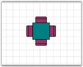
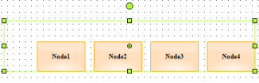
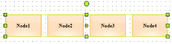

# Grouping in Windows Forms Diagram

A group is a node that acts as a transparent container for other nodes. A group is a composite node that controls a set of child nodes. The bounding rectangle of a group is the union of the bounds of its children. The group renders itself by iterating through its children and rendering them. Child nodes cannot be selected or manipulated individually. Members of the group are added and removed through the ICompositeNode interface.

There are two ways available to add a Group in [WinForms Diagram](https://www.syncfusion.com/diagram-sdk/winforms-diagram) control:

1. Add the children to the [Group](https://help.syncfusion.com/cr/windowsforms/Syncfusion.Windows.Forms.Diagram.Group.html) manually with the help of Group class methods. The following code snippet creates a group with two nodes.





//Node 1
Syncfusion.Windows.Forms.Diagram.Rectangle nodeRect = new Syncfusion.Windows.Forms.Diagram.Rectangle(50, 100, 125, 75);
nodeRect.FillStyle.Color = Color.FromArgb(255, 223, 189);
nodeRect.LineStyle.LineColor = Color.Orange;
Syncfusion.Windows.Forms.Diagram.Label lbl = new Syncfusion.Windows.Forms.Diagram.Label(nodeRect, "Rectangle");
lbl.FontStyle.Size = 12;
lbl.FontStyle.Bold = true;
nodeRect.Labels.Add(lbl);

//Node 2
Syncfusion.Windows.Forms.Diagram.Rectangle nodeRect1 = new Syncfusion.Windows.Forms.Diagram.Rectangle(150, 100, 125, 75);
nodeRect1.FillStyle.Color = Color.FromArgb(255, 223, 189);
nodeRect1.LineStyle.LineColor = Color.Orange;
Syncfusion.Windows.Forms.Diagram.Label lbl1 = new Syncfusion.Windows.Forms.Diagram.Label(nodeRect1, "Rectangle1");
lbl1.FontStyle.Size = 12;
lbl1.FontStyle.Bold = true;
nodeRect1.Labels.Add(lbl1);

//Grouping Nodes
Syncfusion.Windows.Forms.Diagram.Group grp = new Group();
grp.AppendChild(nodeRect);
grp.AppendChild(nodeRect1);
this.diagram1.Model.AppendChild(grp);




'Node 1
Dim nodeRect As Syncfusion.Windows.Forms.Diagram.Rectangle = New Syncfusion.Windows.Forms.Diagram.Rectangle(50, 100, 125, 75)
nodeRect.FillStyle.Color = Color.FromArgb(255, 223, 189)
nodeRect.LineStyle.LineColor = Color.Orange
Dim lbl As Syncfusion.Windows.Forms.Diagram.Label = New Syncfusion.Windows.Forms.Diagram.Label(nodeRect, "Rectangle")
lbl.FontStyle.Size = 12
lbl.FontStyle.Bold = True
nodeRect.Labels.Add(lbl)

'Node 2
Dim nodeRect1 As Syncfusion.Windows.Forms.Diagram.Rectangle = New Syncfusion.Windows.Forms.Diagram.Rectangle(150, 100, 125, 75)
nodeRect1.FillStyle.Color = Color.FromArgb(255, 223, 189)
nodeRect1.LineStyle.LineColor = Color.Orange
Dim lbl1 As Syncfusion.Windows.Forms.Diagram.Label = New Syncfusion.Windows.Forms.Diagram.Label(nodeRect1, "Rectangle1")
lbl1.FontStyle.Size = 12
lbl1.FontStyle.Bold = True
nodeRect1.Labels.Add(lbl1)

'Grouping Nodes
Dim grp As Syncfusion.Windows.Forms.Diagram.Group = New Syncfusion.Windows.Forms.Diagram.Group()
grp.AppendChild(nodeRect)
grp.AppendChild(nodeRect1)
Me.diagram1.Model.AppendChild(grp)




{{ codesnippet1 | OrderList_Indent_Level_1 }}

2. Group the currently selected nodes automatically. Select the nodes first, then use the [Group](https://help.syncfusion.com/cr/windowsforms/Syncfusion.Windows.Forms.Diagram.Controller.html#Syncfusion_Windows_Forms_Diagram_Controller_Group) and [UnGroup](https://help.syncfusion.com/cr/windowsforms/Syncfusion.Windows.Forms.Diagram.Controller.html#Syncfusion_Windows_Forms_Diagram_Controller_UnGroup) methods of the Diagram control's Controller for grouping and ungrouping as follows.





this.diagram1.Controller.Group();     //Method to group the nodes
this.diagram1.Controller.UnGroup();   //Method to ungroup the nodes




Me.diagram1.Controller.Group()     'Method to group the nodes
Me.diagram1.Controller.UnGroup()   'Method to ungroup the nodes




{{ codesnippet2 | OrderList_Indent_Level_1 }}

## Access, Delete, or Remove Child Nodes in a Group

The first step is to check whether the node is a group.




if (node is Group)
{
// Your code here
}




If TypeOf node Is Group Then
' Your code here
End If




If the node is a group, the following special methods are available:

<table>
<tr>
<th>
Method</th><th>
Description</th></tr>
<tr>
<td>
{{'[GetChild](https://help.syncfusion.com/cr/windowsforms/Syncfusion.Windows.Forms.Diagram.Group.html#Syncfusion_Windows_Forms_Diagram_Group_GetChild_System_Int32_)'| markdownify }}(int childIndex)</td><td>
Returns the child node at the specified index.</td></tr>
<tr>
<td>
{{'[GetChildByName](https://help.syncfusion.com/cr/windowsforms/Syncfusion.Windows.Forms.Diagram.Group.html#Syncfusion_Windows_Forms_Diagram_Group_GetChildByName_System_String_)'| markdownify }}(string childName)</td><td>
Returns the child node with the specified name.</td></tr>
<tr>
<td>
{{'[RemoveAllChildren](https://help.syncfusion.com/cr/windowsforms/Syncfusion.Windows.Forms.Diagram.Group.html#Syncfusion_Windows_Forms_Diagram_Group_RemoveAllChildren)'| markdownify }}()</td><td>
Removes all child nodes from the group.</td></tr>
<tr>
<td>
{{'[RemoveChild](https://help.syncfusion.com/cr/windowsforms/Syncfusion.Windows.Forms.Diagram.Group.html#Syncfusion_Windows_Forms_Diagram_Group_RemoveChild_System_Int32_)'| markdownify }}(int childIndex)</td><td>
Removes the child node at the specified index.</td></tr>
<tr>
<td>
{{'[RemoveChild](https://help.syncfusion.com/cr/windowsforms/Syncfusion.Windows.Forms.Diagram.Group.html#Syncfusion_Windows_Forms_Diagram_Group_RemoveChild_Syncfusion_Windows_Forms_Diagram_Node_)'| markdownify }}(Node nodeToRemove)</td><td>
Removes the specified child node from the group.</td></tr>
<tr>
<td>
{{'[InsertChild](https://help.syncfusion.com/cr/windowsforms/Syncfusion.Windows.Forms.Diagram.Group.html#Syncfusion_Windows_Forms_Diagram_Group_InsertChild_Syncfusion_Windows_Forms_Diagram_Node_System_Int32_)'| markdownify }}(Node child, int childIndex)</td><td>
Inserts the specified child node at the specified index.</td></tr>
</table>

The Group class has an int [ChildCount](https://help.syncfusion.com/cr/windowsforms/Syncfusion.Windows.Forms.Diagram.Group.html#Syncfusion_Windows_Forms_Diagram_Group_ChildCount) property that returns the number of child nodes in a group. To delete the first element in a group, use the following code.




foreach (Node node in diagram1.Model.Nodes)
{
if (node is Group) // Check for group
{
Group groupNode = (Group)node;
if (groupNode.ChildCount > 0) // Group has sub nodes
{
Node nodeToRemove = groupNode.GetChild(0);
groupNode.RemoveChild(nodeToRemove);
}
}
}




For Each node As Node In diagram1.Model.Nodes
If TypeOf node Is Group Then ' Check for group
Dim groupNode As Group = CType(node, Group)
If groupNode.ChildCount > 0 Then ' Group has sub nodes
Dim nodeToRemove As Node = groupNode.GetChild(0)
groupNode.RemoveChild(nodeToRemove)
End If
End If
Next




## Positioning a Group's Child Nodes

The Diagram group node supports absolute and relative positioning. The group node has an enum property called [GroupNodePosition](https://help.syncfusion.com/cr/windowsforms/Syncfusion.Windows.Forms.Diagram.Group.html#Syncfusion_Windows_Forms_Diagram_Group_GroupNodePosition) of type [GroupNodePositions](https://help.syncfusion.com/cr/windowsforms/Syncfusion.Windows.Forms.Diagram.GroupNodePositions.html) to position its child nodes. GroupNodePositions has two values: Absolute and Relative. The Absolute option places the nodes inside a group based on their actual PinPoint, whereas the Relative option places the nodes based on their default PinPoint. The default value is `Relative`.




//Group
Group group = new Group();
//Absolute positioning
group.GroupNodePosition = GroupNodePositions.Absolute;




'Group
Dim group As Group = New Group()
'Absolute positioning
group.GroupNodePosition = GroupNodePositions.Absolute




## Properties

<table>
<tr>
<th>
Name</th><th>
Description</th><th>
Type</th><th>
Default value</th><th>
Value Accepted</th><th>
Reference</th></tr>
<tr>
<td>
GroupNodePosition</td><td>
Specifies the mode in which the group node’s child nodes should be positioned.</td><td>
GroupNodePositions</td><td>
Relative</td><td>
Absolute,Relative</td><td>
{{'[GroupNodePosition](https://help.syncfusion.com/cr/windowsforms/Syncfusion.Windows.Forms.Diagram.Group.html#Syncfusion_Windows_Forms_Diagram_Group_GroupNodePosition)'| markdownify }}</td></tr>
</table>
