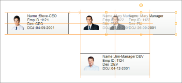

# Guides in Windows Forms Diagram

Guides for the Diagram control are viewable, non printing guidelines used to align a diagram node with other nodes. They provide support to align a diagram node with the boundary, center, or margin of other nodes.

You can also change the visual style of Guides by using its LineStyle property.

### Properties

The following table describes the various properties associated with Diagram Guides.

Guides Properties

<table>
<tr>
<th>
Property Name</th><th>
Description</th></tr>
<tr>
<td>
Guides</td><td>
Gets the Diagram Guides.</td></tr>
<tr>
<td>
Enable</td><td>
Specifies whether to turn on/off Diagram Guides.</td></tr>
<tr>
<td>
LineStyle</td><td>
Gets or sets the visual style for Diagram Guides.</td></tr>
<tr>
<td>
Type</td><td>
Specifies the Guide Type for nodes. The options included are as follows:{{ '_Boundary_' | markdownify }} {{ '_Center_' | markdownify }} {{ '_Margin_' | markdownify }} {{ '_All_' | markdownify }}</td></tr>
<tr>
<td>
Margin</td><td>
Gets or sets the margin between nodes.</td></tr>
</table>

The following code example illustrates how to turn on Guides for Diagram Nodes while dragging or resizing nodes.




// Turns on Guides in Diagram.
diagram1.Controller.Guides.Enable = true;

// Shows All Types of Guides.
diagram1.Controller.Guides.Type = GuideTypes.All;

// Specifies Line Color for Guides.
diagram1.Controller.Guides.LineStyle.LineColor = Color.FromArgb(255, 153, 51);

// Sets the Margin between Nodes.
diagram1.Controller.Guides.Margin = 50;




'Turns on Guides in Diagram.
diagram1.Controller.Guides.Enable = True

'Shows All Types of Guides.
diagram1.Controller.Guides.Type = GuideTypes.All

'Specifies Line Color for Guides.
diagram1.Controller.Guides.LineStyle.LineColor = Color.FromArgb(255, 153, 51)

'Sets the Margin between Nodes.
diagram1.Controller.Guides.Margin = 50




