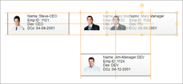

# Guides in Windows Forms Diagram

Guides for the [WinForms Diagram](https://www.syncfusion.com/diagram-sdk/winforms-diagram) control are viewable, non-printing guidelines used to align a diagram node with other nodes. They provide support to align a diagram node with the boundary, center, or margin of other nodes. Guides are rendered only while dragging or resizing a node; they are not shown in the static diagram view and are not included when the diagram is printed.

You can also change the visual style of the guides by using its LineStyle property.

## Properties

The following table describes the various properties associated with the [Guides](https://help.syncfusion.com/cr/windowsforms/Syncfusion.Windows.Forms.Diagram.Guides.html) class:

<table>
<tr>
<th>
Property Name</th><th>
Description</th></tr>
<tr>
<td>
{{'[Guides](https://help.syncfusion.com/cr/windowsforms/Syncfusion.Windows.Forms.Diagram.Controller.html#Syncfusion_Windows_Forms_Diagram_Controller_Guides)'| markdownify }}</td><td>
Gets the Diagram Guides object.</td></tr>
<tr>
<td>
{{'[Enable](https://help.syncfusion.com/cr/windowsforms/Syncfusion.Windows.Forms.Diagram.Guides.html#Syncfusion_Windows_Forms_Diagram_Guides_Enable)'| markdownify }}</td><td>
Enables or disables the diagram guides.</td></tr>
<tr>
<td>
{{'[LineStyle](https://help.syncfusion.com/cr/windowsforms/Syncfusion.Windows.Forms.Diagram.Guides.html#Syncfusion_Windows_Forms_Diagram_Guides_LineStyle)'| markdownify }}</td><td>
Gets or sets the visual style for the diagram guides.</td></tr>
<tr>
<td>
{{'[Type](https://help.syncfusion.com/cr/windowsforms/Syncfusion.Windows.Forms.Diagram.Guides.html#Syncfusion_Windows_Forms_Diagram_Guides_Type)'| markdownify }}</td><td>
Specifies the guide type for nodes. The available {{'[GuideTypes](https://help.syncfusion.com/cr/windowsforms/Syncfusion.Windows.Forms.Diagram.GuideTypes.html)'| markdownify }} options are:{{ '_Boundary_' | markdownify }} {{ '_Center_' | markdownify }} {{ '_Margin_' | markdownify }} {{ '_All_' | markdownify }}. When `Margin` is set, the `Margin` property value is used to draw the margin line between nodes.</td></tr>
<tr>
<td>
{{'[Margin](https://help.syncfusion.com/cr/windowsforms/Syncfusion.Windows.Forms.Diagram.Guides.html#Syncfusion_Windows_Forms_Diagram_Guides_Margin)'| markdownify }}</td><td>
Gets or sets the margin between nodes, in pixels (float).</td></tr>
</table>

## Enable and Customize Guides

The following code example illustrates how to turn on guides for diagram nodes while dragging or resizing nodes. A Diagram control named `diagram1` must already exist on the form.




// Turns on guides in the diagram.
diagram1.Controller.Guides.Enable = true;

// Shows all types of guides.
diagram1.Controller.Guides.Type = GuideTypes.All;

// Specifies the line color for guides.
diagram1.Controller.Guides.LineStyle.LineColor = Color.FromArgb(255, 153, 51);

// Sets the margin between nodes.
diagram1.Controller.Guides.Margin = 50;




'Turns on guides in the diagram.
diagram1.Controller.Guides.Enable = True

'Shows all types of guides.
diagram1.Controller.Guides.Type = GuideTypes.All

'Specifies the line color for guides.
diagram1.Controller.Guides.LineStyle.LineColor = Color.FromArgb(255, 153, 51)

'Sets the margin between nodes.
diagram1.Controller.Guides.Margin = 50




The following screenshot shows the guides rendered while dragging a node:

