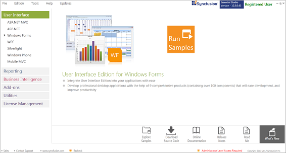
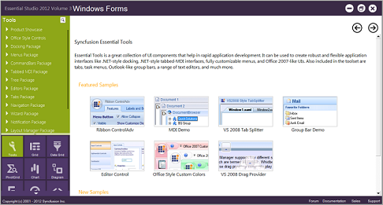
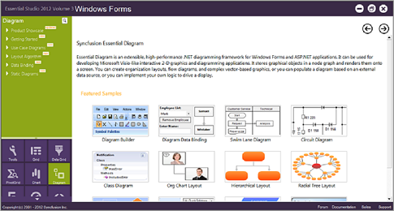

## Installation And Deployment

This section covers information on the install location, samples, licensing, patches update and updation of the recent version of Essential Studio. It comprises the following sub-sections:

### Installation

For step-by-step installation procedure for the installation of Essential Studio, refer to the Installation topic under Installation and Deployment in the Common UG.

See Also

For licensing, patches and information on adding or removing selective components, refer the following topics in Common UG under Installation and Deployment.

* Licensing
* Patches
* Add / Remove Components
### Sample And Location

This section covers the location of the installed samples and describes the procedure to run the samples through the sample browser. It also lists the location of source code.

Sample Installation Location

The Essential Diagram Windows Forms samples are installed in the following location.

...\My Documents\Syncfusion\EssentialStudio\Version Number\Windows\Diagram.Windows\Samples\2.0

Viewing Samples

To view the samples, follow the steps below:

1. Click Start-->All Programs-->Syncfusion-->Essential Studio <version number> -->Dashboard.

{{ '' | markdownify }}
{:.image }

_Figure_ _2__: Essential Studio Dashboard_

2. In the Dashboard window, click Run Samples for Windows Forms under UI Edition. The UI Windows Form Sample Browser window is displayed.

> {{ '' | markdownify }}
{:.image }
_Note: You can view the samples in any of the following three ways:_

> 1. _Run Samples - Click to view the locally installed samples_
> 2. _Online Samples - Click to view online samples_
> 3. _Explore Samples - Explore BI Web samples on disk_

{{ '' | markdownify }}
{:.image }

3. To view the samples of Diagram control, click Diagram from the bottom-left pane.

{{ '' | markdownify }}
{:.image }

4.  Select any sample and browse through the features.

 Source Code Location

The source code for Essential Diagram Windows is available at the following default location:

[System Drive]:\Program Files\Syncfusion\Essential Studio\[Version Number]\Windows\Diagram.Windows\Src

### Deployment Requirements

This section provides deployment requirements for using Essential Diagram under the following topics:

#### Toolbox Entries

Essential Diagram places the following controls into your Visual Studio .NET toolbox from where you can drag each control onto a form and start working with it.

* Diagram
#### DLLs

The following assemblies need to be referenced in your application for using Diagram control:

Windows Forms – Diagram (Basic)

*  Syncfusion.Core.dll
*  Syncfusion.Shared.Base.dll
*  Syncfusion.Diagram.Base.dll
*  Syncfusion.Diagram.Windows.dll

Windows Forms – Diagram (On inclusion of Scripting)

*  Syncfusion.Core.dll
*  Syncfusion.Shared.Base.dll
*  Syncfusion.Diagram.Base.dll
*  Syncfusion.Diagram.Windows.dll
*  Syncfusion.Scripting.Base
* Syncfusion.Scripting.Windows
