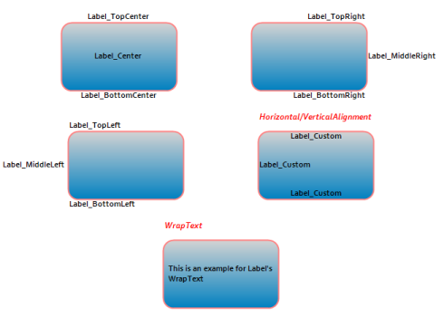
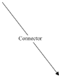

# Label in Windows Forms Diagram

A label is a text object that is attached to a node and is positioned relative to node coordinates. This enables you to format the label text.  You can also customize the appearance of the label. You can bind the node name to the label so that the name will be displayed as the label text. This can be achieved using the _PropertyBinding_ property.

The following formatting options are supports for the label text:

* WrapText
* HorizontalAlignment
* VerticalAlignment
* DirectionRightToLeft
* DirectionVertical
* TextCase
* NoClip
* LineLimit
* FitBlackBox
* MeasureTrailingSpace

The following options are supports for customizing the appearance of the label.

* BackGroundStyle
* FontColorStyle
* FontStyle

Use Case Scenarios

When you are drawing a Business Process Flow Diagram, using this support, you can name the node representing the stage. 

Tables for Properties and Methods

<table>
<tr>
<th>
Property </th><th>
Description </th><th>
Type </th><th>
Data Type </th><th>
Reference links </th></tr>
<tr>
<td>
Name</td><td>
Used to specify the name of a label.</td><td>
NA</td><td>
string</td><td>
NA</td></tr>
<tr>
<td>
FullName</td><td>
Used to specify the full name of a label. Label container’s name is prefixed with its name.</td><td>
NA</td><td>
string</td><td>
NA</td></tr>
<tr>
<td>
ReadOnly</td><td>
Used to add a flag indicating whether the text object is Read-only or not.</td><td>
NA</td><td>
Boolean </td><td>
NA</td></tr>
<tr>
<td>
Visible</td><td>
Specifies the visibility of the label.</td><td>
NA</td><td>
Boolean </td><td>
NA</td></tr>
<tr>
<td>
FontColorStyle</td><td>
Specifies the font color style.</td><td>
NA</td><td>
FillStyle</td><td>
NA</td></tr>
<tr>
<td>
BackgroundStyle</td><td>
Specifies the text background style.</td><td>
NA</td><td>
FillStyle</td><td>
NA</td></tr>
<tr>
<td>
Text</td><td>
Gets or sets the label text.</td><td>
NA</td><td>
String</td><td>
NA</td></tr>
<tr>
<td>
FontStyle</td><td>
Specifies the font style.</td><td>
NA</td><td>
FontStyle</td><td>
NA</td></tr>
<tr>
<td>
PropertyBinding</td><td>
Binds the text value of the label to the Text property.</td><td>
NA</td><td>
LabelPropertyBinding</td><td>
NA</td></tr>
<tr>
<td>
Size</td><td>
Gets or sets the label text size.</td><td>
NA</td><td>
SizeF</td><td>
NA</td></tr>
<tr>
<td>
SizeToNode</td><td>
Set the node size to label size. This can be enabled  if the node has only one label and label's position is center.</td><td>
NA</td><td>
Boolean </td><td>
NA</td></tr>
<tr>
<td>
UpdatePosition</td><td>
Gets or Sets whether default positioning has to be used.</td><td>
NA</td><td>
Boolean </td><td>
NA</td></tr>
<tr>
<td>
AdjustRotationAngle</td><td>
Gets or Sets whether the label should remain horizontal on rotation of the node.</td><td>
NA</td><td>
Boolean </td><td>
NA</td></tr>
<tr>
<td>
TextCase</td><td>
Gets or sets the case of the text in the label.</td><td>
NA</td><td>
TextCases</td><td>
NA</td></tr>
<tr>
<td>
HorizontalAlignment</td><td>
Gets or sets the horizontal alignment of the text.</td><td>
NA</td><td>
StringAlignment</td><td>
NA</td></tr>
<tr>
<td>
VerticalAlignment</td><td>
Gets or sets the vertical alignment of the text.</td><td>
NA</td><td>
StringAlignment</td><td>
NA</td></tr>
<tr>
<td>
FormatFlags</td><td>
Gets the flags used to format the text.</td><td>
NA</td><td>
StringFormatFlags</td><td>
NA</td></tr>
<tr>
<td>
WrapText</td><td>
Gets or sets a value indicating whether text should be wrapped, when it exceeds the width of the bounding box.</td><td>
NA</td><td>
Boolean </td><td>
NA</td></tr>
<tr>
<td>
DirectionRightToLeft</td><td>
Gets or sets a value indicating whether the text is right to left.</td><td>
NA</td><td>
Boolean </td><td>
NA</td></tr>
<tr>
<td>
DirectionVertical</td><td>
Gets or sets a value indicating whether the text is vertical.</td><td>
NA</td><td>
Boolean </td><td>
NA</td></tr>
<tr>
<td>
FitBlackBox</td><td>
Gets or sets a value indicating whether no part of any glyph overhangs the label bounds.</td><td>
NA</td><td>
Boolean</td><td>
NA</td></tr>
<tr>
<td>
LineLimit</td><td>
Gets or sets a value indicating whether only entire lines are laid out in the formatting rectangle.</td><td>
NA</td><td>
Boolean</td><td>
NA</td></tr>
<tr>
<td>
MeasureTrailingSpaces</td><td>
Gets or sets a value indicating whether space at the end of each line in calculations that measure the size of the text.</td><td>
NA</td><td>
Boolean </td><td>
NA</td></tr>
<tr>
<td>
NoClip</td><td>
Gets or sets a value indicating whether overhanging parts of glyphs and unwrapped text reaching outside the formatting rectangle are allowed to show.</td><td>
NA</td><td>
Boolean </td><td>
NA</td></tr>
<tr>
<td>
OffsetX</td><td>
Gets or sets the label offset x in percent relative to node's width from node's top left point.</td><td>
NA</td><td>
float</td><td>
NA</td></tr>
<tr>
<td>
OffsetY</td><td>
Gets or sets the label offset y in percent relative to node's width from node's top left point.</td><td>
NA</td><td>
float</td><td>
NA</td></tr>
<tr>
<td>
Position</td><td>
Gets or sets the position of the label. </td><td>
NA</td><td>
Position</td><td>
NA</td></tr>
<tr>
<td>
Constraints</td><td>
Gets or sets a constraints to define an interact the label. </td><td>
enum</td><td>
LabelConstraints</td><td>
NA</td></tr>
<tr>
<td>
RotationAngle</td><td>
Gets or sets the rotation angle for the label. </td><td>
NA</td><td>
float</td><td>
NA</td></tr>
</table>

### Methods

<table>
<tr>
<th>
Method </th><th>
Description </th><th>
Parameters </th><th>
Type </th><th>
Return Type </th><th>
Reference links </th></tr>
<tr>
<td>
GetPosition</td><td>
Gets the label position in the node coordinates.</td><td>
Empty</td><td>
NA</td><td>
PointF</td><td>
NA</td></tr>
<tr>
<td>
GetStringFormat</td><td>
Creates a StringFormat object that encapsulates the properties of the text object.</td><td>
Empty</td><td>
NA</td><td>
StringFormat</td><td>
NA</td></tr>
</table>

#### Adding a Label to an Application 

You can create label as illustrated in the following code example:




RoundRect node = new RoundRect(0, 0, 170, 100,MeasureUnits.Pixel);

//Create a label with predefined position
Syncfusion.Windows.Forms.Diagram.Label lbl_TopCenter = new Syncfusion.Windows.Forms.Diagram.Label(node, "Label_TopCenter");           

//Position the label
lbl_TopCenter.Position = Position.TopCenter;

/* Position enum has the values Center, TopLeft, TopCenter, TopRight, MiddleLeft, MiddleRight, BottomLeft, BottomCenter, BottomRight and Custom */

//Apply font style
lbl_TopCenter.FontStyle.Bold = true;
lbl_TopCenter.FontStyle.Family = "Corbel";
lbl_TopCenter.FontStyle.Size = 9;

//Add the label to node's label collection
node.Labels.Add(lbl_TopCenter);

//Create a label with custom position
Syncfusion.Windows.Forms.Diagram.Label lbl_Custom = new Syncfusion.Windows.Forms.Diagram.Label(node, "Label_Custom");

//Position the label
lbl_Custom.Position = Position.Custom;
lbl_Custom.OffsetX = 0;
lbl_Custom.OffsetY = 0;

//Apply font style
lbl_Custom.FontStyle.Bold = true;
lbl_Custom.FontStyle.Family = "Corbel";
lbl_Custom.FontStyle.Size = 9;

//Format the label text
lbl_Custom.HorizontalAlignment = StringAlignment.Center;
lbl_Custom.VerticalAlignment = StringAlignment.Far;

//WrapText is set to true by default

//Add the label to node's label collection
node.Labels.Add(lbl_Custom);

//Add the node to diagram model
diagram1.Model.AppendChild(node);  




Dim node As New RoundRect(0, 0, 170, 100,MeasureUnits.Pixel)

'Create a label with predefined position
Dim lbl_TopCenter As New Syncfusion.Windows.Forms.Diagram.Label(node, "Label_TopCenter")

'Position the label
lbl_TopCenter.Position = Position.TopCenter

' Position enum has the values Center, TopLeft, TopCenter, TopRight, MiddleLeft, MiddleRight, BottomLeft, BottomCenter, BottomRight and Custom
'Apply font style
lbl_TopCenter.FontStyle.Bold = True
lbl_TopCenter.FontStyle.Family = "Corbel"
lbl_TopCenter.FontStyle.Size = 9
 
'Add the label to node's label collection
node.Labels.Add(lbl_TopCenter)

'Create a label with custom position
Dim lbl_Custom As New Syncfusion.Windows.Forms.Diagram.Label(node, "Label_Custom")

'Position the label
lbl_Custom.Position = Position.Custom
lbl_Custom.OffsetX = 0
lbl_Custom.OffsetY = 0

'Apply font style
lbl_Custom.FontStyle.Bold = True
lbl_Custom.FontStyle.Family = "Corbel"
lbl_Custom.FontStyle.Size = 9

'Format the label text
lbl_Custom.HorizontalAlignment = StringAlignment.Center
lbl_Custom.VerticalAlignment = StringAlignment.Far

'WrapText is true by default
'Add the label to node's label collection
node.Labels.Add(lbl_Custom)

'Add the node to diagram model
diagram1.Model.AppendChild(node)




## Label Orientation

This feature lets the user to specify the orientation of a node label. There are two orientation modes, Horizontal, which displays the label horizontally, and Auto, which rotates the label based on the node or connector rotation angle.

<table>
<tr>
<th>
Property </th><th>
Description </th><th>
Data Type </th></tr>
<tr>
<td>
Orientation</td><td>
Gets or sets the orientation of the label.</td><td>
Enum</td></tr>
</table>

The following code shows how to set the orientation of the label to horizontal:




Syncfusion.Windows.Forms.Diagram.Label label = new Syncfusion.Windows.Forms.Diagram.Label(node, "Orientation");

//Sets the orientation of the label as horizontal.
label.Orientation = LabelOrientation.Horizontal;
node.Labels.Add(label);




Dim label As New Syncfusion.Windows.Forms.Diagram.Label(node, "Orientation")

'Sets the orientation of the label as horizontal.
label.Orientation = LabelOrientation.Horizontal
node.Labels.Add(label)




## Interaction

Diagram allows label to be interacted by selecting, dragging, rotating, and resizing. By default, the Label interaction is disabled and you can enable this by using the `Constraints` property of the Label. You can also curtail the services of interaction by enabling either selecting, dragging, rotating, or resizing individually with the respective `Constraints` property of the label. The following code illustrates how to enable annotation interaction.



Syncfusion.Windows.Forms.Diagram.Rectangle rectangle = new Syncfusion.Windows.Forms.Diagram.Rectangle(new RectangleF(100, 100, 100, 100));

Syncfusion.Windows.Forms.Diagram.Label label = new Syncfusion.Windows.Forms.Diagram.Label();
//To set the label constraint as Interaction...
label.Constraints = LabelConstraints.Interaction;
label.Text = "Welcome to Syncfusion®";
rectangle.Labels.Add(label);

label = new Syncfusion.Windows.Forms.Diagram.Label();
//To set the label constraint as Resize alone...
label.Constraints = LabelConstraints.Resize | LabelConstraints.Select;
label.Position = Position.TopLeft;
//lbl.UpdatePosition = true;
label.Text = "Second";
label.ReadOnly = true;
rectangle.Labels.Add(label);

label = new Syncfusion.Windows.Forms.Diagram.Label();
//To set the label constraint as Rotate alone...
label.Constraints = LabelConstraints.Rotate| LabelConstraints.Select;
label.Position = Position.MiddleRight;
label.Text = "Third";
rectangle.Labels.Add(label);
diagram1.Model.AppendChild(rectangle);



Dim rectangle As New Syncfusion.Windows.Forms.Diagram.Rectangle(New RectangleF(100, 100, 100, 100))

Dim label As New Syncfusion.Windows.Forms.Diagram.Label()
'To set the label constraint as Interaction...
label.Constraints = LabelConstraints.Interaction
label.Text = "Welcome to Syncfusion®"
rectangle.Labels.Add(label)

label = New Syncfusion.Windows.Forms.Diagram.Label()
'To set the label constraint as Resize alone...
label.Constraints = LabelConstraints.Resize| LabelConstraints.Select
label.Position = Position.TopLeft
'lbl.UpdatePosition = true;
label.Text = "Second"
label.ReadOnly = True
rectangle.Labels.Add(label)

label = New Syncfusion.Windows.Forms.Diagram.Label()
'To set the label constraint as Rotate alone...
label.Constraints = LabelConstraints.Rotate| LabelConstraints.Select
label.Position = Position.MiddleRight
label.Text = "Third"
rectangle.Labels.Add(label)

diagram1.Model.AppendChild(rectangle)


