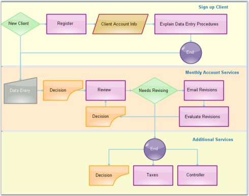

# Layers in Windows Forms Diagram

Layers are transparent sheets that can be added to the model and the objects are added to it. Layers allow to categorically arrange a set of nodes onto the diagram.

### Sample Layers

A layer organizes graphical objects into groups that share a common set of default properties and Z-order. Users can add any number of layers to the model and move objects between layers. Objects in a layer have the same Z-order, which can be relatively controlled with respect to other layers. 

Layers are used when the user wants to separate text and links from other nodes. The nodes created can be added to their respective layers. The following code snippet demonstrates the creation of three layers and assigning them to the various nodes.

Layers are used to group nodes in collections and then show or hide layers with all nodes. One node can be assigned to many layers. Node will be visible, if all layers are visible; even if one layer is hidden, node will not be drawn.

Programmatically layers can be implemented as follows.




// Layer 1
PointF[] pts1 = { new PointF(50, 25), new PointF(75, 75), new PointF(100, 25), new PointF(125, 75), new PointF(150, 25), new PointF(175, 75), new PointF(200, 25) };
CurveNode cn = new CurveNode(pts1);
diagram1.Model.AppendChild(cn);
Layer layer1 = new Layer();
cn.Layers.Add(layer1);

// Layer 2
PointF[] pts = { new PointF(10, 100), new PointF(50, 25), new PointF(34, 78), new PointF(100, 78) };
ClosedCurveNode ccn = new ClosedCurveNode(pts);
diagram1.Model.AppendChild(ccn);
Layer layer2 = new Layer();
ccn.Layers.Add(layer2);

// Layer 3
PointF pt = new PointF(50F, 200F);
PointF pt1 = new PointF(200F, 100F);
BezierCurve bc = new BezierCurve(pt, pt1);
diagram1.Model.AppendChild(bc);
SplineNode sp = new SplineNode(new PointF(130, 200), new PointF(200, 200), new PointF(120, 40));
diagram1.Model.AppendChild(sp);
Layer layer3 = new Layer();
bc.Layers.Add(layer3);
sp.Layers.Add(layer3);




' Layer 1
Dim pts1 As PointF() = {New PointF(50, 25), New PointF(75, 75), New PointF(100, 25), New PointF(125, 75), New PointF(150, 25), New PointF(175, 75),
 New PointF(200, 25)}
Dim cn As New CurveNode(pts1)
diagram1.Model.AppendChild(cn)
Dim layer1 As New Layer()
cn.Layers.Add(layer1)

' Layer 2
Dim pts As PointF() = {New PointF(10, 100), New PointF(50, 25), New PointF(34, 78), New PointF(100, 78)}
Dim ccn As New ClosedCurveNode(pts)
diagram1.Model.AppendChild(ccn)
Dim layer2 As New Layer()
ccn.Layers.Add(layer2)

' Layer 3
Dim pt As New PointF(50.0F, 200.0F)
Dim pt1 As New PointF(200.0F, 100.0F)
Dim bc As New BezierCurve(pt, pt1)
diagram1.Model.AppendChild(bc)
Dim sp As New SplineNode(New PointF(130, 200), New PointF(200, 200), New PointF(120, 40))
diagram1.Model.AppendChild(sp)
Dim layer3 As New Layer()
bc.Layers.Add(layer3)
sp.Layers.Add(layer3)




### Adding Layers

Layers can be added to the model through LayersCollectionEditor, which can be opened by selecting the Layers Collection property.

Layers

<table>
<tr>
<th>
Properties </th><th>
Description</th></tr>
<tr>
<td>
Enabled</td><td>
Indicates whether the layer should be active or not. Default value is false.</td></tr>
<tr>
<td>
Name</td><td>
Indicates whether the unit should be inherited.</td></tr>
<tr>
<td>
Visible</td><td>
Indicates whether the objects on the layer should be visible.</td></tr>
</table>

## Adding Objects to a Layer

To add objects to a layer, that layer must be active. If an object is added to the model, it will be automatically added to that active layer. The layer can be made active only on setting the Enabled property of that layer. 

The objects can be added to more than one layer by setting the Enabled property of all the layers to which it is added.

To add an object only to a single layer, make sure that only a single layer is enabled at a time.

## Object Visibility 

The visibility of the layer can be handled to control the visibility of all the objects on that layer.




Layer layer0 = new Layer();
this.diagram1.Model.Layers.Add(layer0);
layer0.Enabled = true;
layer0.Visible = true;
layer1.Visible = true;




Dim layer0 As New Layer()
Me.diagram1.Model.Layers.Add(layer0)
layer0.Enabled = True
layer0.Visible = True
layer1.Visible = True



