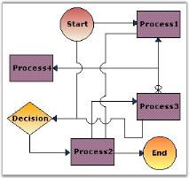

# Line Bridging

Line bridging provides the visual effect such that the links jump over other links that are found in it's way with lower Z-order, thereby avoiding the links from intersecting each other and providing a hassle-free view to clearly state the various connections between the nodes.It will also create the same visual effect when it jumps over any port. This is done by enabling the LineBridgingEnabled property. Default value is _false_.

The below table lists the properties which controls the appearance of the bridge.

<table>
<tr>
<th>
Property</th><th>
Description</th></tr>
<tr>
<td>
LineBridgeSize</td><td>
Allows to set the size of the bridge when the links intersect each other. Default value is 16.</td></tr>
<tr>
<td>
BridgeStyle</td><td>
Specifies the type of bridge to be applied. Default value is 'Arc'. The value when set, applies to all the links that are drawn on the diagram. The links will bridge over the other link only when it's Z-order value is high. The options include the following:
<ul><li> Arc</li><li> Gap</li><li> Square</li><li> Side2</li><li>Side3</li><li>Side4</li><li>Side5</li><li>Side6</li><li>Side7</li></ul></td></tr>
</table>

Programmatically it can be set as follows:




	this.diagram1.Model.LineBridgeSize = 5;
	
	//enabling for model
	this.diagram1.Model.LineBridgingEnabled = true;
	
	//enabling for link object
	link.LineBridgingEnabled = true;
	
	this.diagram1.Model.BridgeStyle = BridgeStyle.Square;




	Me.diagram1.Model.LineBridgeSize = 5
	
	'enabling for model
	Me.diagram1.Model.LineBridgingEnabled = True
	
	'enabling for link object
	link.LineBridgingEnabled = True
	
	Me.diagram1.Model.BridgeStyle = BridgeStyle.Square




N> In the above code snippets, link refers to the instance of the Link node.