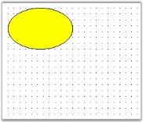
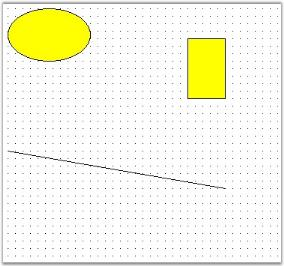
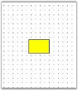
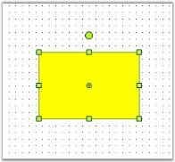
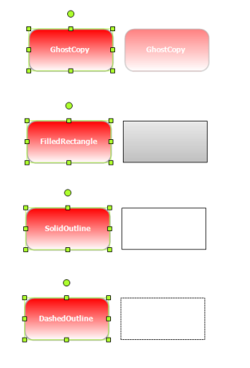

# Nodes or Shapes in Windows Forms Diagram

The Diagram control supports different kinds of nodes. The following are the nodes that are supported by the Diagram control:

* TextNode
* Shape
* Symbol
* ControlNode
* PathNode
* BitmapNode
* RichTextNode
* MetafileNode
* Group
* PseudoGroup
* FilledPath
* FilledShape
* RoundRect
* PolygonA
* Rectangle
* ClosedCurveNode
* Ellipse
* SemiCircle
* CircularArc
* PolylineNode
* CurveNode
* Line
* SplineNode
* Arc
* BezierCurve
* MeasureLine
* Polyline
* OrthogonalConnector
* LineConnector
* OrthogonalLine
* Link
* PolyLineConnector

### Creating a Node in the Diagram Control at Run Time

To create a node in the Diagram control:

1. Drag the Diagram control to the windows form.
2. Press the F7 key to open the *.cs file and enter the following code in the Page_Load function.





private void Form1_Load(object sender, EventArgs e)
{
	Syncfusion.Windows.Forms.Diagram.Ellipse ellipse = new Syncfusion.Windows.Forms.Diagram.Ellipse(10, 10, 110, 70);
	diagram1.Model.AppendChild(ellipse);
}




Private Sub Form1_Load(ByVal sender As Object, ByVal e As EventArgs)
Dim ellipse As New Syncfusion.Windows.Forms.Diagram.Ellipse(10, 10, 110, 70)
diagram1.Model.AppendChild(ellipse)
End Sub




{{ codesnippet1 | OrderList_Indent_Level_1 }}

### Node Property Settings

The following code example demonstrates how to apply node property settings.




private void Form1_Load(object sender, EventArgs e)
{
	Syncfusion.Windows.Forms.Diagram.Ellipse ellipse = new Syncfusion.Windows.Forms.Diagram.Ellipse(10, 10, 110, 70);
	diagram1.Model.AppendChild(ellipse);
	ellipse.FillStyle.Color = System.Drawing.Color.AliceBlue;
	ellipse.FillStyle.ColorAlphaFactor = 100;
	ellipse.FillStyle.ForeColor = System.Drawing.Color.Aquamarine;
	ellipse.FillStyle.ForeColorAlphaFactor = 70;
	ellipse.FillStyle.Type = FillStyleType.PathGradient;
	ellipse.FillStyle.PathBrushStyle = PathGradientBrushStyle.RectangleCenter;
	ellipse.FillStyle.Type = FillStyleType.LinearGradient;
	ellipse.FillStyle.GradientAngle = 95;
	ellipse.FillStyle.GradientCenter = 0.5f;
	ellipse.EditStyle.AllowChangeHeight = true;
	ellipse.EditStyle.AllowChangeWidth = true;
	ellipse.EditStyle.AllowDelete = false;
	ellipse.EditStyle.AllowMoveX = true;
	ellipse.EditStyle.AllowMoveY = false;
	ellipse.EditStyle.AllowRotate = false;
	ellipse.EditStyle.AllowSelect = true;
}




Private Sub Form1_Load(ByVal sender As Object, ByVal e As EventArgs)
Dim ellipse As New Syncfusion.Windows.Forms.Diagram.Ellipse(10, 10, 110, 70)
diagram1.Model.AppendChild(ellipse)
ellipse.FillStyle.Color = System.Drawing.Color.AliceBlue
ellipse.FillStyle.ColorAlphaFactor = 100
ellipse.FillStyle.ForeColor = System.Drawing.Color.Aquamarine
ellipse.FillStyle.ForeColorAlphaFactor = 70
ellipse.FillStyle.Type = FillStyleType.PathGradient
ellipse.FillStyle.PathBrushStyle = PathGradientBrushStyle.RectangleCenter
ellipse.FillStyle.Type = FillStyleType.LinearGradient
ellipse.FillStyle.GradientAngle = 95
ellipse.FillStyle.GradientCenter = 0.5F
ellipse.EditStyle.AllowChangeHeight = True
ellipse.EditStyle.AllowChangeWidth = True
ellipse.EditStyle.AllowDelete = False
ellipse.EditStyle.AllowMoveX = True
ellipse.EditStyle.AllowMoveY = False
ellipse.EditStyle.AllowRotate = False
ellipse.EditStyle.AllowSelect = True
End Sub




### Creating Nodes and Links

The following code example illustrates how to create nodes and links.




protected void Page_Load(object sender, EventArgs e)
{
	Syncfusion.Windows.Forms.Diagram.Ellipse ellipse = new Syncfusion.Windows.Forms.Diagram.Ellipse(10, 10, 110, 70);
	Syncfusion.Windows.Forms.Diagram.Rectangle rectangle = new Syncfusion.Windows.Forms.Diagram.Rectangle(250, 50, 50, 80);
	Syncfusion.Windows.Forms.Diagram.LineConnector lineconnector = new Syncfusion.Windows.Forms.Diagram.LineConnector(new System.Drawing.PointF(10, 200), new System.Drawing.PointF(300, 250));
	this.diagram1.Model.AppendChild(ellipse);
	this.diagram1.Model.AppendChild(rectangle);
	this.diagram1.Model.AppendChild(lineconnector);
}




Protected Sub Page_Load(ByVal sender As Object, ByVal e As EventArgs)
Dim ellipse As New Syncfusion.Windows.Forms.Diagram.Ellipse(10, 10, 110, 70)
Dim rectangle As New Syncfusion.Windows.Forms.Diagram.Rectangle(250, 50, 50, 80)
Dim lineconnector As New Syncfusion.Windows.Forms.Diagram.LineConnector(New System.Drawing.PointF(10, 200), New System.Drawing.PointF(300, 250))
Me.diagram1.Model.AppendChild(ellipse)
Me.diagram1.Model.AppendChild(rectangle)
Me.diagram1.Model.AppendChild(lineconnector)
End Sub




### Node Selections 

A node's behavior can be customized and modified using the EditStyle collection properties which can be used for the following:

* To prohibit selection, rotation and deletion of nodes, by using AllowSelect, AllowRotate and AllowDelete properties. 
* To restrict a node's movement along the x or y axis, by using AllowMoveX and AllowMoveY properties.
* To prevent re-sizing the height and width of the node, by using AllowChangeHeight and AllowChangeWidth and AllowResize properties.

<table>
<tr>
<th>
EditStyle Property</th><th>
Description</th></tr>
<tr>
<td>
AllowChangeHeight </td><td>
Specifies whether or not to allow the height to be changed. Default value is {{ '_true_' | markdownify }}.</td></tr>
<tr>
<td>
AllowChangeWidth </td><td>
Specifies whether or not to allow the width to be changed. Default value is {{ '_true_' | markdownify }}.</td></tr>
<tr>
<td>
AllowDelete  </td><td>
Specifies whether or not to allow the node to be deleted on clicking the DELETE key. Default value is {{ '_true_' | markdownify }}.</td></tr>
<tr>
<td>
AllowMoveX</td><td>
Specifies whether or not to allow the node to be moved along the x-axis. Default value is {{ '_true_' | markdownify }}.</td></tr>
<tr>
<td>
AllowMoveY</td><td>
Specifies whether or not to allow the node to be moved along the y-axis. Default value is {{ '_true_' | markdownify }}.</td></tr>
<tr>
<td>
AllowRotate</td><td>
Specifies whether or not to rotate the node using the PinPoint. Default value is {{ '_true_' | markdownify }}.</td></tr>
<tr>
<td>
AllowSelect</td><td>
Specifies whether or not to select the node on mouse click. Default value is {{ '_true_' | markdownify }}.</td></tr>
</table>

Programmatically, the properties can be set as follows:




rect.EditStyle.AllowChangeHeight = true;
rect.EditStyle.AllowChangeWidth = true;
rect.EditStyle.AllowDelete = false;
rect.EditStyle.AllowMoveX = true;
rect.EditStyle.AllowMoveY = false;
rect.EditStyle.AllowRotate = true;
rect.EditStyle.AllowSelect = true;




rect.EditStyle.AllowChangeHeight = True
rect.EditStyle.AllowChangeWidth = True
rect.EditStyle.AllowDelete = False
rect.EditStyle.AllowMoveX = True
rect.EditStyle.AllowMoveY = False
rect.EditStyle.AllowRotate = True
rect.EditStyle.AllowSelect = True




In the above code snippets, the properties are set to the Rectangular node (rect) created through the code.

Behavior Settings

_Properties_

<table>
<tr>
<th>
Property </th><th>
Description</th></tr>
<tr>
<td>
AspectRatio</td><td>
Specifies whether to maintain the height and width ratio when the node is resized.</td></tr>
<tr>
<td>
DefaultHandleEditMode</td><td>
Specifies the mode in which the node should be handled. The default value for links and lines is Vertex and for all other nodes and polyline the default value is Resize. To move the nodes, DefaultHandleEditMode should be set to Resize. The options provided are as follows.NoneResizeVertex</td></tr>
<tr>
<td>
Enabled</td><td>
Specifies whether the node is enabled. Default value is {{ '_true_' | markdownify }}.</td></tr>
<tr>
<td>
AllowVertexEdit</td><td>
Specifies whether or not to edit the vertex. Default value is {{ '_true_' | markdownify }}.</td></tr>
<tr>
<td>
HidePinPoint</td><td>
Specifies whether to show or hide the PinPoint. Default value is {{ '_false_' | markdownify }}.</td></tr>
<tr>
<td>
HideRotationHandle</td><td>
Specifies whether to show or hide the RotationHandle in order to control the rotation of the node. Default value is {{ '_false_' | markdownify }}.</td></tr>
</table>

Programmatically these properties can be set as follows:




rect.EditStyle.AspectRatio = true;
rect.EditStyle.DefaultHandleEditMode =HandleEditMode.Resize;
rect.EditStyle.Enabled = true;
rect.EditStyle.AllowVertexEdit = true;
rect.EditStyle.DefaultHandleEditMode =HandleEditMode.Vertex;
rect.EditStyle.HidePinPoint = true;
rect.EditStyle.HideRotationHandle = true;




rect.EditStyle.AspectRatio = True
rect.EditStyle.DefaultHandleEditMode = HandleEditMode.Resize
rect.EditStyle.Enabled = True
rect.EditStyle.AllowVertexEdit = True
rect.EditStyle.DefaultHandleEditMode = HandleEditMode.Vertex
rect.EditStyle.HidePinPoint = True
rect.EditStyle.HideRotationHandle = True




In the above code snippets, the properties are set to the Rectangular node (rect) created through the code.

## Dragging, Resizing, and Rotation Styles for Nodes

Essential® Diagram for Windows Forms provides dragging, resizing, and rotation styles such as ghost copy, filled rectangle, solid outline, and dashed outline for nodes. These styles provide better visual effects for your diagram and increase the performance speed of the diagram while dragging, rotating, or resizing nodes.

Properties Table

<table>
<tr>
<th>
Property </th><th>
Description </th><th>
Type </th><th>
Data Type </th></tr>
<tr>
<td>
ResizingStyle</td><td>
Gets or sets resizing style for the rendering helper</td><td>
NA</td><td>
RenderingHelperStyle</td></tr>
<tr>
<td>
DraggingStyle</td><td>
Gets or sets dragging style for the rendering helper</td><td>
NA</td><td>
RenderingHelperStyle</td></tr>
<tr>
<td>
RotatingStyle</td><td>
Gets or sets rotating style for the rendering helper</td><td>
NA</td><td>
RenderingHelperStyle</td></tr>
</table>

### Applying Styles to Rendering Helper

The following code example illustrates how to apply styles to the rendering helper while resizing, dragging, and rotating nodes.




//Specify dragging, resizing, and rotation styles to the rendering helper
diagram1.Controller.DraggingStyle = RenderingHelperStyle.SolidOutline;
diagram1.Controller.ResizingStyle = RenderingHelperStyle.GhostCopy;
diagram1.Controller.RotatingStyle = RenderingHelperStyle.DashedOutline;




'Specify dragging, resizing, and rotation styles to the rendering helper
diagram1.Controller.DraggingStyle = RenderingHelperStyle.SolidOutline
diagram1.Controller.ResizingStyle = RenderingHelperStyle.GhostCopy
diagram1.Controller.RotatingStyle = RenderingHelperStyle.DashedOutline




