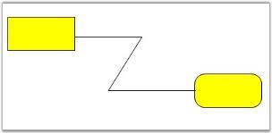
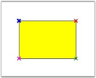
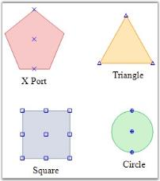
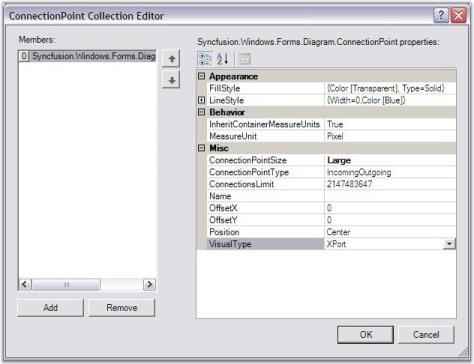
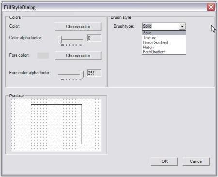
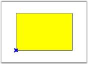
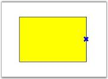
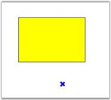

# Ports And Connections in Windows Forms Diagram

## Ports

Port is an object used to establish a connection between the node and the link.

### Central Port

By default, the central port for a diagram is enabled using the EnableCentralPort property available for the node. 

Port Properties

<table>
<tr>
<th>
Property</th><th>
Description</th></tr>
<tr>
<td>
EnableCentralPort</td><td>
Used to enable or disable the CentralPort.</td></tr>
</table>

The central port for a diagram node can be enabled by using the following code snippet.




Rectangle rect = new Rectangle(100, 100, 200, 100);
//To enable the central port for the node...
rectangle.EnableCentralPort = true;
diagram1.Model.AppendChild(rect);
RoundRect roundRect = new RoundRect(200, 200, 200, 100, MeasureUnits.Pixel);
//To enable the central port for the node...
roundRect.EnableCentralPort = true;
diagram1.Model.AppendChild(roundRect);
//Create a connection between the nodes...
OrgLineConnector line = new OrgLineConnector(Point.Empty, new PointF(100, 100));
diagram1.Model.AppendChild(line);
rect.CentralPort.Connect(line.HeadEndPoint);
roundRect.CentralPort.Connect(line.TailEndPoint);




Dim rect As Rectangle = New Rectangle(100, 100, 200, 100)
rectangle.EnableCentralPort = True
diagram1.Model.AppendChild(rect)
Dim roundRect As RoundRect = New RoundRect(200, 200, 200, 100, MeasureUnits.Pixel)
roundRect.EnableCentralPort = True
diagram1.Model.AppendChild(roundRect)
Dim line As OrgLineConnector = New OrgLineConnector(Point.Empty, New PointF(100, 100))
diagram1.Model.AppendChild(line)
rect.CentralPort.Connect(line.HeadEndPoint)
roundRect.CentralPort.Connect(line.TailEndPoint)




In the above code snippets, the Central Port is enabled for an Ellipse node.

Sample diagram is as follows:

### Custom ports

Custom ports can be defined at any position of the diagram node, thus allowing the creation of any number of connection ports at any position on the node. All the connections can be defined from the required point or port. Unlike the default port, the custom port when set, will be visible. The DrawPorts property must be enabled for custom ports to be created.

N> When a link is drawn to a node or another link and when the EnableCentralPort is set to true, the links cannot be connected to the custom port. Hence make sure to disable that property for the links and the nodes to connect the links to the custom ports.

<table>
<tr>
<th>
Property </th><th>
Description</th></tr>
<tr>
<td>
DrawPorts</td><td>
Specifies whether creation of custom ports is enabled. Default value is true.</td></tr>
</table>

The Syncfusion.Windows.Forms.Diagram.ConnectionPoint class is used to create custom ports and define their properties. For details, see ConnectionPoint Properties.

The following code snippet illustrate the Custom Ports,




Syncfusion.Windows.Forms.Diagram.Rectangle rect = new Syncfusion.Windows.Forms.Diagram.Rectangle(100, 100, 100, 50);
rect.DrawPorts = true;
Syncfusion.Windows.Forms.Diagram.ConnectionPoint cp = new Syncfusion.Windows.Forms.Diagram.ConnectionPoint();
rect.Ports.Add(cp);




Dim rect As New Syncfusion.Windows.Forms.Diagram.Rectangle(100, 100, 100, 50)
rect.DrawPorts = True
Dim cp As New Syncfusion.Windows.Forms.Diagram.ConnectionPoint()
rect.Ports.Add(cp)




Sample diagram is as follows.

### Port Shapes

The VisualType property available for the port can be used for customizing the shape of the port. There are several types of ports available for customizing the port's shape, each of which differs depending on how they are positioned within the symbol and how they are rendered. For example, a CirclePort can be positioned anywhere within the bounds of a symbol and renders itself as a circle containing cross hairs. Another example is a CenterPort, which always positions itself in the center of the symbol and has no visual representation.

Port Shapes

<table>
<tr>
<th>
Property </th><th>
Description</th></tr>
<tr>
<td>
VisualType</td><td>
The default value is XPort. The options included are as follows:
<ul><li> CirclePort</li><li> XPort</li><li> TrianglePort</li><li>SquarePort</li><li>RhombPort</li><li> Custom</li></ul></td></tr>
</table>

The visual types for a port can be defined using the following code snippet.




port.VisualType = PortVisualType.RhombPort;




port.VisualType = PortVisualType.RhombPort




Sample diagram is as follows,

## Connection Point Properties

ConnectionPoint class provides points to connect to other nodes using a connector. It is available in different custom appearance and in different sizes.It is also has a feature to generate connector automatically when we hover on port through AllowConnectOnDrag.

The ConnectionPointType and ConnectionsLimit properties are available for the ports to define their nature.

ConnectionPointType

<table>
<tr>
<th>
Property </th><th>
Description</th></tr>
<tr>
<td>
ConnectionPointType</td><td>
Specifies the type of connection to be used. The values included are as follows:IncomingOutgoing (default)OutgoingIncoming</td></tr>
<tr>
<td>
ConnectionsLimit</td><td>
Specifies the number of connections to be allowed. Default value is 10.</td></tr>
<tr>
<td>
AllowConnectOnDrag</td><td>
It is used to generate connector automatically when we hover on port. Default Value is false.</td></tr>
</table>

The following code snippet demonstrates their usage.




Syncfusion.Windows.Forms.Diagram.ConnectionPoint cp = new Syncfusion.Windows.Forms.Diagram.ConnectionPoint();
cp.ConnectionPointType = ConnectionPointType.Incoming;
cp.ConnectionsLimit = 12;
cp.AllowConnectOnDrag = true;




Dim cp As New Syncfusion.Windows.Forms.Diagram.ConnectionPoint()
cp.ConnectionPointType = ConnectionPointType.Incoming
cp.ConnectionsLimit = 12
cp.AllowConnectOnDrag = True




Sample diagram  is as follows:

Some important properties are discussed below:

### FillStyle

FillStyle property is used to create brushes for filling the interior region of the Connection Points.




FillStyle m_styleFill = new FillStyle();
m_styleFill.Color = Color.Transparent;
m_styleFill.Type = FillStyleType.Solid;
m_styleFill.ColorAlphaFactor = 60;




Dim m_styleFill As New FillStyle()
m_styleFill.Color = Color.Transparent
m_styleFill.Type = FillStyleType.Solid
m_styleFill.ColorAlphaFactor = 60




The following image illustrates the above settings.

### LineStyle

This property in turn has customization properties to set the style for the Connection Point Lines, similar to the other line types.




m_styleLine = new LineStyle();
m_styleLine.LineColor = Color.Blue;
m_styleLine.LineWidth = 0;
m_styleLine.DashStyle = DashStyle.Dash;




m_styleLine = New LineStyle()
m_styleLine.LineColor = Color.Blue
m_styleLine.LineWidth = 0
m_styleLine.DashStyle = DashStyle.Dash




The below images illustrates the above settings.

### ConnectionPointSize

This property allows us to set the size of the Ports for current ConnectionPoint. This property accepts a ConnectionPointSize enumerator which has three predefined sizes as follows.

Large(12 * 12), Medium (9 *9) & Small (6 * 6).

Position

The point at which the connection should be established can be easily customized by setting the Position property to one of the options. This automatically associates the link to the desired position. Offset values can be specified through OffsetX and OffsetY properties, which will be inherited when the Position is set to Custom. 

Properties

<table>
<tr>
<th>
Properties</th><th>
Description</th></tr>
<tr>
<td>
OffsetX</td><td>
Specifies the position which takes the x value of the node. It positions the link with respect to the x value of the node.</td></tr>
<tr>
<td>
OffsetY</td><td>
Specifies the Y offset value where the link should be aligned.  It positions the link with respect to the Y value of the node.</td></tr>
<tr>
<td>
Position</td><td>
Specifies the position where the links should be connected to the node. Default value is Center. The options included are as follows:
<ul><li> Center</li><li> TopLeft</li><li> TopCenter</li><li> TopRight</li><li> MiddleLeft</li><li>MiddleRight</li><li>BottomLeft</li><li> BottomCenter</li><li>BottomRight</li><li> Custom</li></ul></td></tr>
</table>

The following code snippet defines the setting of the position values for a node's port.




Syncfusion.Windows.Forms.Diagram.ConnectionPoint cp = new Syncfusion.Windows.Forms.Diagram.ConnectionPoint();
cp.Position = Position.BottomLeft;
cp.OffsetX = 50;
cp.OffsetY = 10;




Dim cp As New Syncfusion.Windows.Forms.Diagram.ConnectionPoint()
cp.Position = Position.BottomLeft
cp.OffsetX = 50
cp.OffsetY = 10




Sample diagram is as follows,

### Reject Connections

This feature allows the ConnectionPoint to discard the incoming or outgoing connections to or from that point by setting the ConnectionPointType as Reject. The prohibition sign will be shown when users attempt to connect a line connector to it.

The following code sample illustrates how to reject the incoming and outgoing connections from the ConnectionPoint:




ConnectionPoint port = new ConnectionPoint();
port.Position = Position.MiddleLeft;

// Sets the ConnectionPointType as Reject, which rejects the incoming and outgoing connections.
port.ConnectionPointType = ConnectionPointType.Reject;
rect1.Ports.Add(port);  




Dim port As New ConnectionPoint()
port.Position = Position.MiddleLeft

'Sets the ConnectionPointType as Reject, which rejects the incoming and outgoing connections.
port.ConnectionPointType = ConnectionPointType.Reject
rect1.Ports.Add(port)




