# Ports and Connections in Windows Forms Diagram

## Ports

A port is an object used to establish a connection between a node and a link.

### Central Port

The central port for a [WinForms Diagram](https://www.syncfusion.com/diagram-sdk/winforms-diagram) node can be enabled or disabled by using the EnableCentralPort property. By default, the central port is enabled. 

<table>
<tr>
<th>
Property</th><th>
Description</th></tr>
<tr>
<td>
EnableCentralPort</td><td>
Used to enable or disable the CentralPort. Default value is true.</td></tr>
</table>

The central port for a diagram node can be enabled by using the following code snippet.




Rectangle rect = new Rectangle(100, 100, 200, 100);
//To enable the central port for the node...
rect.EnableCentralPort = true;
diagram1.Model.AppendChild(rect);
RoundRect roundRect = new RoundRect(200, 200, 200, 100, MeasureUnits.Pixel);
//To enable the central port for the node...
roundRect.EnableCentralPort = true;
diagram1.Model.AppendChild(roundRect);
//Create a connection between the nodes...
OrgLineConnector line = new OrgLineConnector(Point.Empty, new PointF(100, 100));
diagram1.Model.AppendChild(line);
rect.CentralPort.Connect(line.HeadEndPoint);
roundRect.CentralPort.Connect(line.TailEndPoint);




Dim rect As Rectangle = New Rectangle(100, 100, 200, 100)
rect.EnableCentralPort = True
diagram1.Model.AppendChild(rect)
Dim roundRect As RoundRect = New RoundRect(200, 200, 200, 100, MeasureUnits.Pixel)
roundRect.EnableCentralPort = True
diagram1.Model.AppendChild(roundRect)
Dim line As OrgLineConnector = New OrgLineConnector(Point.Empty, New PointF(100, 100))
diagram1.Model.AppendChild(line)
rect.CentralPort.Connect(line.HeadEndPoint)
roundRect.CentralPort.Connect(line.TailEndPoint)




In the above code snippets, the central port is enabled for the Rectangle and RoundRect nodes.

Sample diagram is as follows:

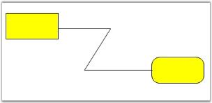

### Custom ports

Custom ports can be defined at any position of the diagram node, thus allowing the creation of any number of connection ports at any position on the node. All the connections can be defined from the required point or port. Unlike the default port, the custom port when set, will be visible. The DrawPorts property must be enabled for custom ports to be created.

N> When a link is drawn to a node or another link and when the EnableCentralPort is set to true, the links cannot be connected to the custom port. Hence, make sure to disable that property for the links and the nodes to connect the links to the custom ports.

<table>
<tr>
<th>
Property </th><th>
Description</th></tr>
<tr>
<td>
DrawPorts</td><td>
Specifies whether creation of custom ports is enabled. Default value is true.</td></tr>
</table>

The Syncfusion.Windows.Forms.Diagram.ConnectionPoint class is used to create custom ports and define their properties. For details, see ConnectionPoint Properties.

The following code snippet illustrates custom ports.




Syncfusion.Windows.Forms.Diagram.Rectangle rect = new Syncfusion.Windows.Forms.Diagram.Rectangle(100, 100, 100, 50);
rect.DrawPorts = true;
Syncfusion.Windows.Forms.Diagram.ConnectionPoint cp = new Syncfusion.Windows.Forms.Diagram.ConnectionPoint();
rect.Ports.Add(cp);




Dim rect As New Syncfusion.Windows.Forms.Diagram.Rectangle(100, 100, 100, 50)
rect.DrawPorts = True
Dim cp As New Syncfusion.Windows.Forms.Diagram.ConnectionPoint()
rect.Ports.Add(cp)




Sample diagram is as follows.

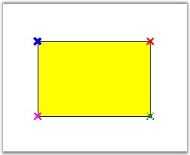

### Port Shapes

The VisualType property available for the port can be used for customizing the shape of the port. There are several types of ports available for customizing the port's shape, each of which differs depending on how they are positioned within the symbol and how they are rendered. For example, a CirclePort can be positioned anywhere within the bounds of a symbol and renders itself as a circle containing cross hairs. Another example is a CenterPort, which always positions itself at the center of the symbol and has no visual representation. Note that the VisualType property does not include CenterPort as an option; the central port behavior is handled separately through the node's EnableCentralPort property.

<table>
<tr>
<th>
Property </th><th>
Description</th></tr>
<tr>
<td>
VisualType</td><td>
The default value is XPort. The options included are as follows:
<ul><li> CirclePort</li><li> XPort</li><li> TrianglePort</li><li>SquarePort</li><li>RhombPort</li><li> Custom</li></ul></td></tr>
</table>

The visual types for a port can be defined using the following code snippet.




Syncfusion.Windows.Forms.Diagram.ConnectionPoint port = new Syncfusion.Windows.Forms.Diagram.ConnectionPoint();
port.VisualType = PortVisualType.RhombPort;




Dim port As New Syncfusion.Windows.Forms.Diagram.ConnectionPoint()
port.VisualType = PortVisualType.RhombPort




Sample diagram is as follows,

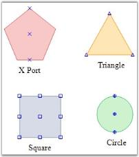

## Connection Point Properties

The ConnectionPoint class provides points to connect to other nodes using a connector. It is available in different custom appearances and in different sizes. It also provides a feature to generate a connector automatically when the user hovers on a port, through AllowConnectOnDrag.

The ConnectionPointType and ConnectionsLimit properties are available for the ports to define their nature.

<table>
<tr>
<th>
Property </th><th>
Description</th></tr>
<tr>
<td>
ConnectionPointType</td><td>
Specifies the type of connection to be used. The values included are as follows:
<ul><li> IncomingOutgoing (default)</li><li>Outgoing</li><li>Incoming</li><li>Reject</li></ul></td></tr>
<tr>
<td>
ConnectionsLimit</td><td>
Specifies the number of connections to be allowed. Default value is 10.</td></tr>
<tr>
<td>
AllowConnectOnDrag</td><td>
Used to generate a connector automatically when the user hovers on a port. Default value is false.</td></tr>
</table>

The following code snippet demonstrates their usage.




Syncfusion.Windows.Forms.Diagram.ConnectionPoint cp = new Syncfusion.Windows.Forms.Diagram.ConnectionPoint();
cp.ConnectionPointType = ConnectionPointType.Incoming;
cp.ConnectionsLimit = 12;
cp.AllowConnectOnDrag = true;




Dim cp As New Syncfusion.Windows.Forms.Diagram.ConnectionPoint()
cp.ConnectionPointType = ConnectionPointType.Incoming
cp.ConnectionsLimit = 12
cp.AllowConnectOnDrag = True




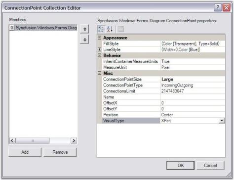

Sample diagram is as follows:

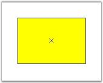

Some important properties are discussed below:

### FillStyle

FillStyle property is used to create brushes for filling the interior region of the connection points.




Syncfusion.Windows.Forms.Diagram.ConnectionPoint cp = new Syncfusion.Windows.Forms.Diagram.ConnectionPoint();
FillStyle m_styleFill = new FillStyle();
m_styleFill.Color = Color.Transparent;
m_styleFill.Type = FillStyleType.Solid;
m_styleFill.ColorAlphaFactor = 60;
cp.FillStyle.Color = m_styleFill.Color;
cp.FillStyle.Type = m_styleFill.Type;
cp.FillStyle.ColorAlphaFactor = m_styleFill.ColorAlphaFactor;




Dim cp As New Syncfusion.Windows.Forms.Diagram.ConnectionPoint()
Dim m_styleFill As New FillStyle()
m_styleFill.Color = Color.Transparent
m_styleFill.Type = FillStyleType.Solid
m_styleFill.ColorAlphaFactor = 60
cp.FillStyle.Color = m_styleFill.Color
cp.FillStyle.Type = m_styleFill.Type
cp.FillStyle.ColorAlphaFactor = m_styleFill.ColorAlphaFactor




The following image illustrates the above settings.

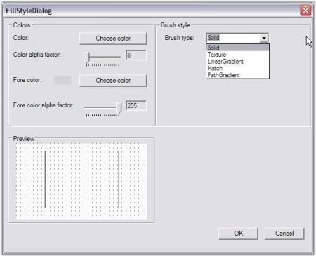

### LineStyle

This property in turn has customization properties to set the style for the connection point lines, similar to the other line types.




Syncfusion.Windows.Forms.Diagram.ConnectionPoint cp = new Syncfusion.Windows.Forms.Diagram.ConnectionPoint();
LineStyle m_styleLine = new LineStyle();
m_styleLine.LineColor = Color.Blue;
m_styleLine.LineWidth = 1;
m_styleLine.DashStyle = DashStyle.Dash;
cp.LineStyle.LineColor = m_styleLine.LineColor;
cp.LineStyle.LineWidth = m_styleLine.LineWidth;
cp.LineStyle.DashStyle = m_styleLine.DashStyle;




Dim cp As New Syncfusion.Windows.Forms.Diagram.ConnectionPoint()
Dim m_styleLine As New LineStyle()
m_styleLine.LineColor = Color.Blue
m_styleLine.LineWidth = 1
m_styleLine.DashStyle = DashStyle.Dash
cp.LineStyle.LineColor = m_styleLine.LineColor
cp.LineStyle.LineWidth = m_styleLine.LineWidth
cp.LineStyle.DashStyle = m_styleLine.DashStyle




The image below illustrates the above settings.

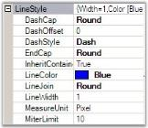

### ConnectionPointSize

This property sets the size of the ports for the current ConnectionPoint. It accepts the ConnectionPointSize enumeration, which has the following predefined sizes:

<table>
<tr>
<th>
Size</th><th>
Value</th></tr>
<tr>
<td>
Large</td><td>
12 * 12</td></tr>
<tr>
<td>
Medium</td><td>
9 * 9</td></tr>
<tr>
<td>
Small</td><td>
6 * 6</td></tr>
</table>

The following code snippet illustrates how to set the connection point size.




Syncfusion.Windows.Forms.Diagram.ConnectionPoint cp = new Syncfusion.Windows.Forms.Diagram.ConnectionPoint();
cp.ConnectionPointSize = ConnectionPointSize.Large;




Dim cp As New Syncfusion.Windows.Forms.Diagram.ConnectionPoint()
cp.ConnectionPointSize = ConnectionPointSize.Large




### Position

The point at which the connection should be established can be easily customized by setting the Position property to one of the options. This automatically associates the link to the desired position. Offset values can be specified through OffsetX and OffsetY properties, which will be applied when the Position is set to Custom. 

<table>
<tr>
<th>
Property</th><th>
Description</th></tr>
<tr>
<td>
OffsetX</td><td>
Specifies the X offset value of the port. It positions the port with respect to the x-axis of the node.</td></tr>
<tr>
<td>
OffsetY</td><td>
Specifies the Y offset value of the port. It positions the port with respect to the y-axis of the node.</td></tr>
<tr>
<td>
Position</td><td>
Specifies the position where the links should be connected to the node. Default value is Center. The options included are as follows:
<ul><li> Center</li><li> TopLeft</li><li> TopCenter</li><li> TopRight</li><li> MiddleLeft</li><li>MiddleRight</li><li>BottomLeft</li><li> BottomCenter</li><li>BottomRight</li><li> Custom</li></ul></td></tr>
</table>

The following code snippet defines the setting of the position values for a node's port.




Syncfusion.Windows.Forms.Diagram.ConnectionPoint cp = new Syncfusion.Windows.Forms.Diagram.ConnectionPoint();
cp.Position = Position.BottomLeft;
cp.OffsetX = 50;
cp.OffsetY = 10;




Dim cp As New Syncfusion.Windows.Forms.Diagram.ConnectionPoint()
cp.Position = Position.BottomLeft
cp.OffsetX = 50
cp.OffsetY = 10




Sample diagram is as follows,

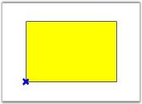

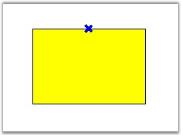

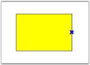

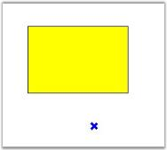

### Reject Connections

This feature allows the ConnectionPoint to discard the incoming or outgoing connections to or from that point by setting the ConnectionPointType as Reject. The prohibition sign will be shown when users attempt to connect a line connector to it.

The following code sample illustrates how to reject the incoming and outgoing connections from the ConnectionPoint:




Syncfusion.Windows.Forms.Diagram.Rectangle rect1 = new Syncfusion.Windows.Forms.Diagram.Rectangle(100, 100, 100, 50);
diagram1.Model.AppendChild(rect1);

ConnectionPoint port = new ConnectionPoint();
port.Position = Position.MiddleLeft;

// Sets the ConnectionPointType as Reject, which rejects the incoming and outgoing connections.
port.ConnectionPointType = ConnectionPointType.Reject;
rect1.Ports.Add(port);  




Dim rect1 As New Syncfusion.Windows.Forms.Diagram.Rectangle(100, 100, 100, 50)
diagram1.Model.AppendChild(rect1)

Dim port As New ConnectionPoint()
port.Position = Position.MiddleLeft

'Sets the ConnectionPointType as Reject, which rejects the incoming and outgoing connections.
port.ConnectionPointType = ConnectionPointType.Reject
rect1.Ports.Add(port)




