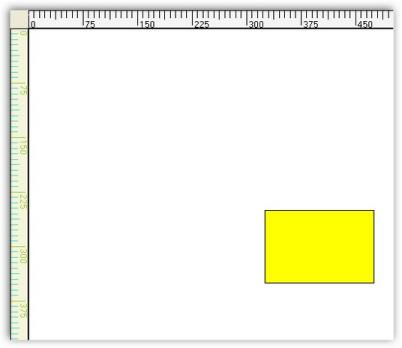

# Rulers in Windows Forms Diagram

Rulers can be enabled by setting the ShowRulers property for the diagram control. The rulers will automatically inherit the MeasurementUnit set for the diagram model and get converted accordingly.

The height of the ruler can be set through RulersHeight property.

RulersHeight

<table>
<tr>
<th>
Property</th><th>
Description</th></tr>
<tr>
<td>
ShowRulers</td><td>
Specifies whether to display ruler for the diagram control.</td></tr>
<tr>
<td>
RulersHeight</td><td>
Specifies the height of the ruler.</td></tr>
</table>

Programmatically the ruler properties can be set as follows.




this.diagram1.ShowRulers = true;
this.diagram1.RulersHeight = 25;



	
Me.diagram1.ShowRulers = True
Me.diagram1.RulersHeight = 25




Sample diagram is as follows,

## Diagram With Rulers

Horizontal and vertical rulers can be displayed by setting the ShowRulers property. Both the horizontal and vertical rulers can be customized using various properties, which can be separately applied for each of the rulers.

Diagram With Rulers

<table>
<tr>
<th>
Ruler Property </th><th>
Description</th></tr>
<tr>
<td>
BackgroundColor</td><td>
Specifies the back color for the ruler.</td></tr>
<tr>
<td>
HighlightColor</td><td>
Specifies the highlight color.</td></tr>
<tr>
<td>
MajorLinesColor</td><td>
Specifies the color for the main line in the ruler.</td></tr>
<tr>
<td>
MarkerColor</td><td>
Specifies the marker color in the ruler.</td></tr>
<tr>
<td>
MinorLinesColor</td><td>
Specifies the color for the sub-division lines.</td></tr>
<tr>
<td>
TextStyle</td><td>
Specifies the text style.</td></tr>
</table>
Programmatically the properties can be set as follows for vertical lines.




this.diagram1.VerticalRuler.BackgroundColor = System.Drawing.Color.Beige;
this.diagram1.VerticalRuler.HighlightColor = System.Drawing.Color.Yellow;
this.diagram1.VerticalRuler.MajorLinesColor = System.Drawing.Color.YellowGreen;
this.diagram1.VerticalRuler.MarkerColor = System.Drawing.Color.Thistle;
this.diagram1.VerticalRuler.MinorLinesColor = System.Drawing.Color.Turquoise;
this.diagram1.VerticalRuler.TextStyle.Bold = true;
this.diagram1.VerticalRuler.TextStyle.Italic = true;
this.diagram1.VerticalRuler.TextStyle.PointSize = 20;
this.diagram1.VerticalRuler.TextStyle.Strikeout = true;
this.diagram1.VerticalRuler.TextStyle.Style = System.Drawing.FontStyle.Bold;
this.diagram1.VerticalRuler.TextStyle.Underline = true;
this.diagram1.VerticalRuler.TextStyle.Unit = MeasureUnits.Point;



	
Me.diagram1.VerticalRuler.BackgroundColor = System.Drawing.Color.Beige
Me.diagram1.VerticalRuler.HighlightColor = System.Drawing.Color.Yellow
Me.diagram1.VerticalRuler.MajorLinesColor = System.Drawing.Color.YellowGreen
Me.diagram1.VerticalRuler.MarkerColor = System.Drawing.Color.Thistle
Me.diagram1.VerticalRuler.MinorLinesColor = System.Drawing.Color.Turquoise
Me.diagram1.VerticalRuler.TextStyle.Bold = True
Me.diagram1.VerticalRuler.TextStyle.Italic = True
Me.diagram1.VerticalRuler.TextStyle.PointSize = 20
Me.diagram1.VerticalRuler.TextStyle.Strikeout = True
Me.diagram1.VerticalRuler.TextStyle.Style = System.Drawing.FontStyle.Bold
Me.diagram1.VerticalRuler.TextStyle.Underline = True
Me.diagram1.VerticalRuler.TextStyle.Unit = MeasureUnits.Point




Sample diagram is as follows,

These properties can be set separately for the horizontal ruler by using HorizontalRuler instead of VerticalRuler as follows.




this.diagram1.HorizontalRuler.BackgroundColor = System.Drawing.Color.Beige;
this.diagram1.HorizontalRuler.HighlightColor = System.Drawing.Color.Yellow;
this.diagram1.HorizontalRuler.MajorLinesColor = System.Drawing.Color.YellowGreen;
this.diagram1.HorizontalRuler.MarkerColor = System.Drawing.Color.Thistle;
this.diagram1.HorizontalRuler.MinorLinesColor = System.Drawing.Color.Turquoise;
this.diagram1.HorizontalRuler.TextStyle.Bold = true;
this.diagram1.HorizontalRuler.TextStyle.Italic = true;
this.diagram1.HorizontalRuler.TextStyle.PointSize = 20;
this.diagram1.HorizontalRuler.TextStyle.Strikeout = true;
this.diagram1.HorizontalRuler.TextStyle.Style = System.Drawing.FontStyle.Bold;
this.diagram1.HorizontalRuler.TextStyle.Underline = true;
this.diagram1.HorizontalRuler.TextStyle.Unit = MeasureUnits.Point;




Me.diagram1.HorizontalRuler.BackgroundColor = System.Drawing.Color.Beige
Me.diagram1.HorizontalRuler.HighlightColor = System.Drawing.Color.Yellow
Me.diagram1.HorizontalRuler.MajorLinesColor = System.Drawing.Color.YellowGreen
Me.diagram1.HorizontalRuler.MarkerColor = System.Drawing.Color.Thistle
Me.diagram1.HorizontalRuler.MinorLinesColor = System.Drawing.Color.Turquoise
Me.diagram1.HorizontalRuler.TextStyle.Bold = True
Me.diagram1.HorizontalRuler.TextStyle.Italic = True
Me.diagram1.HorizontalRuler.TextStyle.PointSize = 20
Me.diagram1.HorizontalRuler.TextStyle.Strikeout = True
Me.diagram1.HorizontalRuler.TextStyle.Style = System.Drawing.FontStyle.Bold
Me.diagram1.HorizontalRuler.TextStyle.Underline = True
Me.diagram1.HorizontalRuler.TextStyle.Unit = MeasureUnits.Point




Sample diagram is as follows,

