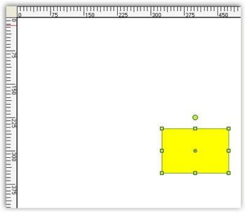
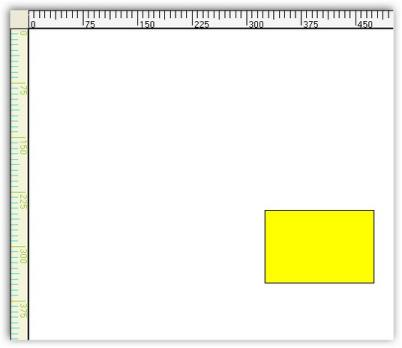

# Rulers in Windows Forms Diagram

To enable rulers, set the **ShowRulers** property to true on the [WinForms Diagram](https://www.syncfusion.com/diagram-sdk/winforms-diagram) control. The rulers automatically inherit the **MeasurementUnit** configured on the diagram model and display their ticks in that unit.

The height of the rulers can be set through the **RulersHeight** property.

<table>
<tr>
<th>
Property</th><th>
Description</th></tr>
<tr>
<td>
ShowRulers</td><td>
Gets or sets a value indicating whether to display rulers for the diagram control. Default value is false.</td></tr>
<tr>
<td>
RulersHeight</td><td>
Gets or sets the height of the rulers, in pixels. Default value is 16.</td></tr>
</table>

The following code example shows how to enable the rulers and set their height. Before running this sample, add a Diagram control named `diagram1` to a Windows Form.




this.diagram1.ShowRulers = true;
this.diagram1.RulersHeight = 25;




Me.diagram1.ShowRulers = True
Me.diagram1.RulersHeight = 25




Sample diagram is as follows,

## Customizing the Rulers

The horizontal and vertical rulers can be customized independently by using the **HorizontalRuler** and **VerticalRuler** properties. Each ruler exposes colors and a text style for the labels.

The following table describes the properties exposed by each ruler. These properties are available on both `HorizontalRuler` and `VerticalRuler`, backed by the **Ruler** and **RulerStyleInfo** types.

<table>
<tr>
<th>
Ruler Property</th><th>
Description</th></tr>
<tr>
<td>
BackgroundColor</td><td>
Gets or sets the background color of the ruler.</td></tr>
<tr>
<td>
HighlightColor</td><td>
Gets or sets the color used to highlight the current position on the ruler.</td></tr>
<tr>
<td>
MajorLinesColor</td><td>
Gets or sets the color of the major tick lines on the ruler.</td></tr>
<tr>
<td>
MarkerColor</td><td>
Gets or sets the color of the marker used on the ruler.</td></tr>
<tr>
<td>
MinorLinesColor</td><td>
Gets or sets the color of the minor (sub-division) tick lines on the ruler.</td></tr>
<tr>
<td>
TextStyle</td><td>
Gets the text style used for the ruler labels. Use this to set the unit, font, size, and emphasis (bold, italic, underline, strikeout).</td></tr>
</table>

The following code example illustrates how to customize the vertical ruler. The same API applies to the horizontal ruler by using **HorizontalRuler** instead of **VerticalRuler**.




this.diagram1.VerticalRuler.BackgroundColor = System.Drawing.Color.Beige;
this.diagram1.VerticalRuler.HighlightColor = System.Drawing.Color.Yellow;
this.diagram1.VerticalRuler.MajorLinesColor = System.Drawing.Color.YellowGreen;
this.diagram1.VerticalRuler.MarkerColor = System.Drawing.Color.Thistle;
this.diagram1.VerticalRuler.MinorLinesColor = System.Drawing.Color.Turquoise;
this.diagram1.VerticalRuler.TextStyle.Unit = this.diagram1.Model.MeasurementUnits;
this.diagram1.VerticalRuler.TextStyle.Bold = true;
this.diagram1.VerticalRuler.TextStyle.Italic = true;
this.diagram1.VerticalRuler.TextStyle.PointSize = 20;
this.diagram1.VerticalRuler.TextStyle.Strikeout = true;
this.diagram1.VerticalRuler.TextStyle.Style = System.Drawing.FontStyle.Bold;
this.diagram1.VerticalRuler.TextStyle.Underline = true;




Me.diagram1.VerticalRuler.BackgroundColor = System.Drawing.Color.Beige
Me.diagram1.VerticalRuler.HighlightColor = System.Drawing.Color.Yellow
Me.diagram1.VerticalRuler.MajorLinesColor = System.Drawing.Color.YellowGreen
Me.diagram1.VerticalRuler.MarkerColor = System.Drawing.Color.Thistle
Me.diagram1.VerticalRuler.MinorLinesColor = System.Drawing.Color.Turquoise
Me.diagram1.VerticalRuler.TextStyle.Unit = Me.diagram1.Model.MeasurementUnits
Me.diagram1.VerticalRuler.TextStyle.Bold = True
Me.diagram1.VerticalRuler.TextStyle.Italic = True
Me.diagram1.VerticalRuler.TextStyle.PointSize = 20
Me.diagram1.VerticalRuler.TextStyle.Strikeout = True
Me.diagram1.VerticalRuler.TextStyle.Style = System.Drawing.FontStyle.Bold
Me.diagram1.VerticalRuler.TextStyle.Underline = True




Sample diagram is as follows,

### Customizing the Horizontal Ruler

The same set of properties can be applied to the horizontal ruler by accessing **HorizontalRuler**. Note that `TextStyle.Unit` is set automatically based on the diagram model's `MeasurementUnits`, so it typically does not need to be set explicitly.




this.diagram1.HorizontalRuler.BackgroundColor = System.Drawing.Color.Beige;
this.diagram1.HorizontalRuler.HighlightColor = System.Drawing.Color.Yellow;
this.diagram1.HorizontalRuler.MajorLinesColor = System.Drawing.Color.YellowGreen;
this.diagram1.HorizontalRuler.MarkerColor = System.Drawing.Color.Thistle;
this.diagram1.HorizontalRuler.MinorLinesColor = System.Drawing.Color.Turquoise;
this.diagram1.HorizontalRuler.TextStyle.Unit = this.diagram1.Model.MeasurementUnits;
this.diagram1.HorizontalRuler.TextStyle.Bold = true;
this.diagram1.HorizontalRuler.TextStyle.Italic = true;
this.diagram1.HorizontalRuler.TextStyle.PointSize = 20;
this.diagram1.HorizontalRuler.TextStyle.Strikeout = true;
this.diagram1.HorizontalRuler.TextStyle.Style = System.Drawing.FontStyle.Bold;
this.diagram1.HorizontalRuler.TextStyle.Underline = true;




Me.diagram1.HorizontalRuler.BackgroundColor = System.Drawing.Color.Beige
Me.diagram1.HorizontalRuler.HighlightColor = System.Drawing.Color.Yellow
Me.diagram1.HorizontalRuler.MajorLinesColor = System.Drawing.Color.YellowGreen
Me.diagram1.HorizontalRuler.MarkerColor = System.Drawing.Color.Thistle
Me.diagram1.HorizontalRuler.MinorLinesColor = System.Drawing.Color.Turquoise
Me.diagram1.HorizontalRuler.TextStyle.Unit = Me.diagram1.Model.MeasurementUnits
Me.diagram1.HorizontalRuler.TextStyle.Bold = True
Me.diagram1.HorizontalRuler.TextStyle.Italic = True
Me.diagram1.HorizontalRuler.TextStyle.PointSize = 20
Me.diagram1.HorizontalRuler.TextStyle.Strikeout = True
Me.diagram1.HorizontalRuler.TextStyle.Style = System.Drawing.FontStyle.Bold
Me.diagram1.HorizontalRuler.TextStyle.Underline = True




Sample diagram is as follows,

