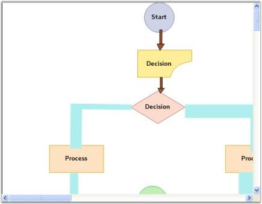
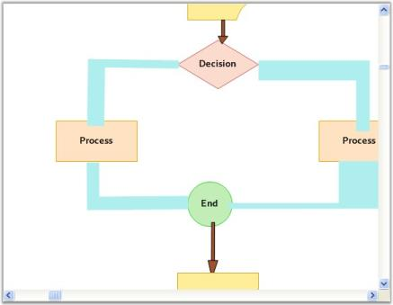
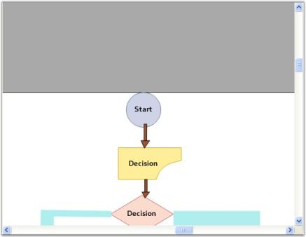
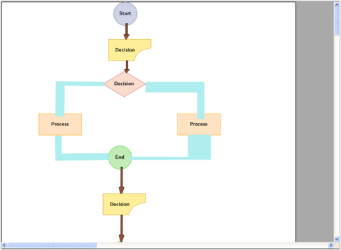

# Scrolling in Windows Forms Diagram

This section describes the scrolling features supported by the [WinForms Diagram](https://www.syncfusion.com/diagram-sdk/winforms-diagram) control. Before running the samples below, add a Diagram control named `diagram1` to a Windows Form.

## Scroll Support

The horizontal and vertical scrollbars can be shown or hidden by setting the **HScroll** and **VScroll** properties, which are inherited from `System.Windows.Forms.ScrollableControl`.

<table>
<tr>
<th>
Property</th><th>
Description</th></tr>
<tr>
<td>
HScroll</td><td>
Gets or sets whether the horizontal scrollbar is visible. Default value is true.</td></tr>
<tr>
<td>
VScroll</td><td>
Gets or sets whether the vertical scrollbar is visible. Default value is true.</td></tr>
</table>

The following code example shows how to ensure both scrollbars are visible.




this.diagram1.HScroll = true;
this.diagram1.VScroll = true;




Me.diagram1.HScroll = True
Me.diagram1.VScroll = True




Sample diagram is as follows,

## Scroll Settings

The following additional properties control scrolling granularity, mouse wheel behavior, IntelliMouse panning, and the underlying horizontal scrollbar settings. The **ScrollGranularity** property determines the level of granularity for scrolling. The value of this property must be greater than 0. This value is multiplied by the virtual size of the view to determine the scroll range. For example, if the virtual size of the view is 100x50 and this property is set to 0.5f, then the horizontal scroll range is set to 50 and the vertical scroll range is set to 25.

**SmoothMouseWheelScrolling** specifies whether the control should perform one scroll command (faster) or multiple scroll commands with smaller increments (smoother) when the user rolls the mouse wheel.

<table>
<tr>
<th>
Property</th><th>
Description</th></tr>
<tr>
<td>
EnableIntelliMouse</td><td>
Gets or sets whether IntelliMouse panning is enabled. When the user holds the middle-mouse button and drags, the view scrolls. Default value is false.</td></tr>
<tr>
<td>
ScrollGranularity</td><td>
Gets or sets the multiplier used to scale the scroll range of the scrollbars. The value must be greater than 0. Default value is 1.</td></tr>
<tr>
<td>
SmoothMouseWheelScrolling</td><td>
Gets or sets whether the control performs one scroll command (faster) or multiple smaller scroll commands (smoother) when the user rolls the mouse wheel. Default value is false.</td></tr>
<tr>
<td>
HScrollBar</td><td>
Returns an object that exposes horizontal scrollbar settings of the control, such as SmallChange and LargeChange.</td></tr>
</table>

The following code example illustrates how to set these properties.




this.diagram1.EnableIntelliMouse = true;
this.diagram1.ScrollGranularity = 0.9f;
this.diagram1.SmoothMouseWheelScrolling = false;
this.diagram1.HScrollBar.SmallChange = 200;




Me.diagram1.EnableIntelliMouse = True
Me.diagram1.ScrollGranularity = 0.9F
Me.diagram1.SmoothMouseWheelScrolling = False
Me.diagram1.HScrollBar.SmallChange = 200




## Scrollable Area

The **ScrollVirtualBounds** property determines the bounds of the scrollable area. This sets the Diagram control's virtual space (the gray area around the control). You can collapse this area so only the diagram's working area is visible.

<table>
<tr>
<th>
Property</th><th>
Description</th></tr>
<tr>
<td>
ScrollVirtualBounds</td><td>
Gets or sets the bounds of the scrollable virtual area as a `RectangleF`. Set this to `RectangleF.Empty` or a zero-sized rectangle to hide the virtual space.</td></tr>
</table>

The following code example shows how to remove the virtual scrolling area.




this.diagram1.ScrollVirtualBounds = new RectangleF(0, 0, 0, 0);




Me.diagram1.ScrollVirtualBounds = New RectangleF(0, 0, 0, 0)




## Scroll Behavior

Scrolling behavior can be controlled by setting the **AccelerateScrolling** property.

<table>
<tr>
<th>
Property</th><th>
Description</th></tr>
<tr>
<td>
AccelerateScrolling</td><td>
Gets or sets the scrolling acceleration behavior. The available values are:
<ul><li>None</li><li>Default</li><li>Fast</li><li>Immediate</li></ul></td></tr>
<tr>
<td>
AllowIncreaseSmallChange</td><td>
Gets or sets whether the scroll control can increase the ScrollBar.SmallChange property during accelerated scrolling. Default value is true.</td></tr>
</table>

Setting **AccelerateScrolling** to **Fast** increases the scroll speed when the horizontal or vertical thumb is pressed continuously.




this.diagram1.AccelerateScrolling = Syncfusion.Windows.Forms.AccelerateScrollingBehavior.Fast;
this.diagram1.AllowIncreaseSmallChange = true;




Me.diagram1.AccelerateScrolling = Syncfusion.Windows.Forms.AccelerateScrollingBehavior.Fast
Me.diagram1.AllowIncreaseSmallChange = True




## ThumbTrack

The **HorizontalThumbTrack** and **VerticalThumbTrack** properties control whether the control scrolls while the user drags the scrollbar thumb.

<table>
<tr>
<th>
Property</th><th>
Description</th></tr>
<tr>
<td>
HorizontalThumbTrack</td><td>
Gets or sets whether the control scrolls while the user drags the horizontal scrollbar thumb. Default value is true.</td></tr>
<tr>
<td>
VerticalThumbTrack</td><td>
Gets or sets whether the control scrolls while the user drags the vertical scrollbar thumb. Default value is true.</td></tr>
</table>

The following code example illustrates how to enable live thumb tracking.




this.diagram1.HorizontalThumbTrack = true;
this.diagram1.VerticalThumbTrack = true;




Me.diagram1.HorizontalThumbTrack = True
Me.diagram1.VerticalThumbTrack = True




## ScrollTips

ScrollTips can be enabled or disabled for the horizontal and vertical scrollbars individually by setting the **HorizontalScrollTips** and **VerticalScrollTips** properties. The format of the ScrollTip can be customized using the **ScrollTipFormat** property. The default format is `"Position{0}"`, where `{0}` is replaced with the current offset value.

<table>
<tr>
<th>
Property</th><th>
Description</th></tr>
<tr>
<td>
HorizontalScrollTips</td><td>
Gets or sets whether a tooltip that shows the current horizontal offset is displayed while the user scrolls. Default value is false.</td></tr>
<tr>
<td>
VerticalScrollTips</td><td>
Gets or sets whether a tooltip that shows the current vertical offset is displayed while the user scrolls. Default value is false.</td></tr>
<tr>
<td>
ScrollTipFormat</td><td>
Gets or sets the format string used for the ScrollTip. Use `{0}` as the placeholder for the current offset value. Default value is "Position{0}".</td></tr>
</table>

The following code example illustrates how to enable scroll tips and customize the format.




this.diagram1.HorizontalScrollTips = true;
this.diagram1.VerticalScrollTips = true;
this.diagram1.ScrollTipFormat = "Offset{0}";




Me.diagram1.HorizontalScrollTips = True
Me.diagram1.VerticalScrollTips = True
Me.diagram1.ScrollTipFormat = "Offset{0}"




## Using Splitter Control

When the **Windows Forms Splitter** control is used and one or more diagram controls are added to its panels, setting the **FillSplitterPane** property docks the diagram control inside the splitter and makes it fill the entire available space.

<table>
<tr>
<th>
Property</th><th>
Description</th></tr>
<tr>
<td>
FillSplitterPane</td><td>
Gets or sets whether the Diagram control fills its parent splitter pane. Default value is false.</td></tr>
</table>

The following code example shows how to enable fill behavior when the diagram is hosted in a splitter.




this.diagram1.FillSplitterPane = true;




Me.diagram1.FillSplitterPane = True




