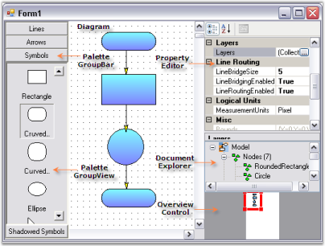
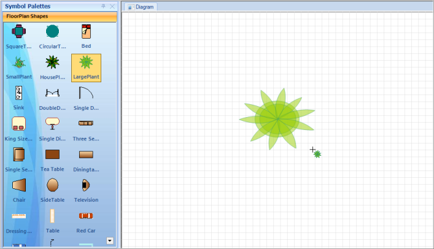
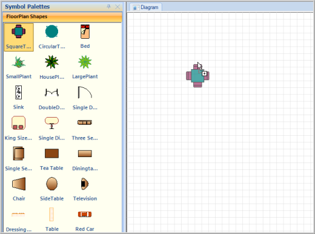
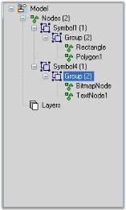
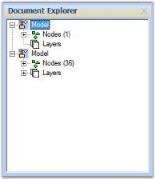
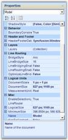

# Supported Controls  in Windows Forms Diagram

The controls supported by Essential® Diagram are as follows.

The controls associated with the Diagram control are illustrated in the following image.

## Overview Control 

Overview Control provides a perspective view of a diagram model, and allows users to dynamically pan and zoom the diagrams. The control features a view port window that can be moved and / or resized using the mouse to modify the diagrams' origin and magnification properties at run-time.

The important property of the Overview Control is the Diagram property. The following are the list of properties of the Overview control.

<table>
<tr>
<th>
Property</th><th>
Description</th></tr>
<tr>
<td>
BackColor</td><td>
Background color of the component.</td></tr>
<tr>
<td>
AllowDrop</td><td>
Gets or sets a value indicating whether the control can accept the data that the user can drops on it.</td></tr>
<tr>
<td>
BackgroundImage</td><td>
Background image of the component.</td></tr>
<tr>
<td>
BorderStyle</td><td>
Sets the border style for the component. It can be FixedSingle, Fixed3D or None.</td></tr>
<tr>
<td>
Controls</td><td>
Indicates the collection of control within the component.</td></tr>
<tr>
<td>
Enabled</td><td>
Indicates if the control is enabled.</td></tr>
<tr>
<td>
Dock</td><td>
Indicates which control borders are docked to its parent control and determine how the control is resized with its parent.</td></tr>
<tr>
<td>
Diagram</td><td>
Sets the corresponding diagram to the Overview Control.</td></tr>
<tr>
<td>
Visible</td><td>
Sets the visibility of the control.</td></tr>
</table>

The important events of Overview Control are listed below with their corresponding descriptions.

<table>
<tr>
<th>
Event</th><th>
Description</th></tr>
<tr>
<td>
Click</td><td>
Occurs when the component is clicked.</td></tr>
<tr>
<td>
DoubleClick</td><td>
Occurs when the component is double-clicked.</td></tr>
<tr>
<td>
ViewPortBoundsChanged </td><td>
Occurs when the controls viewport bounds is changed.</td></tr>
<tr>
<td>
ViewPortBoundsChanging Event</td><td>
Occurs when the controls viewport bounds is changing.</td></tr>
</table>

Programmatically, the properties can be set as follows.



overviewControl1.BackColor = System.Drawing.SystemColors.AppWorkspace;

overviewControl1.Diagram = diagram1;

overviewControl1.Dock = System.Windows.Forms.DockStyle.Bottom;

overviewControl1.ForeColor = System.Drawing.Color.Red;

overviewControl1.Location = new System.Drawing.Point(0, 377);

overviewControl1.Name = "overviewControl";

overviewControl1.Size = new System.Drawing.Size(200, 100);

overviewControl1.TabIndex = 1;




overviewControl1.BackColor = System.Drawing.SystemColors.AppWorkspace

overviewControl1.Diagram = diagram1

overviewControl1.Dock = System.Windows.Forms.DockStyle.Bottom

overviewControl1.ForeColor = System.Drawing.Color.Red

overviewControl1.Location = New System.Drawing.Point(0, 377)

overviewControl1.Name = "overviewControl"

overviewControl1.Size = New System.Drawing.Size(200, 100)

overviewControl1.TabIndex = 1



## Palette Groupbar And GroupView

The Palette Groupbar control provides a way for users to drag-and-drop the symbols onto a diagram. It is based on the Syncfusion® Essential® Tools GroupBar control. Each symbol palette loaded in the PaletteGroupBar occupies a panel that can be selected by a bar button. The bar button is labeled with the name of the symbol palette. The symbols in the palette are shown as icons that can be dragged and dropped onto the diagram. This control allows users to add symbols to a palette, and save or load the palette whenever necessary. It provides a way to classify and maintain the symbols.

The PaletteGroupView control provides an easy way to serialize a symbol palette to and from the resource file of a form. At the design-time, users can attach a symbol palette to a PaletteGroupView control in a form. Selecting the PaletteGroupView, and clicking the Palette property in the Visual Studio .NET properties window, opens a standard Open File dialog, which allows the user to select a symbol palette file that has been created using the Symbol Designer.

The properties of the PaletteGroupBar and GroupView with their descriptions are given in the below table.

_PaletteGroupBar and GroupView_

<table>
<tr>
<th>
Property</th><th>
Description</th></tr>
<tr>
<td>
BackColor</td><td>
Sets the background color of the component.</td></tr>
<tr>
<td>
BorderStyle</td><td>
Sets the border style to FixedSingle, Fixed3D or None.</td></tr>
<tr>
<td>
Collapsed</td><td>
Indicates whether the GroupBar is collapsed.</td></tr>
<tr>
<td>
CollapsedText</td><td>
Sets the text for the collapsed client area of the GroupBar.</td></tr>
<tr>
<td>
CollapsedWidth</td><td>
Specifies the width of the collapsed GroupBar.</td></tr>
<tr>
<td>
CollapseImage</td><td>
Image of the collapsed button in the expanded state.</td></tr>
<tr>
<td>
DrawClientBorder</td><td>
Indicates whether border is drawn around the GroupBar's client window.</td></tr>
<tr>
<td>
ExpandImage</td><td>
Sets image of the collapse button.</td></tr>
<tr>
<td>
FlatLook</td><td>
Indicates whether control is displayed with a flat look.</td></tr>
<tr>
<td>
Font</td><td>
Sets font style for text in the control.</td></tr>
<tr>
<td>
ForeColor</td><td>
Sets fore color of the display text in the component.</td></tr>
<tr>
<td>
GroupBarItemCursor</td><td>
Cursor that is to be displayed when the mouse pointer is over the GroupBarItems.</td></tr>
<tr>
<td>
Office2007Theme</td><td>
Sets the (blue, black or silver) office theme used for drawing the control.</td></tr>
<tr>
<td>
PopupClientSize</td><td>
Sets the initial size of the pop-up for GroupBar client.</td></tr>
<tr>
<td>
PopupResizeMode</td><td>
Gets / sets the pop-up resize mode.</td></tr>
<tr>
<td>
ShowPopupGripper</td><td>
Boolean value indicating whether to show GroupBarItem's popup gripper.</td></tr>
<tr>
<td>
Text</td><td>
Text associated with the control.</td></tr>
<tr>
<td>
TextAlign</td><td>
Alignment of the text set through Text property.</td></tr>
<tr>
<td>
ThemesEnabled</td><td>
Specifies whether control should be themed.</td></tr>
<tr>
<td>
VisualStyle</td><td>
Visual style for drawing the control. Styles are Default, OfficeXP, Office2003, VS2005 and Office2007.</td></tr>
<tr>
<td>
AllowCollapse</td><td>
Indicates whether GroupBar can be collapsed.</td></tr>
<tr>
<td>
AnimatedSelection</td><td>
Indicates whether animated selection is enabled.</td></tr>
<tr>
<td>
BarHighlight</td><td>
Indicates whether GroupBar item is highlighted on mouse hovering over a GroupBar Item.</td></tr>
<tr>
<td>
EditMode</td><td>
This property determines whether the symbols from the palette can be dragged and dropped onto the Diagram.</td></tr>
<tr>
<td>
Enabled</td><td>
Indicates whether component is enabled.</td></tr>
<tr>
<td>
ExpandButtonToolTip</td><td>
Sets tooltip for Collapse button, when the control is collapsed.</td></tr>
<tr>
<td>
GroupBarItemHeight</td><td>
Height of the GroupBarItems.</td></tr>
<tr>
<td>
MinimizeButtonToolTip</td><td>
ToolTip for collapse button when control is expanded.</td></tr>
<tr>
<td>
NavigationPaneToolTip</td><td>
ToolTip for navigation pane.</td></tr>
<tr>
<td>
PopupAutoClose</td><td>
Indicates whether pop-up is closed after clicking an item.</td></tr>
<tr>
<td>
SelectedItem</td><td>
Index of the selected GroupBarItem.</td></tr>
<tr>
<td>
StackedMode</td><td>
Indicates whether GroupBarItem is stacked.</td></tr>
<tr>
<td>
Visible </td><td>
Sets the visibility of the GroupBar control.</td></tr>
<tr>
<td>
GroupBarItems</td><td>
GroupBarItem collection in the control.</td></tr>
<tr>
<td>
ShowChevron</td><td>
Indicates if chevron button of the navigation panel should be displayed when required.</td></tr>
<tr>
<td>
ShowItemImageInHeader</td><td>
Gets / sets a value indicating whether the selected item's image is shown in the header in Stacked GroupBar.</td></tr>
<tr>
<td>
Palette</td><td>
Indicates the loaded palette is in palette view.</td></tr>
</table>

_PaletteGroupBar and GroupView_

<table>
<tr>
<th>
Method</th><th>
Description</th></tr>
<tr>
<td>
LoadPalette</td><td>
Loads given Symbol Palette to the PaletteGroupView.</td></tr>
</table>

The important events of the PaletteGroupBar and GroupView with their descriptions are given in the below table.

<table>
<tr>
<th>
Event</th><th>
Description</th></tr>
<tr>
<td>
Click</td><td>
Occurs when component is clicked.</td></tr>
<tr>
<td>
DoubleClick</td><td>
Occurs when the component is double-clicked.</td></tr>
<tr>
<td>
GroupViewItemHighlighted </td><td>
Event fired when an item in the GroupView control is highlighted.</td></tr>
<tr>
<td>
GroupViewItemSelected</td><td>
Event fired when an item in the GroupView control is selected.</td></tr>
<tr>
<td>
GroupViewItemReordered</td><td>
Event fired after the GroupView control items have been reordered by a drag–and–drop operation.</td></tr>
<tr>
<td>
GroupViewItemRenamed</td><td>
Event fired after an in-place rename operation.</td></tr>
<tr>
<td>
ShowContextMenu Event</td><td>
Event fired when the right mouse button is clicked over the control.</td></tr>
</table>

Programmatically, the properties can be set as follows.



paletteGroupBar1.AllowDrop = true;

paletteGroupBar1.Controls.Add(paletteGroupView1);

paletteGroupBar1.Controls.Add(paletteGroupView2);

paletteGroupBar1.Dock = System.Windows.Forms.DockStyle.Left;

paletteGroupBar1.EditMode = false;

paletteGroupBar1.GroupBarItems.AddRange(new Syncfusion.Windows.Forms.Tools.GroupBarItem[] 								{ groupBarItem1, groupBarItem2 });

paletteGroupBar1.Location = new System.Drawing.Point(0, 0);

paletteGroupBar1.Name = "paletteGroupBar1";

paletteGroupBar1.SelectedItem = 1;

paletteGroupBar1.Size = new System.Drawing.Size(114, 477);

paletteGroupBar1.TabIndex = 1;

paletteGroupBar1.Text = "Symbol Palette";

groupBarItem1.Client = paletteGroupView1;

groupBarItem1.Text = "Basic Shapes";

groupBarItem2.Client = paletteGroupView2;

groupBarItem2.Text = "ElectricalSymbols";

paletteGroupView1.ButtonView = true;

paletteGroupView1.Location = new System.Drawing.Point(2, 24);

paletteGroupView1.Name = "paletteGroupView1";

paletteGroupView1.Size = new System.Drawing.Size(71, 0);

paletteGroupView1.TabIndex = 0;

paletteGroupView1.Text = "paletteGroupView1";

paletteGroupView1.LoadPalette

(@"..\..\..\..\..\..\..\..\..\Common\Data\Diagram\BasicShapes.edp");

paletteGroupView2.LoadPalette

(@"..\..\..\..\..\..\..\..\..\Common\Data\Diagram\ElectricalSymbols.edp");





paletteGroupBar1.AllowDrop = True

paletteGroupBar1.Controls.Add(paletteGroupView1)

paletteGroupBar1.Controls.Add(paletteGroupView2)

paletteGroupBar1.Dock = System.Windows.Forms.DockStyle.Left

paletteGroupBar1.EditMode = False

paletteGroupBar1.GroupBarItems.AddRange(New Syncfusion.Windows.Forms.Tools.GroupBarItem() {groupBarItem1, groupBarItem2})

paletteGroupBar1.Location = New System.Drawing.Point(0, 0)

paletteGroupBar1.Name = "paletteGroupBar1"

paletteGroupBar1.SelectedItem = 1

paletteGroupBar1.Size = New System.Drawing.Size(114, 477)

paletteGroupBar1.TabIndex = 1

paletteGroupBar1.Text = "Symbol Palette"

groupBarItem1.Client = paletteGroupView1

groupBarItem1.Text = "Basic Shapes"

groupBarItem2.Client = paletteGroupView2

groupBarItem2.Text = "ElectricalSymbols"

paletteGroupView1.ButtonView = True

paletteGroupView1.Location = New System.Drawing.Point(2, 24)

paletteGroupView1.Name = "paletteGroupView1"

paletteGroupView1.Size = New System.Drawing.Size(71, 0)

paletteGroupView1.TabIndex = 0

paletteGroupView1.Text = "paletteGroupView1"

paletteGroupView1.LoadPalette("..\..\..\..\..\..\..\..\..\Common\Data\Diagram\BasicShapes.edp")

paletteGroupView2.LoadPalette("..\..\..\..\..\..\..\..\..\Common\Data\Diagram\ElectricalSymbols.edp")



### Dynamically add Symbol Palette into PaletteGroupBar 

You can add Symbol Palettes into PaletteGroupBar by means of deserializing the palette (*.edp) file dynamically. The PaletteGroupBar control supports PaletteGroupBar1.AddPalette() method in order to add a palette into the PaletteGroupBar.

Follow the steps given below for adding symbol palette into PaletteGroupBar:

1. Add OpenFileDialog control into form.
2. Set the Filter property of OpenFileDialog as,
3. Essential® Diagram Palettes|*.edp|Visio Stencils|*.vss; *.vsx|Visio Drawings(Shapes only)|*.vsd; *.vdx|All files|*.*
4. Add the following lines of code to your button click event.




if (openPaletteDialog.ShowDialog(this) == DialogResult.OK)
{
    SymbolPalette curSymbolPalette;
    FileStream iStream;
    string strFileName = openPaletteDialog.FileName;
    RegexOptions options = RegexOptions.IgnoreCase | RegexOptions.RightToLeft;
    Match match = Regex.Match(strFileName, ".vss|.vsx|.vsd|.vdx", options);
    if (match.Success)
    {
        VisioStencilConverter converter = new VisioStencilConverter(strFileName, this);
        converter.ShowProgressDialog = true;
        curSymbolPalette = converter.Convert();
        if (curSymbolPalette != null)
        PaletteGroupBar1.AddPalette(curSymbolPalette);
    }
    else
    {
    try
    {
        iStream = new FileStream(strFileName, FileMode.Open, FileAccess.Read);
        // Deserialize  the Binary format
        IFormatter formatter = new BinaryFormatter();
        AppDomain.CurrentDomain.AssemblyResolve +=
                new ResolveEventHandler(DiagramBaseAssembly.AssemblyResolver);
        curSymbolPalette = (SymbolPalette)formatter.Deserialize(iStream);
        PaletteGroupBar1.AddPalette(curSymbolPalette);
    }
    catch (Exception se)
    {
        MessageBox.Show(this, se.Message);
    }
    finally
    {
        iStream.Close();
    }
    }
}



{{ codesnippet1 | OrderList_Indent_Level_1 }}

### Saving the active Palette

You can save the current active palette of PaletteGroupBar window by means of serializing the palette (.edp) file. The PaletteGroupBar.CurrentSymbolPalette property returns the currently selected symbol palette.

Follow the steps given below for saving current symbol palette.

1. Add SaveFileDialog control into form.
2. Set the Filter property of SaveFileDialog as

   Essential® Diagram Palettes|*.edp|All files|*.*

3. Add the following lines of code to your button click event. 




if (savePaletteDialog.ShowDialog(this) == DialogResult.OK)
{
    SymbolPalette symbolPalette = PaletteGroupBar1.CurrentSymbolPalette;
    string strSavePath = savePaletteDialog.FileName;
    if (symbolPalette != null)
    {
        FileStream fStream = new FileStream(strSavePath, FileMode.OpenOrCreate, FileAccess.Write);
        BinaryFormatter formatter = new BinaryFormatter();
        formatter.Serialize(fStream, symbolPalette);
        fStream.Close();
    }
}



{{ codesnippet2 | OrderList_Indent_Level_1 }}

### Adding Shapes by Clicking the Diagram Page

Essential® Diagram enables you to draw the selected node by clicking the Diagram page instead of dragging from the Symbol Palette. 

Property Table

<table>
<tr>
<th>
Property </th><th>
Description </th><th>
Type </th><th>
Data Type </th><th>
Reference links </th></tr>
<tr>
<td>
Diagram</td><td>
Reference to enable drawing the selected node by clicking on the diagram page.</td><td>
NA </td><td>
Diagram</td><td>
NA. </td></tr>
</table>

Enabling Adding Shapes by Clicking Support

You can enable drawing shapes by clicking the diagram page using the _Diagram_ property. 




//Palette group view
paletteGroupView1.Diagram = diagram1;
// Platte group bar
paletteGroupBar1.Diagram = diagram1;
	



'Palette group view	
paletteGroupView1.Diagram = diagram1;	
'Palette group bar	
paletteGroupBar1.Diagram = diagram1;
		



N> Click the Diagram page to add the selected node. Click and drag to get the required size. 

Sample Link

To view a sample:

1. Open the Syncfusion® Dashboard.
2. Click the Windows Forms drop-down list and select Run Locally Installed Samples.
3. Navigate to Diagram Samples > Product Showcase > Diagram Builder.

### Preview for Symbol Palette Item

Essential® Diagram for Windows Forms provides preview support for Symbol Palette. When you drag an item from Symbol Palette to Diagram View, Preview of the dragged item will be displayed. You can enable or disable the preview support. 

### Use Case Scenario

This feature displays a preview of the item you drag from Symbol Palette, thus enables you to identify the item you are dragging from the symbol palette to Diagram view.

Property Table

<table>
<tr>
<th>
Property </th><th>
Description </th><th>
Type </th><th>
Data Type </th><th>
Reference links </th></tr>
<tr>
<td>
ShowDragNodeCue</td><td>
Gets or sets a value indicating whether preview is visible.The default value is true.</td><td>
NA</td><td>
Boolean </td><td>
NA</td></tr>
<tr>
<td>
DragNodeCueEnabled</td><td>
Gets or sets a value indicating whether preview is enabled.The default value is true.</td><td>
NA</td><td>
Boolean</td><td>
NA</td></tr>
</table>

### Enabling Preview Support

To enable preview for the dragged item from Symbol Palette, set the _DragNodeCueEnabled_ property of _PaletteGroupBar/PaletteGroupView_ to true. To disable preview set this to false. By default this is set to true.  

Following code example illustrates how to enable preview support:  




//enable dragged node cue
paletteGroupBar1.DragNodeCueEnabled = true;
paletteGroupView1.DragNodeCueEnabled = true

//show dragged node cue
paletteGroupBar1.ShowDragNodeCue = true;
paletteGroupView1.ShowDragNodeCue = true;




'enable dragged node cue
paletteGroupBar1.DragNodeCueEnabled = True	
paletteGroupView1.DragNodeCueEnabled = True

'show dragged node cue
paletteGroupBar1.ShowDragNodeCue = True
paletteGroupView1.ShowDragNodeCue = True




The following code illustrates how to disable preview support: 




//hide dragged node cue
paletteGroupBar1.ShowDragNodeCue = false;
paletteGroupView1.ShowDragNodeCue = false;




//hide dragged node cue
paletteGroupBar1.ShowDragNodeCue = False;
paletteGroupView1.ShowDragNodeCue = False;




Sample Link

To view a sample:

1. Open the Syncfusion® Dashboard.
2. Click the Windows Forms drop-down list and select Run Locally Installed Samples.
3. Navigate to Diagram Samples > Product Showcase > Diagram Builder.

## Document Explorer

Document Explorer allows you to visualize the details of various objects that are added onto the diagram control at run-time. The layers will be listed under the Layers node and other objects like shapes, links, lines and text editor will be listed under Nodes node.

The properties of the Document Explorer are listed below with their respective descriptions.

<table>
<tr>
<th>
    Property</th><th>
Description</th></tr>
<tr>
<td>
BackColor</td><td>
Background color of the component.</td></tr>
<tr>
<td>
BorderStyle</td><td>
Border style for the component. It can be FixedSingle, Fixed3D or None.</td></tr>
<tr>
<td>
CheckBoxes</td><td>
Boolean value indicating whether check boxes should be displayed besides the nodes.</td></tr>
<tr>
<td>
ItemHeight</td><td>
Height of the tree view node.</td></tr>
<tr>
<td>
Enabled</td><td>
Indicates if the control is enabled.</td></tr>
<tr>
<td>
FullRowSelect</td><td>
Indicates whether the whole row (through out the width of the TreeView) is selected when the corresponding node is selected.</td></tr>
<tr>
<td>
HideSelection</td><td>
Removes the highlight from the selected node when the control loses focus.</td></tr>
<tr>
<td>
HotTracking</td><td>
Indicates whether the selected node will interact with the user by giving a link-like appearance.</td></tr>
<tr>
<td>
ImageIndex</td><td>
Default image index for the nodes.</td></tr>
<tr>
<td>
ImageKey</td><td>
Default image key for the nodes.</td></tr>
<tr>
<td>
ImageList</td><td>
ImageList with images to be used for the nodes.</td></tr>
<tr>
<td>
Indent</td><td>
Indentation of child nodes in pixels.</td></tr>
<tr>
<td>
LabelEdit</td><td>
Boolean value indicating whether nodes labels can be edited.</td></tr>
<tr>
<td>
LineColor</td><td>
Color of the lines that connects the nodes of the TreeView.</td></tr>
<tr>
<td>
Nodes</td><td>
Node Collection of the TreeView control.</td></tr>
<tr>
<td>
PathSeparator</td><td>
String Delimiter used for the path returned by a node's FullPath property.</td></tr>
<tr>
<td>
Scrollable</td><td>
Enables scroll bars if required.</td></tr>
<tr>
<td>
SelectedImageIndex</td><td>
Default image index for the selected nodes.</td></tr>
<tr>
<td>
SelectedImageKey</td><td>
Default image key for the selected nodes.</td></tr>
<tr>
<td>
ShowLines</td><td>
Indicates whether lines are displayed between sibling nodes and between parent and child nodes.</td></tr>
<tr>
<td>
ShowNodeToolTips</td><td>
Indicates whether tooltips will be displayed on the nodes.</td></tr>
<tr>
<td>
ShowPlusMinus</td><td>
Indicates whether plus / minus buttons are shown next to  parent nodes.</td></tr>
<tr>
<td>
ShowRootLines</td><td>
Indicates whether lines are shown between root nodes.</td></tr>
<tr>
<td>
StateImageList</td><td>
ImageList used for custom state images.</td></tr>
<tr>
<td>
Visible</td><td>
Sets visibility of the control.</td></tr>
</table>

_Document Explorer_

<table>
<tr>
<th>
Method</th><th>
Description</th></tr>
<tr>
<td>
AttachModel</td><td>
Adds Diagram Model to the Document Explorer.</td></tr>
</table>

The important events of Document Explorer are as follows,

<table>
<tr>
<th>
Event</th><th>
Description</th></tr>
<tr>
<td>
Click</td><td>
Occurs when the component is clicked.</td></tr>
<tr>
<td>
DoubleClick</td><td>
Occurs when the component is double-clicked.</td></tr>
<tr>
<td>
AfterCheck</td><td>
Occurs when a check box on a tree node has been checked or unchecked.</td></tr>
<tr>
<td>
AfterCollapse </td><td>
Occurs when a node has been collapsed.</td></tr>
<tr>
<td>
AfterExpand </td><td>
Occurs when a node has been expanded.</td></tr>
<tr>
<td>
AfterLabelEdit </td><td>
Occurs when the text of a node has been edited by the user.</td></tr>
<tr>
<td>
AfterSelect </td><td>
Occurs when the selection has been changed.</td></tr>
<tr>
<td>
BeforeCheck </td><td>
Occurs when a check box on a tree node is about to be checked or unchecked.</td></tr>
<tr>
<td>
BeforeCollapse </td><td>
Occurs when a node is about to be collapsed.</td></tr>
<tr>
<td>
BeforeExpand </td><td>
Occurs when a node is about to be expanded.</td></tr>
<tr>
<td>
BeforeLabelEdit </td><td>
Occurs when the text of a node is about to be edited by the user.</td></tr>
<tr>
<td>
BeforeSelect </td><td>
Occurs when the selection is about to change.</td></tr>
<tr>
<td>
DrawNode </td><td>
Occurs in owner draw-mode, when a node needs to be drawn.</td></tr>
<tr>
<td>
NodeMouseClick </td><td>
Occurs when a node is clicked with the mouse.</td></tr>
<tr>
<td>
NodeMouseDoubleClick</td><td>
Occurs when a node is double-clicked with the mouse.</td></tr>
</table>

Programmatically, the properties can be set as follows.



documentExplorer1.AttachModel(model1);

documentExplorer1.Dock = DockStyle.Right;

documentExplorer1.BackColor = System.Drawing.SystemColors.Window;

documentExplorer1.Location = new System.Drawing.Point(0, 377);

documentExplorer1.Size = new System.Drawing.Size(200, 100);

documentExplorer1.BorderStyle = System.Windows.Forms.BorderStyle.Fixed3D;

documentExplorer1.ShowNodeToolTips = true;





documentExplorer1.AttachModel(model1)

documentExplorer1.Dock = DockStyle.Right

documentExplorer1.BackColor = System.Drawing.SystemColors.Window

documentExplorer1.Location = New System.Drawing.Point(0, 377)

documentExplorer1.Size = New System.Drawing.Size(200, 100)

documentExplorer1.BorderStyle = System.Windows.Forms.BorderStyle.Fixed3D

documentExplorer1.ShowNodeToolTips = True



Sample code snippet for documentExplorer1.AfterSelect Event



documentExplorer1.AfterSelect+=new TreeViewEventHandler( documentExplorer1_AfterSelect );

private void documentExplorer1_AfterSelect(object sender,TreeViewEventArgs e) 
{
    // Update diagram's selection list depending on TreeNode Tag
    if ( e.Node.Tag is Node )
        {
        Node nodeTemp = e.Node.Tag as Node;
        if ( nodeTemp != null )
            {
            if (nodeTemp.Visible && nodeTemp.Root.Equals(this.diagram1.Model))
            {
                diagram1.View.SelectionList.Clear();
                diagram1.View.SelectionList.Add(e.Node.Tag as Node);
            }
            else
            {
                propertyEditor.PropertyGrid.SelectedObject = nodeTemp;
            }
        }
    }
}



## Property Editor

The Property Editor in Essential® Diagram displays properties of the currently selected object(s) in the diagram. It is a Windows Forms control that can be added to the Visual Studio .NET toolbox. It also allows the users to set or modify various properties of the objects or the model. The Property Editor provides an easy interface, to set and view various property settings. 

The following table lists the properties of the Property Editor. The important property of the Property Editor is the Diagram property.

<table>
<tr>
<th>
Property</th><th>
Description</th></tr>
<tr>
<td>
Diagram </td><td>
It contains a reference to the diagram that this property editor is attached to. The property editor receives events from the diagram when the current selection changes. It updates the currently displayed object in the property editor.</td></tr>
<tr>
<td>
Product Name</td><td>
Gets the product name of the assembly containing the control.</td></tr>
<tr>
<td>
ProductVersion</td><td>
Gets the version of the assembly containing the control.</td></tr>
<tr>
<td>
PropertyGrid</td><td>
Gets the reference to the PropertyGrid object contained by this property editor.</td></tr>
<tr>
<td>
ShowCombo</td><td>
Determines if combo box is visible.</td></tr>
</table>

Programmatically, the properties can be set as follows.



this.propertyEditor.PropertyGrid.BackColor = System.Drawing.Color.FromArgb((( System.Byte)(227)), ((System.Byte)(239)),((System.Byte)(255)));

this.propertyEditor.PropertyGrid.CommandsBackColor = System.Drawing.Color.FromArgb(((System.Byte)(227)),((System.Byte)(239)),((System.Byte)(255)));

this.propertyEditor.PropertyGrid.CommandsForeColor= System.Drawing.Color.MidnightBlue;

this.propertyEditor.PropertyGrid.Font = new System.Drawing.Font("Arial", 8.25F,System.Drawing.FontStyle.Regular,System.Drawing.GraphicsUnit.Point,(System.Byte)(0)));

this.propertyEditor.PropertyGrid.HelpBackColor = System.Drawing.Color.FromArgb(((System.Byte)(227)),((System.Byte)239)), ((System.Byte)(255)));

this.propertyEditor.PropertyGrid.HelpForeColor = System.Drawing.Color.MidnightBlue;  					     

this.propertyEditor.PropertyGrid.LineColor = System.Drawing.Color.FromArgb((( System.Byte)(185)), ((System.Byte)(216)), ((System.Byte)(255)));

this.propertyEditor.PropertyGrid.ViewBackColor = System.Drawing.Color.FromArgb(((System.Byte)(227)), (( System.Byte)(239)), ((System.Byte)(255)));

this.propertyEditor.PropertyGrid.ViewForeColor= System.Drawing.Color.MidnightBlue;

this.propertyEditor.ShowCombo = true;

this.propertyEditor.Diagram = diagram1;



