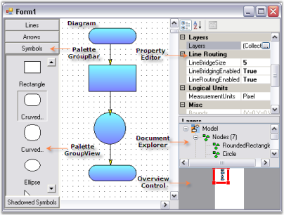
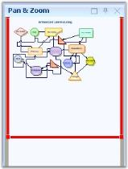
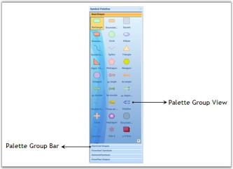
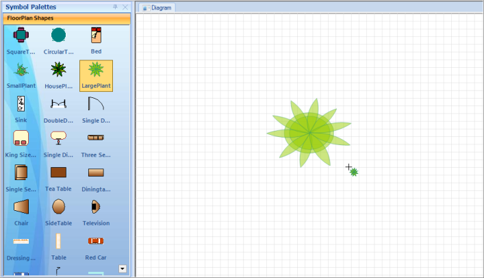
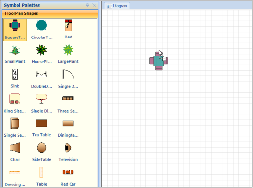
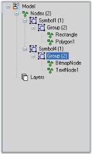
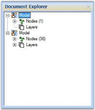
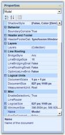

# Supported Controls in Windows Forms Diagram

The controls associated with the [WinForms Diagram](https://www.syncfusion.com/diagram-sdk/winforms-diagram) control are illustrated in the following image. Each control can be added to a Windows Form from the Visual Studio .NET toolbox after the Syncfusion WinForms package is referenced.

## Overview Control

The Overview Control provides a perspective view of a diagram model, and allows users to dynamically pan and zoom the diagram. The control features a viewport window that can be moved and/or resized using the mouse to modify the diagram's origin and magnification at run time.

The most important property of the Overview Control is **Diagram**, which binds the overview to the target diagram.

### Properties

<table>
<tr>
<th>
Property</th><th>
Description</th></tr>
<tr>
<td>
BackColor</td><td>
Gets or sets the background color of the overview. Default value is the system control color.</td></tr>
<tr>
<td>
BackgroundImage</td><td>
Gets or sets the background image of the overview.</td></tr>
<tr>
<td>
BorderStyle</td><td>
Gets or sets the border style. Valid values are FixedSingle, Fixed3D, or None.</td></tr>
<tr>
<td>
Diagram</td><td>
Gets or sets the diagram that the overview control renders. This is the primary binding property.</td></tr>
</table>

### Standard WinForms properties

The overview also inherits the standard `System.Windows.Forms.Control` properties: `Enabled`, `Visible`, `Dock`, `Anchor`, `AllowDrop`, `BackColor`, `Controls`, `Location`, `Size`, `TabIndex`, `BackgroundImage`, and `ForeColor`.

### Events

<table>
<tr>
<th>
Event</th><th>
Description</th></tr>
<tr>
<td>
ViewPortBoundsChanged</td><td>
Occurs after the viewport bounds have changed.</td></tr>
<tr>
<td>
ViewPortBoundsChanging</td><td>
Occurs when the viewport bounds are about to change. Cancellable.</td></tr>
</table>

The standard `Click`, `DoubleClick`, `MouseDown`, `MouseUp`, and `MouseMove` events are also inherited from `System.Windows.Forms.Control`.

Programmatically, the properties can be set as follows. Add a Diagram control named `diagram1` and an Overview Control named `overviewControl1` to the form before running this sample.



overviewControl1.BackColor = System.Drawing.SystemColors.AppWorkspace;
overviewControl1.Diagram = diagram1;
overviewControl1.Dock = System.Windows.Forms.DockStyle.Bottom;
overviewControl1.Location = new System.Drawing.Point(0, 377);
overviewControl1.Name = "overviewControl";
overviewControl1.Size = new System.Drawing.Size(200, 100);
overviewControl1.TabIndex = 1;




overviewControl1.BackColor = System.Drawing.SystemColors.AppWorkspace
overviewControl1.Diagram = diagram1
overviewControl1.Dock = System.Windows.Forms.DockStyle.Bottom
overviewControl1.Location = New System.Drawing.Point(0, 377)
overviewControl1.Name = "overviewControl"
overviewControl1.Size = New System.Drawing.Size(200, 100)
overviewControl1.TabIndex = 1



## PaletteGroupBar and GroupView

The **PaletteGroupBar** control provides a way for users to drag and drop the symbols onto a diagram. It is based on the WinForms Tools GroupBar control. Each symbol palette loaded in the PaletteGroupBar occupies a panel that can be selected by a bar button. The bar button is labeled with the name of the symbol palette. The symbols in the palette are shown as icons that can be dragged and dropped onto the diagram. This control allows users to add symbols to a palette, and save or load the palette whenever necessary. It provides a way to classify and maintain the symbols.

The **PaletteGroupView** control provides an easy way to serialize a symbol palette to and from the resource file of a form. At design time, you can attach a symbol palette to a PaletteGroupView control on a form. Selecting the PaletteGroupView and clicking the **Palette** property in the Visual Studio .NET properties window opens a standard Open File dialog that allows the user to select a symbol palette file created using the Symbol Designer.

### Properties

<table>
<tr>
<th>
Property</th><th>
Description</th></tr>
<tr>
<td>
BackColor</td><td>
Gets or sets the background color of the control.</td></tr>
<tr>
<td>
BorderStyle</td><td>
Gets or sets the border style. Valid values are FixedSingle, Fixed3D, or None.</td></tr>
<tr>
<td>
Collapsed</td><td>
Gets or sets whether the GroupBar is collapsed.</td></tr>
<tr>
<td>
CollapsedText</td><td>
Gets or sets the text shown for the collapsed client area of the GroupBar.</td></tr>
<tr>
<td>
CollapsedWidth</td><td>
Gets or sets the width of the collapsed GroupBar in pixels.</td></tr>
<tr>
<td>
CollapseImage</td><td>
Gets or sets the image shown for the expand button.</td></tr>
<tr>
<td>
DrawClientBorder</td><td>
Gets or sets whether a border is drawn around the GroupBar's client window.</td></tr>
<tr>
<td>
ExpandImage</td><td>
Gets or sets the image shown for the collapse button.</td></tr>
<tr>
<td>
FlatLook</td><td>
Gets or sets whether the control is displayed with a flat look.</td></tr>
<tr>
<td>
Font</td><td>
Gets or sets the font used for text in the control.</td></tr>
<tr>
<td>
ForeColor</td><td>
Gets or sets the foreground color of the display text.</td></tr>
<tr>
<td>
GroupBarItemCursor</td><td>
Gets or sets the cursor displayed when the mouse pointer is over a GroupBar item.</td></tr>
<tr>
<td>
Office2007Theme</td><td>
Gets or sets the Office 2007 theme color (blue, black, or silver) used to draw the control.</td></tr>
<tr>
<td>
PopupClientSize</td><td>
Gets or sets the initial size of the pop-up for the GroupBar client.</td></tr>
<tr>
<td>
PopupResizeMode</td><td>
Gets or sets the pop-up resize mode.</td></tr>
<tr>
<td>
ShowPopupGripper</td><td>
Gets or sets whether a gripper is shown on the pop-up.</td></tr>
<tr>
<td>
Text</td><td>
Gets or sets the caption text of the control.</td></tr>
<tr>
<td>
TextAlign</td><td>
Gets or sets the alignment of the caption text.</td></tr>
<tr>
<td>
ThemesEnabled</td><td>
Gets or sets the Office 2003 / 2007 themes. Use VisualStyle to apply the theme. Default value is true.</td></tr>
<tr>
<td>
VisualStyle</td><td>
Gets or sets the visual style used to draw the control. Valid values are Default, OfficeXP, Office2003, VS2005, and Office2007.</td></tr>
<tr>
<td>
AllowCollapse</td><td>
Gets or sets whether the GroupBar can be collapsed.</td></tr>
<tr>
<td>
AnimatedSelection</td><td>
Gets or sets whether an animated selection indicator is shown.</td></tr>
<tr>
<td>
BarHighlight</td><td>
Gets or sets whether a GroupBar item is highlighted when the mouse hovers over it.</td></tr>
<tr>
<td>
EditMode</td><td>
Gets or sets whether symbols from the palette can be dragged and dropped onto the diagram.</td></tr>
<tr>
<td>
ExpandButtonToolTip</td><td>
Gets or sets the tooltip shown for the expand button when the control is collapsed.</td></tr>
<tr>
<td>
GroupBarItemHeight</td><td>
Gets or sets the height of the GroupBar items in pixels.</td></tr>
<tr>
<td>
MinimizeButtonToolTip</td><td>
Gets or sets the tooltip shown for the collapse button when the control is expanded.</td></tr>
<tr>
<td>
NavigationPaneToolTip</td><td>
Gets or sets the tooltip shown for the navigation pane.</td></tr>
<tr>
<td>
PopupAutoClose</td><td>
Gets or sets whether the pop-up closes automatically after a click.</td></tr>
<tr>
<td>
SelectedItem</td><td>
Gets or sets the index of the selected GroupBar item.</td></tr>
<tr>
<td>
StackedMode</td><td>
Gets or sets whether GroupBar items are stacked.</td></tr>
<tr>
<td>
Visible</td><td>
Gets or sets whether the control is visible.</td></tr>
<tr>
<td>
GroupBarItems</td><td>
Gets or sets the GroupBarItem collection owned by the control.</td></tr>
<tr>
<td>
ShowChevron</td><td>
Gets or sets whether a chevron button is shown on the navigation panel when needed.</td></tr>
<tr>
<td>
ShowItemImageInHeader</td><td>
Gets or sets whether the selected item's image is shown in the header when StackedMode is enabled.</td></tr>
<tr>
<td>
Palette</td><td>
Gets or sets the loaded palette file for the palette view.</td></tr>
</table>

### Methods

<table>
<tr>
<th>
Method</th><th>
Description</th></tr>
<tr>
<td>
LoadPalette</td><td>
Loads a Symbol Palette file (.edp, .vss, .vsx, .vsd, or .vdx) into the PaletteGroupView.</td></tr>
<tr>
<td>
AddPalette</td><td>Adds a SymbolPalette object to the PaletteGroupBar at run time.</td></tr>
</table>

### Events

<table>
<tr>
<th>
Event</th><th>
Description</th></tr>
<tr>
<td>
GroupViewItemHighlighted</td><td>
Occurs when an item in the GroupView control is highlighted.</td></tr>
<tr>
<td>
GroupViewItemSelected</td><td>
Occurs when an item in the GroupView control is selected.</td></tr>
<tr>
<td>
GroupViewItemReordered</td><td>
Occurs after items in the GroupView control have been reordered by a drag-and-drop operation.</td></tr>
<tr>
<td>
GroupViewItemRenamed</td><td>
Occurs after an in-place rename operation.</td></tr>
<tr>
<td>
ShowContextMenu</td><td>
Occurs when the right mouse button is clicked on the control.</td></tr>
</table>

The standard `Click`, `DoubleClick`, and other `Control` events are also inherited.

The following code example shows how to set up the PaletteGroupBar, PaletteGroupView, and load palettes into them. Add a `PaletteGroupBar` named `paletteGroupBar1`, two `PaletteGroupView` controls named `paletteGroupView1` and `paletteGroupView2`, and two `GroupBarItem` objects named `groupBarItem1` and `groupBarItem2` to the form before running this sample. Update the file paths to match the location of the Syncfusion sample data on your machine.



paletteGroupBar1.AllowDrop = true;
paletteGroupBar1.Controls.Add(paletteGroupView1);
paletteGroupBar1.Controls.Add(paletteGroupView2);
paletteGroupBar1.Dock = System.Windows.Forms.DockStyle.Left;
paletteGroupBar1.EditMode = false;
paletteGroupBar1.GroupBarItems.AddRange(
    new Syncfusion.Windows.Forms.Tools.GroupBarItem[] { groupBarItem1, groupBarItem2 });
paletteGroupBar1.Location = new System.Drawing.Point(0, 0);
paletteGroupBar1.Name = "paletteGroupBar1";
paletteGroupBar1.SelectedItem = 1;
paletteGroupBar1.Size = new System.Drawing.Size(114, 477);
paletteGroupBar1.TabIndex = 1;
paletteGroupBar1.Text = "Symbol Palette";

groupBarItem1.Client = paletteGroupView1;
groupBarItem1.Text = "Basic Shapes";
groupBarItem2.Client = paletteGroupView2;
groupBarItem2.Text = "ElectricalSymbols";

paletteGroupView1.ButtonView = true;
paletteGroupView1.Location = new System.Drawing.Point(2, 24);
paletteGroupView1.Name = "paletteGroupView1";
paletteGroupView1.Size = new System.Drawing.Size(71, 0);
paletteGroupView1.TabIndex = 0;
paletteGroupView1.Text = "paletteGroupView1";

paletteGroupView1.LoadPalette(@"..\..\..\..\..\..\..\..\..\Common\Data\Diagram\BasicShapes.edp");
paletteGroupView2.LoadPalette(@"..\..\..\..\..\..\..\..\..\Common\Data\Diagram\ElectricalSymbols.edp");





paletteGroupBar1.AllowDrop = True
paletteGroupBar1.Controls.Add(paletteGroupView1)
paletteGroupBar1.Controls.Add(paletteGroupView2)
paletteGroupBar1.Dock = System.Windows.Forms.DockStyle.Left
paletteGroupBar1.EditMode = False
paletteGroupBar1.GroupBarItems.AddRange(New Syncfusion.Windows.Forms.Tools.GroupBarItem() {groupBarItem1, groupBarItem2})
paletteGroupBar1.Location = New System.Drawing.Point(0, 0)
paletteGroupBar1.Name = "paletteGroupBar1"
paletteGroupBar1.SelectedItem = 1
paletteGroupBar1.Size = New System.Drawing.Size(114, 477)
paletteGroupBar1.TabIndex = 1
paletteGroupBar1.Text = "Symbol Palette"

groupBarItem1.Client = paletteGroupView1
groupBarItem1.Text = "Basic Shapes"
groupBarItem2.Client = paletteGroupView2
groupBarItem2.Text = "ElectricalSymbols"

paletteGroupView1.ButtonView = True
paletteGroupView1.Location = New System.Drawing.Point(2, 24)
paletteGroupView1.Name = "paletteGroupView1"
paletteGroupView1.Size = New System.Drawing.Size(71, 0)
paletteGroupView1.TabIndex = 0
paletteGroupView1.Text = "paletteGroupView1"

paletteGroupView1.LoadPalette("..\..\..\..\..\..\..\..\..\Common\Data\Diagram\BasicShapes.edp")
paletteGroupView2.LoadPalette("..\..\..\..\..\..\..\..\..\Common\Data\Diagram\ElectricalSymbols.edp")



### Dynamically adding a Symbol Palette into PaletteGroupBar

You can add Symbol Palettes into a `PaletteGroupBar` at run time by deserializing the palette (*.edp) file. The `PaletteGroupBar.AddPalette()` method lets you append a deserialized `SymbolPalette` instance to the bar.

Before running the code below:

1. Add an `OpenFileDialog` control named `openPaletteDialog` to the form.
2. Set its `Filter` property to the following value (paste this as a single string):
   `WinForms Diagram Palettes|*.edp|Visio Stencils|*.vss; *.vsx|Visio Drawings (Shapes only)|*.vsd; *.vdx|All files|*.*`
3. Add a button whose click handler runs the code below. Add using directives for `System.IO`, `System.Runtime.Serialization.Formatters.Binary`, and `System.Text.RegularExpressions` if they are not already present.



private void buttonLoadPalette_Click(object sender, EventArgs e)
{
    if (openPaletteDialog.ShowDialog(this) != DialogResult.OK)
        return;

    SymbolPalette curSymbolPalette = null;
    string strFileName = openPaletteDialog.FileName;
    Match match = Regex.Match(strFileName, ".vss|.vsx|.vsd|.vdx",
                              RegexOptions.IgnoreCase | RegexOptions.RightToLeft);
    if (match.Success)
    {
        VisioStencilConverter converter = new VisioStencilConverter(strFileName, this);
        converter.ShowProgressDialog = true;
        curSymbolPalette = converter.Convert();
        if (curSymbolPalette != null)
            paletteGroupBar1.AddPalette(curSymbolPalette);
    }
    else
    {
        using (FileStream iStream = new FileStream(strFileName, FileMode.Open, FileAccess.Read))
        {
            try
            {
                IFormatter formatter = new BinaryFormatter();
                AppDomain.CurrentDomain.AssemblyResolve +=
                    new ResolveEventHandler(DiagramBaseAssembly.AssemblyResolver);
                curSymbolPalette = (SymbolPalette)formatter.Deserialize(iStream);
                paletteGroupBar1.AddPalette(curSymbolPalette);
            }
            catch (Exception se)
            {
                MessageBox.Show(this, se.Message);
            }
        }
    }
}



### Saving the Active Palette

You can save the currently active palette of the `PaletteGroupBar` window by serializing it as a `.edp` file. The `PaletteGroupBar.CurrentSymbolPalette` property returns the selected palette.

Before running the code below:

1. Add a `SaveFileDialog` control named `savePaletteDialog` to the form.
2. Set its `Filter` property to: `WinForms Diagram Palettes|*.edp|All files|*.*`
3. Add a button whose click handler calls the code below. Add `using System.IO;` and `using System.Runtime.Serialization.Formatters.Binary;` if they are not present.



private void buttonSavePalette_Click(object sender, EventArgs e)
{
    if (savePaletteDialog.ShowDialog(this) != DialogResult.OK)
        return;

    SymbolPalette symbolPalette = paletteGroupBar1.CurrentSymbolPalette;
    string strSavePath = savePaletteDialog.FileName;
    if (symbolPalette != null)
    {
        using (FileStream fStream = new FileStream(strSavePath, FileMode.OpenOrCreate, FileAccess.Write))
        {
            BinaryFormatter formatter = new BinaryFormatter();
            formatter.Serialize(fStream, symbolPalette);
        }
    }
}



### Adding Shapes by Clicking the Diagram Page

WinForms Diagram enables you to draw the selected node by clicking the Diagram page instead of dragging from the Symbol Palette. 

Property Table

<table>
<tr>
<th>
Property </th><th>
Description </th><th>
Type </th><th>
Data Type </th><th>
Reference links </th></tr>
<tr>
<td>
Diagram</td><td>
Reference to enable drawing the selected node by clicking on the diagram page.</td><td>
NA </td><td>
Diagram</td><td>
NA. </td></tr>
</table>

Enabling Adding Shapes by Clicking Support

You can enable drawing shapes by clicking the diagram page using the _Diagram_ property. 




//Palette group view
paletteGroupView1.Diagram = diagram1;
// Platte group bar
paletteGroupBar1.Diagram = diagram1;
	



'Palette group view	
paletteGroupView1.Diagram = diagram1;	
'Palette group bar	
paletteGroupBar1.Diagram = diagram1;
		



N> Click the Diagram page to add the selected node. Click and drag to get the required size. 

Sample Link

To view a sample:

1. Open the Syncfusion® Dashboard.
2. Click the Windows Forms drop-down list and select Run Locally Installed Samples.
3. Navigate to Diagram Samples > Product Showcase > Diagram Builder.

### Preview for Symbol Palette Item

WinForms Diagram control provides preview support for Symbol Palette. When you drag an item from Symbol Palette to Diagram View, Preview of the dragged item will be displayed. You can enable or disable the preview support. 

### Use Case Scenario

This feature displays a preview of the item you drag from Symbol Palette, thus enables you to identify the item you are dragging from the symbol palette to Diagram view.

Property Table

<table>
<tr>
<th>
Property </th><th>
Description </th><th>
Type </th><th>
Data Type </th><th>
Reference links </th></tr>
<tr>
<td>
ShowDragNodeCue</td><td>
Gets or sets a value indicating whether preview is visible.The default value is true.</td><td>
NA</td><td>
Boolean </td><td>
NA</td></tr>
<tr>
<td>
DragNodeCueEnabled</td><td>
Gets or sets a value indicating whether preview is enabled.The default value is true.</td><td>
NA</td><td>
Boolean</td><td>
NA</td></tr>
</table>

### Enabling Preview Support

To enable preview for the dragged item from Symbol Palette, set the _DragNodeCueEnabled_ property of _PaletteGroupBar/PaletteGroupView_ to true. To disable preview set this to false. By default this is set to true.  

Following code example illustrates how to enable preview support:  




//enable dragged node cue
paletteGroupBar1.DragNodeCueEnabled = true;
paletteGroupView1.DragNodeCueEnabled = true

//show dragged node cue
paletteGroupBar1.ShowDragNodeCue = true;
paletteGroupView1.ShowDragNodeCue = true;




'enable dragged node cue
paletteGroupBar1.DragNodeCueEnabled = True	
paletteGroupView1.DragNodeCueEnabled = True

'show dragged node cue
paletteGroupBar1.ShowDragNodeCue = True
paletteGroupView1.ShowDragNodeCue = True




The following code illustrates how to disable preview support: 




//hide dragged node cue
paletteGroupBar1.ShowDragNodeCue = false;
paletteGroupView1.ShowDragNodeCue = false;




//hide dragged node cue
paletteGroupBar1.ShowDragNodeCue = False;
paletteGroupView1.ShowDragNodeCue = False;




Sample Link

To view a sample:

1. Open the Syncfusion® Dashboard.
2. Click the Windows Forms drop-down list and select Run Locally Installed Samples.
3. Navigate to Diagram Samples > Product Showcase > Diagram Builder.

## Document Explorer

Document Explorer allows you to visualize the details of various objects that are added onto the diagram control at run-time. The layers will be listed under the Layers node and other objects like shapes, links, lines and text editor will be listed under Nodes node.

The properties of the Document Explorer are listed below with their respective descriptions.

<table>
<tr>
<th>
    Property</th><th>
Description</th></tr>
<tr>
<td>
BackColor</td><td>
Background color of the component.</td></tr>
<tr>
<td>
BorderStyle</td><td>
Border style for the component. It can be FixedSingle, Fixed3D or None.</td></tr>
<tr>
<td>
CheckBoxes</td><td>
Boolean value indicating whether check boxes should be displayed besides the nodes.</td></tr>
<tr>
<td>
ItemHeight</td><td>
Height of the tree view node.</td></tr>
<tr>
<td>
Enabled</td><td>
Indicates if the control is enabled.</td></tr>
<tr>
<td>
FullRowSelect</td><td>
Indicates whether the whole row (through out the width of the TreeView) is selected when the corresponding node is selected.</td></tr>
<tr>
<td>
HideSelection</td><td>
Removes the highlight from the selected node when the control loses focus.</td></tr>
<tr>
<td>
HotTracking</td><td>
Indicates whether the selected node will interact with the user by giving a link-like appearance.</td></tr>
<tr>
<td>
ImageIndex</td><td>
Default image index for the nodes.</td></tr>
<tr>
<td>
ImageKey</td><td>
Default image key for the nodes.</td></tr>
<tr>
<td>
ImageList</td><td>
ImageList with images to be used for the nodes.</td></tr>
<tr>
<td>
Indent</td><td>
Indentation of child nodes in pixels.</td></tr>
<tr>
<td>
LabelEdit</td><td>
Boolean value indicating whether nodes labels can be edited.</td></tr>
<tr>
<td>
LineColor</td><td>
Color of the lines that connects the nodes of the TreeView.</td></tr>
<tr>
<td>
Nodes</td><td>
Node Collection of the TreeView control.</td></tr>
<tr>
<td>
PathSeparator</td><td>
String Delimiter used for the path returned by a node's FullPath property.</td></tr>
<tr>
<td>
Scrollable</td><td>
Enables scroll bars if required.</td></tr>
<tr>
<td>
SelectedImageIndex</td><td>
Default image index for the selected nodes.</td></tr>
<tr>
<td>
SelectedImageKey</td><td>
Default image key for the selected nodes.</td></tr>
<tr>
<td>
ShowLines</td><td>
Indicates whether lines are displayed between sibling nodes and between parent and child nodes.</td></tr>
<tr>
<td>
ShowNodeToolTips</td><td>
Indicates whether tooltips will be displayed on the nodes.</td></tr>
<tr>
<td>
ShowPlusMinus</td><td>
Indicates whether plus / minus buttons are shown next to  parent nodes.</td></tr>
<tr>
<td>
ShowRootLines</td><td>
Indicates whether lines are shown between root nodes.</td></tr>
<tr>
<td>
StateImageList</td><td>
ImageList used for custom state images.</td></tr>
<tr>
<td>
Visible</td><td>
Sets visibility of the control.</td></tr>
</table>

_Document Explorer_

<table>
<tr>
<th>
Method</th><th>
Description</th></tr>
<tr>
<td>
AttachModel</td><td>
Adds Diagram Model to the Document Explorer.</td></tr>
</table>

The important events of Document Explorer are as follows,

<table>
<tr>
<th>
Event</th><th>
Description</th></tr>
<tr>
<td>
Click</td><td>
Occurs when the component is clicked.</td></tr>
<tr>
<td>
DoubleClick</td><td>
Occurs when the component is double-clicked.</td></tr>
<tr>
<td>
AfterCheck</td><td>
Occurs when a check box on a tree node has been checked or unchecked.</td></tr>
<tr>
<td>
AfterCollapse </td><td>
Occurs when a node has been collapsed.</td></tr>
<tr>
<td>
AfterExpand </td><td>
Occurs when a node has been expanded.</td></tr>
<tr>
<td>
AfterLabelEdit </td><td>
Occurs when the text of a node has been edited by the user.</td></tr>
<tr>
<td>
AfterSelect </td><td>
Occurs when the selection has been changed.</td></tr>
<tr>
<td>
BeforeCheck </td><td>
Occurs when a check box on a tree node is about to be checked or unchecked.</td></tr>
<tr>
<td>
BeforeCollapse </td><td>
Occurs when a node is about to be collapsed.</td></tr>
<tr>
<td>
BeforeExpand </td><td>
Occurs when a node is about to be expanded.</td></tr>
<tr>
<td>
BeforeLabelEdit </td><td>
Occurs when the text of a node is about to be edited by the user.</td></tr>
<tr>
<td>
BeforeSelect </td><td>
Occurs when the selection is about to change.</td></tr>
<tr>
<td>
DrawNode </td><td>
Occurs in owner draw-mode, when a node needs to be drawn.</td></tr>
<tr>
<td>
NodeMouseClick </td><td>
Occurs when a node is clicked with the mouse.</td></tr>
<tr>
<td>
NodeMouseDoubleClick</td><td>
Occurs when a node is double-clicked with the mouse.</td></tr>
</table>

Programmatically, the properties can be set as follows.



documentExplorer1.AttachModel(model1);

documentExplorer1.Dock = DockStyle.Right;

documentExplorer1.BackColor = System.Drawing.SystemColors.Window;

documentExplorer1.Location = new System.Drawing.Point(0, 377);

documentExplorer1.Size = new System.Drawing.Size(200, 100);

documentExplorer1.BorderStyle = System.Windows.Forms.BorderStyle.Fixed3D;

documentExplorer1.ShowNodeToolTips = true;





documentExplorer1.AttachModel(model1)

documentExplorer1.Dock = DockStyle.Right

documentExplorer1.BackColor = System.Drawing.SystemColors.Window

documentExplorer1.Location = New System.Drawing.Point(0, 377)

documentExplorer1.Size = New System.Drawing.Size(200, 100)

documentExplorer1.BorderStyle = System.Windows.Forms.BorderStyle.Fixed3D

documentExplorer1.ShowNodeToolTips = True



Sample code snippet for documentExplorer1.AfterSelect Event



documentExplorer1.AfterSelect+=new TreeViewEventHandler( documentExplorer1_AfterSelect );

private void documentExplorer1_AfterSelect(object sender,TreeViewEventArgs e) 
{
    // Update diagram's selection list depending on TreeNode Tag
    if ( e.Node.Tag is Node )
        {
        Node nodeTemp = e.Node.Tag as Node;
        if ( nodeTemp != null )
            {
            if (nodeTemp.Visible && nodeTemp.Root.Equals(this.diagram1.Model))
            {
                diagram1.View.SelectionList.Clear();
                diagram1.View.SelectionList.Add(e.Node.Tag as Node);
            }
            else
            {
                propertyEditor.PropertyGrid.SelectedObject = nodeTemp;
            }
        }
    }
}



## Property Editor

The Property Editor in WinForms Diagram displays properties of the currently selected object(s) in the diagram. It is a Windows Forms control that can be added to the Visual Studio .NET toolbox that allows users to set or modify properties of the selected object or the model. The Property Editor provides an easy interface for setting and viewing property values.

Add a Diagram control named `diagram1` and a Property Editor named `propertyEditor1` to the form before running the samples below.

<table>
<tr>
<th>
Property</th><th>
Description</th></tr>
<tr>
<td>
Diagram</td><td>
Gets or sets the diagram that this property editor is attached to. The property editor receives events from the diagram when the current selection changes and updates the object displayed in the grid.</td></tr>
<tr>
<td>
PropertyGrid</td><td>
Gets the reference to the underlying `System.Windows.Forms.PropertyGrid` for advanced styling.</td></tr>
<tr>
<td>
ShowCombo</td><td>
Gets or sets whether the toolbar combo list is visible on top of the grid. Default value is true.</td></tr>
</table>

> `ProductName` and `ProductVersion` are read-only properties inherited from `System.Windows.Forms.Control` and cannot be set in the property editor.

The following code example shows how to style the Property Editor. Add `using System.Drawing;` if it is not already present.



this.propertyEditor1.PropertyGrid.BackColor = Color.FromArgb(227, 239, 255);
this.propertyEditor1.PropertyGrid.CommandsBackColor = Color.FromArgb(227, 239, 255);
this.propertyEditor1.PropertyGrid.CommandsForeColor = Color.MidnightBlue;
this.propertyEditor1.PropertyGrid.Font = new Font("Arial", 8.25f, FontStyle.Regular, GraphicsUnit.Point);
this.propertyEditor1.PropertyGrid.HelpBackColor = Color.FromArgb(227, 239, 255);
this.propertyEditor1.PropertyGrid.HelpForeColor = Color.MidnightBlue;
this.propertyEditor1.PropertyGrid.LineColor = Color.FromArgb(185, 216, 255);
this.propertyEditor1.PropertyGrid.ViewBackColor = Color.FromArgb(227, 239, 255);
this.propertyEditor1.PropertyGrid.ViewForeColor = Color.MidnightBlue;
this.propertyEditor1.ShowCombo = true;
this.propertyEditor1.Diagram = diagram1;



