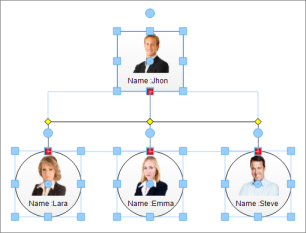

# Touch Support in Windows Forms Diagram

Touch support for Diagram control helps to create sophisticated diagrams quickly and easily by interacting with Diagram nodes through touch gestures such as Tap, Double Tap, Long Press, Pinch, and more. These touch gestures help you perform actions such as select, label text editing, open the context menu, zoom in, and zoom out.

## Properties

The following table describes the property associated with turning on/off touch support in Diagram control.

Touch support Properties

<table>
<tr>
<th>
Property Name</th><th>
Description</th></tr>
<tr>
<td>
TouchMode</td><td>
Specifies whether to turn on/off touch support in Diagram control.</td></tr>
</table>

The following code example illustrates how to turn on touch support for Diagram control.




// Specifies whether to turn on/off touch mode in Diagram.
diagram1.TouchMode = true;




' Specifies whether to turn on/off touch mode in Diagram.
diagram1.TouchMode = True




