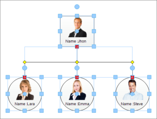
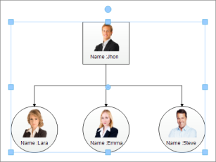

# Touch Support in Windows Forms Diagram

Touch support in the [WinForms Diagram](https://www.syncfusion.com/diagram-sdk/winforms-diagram) control lets users interact with diagram nodes through touch gestures. Users can select nodes, edit label text, open the context menu, and zoom in or out using tap, double tap, long press, pinch, and other gestures.

> Touch gestures are delivered by the `Microsoft.Windows.Forms`-based touch handling in the Syncfusion WinForms Diagram control and are supported on Windows 8.1 and later and on Windows Server 2012 and later. A physical or virtual touch digitizer, or a Windows touch emulator, is required.

## Supported Gestures

The Diagram control responds to the following touch gestures.

| Gesture | Action |
| --- | --- |
| Tap | Selects the touched node. |
| Double Tap | Begins in-place label editing of the touched node. |
| Long Press | Opens the context menu for the touched node. |
| Pinch | Zooms the diagram view in or out around the focal point. |
| Two-finger Pan | Pans the diagram view. |

## Enabling Touch Support

Use the **TouchMode** property to enable or disable touch support at run time. Add a Diagram control named `diagram1` to a Windows Form before running the following sample.

### Properties

<table>
<tr>
<th>
Property Name</th><th>
Description</th></tr>
<tr>
<td>
TouchMode</td><td>
Gets or sets whether touch support is enabled for the WinForms Diagram control. Default value is false.</td></tr>
</table>

The following code example shows how to enable touch support from the form's load event so that touch gestures are active when the diagram is first displayed.




private void Form1_Load(object sender, EventArgs e)
{
    // Enable touch gestures (Tap, Double Tap, Long Press, Pinch, etc.) on the diagram.
    diagram1.TouchMode = true;
}




Private Sub Form1_Load(ByVal sender As Object, ByVal e As EventArgs) Handles MyBase.Load
    ' Enable touch gestures (Tap, Double Tap, Long Press, Pinch, etc.) on the diagram.
    diagram1.TouchMode = True
End Sub




To turn off touch support after it has been enabled, set `TouchMode = false`. When `TouchMode` is `false`, the control responds only to mouse input and standard keyboard interactions.

