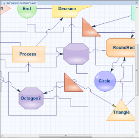
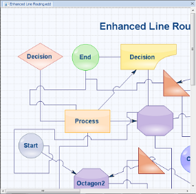
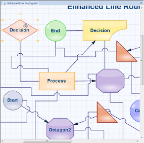
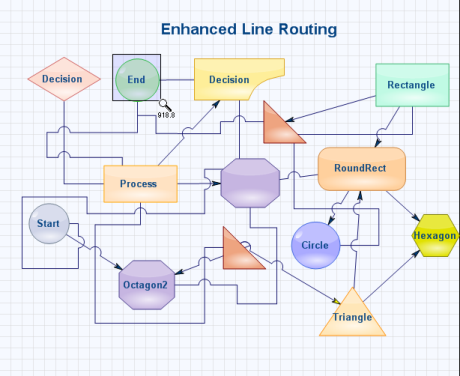
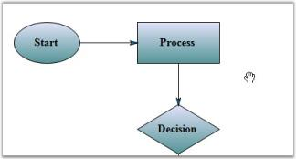

# Zoom and Pan in Windows Forms Diagram

The Zoom and Pan features of the [WinForms Diagram](https://www.syncfusion.com/diagram-sdk/winforms-diagram) control let users interactively change the view magnification and scroll the diagram content. The control supports different approaches (center, top-left, and pointer position) and offers a dedicated Zoom tool and Pan tool for interactive use.

Before running the samples below, add a Diagram control named `diagram1` to a Windows Form.

## Zooming Support

This feature allows you to interactively zoom in and out of the diagram in the following ways:

* Zoom to the **center** of the diagram.
* Zoom to the **TopLeft** of the diagram.
* Zoom to the **pointer position** using Ctrl + the mouse wheel. Place the cursor over the diagram, hold the Ctrl key, and scroll the wheel to zoom in or out around the cursor location.

### Use Case Scenario

Users can zoom in and out of diagram content based on their requirements.

### View Properties

The following properties control the zoom behavior of the `View` (accessed via `diagram1.View`).

<table>
<tr>
<th>
Property </th><th>
Description </th><th>
Data Type </th></tr>
<tr>
<td>
ZoomType </td><td>
Gets or sets the type of zooming to be performed. The available values are:
<ul><li>Center</li><li>TopLeft</li></ul>Default value: Center.</td><td>
enum</td></tr>
<tr>
<td>
ZoomIncrement</td><td>
Gets or sets the percentage increment applied to the current zoom factor each time the diagram is zoomed in or out via `ZoomIn` or `ZoomOut`. Default value: 25.</td><td>
float</td></tr>
</table>

Methods

The following methods on the `View` perform the actual zoom operations.

<table>
<tr>
<th>
Method </th><th>
Description </th><th>
Parameters </th><th>
Return Type </th></tr>
<tr>
<td>
ZoomIn</td><td>
Zooms in on the diagram document by the configured ZoomIncrement.</td><td>
NA</td><td>
void</td></tr>
<tr>
<td>
ZoomOut</td><td>
Zooms out of the diagram document by the configured ZoomIncrement.</td><td>
NA</td><td>
void</td></tr>
<tr>
<td>
ZoomToSelection</td><td>
Zooms the diagram document so that the rectangle bounds passed in fill the viewport.</td><td>
RectangleF (x, y, width, height in diagram units)</td><td>
void</td></tr>
<tr>
<td>
ZoomToActual</td><td>
Zooms the document to its actual size (1:1, no magnification).</td><td>
NA</td><td>
void</td></tr>
</table>

### Zooming Programmatically

The diagram document can be zoomed in, zoomed out, zoomed to its original size, or zoomed to a selected area based on the ZoomIncrement. The methods that perform these operations are:

* `ZoomIn()`
* `ZoomOut()`
* `ZoomToSelection(RectangleF)`
* `ZoomToActual()`

The following code example shows how to call each method programmatically:




//Set the percentage increment applied for each ZoomIn or ZoomOut call.
this.diagram1.View.ZoomIncrement = 20;

// Zoom in on the document.
this.diagram1.View.ZoomIn();

// Zoom out of the document.
this.diagram1.View.ZoomOut();

// Zoom the document to its actual size.
this.diagram1.View.ZoomToActual();

// Zoom the document to the selection rectangle (x, y, width, height in diagram units).
this.diagram1.View.ZoomToSelection(new RectangleF(100, 100, 100, 100));




'Set the percentage increment applied for each ZoomIn or ZoomOut call.
Me.diagram1.View.ZoomIncrement = 20

' Zoom in on the document.
Me.diagram1.View.ZoomIn()

' Zoom out of the document.
Me.diagram1.View.ZoomOut()

' Zoom the document to its actual size.
Me.diagram1.View.ZoomToActual()

' Zoom the document to the selection rectangle (x, y, width, height in diagram units).
Me.diagram1.View.ZoomToSelection(New RectangleF(100, 100, 100, 100))




### Zooming to the Center of the Diagram

The diagram document can be zoomed to the center of the current viewport by setting ZoomType to `Center`. The default ZoomType is `Center`.

The following code example shows how to use the zoom-to-center feature:




// Center the zoom origin at the viewport center.
this.diagram1.View.ZoomType = ZoomType.Center;




' Center the zoom origin at the viewport center.
Me.diagram1.View.ZoomType = ZoomType.Center




### Zooming to the Top-Left of the Diagram

The diagram document can be zoomed to the top-left corner of the viewport by setting ZoomType to `TopLeft`.

The following code example shows how to use the zoom-to-top-left feature:




// Anchor the zoom origin to the top-left corner of the viewport.
this.diagram1.View.ZoomType = ZoomType.TopLeft;




' Anchor the zoom origin to the top-left corner of the viewport.
Me.diagram1.View.ZoomType = ZoomType.TopLeft




### Zooming to the Pointer Position

The Diagram control supports zooming around the pointer position when the user holds the **Ctrl** key and scrolls the mouse wheel. Hold Ctrl and roll the wheel over the diagram to zoom the view around the cursor location.

### ZoomTool

The Diagram control ships with a UI tool called `ZoomTool` that lets users zoom in and select the diagram document interactively by clicking and dragging. Use the `ZoomTool.MaximumMagnification` and `ZoomTool.MinimumMagnification` properties to restrict the zoom level and `ZoomTool.ZoomIncrement` to control how much each click changes the zoom.

#### ZoomTool Properties

<table>
<tr>
<th>
 Property </th><th>
Description </th><th>
Data Type </th></tr>
<tr>
<td>
MaximumMagnification</td><td>
Gets or sets the maximum magnification (in percent) for zooming. Default value is 1000 (1000%).</td><td>
float</td></tr>
<tr>
<td>
MinimumMagnification</td><td>
Gets or sets the minimum magnification (in percent) for zooming. Default value is 10 (10%).</td><td>
float</td></tr>
<tr>
<td>
ZoomIncrement</td><td>
Gets or sets the percentage increment applied for each ZoomTool click. Default value is 25.</td><td>
float</td></tr>
</table>

The following code example demonstrates how to activate the ZoomTool. Note that 1000 is interpreted as 1000 percent (10x zoom) and 10 as 10 percent.




diagram1.Controller.ActivateTool("ZoomTool");
ZoomTool zoomTool = (ZoomTool)diagram1.Controller.ActiveTool;
// Magnification values are expressed as a percentage of actual size.
zoomTool.MaximumMagnification = 1000f; // 1000% (10x zoom)
zoomTool.MinimumMagnification = 10f;   // 10%
zoomTool.ZoomIncrement = 10f;




diagram1.Controller.ActivateTool("ZoomTool")
Dim zoomTool As ZoomTool = CType(diagram1.Controller.ActiveTool, ZoomTool)
' Magnification values are expressed as a percentage of actual size.
zoomTool.MaximumMagnification = 1000.0F ' 1000% (10x zoom)
zoomTool.MinimumMagnification = 10.0F   ' 10%
zoomTool.ZoomIncrement = 10.0F




#### Reset Zoom

Reset the zoom factor to the original 1:1 size using the `ZoomToActual` method on the View:




diagram1.View.ZoomToActual();




## Panning Support

The Pan tool lets the user drag the diagram and scroll it in any direction. Pan is also accessible without the PanTool by holding the middle mouse button while dragging, when IntelliMouse panning is enabled.

The following code shows how to enable IntelliMouse panning and activate the PanTool programmatically:




// Enable middle-mouse-button panning.
this.diagram1.EnableIntelliMouse = true;
// Activate the PanTool so the user can pan by dragging with the left mouse button.
this.diagram1.Controller.ActivateTool("PanTool");




' Enable middle-mouse-button panning.
Me.diagram1.EnableIntelliMouse = True
' Activate the PanTool so the user can pan by dragging with the left mouse button.
Me.diagram1.Controller.ActivateTool("PanTool")




Sample diagram is as follows.

### Reset Pan

Reset the pan value by setting the view origin and scroll bounds back to their defaults.

`BeginUpdate` and `EndUpdate` bracket a series of view changes; the diagram suspends layout and redraw while the changes are applied, which improves performance when making multiple updates at once. Calling `ActivateTool("SelectTool")` reactivates the standard selection tool after panning.




this.diagram1.BeginUpdate();
// Reset the view origin to (0, 0) and clear the virtual scrolling bounds.
this.diagram1.Controller.View.Origin = new PointF(0, 0);
this.diagram1.Controller.View.ScrollVirtualBounds = new RectangleF(0, 0, 0, 0);
// Deactivate the Pan tool and reactivate the Select tool.
this.diagram1.ActivateTool("SelectTool");
this.diagram1.EndUpdate();




This snippet resets the diagram view to the top-left corner, clears the virtual scrolling bounds, and reactivates the `SelectTool` after panning.
