# Appearance in Windows Forms Docking Manager

The UI for dock, float, and auto hide windows of the docking manager can be changed using different styles. You can customize the appearance of docked, float, tabbed, and auto hide window in the docking manager.

## Visual styles

Visual styles provide rich and professional look and feel UI for the dock windows. Some of the available VisualStyles are as follows:

* Default
* Office2003
* Office2007
* Office2007Outlook
* Office2010
* OfficeXP
* VS2003
* VS2005
* Metro
* Office2016Colorful
* Office2016White
* Office2016DarkGray
* Office2016Black

The visual style can be applied for the docking manager using the [VisualStyle](https://help.syncfusion.com/cr/windowsforms/Syncfusion.Windows.Forms.Tools.DockingManager.html#Syncfusion_Windows_Forms_Tools_DockingManager_VisualStyle) property. The following code example illustrates how to change the visual style for the docking manager.

**Default**

This option helps to set the default style.





// Default

this.dockingManager1.VisualStyle = Syncfusion.Windows.Forms.VisualStyle.Default;





'Default

Me.dockingManager1.VisualStyle = Syncfusion.Windows.Forms.VisualStyle.Default





**Office2003**

This option helps to set the Office2003 style.





// Office2003

this.dockingManager1.VisualStyle = Syncfusion.Windows.Forms.VisualStyle.Office2003;





'Office2003

Me.dockingManager1.VisualStyle = Syncfusion.Windows.Forms.VisualStyle.Office2003





**Office2007**

This option helps to set the Office2007 style.





// Office2007

this.dockingManager1.VisualStyle = Syncfusion.Windows.Forms.VisualStyle.Office2007;





'Office2007

Me.dockingManager1.VisualStyle = Syncfusion.Windows.Forms.VisualStyle.Office2007





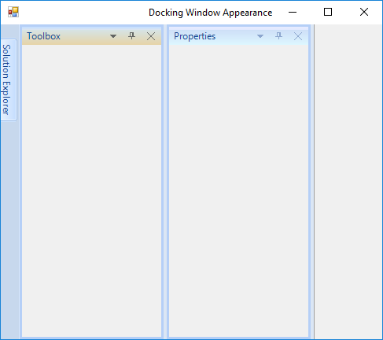

**Office2007Outlook**

This option helps to set the Office2007Outlook style.





// Office2007Outlook

this.dockingManager1.VisualStyle = Syncfusion.Windows.Forms.VisualStyle.Office2007Outlook;





'Office2007Outlook

Me.dockingManager1.VisualStyle = Syncfusion.Windows.Forms.VisualStyle.Office2007Outlook





**Office2010**

This option helps to set the Office2010 style.





// Office2010

this.dockingManager1.VisualStyle = Syncfusion.Windows.Forms.VisualStyle.Office2010;





'Office2010

Me.dockingManager1.VisualStyle = Syncfusion.Windows.Forms.VisualStyle.Office2010





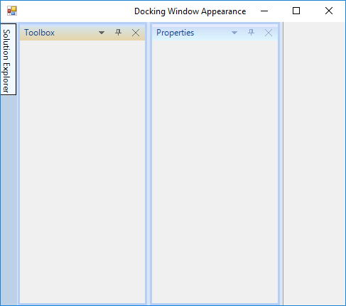

**OfficeXP**

This option helps to set the OfficeXP style.





// OfficeXP

this.dockingManager1.VisualStyle = Syncfusion.Windows.Forms.VisualStyle.OfficeXP;





'OfficeXP

Me.dockingManager1.VisualStyle = Syncfusion.Windows.Forms.VisualStyle.OfficeXP





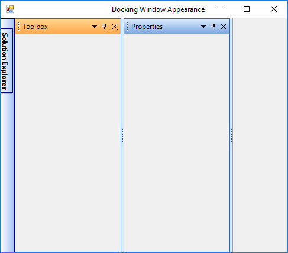

**VS2005**

This option helps to set the VS2005 style.





// VS2005

this.dockingManager1.VisualStyle = Syncfusion.Windows.Forms.VisualStyle.VS2005;





'VS2005

Me.dockingManager1.VisualStyle = Syncfusion.Windows.Forms.VisualStyle.VS2005





**VS2010**

This option helps to set the VS2010 style.





// VS2010

this.dockingManager1.VisualStyle = Syncfusion.Windows.Forms.VisualStyle.VS2010;





'VS2010

Me.dockingManager1.VisualStyle = Syncfusion.Windows.Forms.VisualStyle.VS2010





**Metro**

This option helps to set the Metro style.





// Metro

this.dockingManager1.VisualStyle = Syncfusion.Windows.Forms.VisualStyle.Metro;





'Metro

Me.dockingManager1.VisualStyle = Syncfusion.Windows.Forms.VisualStyle.Metro





**Office2016Colorful**

This option helps to set the Office2016Colorful style.





// Office2016Colorful

this.dockingManager1.VisualStyle = Syncfusion.Windows.Forms.VisualStyle.Office2016Colorful;





'Office2016Colorful

Me.dockingManager1.VisualStyle = Syncfusion.Windows.Forms.VisualStyle.Office2016Colorful





**Office2016White**

This option helps to set the Office2016White style.





// Office2016White

this.dockingManager1.VisualStyle = Syncfusion.Windows.Forms.VisualStyle.Office2016White;





'Office2016White

Me.dockingManager1.VisualStyle = Syncfusion.Windows.Forms.VisualStyle.Office2016White





**Office2016DarkGray**

This option helps to set the Office2016DarkGray style.





// Office2016DarkGray

this.dockingManager1.VisualStyle = Syncfusion.Windows.Forms.VisualStyle.Office2016DarkGray;





'Office2016DarkGray

Me.dockingManager1.VisualStyle = Syncfusion.Windows.Forms.VisualStyle.Office2016DarkGray





**Office2016Black**

This option helps to set the Office2016Black style.





// Office2016Black

this.dockingManager1.VisualStyle = Syncfusion.Windows.Forms.VisualStyle.Office2016Black;





'Office2016Black

Me.dockingManager1.VisualStyle = Syncfusion.Windows.Forms.VisualStyle.Office2016Black





## Office 2007 color scheme

The docking manager supports all the three-color schemes in Office2007 visual style. This can be controlled using the [Office2007Theme](https://help.syncfusion.com/cr/windowsforms/Syncfusion.Windows.Forms.Tools.DockingManager.html#Syncfusion_Windows_Forms_Tools_DockingManager_Office2007Theme) property.





this.dockingManager1.Office2007Theme = Syncfusion.Windows.Forms.Office2007Theme.Silver;





Me.dockingManager1.Office2007Theme = Syncfusion.Windows.Forms.Office2007Theme.Silver





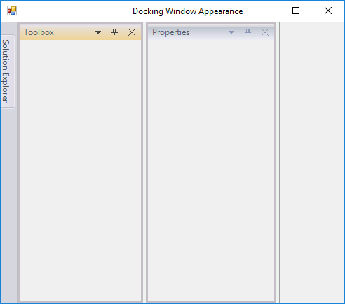

## Office 2010 color scheme

Th docking manager supports all the three-color schemes in Office2010 visual style. This can be controlled using the [Office2010Theme](https://help.syncfusion.com/cr/windowsforms/Syncfusion.Windows.Forms.Tools.DockingManager.html#Syncfusion_Windows_Forms_Tools_DockingManager_Office2010Theme) property.





this.dockingManager1.Office2010Theme = Syncfusion.Windows.Forms.Office2010Theme.Black;





Me.dockingManager1.Office2010Theme = Syncfusion.Windows.Forms.Office2010Theme.Black





## Custom color schemes

Custom colors can be applied for `Office2007` and `Office2010` styles in the docking manager.

### Custom Office 2007 color scheme

Custom colors can also be applied for Office2007 by setting the `Managed` style of [Office2007Theme](https://help.syncfusion.com/cr/windowsforms/Syncfusion.Windows.Forms.Tools.DockingManager.html#Syncfusion_Windows_Forms_Tools_DockingManager_Office2007Theme).





dockingManager1.Office2007Theme = Office2007Theme.Managed;

Office2007Colors.ApplyManagedColors(this, Color.Red);





dockingManager1.Office2007Theme = Office2007Theme.Managed

Office2007Colors.ApplyManagedColors(Me, Color.Red)





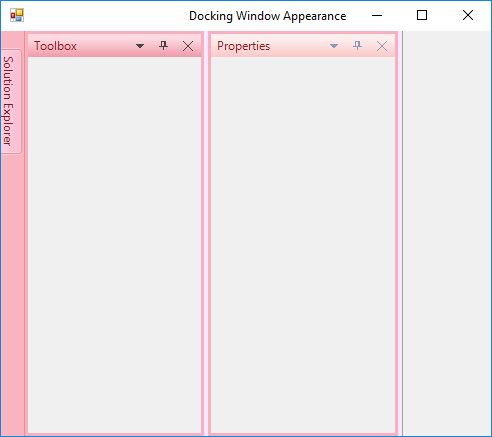

### Custom Office 2010 color scheme

Custom colors can be applied for Office2010 by setting the `Managed` style of [Office2010Theme](https://help.syncfusion.com/cr/windowsforms/Syncfusion.Windows.Forms.Tools.DockingManager.html#Syncfusion_Windows_Forms_Tools_DockingManager_Office2010Theme).





dockingManager1.Office2010Theme = Office2010Theme.Managed;

Office2010Colors.ApplyManagedColors(this, Color.Green);





dockingManager1.Office2010Theme = Office2010Theme.Managed

Office2010Colors.ApplyManagedColors(Me, Color.Green)





## Customize dock window

In docking manager, you can customize the background, foreground, and font of docked or dockable window.

### Customize caption

The dock and float window caption bar BackColor, ForeColor, and Font Style can be customized by using the following properties of the docking manager. This customization can be applied for both active and inactive docked or dockable window.

<table>
<tr>
<th>
Docking manager property</th><th>
Description</th></tr>
<tr>
<td>
{{ '[ActiveCaptionBackground](https://help.syncfusion.com/cr/windowsforms/Syncfusion.Windows.Forms.Tools.DockingManager.html#Syncfusion_Windows_Forms_Tools_DockingManager_ActiveCaptionBackground)' | markdownify }}</td><td>
Sets background for the caption area using BrushInfo object.</td></tr>
<tr>
<td>
{{ '[InActiveCaptionBackground](https://help.syncfusion.com/cr/windowsforms/Syncfusion.Windows.Forms.Tools.DockingManager.html#Syncfusion_Windows_Forms_Tools_DockingManager_InActiveCaptionBackground)' | markdownify }}</td><td>
Sets caption background of the inactive docked control using BrushInfo object.</td></tr>
<tr>
<td>
{{ '[ActiveCaptionForeGround](https://help.syncfusion.com/cr/windowsforms/Syncfusion.Windows.Forms.Tools.DockingManager.html#Syncfusion_Windows_Forms_Tools_DockingManager_ActiveCaptionForeGround)' | markdownify }}</td><td>
Indicates the color of the caption text in the active state.</td></tr>
<tr>
<td>
{{ '[InActiveCaptionForeGround](https://help.syncfusion.com/cr/windowsforms/Syncfusion.Windows.Forms.Tools.DockingManager.html#Syncfusion_Windows_Forms_Tools_DockingManager_InActiveCaptionForeGround)' | markdownify }}</td><td>
Indicates the color of the caption text in inactive state.</td></tr>
<tr>
<td>
{{ '[ActiveCaptionFont](https://help.syncfusion.com/cr/windowsforms/Syncfusion.Windows.Forms.Tools.DockingManager.html#Syncfusion_Windows_Forms_Tools_DockingManager_ActiveCaptionFont)' | markdownify }}</td><td>
Gets or sets the font for the active caption.</td></tr>
<tr>
<td>
{{ '[InActiveCaptionFont](https://help.syncfusion.com/cr/windowsforms/Syncfusion.Windows.Forms.Tools.DockingManager.html#Syncfusion_Windows_Forms_Tools_DockingManager_InActiveCaptionFont)' | markdownify }}</td><td>
Gets or sets the font of the inactive caption.</td></tr>
</table>

N> These settings will effect only with [DockingManager.VisualStyle](https://help.syncfusion.com/cr/windowsforms/Syncfusion.Windows.Forms.Tools.DockingManager.html#Syncfusion_Windows_Forms_Tools_DockingManager_VisualStyle) property that is set as default.





this.dockingManager1.ActiveCaptionBackground = new Syncfusion.Drawing.BrushInfo(Syncfusion.Drawing.PatternStyle.Percent20, System.Drawing.Color.Red, System.Drawing.Color.Red);

this.dockingManager1.InActiveCaptionBackground = new Syncfusion.Drawing.BrushInfo(Syncfusion.Drawing.GradientStyle.Horizontal, System.Drawing.Color.Green, System.Drawing.Color.Green);

this.dockingManager1.ActiveCaptionForeGround = System.Drawing.Color.Yellow;

this.dockingManager1.InActiveCaptionForeGround = System.Drawing.Color.Violet;

this.dockingManager1.ActiveCaptionFont = new System.Drawing.Font("Trebuchet MS", 9.75F, System.Drawing.FontStyle.Bold, System.Drawing.GraphicsUnit.Point, ((System.Byte)(0)));

this.dockingManager1.InActiveCaptionFont = new System.Drawing.Font("Arial", 11.25F, System.Drawing.FontStyle.Bold, System.Drawing.GraphicsUnit.Point, ((System.Byte)(0)));





this.dockingManager1.ActiveCaptionBackground = new Syncfusion.Drawing.BrushInfo(Syncfusion.Drawing.PatternStyle.Percent20, System.Drawing.Color.Red, System.Drawing.Color.Red);

Me.dockingManager1.InActiveCaptionBackground = new Syncfusion.Drawing.BrushInfo(Syncfusion.Drawing.GradientStyle.Horizontal, System.Drawing.Color.Green, System.Drawing.Color.Green);

Me.DockingManager1.ActiveCaptionForeGround = System.Drawing.Color.Yellow

Me.DockingManager1.InActiveCaptionForeGround = System.Drawing.Color.Violet

Me.dockingManager1.ActiveCaptionFont = New System.Drawing.Font("Trebuchet MS", 9.75!, System.Drawing.FontStyle.Bold, System.Drawing.GraphicsUnit.Point, CType(0, Byte))

Me.DockingManager1.InActiveCaptionFont = New System.Drawing.Font("Arial", 11.25!, System.Drawing.FontStyle.Bold, System.Drawing.GraphicsUnit.Point, CType(0, Byte))





### Customize border

The border color of the docked controls can be customized by using the [BorderColor](https://help.syncfusion.com/cr/windowsforms/Syncfusion.Windows.Forms.Tools.DockingManager.html#Syncfusion_Windows_Forms_Tools_DockingManager_BorderColor) property of the docking manager.

N> The [PaintBorders](https://help.syncfusion.com/cr/windowsforms/Syncfusion.Windows.Forms.Tools.DockingManager.html#Syncfusion_Windows_Forms_Tools_DockingManager_PaintBorders) property must be enabled to effect this setting.





//Setting Border color

this.dockingManager1.BorderColor = System.Drawing.Color.Red;

this.dockingManager1.PaintBorders = true;





'Setting border color

Me.dockingManager1.BorderColor = System.Drawing.Color.Red

Me.dockingManager1.PaintBorders = True





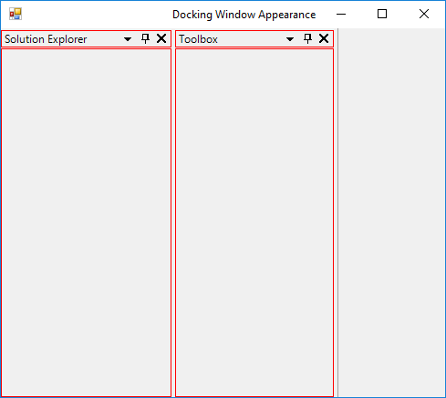

### HostFormClientBorder

By using the [HostFormClientBorder](https://help.syncfusion.com/cr/windowsforms/Syncfusion.Windows.Forms.Tools.DockingManager.html#Syncfusion_Windows_Forms_Tools_DockingManager_HostFormClientBorder) property of the docking manager, you can enable or disable the border that is drawn around the host form's client rectangle. The default value of **HostFormClientBorder** is `true`. To disable the border of HostForm, turn its value to `false`.





this.dockingManager1.HostFormClientBorder = false;





Me.dockingManager1.HostFormClientBorder = False





## Customize Caption Height

The height of dock and float window caption can be customized using the `CaptionHeight` property.





//Setting Caption Height

this.dockingManager1.CaptionHeight = 40;





'Setting Caption Height

Me.DockingManager1.CaptionHeight = 40





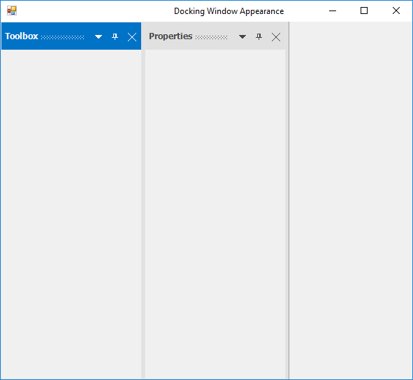

N>  The `CaptionHeight` property will not applicable for Default and VS2005 visual style of docking manager. The maximum value of `CaptionHeight` is 60.

## Customize tabs in dock window

The docking manager provides tab and label settings for the docked windows. These settings allow you to control the appearance of dock tabs.

### Foreground settings for dock tabs

The font style and height of the tab controls in a tabbed docking group can be controlled by using the following properties respectively.

<table>
<tr>
<th>
Docking manager property</th><th>
Description</th></tr>
<tr>
<td>
{{ '[DockTabFont](https://help.syncfusion.com/cr/windowsforms/Syncfusion.Windows.Forms.Tools.DockingManager.html#Syncfusion_Windows_Forms_Tools_DockingManager_DockTabFont)' | markdownify }} </td><td>
This property helps to customize the font of tab control used in the tabbed docking group.</td></tr>
<tr>
<td>
{{ '[DockTabHeight](https://help.syncfusion.com/cr/windowsforms/Syncfusion.Windows.Forms.Tools.DockingManager.html#Syncfusion_Windows_Forms_Tools_DockingManager_DockTabHeight)' | markdownify }}</td><td>
This property helps to customize the tab control used in the tabbed docking group.</td></tr>
<tr>
<td>
{{ '[DockTabForeColor](https://help.syncfusion.com/cr/windowsforms/Syncfusion.Windows.Forms.Tools.DockingManager.html#Syncfusion_Windows_Forms_Tools_DockingManager_DockTabForeColor)' | markdownify }}</td><td>
This property helps to customize the header foreground color of inactive tab item in the dock window.</td></tr>
<tr>
<td>
{{ '[ActiveDockTabForeColor](https://help.syncfusion.com/cr/windowsforms/Syncfusion.Windows.Forms.Tools.DockingManager.html#Syncfusion_Windows_Forms_Tools_DockingManager_ActiveDockTabForeColor)' | markdownify }}</td><td>
This property helps to customize the header foreground color of active tab item in the dock window.</td></tr>
<tr>
<td>
{{ '[DockTabBackColor](https://help.syncfusion.com/cr/windowsforms/Syncfusion.Windows.Forms.Tools.DockingManager.html#Syncfusion_Windows_Forms_Tools_DockingManager_DockTabBackColor)' | markdownify }}</td><td>
This property helps to customize the header background color of inactive tab item in the dock window.</td></tr>
<tr>
<td>
{{ '[ActiveDockTabBackColor](https://help.syncfusion.com/cr/windowsforms/Syncfusion.Windows.Forms.Tools.DockingManager.html#Syncfusion_Windows_Forms_Tools_DockingManager_ActiveDockTabBackColor)' | markdownify }}</td><td>
This property helps to customize the header background color of active tab item in the dock window.</td></tr>
<tr>
<td>
{{ '[DockTabPanelBackColor](https://help.syncfusion.com/cr/windowsforms/Syncfusion.Windows.Forms.Tools.DockingManager.html#Syncfusion_Windows_Forms_Tools_DockingManager_DockTabPanelBackColor)' | markdownify }}</td><td>
This property helps to customize the tab panel background color of tabbed dock window.</td></tr>
<tr>
<td>
{{ '[DockTabSeparatorColor](https://help.syncfusion.com/cr/windowsforms/Syncfusion.Windows.Forms.Tools.DockingManager.html#Syncfusion_Windows_Forms_Tools_DockingManager_DockTabSeparatorColor)' | markdownify }}</td><td>
This property helps to customize the separator between tabs in the dock window.</td></tr>
</table>





this.dockingManager1.DockTabFont = new System.Drawing.Font("Arial", 9F, ((System.Drawing.FontStyle)((System.Drawing.FontStyle.Italic | System.Drawing.FontStyle.Underline))), System.Drawing.GraphicsUnit.Point, ((System.Byte)(0)));

this.dockingManager1.DockTabHeight = 30;





Me.DockingManager1.DockTabFont = New System.Drawing.Font("Arial", 9.0!, CType((System.Drawing.FontStyle.Italic Or System.Drawing.FontStyle.Underline), System.Drawing.FontStyle), System.Drawing.GraphicsUnit.Point, CType(0, Byte))

Me.DockingManager1.DockTabHeight = 30









//Specifies the fore color of the Docked tab Control.

this.dockingManager1.DockTabForeColor = System.Drawing.Color.Red;





'Specifies the fore color of the Docked tab Control.

Me.dockingManager1.DockTabForeColor = System.Drawing.Color.Red









this.dockingManager1.ActiveDockTabForeColor = System.Drawing.Color.Purple;





Me.dockingManager1.ActiveDockTabForeColor = System.Drawing.Color.Purple









this.dockingManager1.DockTabBackColor = System.Drawing.Color.Yellow;





Me.dockingManager1.DockTabBackColor = System.Drawing.Color.Yellow









this.dockingManager1.ActiveDockTabBackColor = System.Drawing.Color.Green;





Me.dockingManager1.ActiveDockTabBackColor = System.Drawing.Color.Green





 





this.dockingManager1.DockTabPanelBackColor = System.Drawing.Color.Purple;





Me.dockingManager1.DockTabPanelBackColor = System.Drawing.Color.Purple





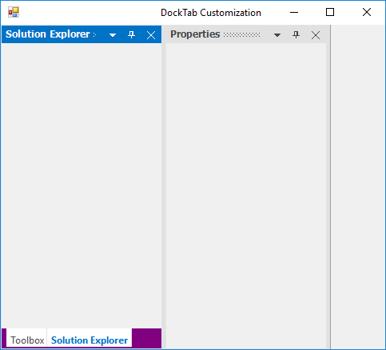





this.dockingManager1.DockTabSeparatorColor = System.Drawing.Color.Red;





Me.dockingManager1.DockTabSeparatorColor = System.Drawing.Color.Red





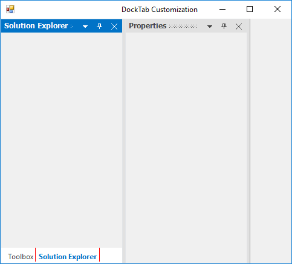
 

N> [ResetDockTabFont](https://help.syncfusion.com/cr/windowsforms/Syncfusion.Windows.Forms.Tools.DockingManager.html#Syncfusion_Windows_Forms_Tools_DockingManager_ResetDockTabFont), [ResetDockTabHeight](https://help.syncfusion.com/cr/windowsforms/Syncfusion.Windows.Forms.Tools.DockingManager.html#Syncfusion_Windows_Forms_Tools_DockingManager_ResetDockTabHeight), and [ResetDockTabForeColor](https://help.syncfusion.com/cr/windowsforms/Syncfusion.Windows.Forms.Tools.DockingManager.html#Syncfusion_Windows_Forms_Tools_DockingManager_ResetDockTabForeColor) functions allow you to reset the above settings.





//Restoring to default settings

this.dockingManager1.ResetDockTabFont();

this.dockingManager1.ResetDockTabHeight();

this.dockingManager1.ResetDockTabForeColor();





'Restoring to default settings

Me.dockingManager1.ResetDockTabFont()

Me.dockingManager1.ResetDockTabHeight()

Me.dockingManager1.ResetDockTabForeColor()





## Customize document(TDI) window

The appearance of document tab can be customized using the `DocumentWindowSettings` property of docking manager. DocumentWindowSettings provides options to change the tab background, foreground, font and much more.

<table>
<tr>
<th>
Properties</th><th>
Descriptions</th></tr>
<tr>
<td>
{{ '[TabBackColor](https://help.syncfusion.com/cr/windowsforms/Syncfusion.Windows.Forms.Tools.DocumentWindowSettings.html#Syncfusion_Windows_Forms_Tools_DocumentWindowSettings_TabBackColor)' | markdownify }}</td><td>
 Customizes the header background color of inactive tab items in document window.</td></tr>
<tr>
<td>
{{ '[ActiveTabBackColor](https://help.syncfusion.com/cr/windowsforms/Syncfusion.Windows.Forms.Tools.DocumentWindowSettings.html#Syncfusion_Windows_Forms_Tools_DocumentWindowSettings_ActiveTabBackColor)' | markdownify }}
</td><td>
Customizes the header background color of active tab items in document window.</td></tr>
<tr>
<td>
{{ '[TabForeColor](https://help.syncfusion.com/cr/windowsforms/Syncfusion.Windows.Forms.Tools.DocumentWindowSettings.html#Syncfusion_Windows_Forms_Tools_DocumentWindowSettings_TabForeColor)' | markdownify }}
</td><td>
 Customizes the header foreground color of inactive tab items in the document window.</td></tr>
<tr>
<td>
{{ '[ActiveTabForeColor](https://help.syncfusion.com/cr/windowsforms/Syncfusion.Windows.Forms.Tools.DocumentWindowSettings.html#Syncfusion_Windows_Forms_Tools_DocumentWindowSettings_ActiveTabForeColor)' | markdownify }}
</td><td>
Customizes the header foreground color of active tab item in the document window.</td></tr>
<tr>
<td>
{{ '[TabPanelBackColor](https://help.syncfusion.com/cr/windowsforms/Syncfusion.Windows.Forms.Tools.DocumentWindowSettings.html#Syncfusion_Windows_Forms_Tools_DocumentWindowSettings_TabPanelBackColor)' | markdownify }}
</td><td>
Customizes the background color of tab panel in document window.</td></tr>
<tr>
<td>
{{ '[TabPanelBorderColor](https://help.syncfusion.com/cr/windowsforms/Syncfusion.Windows.Forms.Tools.DocumentWindowSettings.html#Syncfusion_Windows_Forms_Tools_DocumentWindowSettings_TabPanelBorderColor)' | markdownify }}
</td><td>
 Customizes the border color of tab panel in document window.</td></tr>
<tr>
<td>
{{ '[ActiveTabFont](https://help.syncfusion.com/cr/windowsforms/Syncfusion.Windows.Forms.Tools.DocumentWindowSettings.html#Syncfusion_Windows_Forms_Tools_DocumentWindowSettings_ActiveTabFont)' | markdownify }}
</td><td>
 Customizes the header font of active tab items in document window.</td></tr>
<tr>
<td>
{{ '[TabFont](https://help.syncfusion.com/cr/windowsforms/Syncfusion.Windows.Forms.Tools.DocumentWindowSettings.html#Syncfusion_Windows_Forms_Tools_DocumentWindowSettings_TabFont)' | markdownify }}
</td><td>
 Customizes the header font of inactive tab items in document window.</td></tr>
<tr>
<td>
{{ '[TabHeight](https://help.syncfusion.com/cr/windowsforms/Syncfusion.Windows.Forms.Tools.DocumentWindowSettings.html#Syncfusion_Windows_Forms_Tools_DocumentWindowSettings_TabHeight)' | markdownify }}
</td><td>
 Customizes the header height of tab items in document window. The maximum height is 60.</td></tr>
</table>





this.dockingManager1.DocumentWindowSettings.TabBackColor = Color.SteelBlue;
this.dockingManager1.DocumentWindowSettings.ActiveTabBackColor = Color.Green;
this.dockingManager1.DocumentWindowSettings.TabForeColor = Color.SeaShell;
this.dockingManager1.DocumentWindowSettings.ActiveTabForeColor = Color.Pink;
this.dockingManager1.DocumentWindowSettings.TabPanelBackColor = Color.Purple;
this.dockingManager1.DocumentWindowSettings.TabPanelBorderColor = Color.Green;





 Me.dockingManager1.DocumentWindowSettings.TabBackColor = Color.SteelBlue
 Me.dockingManager1.DocumentWindowSettings.ActiveTabBackColor = Color.Green
 Me.dockingManager1.DocumentWindowSettings.TabForeColor = Color.SeaShell
 Me.dockingManager1.DocumentWindowSettings.ActiveTabForeColor = Color.Pink
 Me.dockingManager1.DocumentWindowSettings.TabPanelBackColor = Color.Purple
 Me.dockingManager1.DocumentWindowSettings.TabPanelBorderColor = Color.Green
            





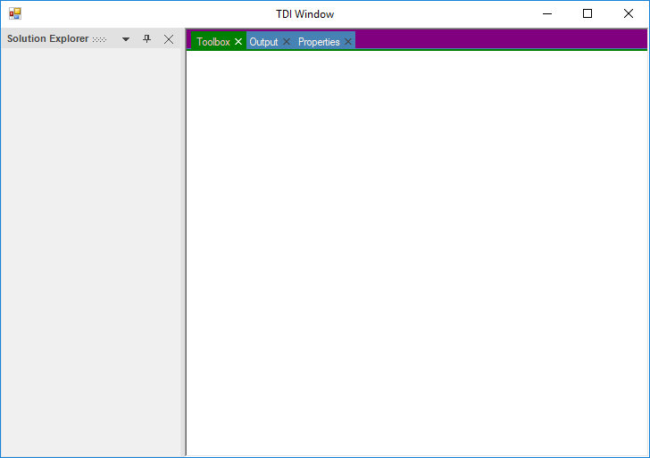





this.dockingManager1.DocumentWindowSettings.TabHeight = 38;
this.dockingManager1.DocumentWindowSettings.TabFont = new Font("Arial", 9, FontStyle.Italic);
this.dockingManager1.DocumentWindowSettings.ActiveTabFont = new Font("Automatic", 9, FontStyle.Bold);





Me.dockingManager1.DocumentWindowSettings.TabHeight = 38 Me.dockingManager1.DocumentWindowSettings.TabFont = New Font("Arial", 9, FontStyle.Italic)
Me.dockingManager1.DocumentWindowSettings.ActiveTabFont = New Font("Automatic", 9, FontStyle.Bold)





## Customize auto hide window

In docking manager, you can customize the AutoHidden window tabs foreground, font, and tab panel background color.

### Customize auto hide tab

The font style of the auto hidden tabs can be customized by using the [AutoHideTabFont](https://help.syncfusion.com/cr/windowsforms/Syncfusion.Windows.Forms.Tools.DockingManager.html#Syncfusion_Windows_Forms_Tools_DockingManager_AutoHideTabFont) property of the docking manager. The height of AutoHidden tab control can be customized by using the [AutoHideTabHeight](https://help.syncfusion.com/cr/windowsforms/Syncfusion.Windows.Forms.Tools.DockingManager.html#Syncfusion_Windows_Forms_Tools_DockingManager_AutoHideTabHeight) property.

N> This setting will effect only when the [DockingManager.VisualStyle](https://help.syncfusion.com/cr/windowsforms/Syncfusion.Windows.Forms.Tools.DockingManager.html#Syncfusion_Windows_Forms_Tools_DockingManager_VisualStyle) property is set as default.





//Setting Auto hide tab Font style

this.dockingManager1.AutoHideTabFont = new System.Drawing.Font("Arial", 9.75F, ((System.Drawing.FontStyle)(((System.Drawing.FontStyle.Bold | System.Drawing.FontStyle.Italic) 

| System.Drawing.FontStyle.Underline))), System.Drawing.GraphicsUnit.Point, ((System.Byte)(0)));

//Setting Auto hide tab height

this.dockingManager1.AutoHideTabHeight = 35;





'Setting Auto hide tab Font style

Me.DockingManager1.AutoHideTabFont = New System.Drawing.Font("Arial", 9.75!, CType(((System.Drawing.FontStyle.Bold Or System.Drawing.FontStyle.Italic) _

Or System.Drawing.FontStyle.Underline), System.Drawing.FontStyle), System.Drawing.GraphicsUnit.Point, CType(0, Byte))

Me.DockingManager1.AutoHideTabHeight = 35





The fore color of the auto hidden tabs can be customized by using the [AutoHideTabForeColor](https://help.syncfusion.com/cr/windowsforms/Syncfusion.Windows.Forms.Tools.DockingManager.html#Syncfusion_Windows_Forms_Tools_DockingManager_AutoHideTabForeColor) property.





//Setting Auto hide tab fore color

this.dockingManager1.AutoHideTabForeColor = System.Drawing.Color.Red;





'Setting Auto hide tab fore color

Me.dockingManager1.AutoHideTabForeColor = System.Drawing.Color.Red





### Customize auto hide panel

The background color of the auto hide window can be customized using the property named [TabPanelBackcolor](https://help.syncfusion.com/cr/windowsforms/Syncfusion.Windows.Forms.Tools.TabControlAdv.html#Syncfusion_Windows_Forms_Tools_TabControlAdv_TabPanelBackColor) in the AHTabControl. All the auto hide TabControls can be get from the [GetAHTabControl](https://help.syncfusion.com/cr/windowsforms/Syncfusion.Windows.Forms.Tools.MainFormController.html#Syncfusion_Windows_Forms_Tools_MainFormController_GetAHTabControl_Syncfusion_Windows_Forms_Tools_DockingStyle_) function of MainFormController by specifying the side of auto hide TabControl. The following code is used to customize the back color.





DockHost dockHost = this.dockingManager1.ControlsArray[0].Parent as DockHost; 

DockHostController dockHostController = dockHost.InternalController as DockHostController; 
 
MainFormController mainFormController = dockHostController.ParentController.ToplevelController as MainFormController; 
         
AHTabControl ahTabCtrlLeft = mainFormController.GetAHTabControl(DockingStyle.Left); 

ahTabCtrlLeft.TabPanelBackColor = Color.Yellow; 

AHTabControl ahTabCtrlBottom = mainFormController.GetAHTabControl(DockingStyle.Bottom); 

ahTabCtrlBottom.TabPanelBackColor = Color.Green; 

AHTabControl ahTabCtrlRight = mainFormController.GetAHTabControl(DockingStyle.Right); 

ahTabCtrlRight.TabPanelBackColor = Color.Gray; 

AHTabControl ahTabCtrlTop = mainFormController.GetAHTabControl(DockingStyle.Top); 

ahTabCtrlTop.TabPanelBackColor = Color.YellowGreen; 





Dim dockHost As DockHost = TryCast(Me.panel1.Parent, DockHost)

Dim dockHostController As DockHostController = TryCast(dockHost.InternalController, DockHostController)

Dim mainFormController As MainFormController = TryCast(dockHostController.ParentController.ToplevelController, MainFormController)

Dim ahTabCtrlBottom As AHTabControl = mainFormController.GetAHTabControl(DockingStyle.Bottom)

ahTabCtrlBottom.TabPanelBackColor = Color.Red

Dim ahTabCtrlLeft As AHTabControl = mainFormController.GetAHTabControl(DockingStyle.Left)

ahTabCtrlLeft.TabPanelBackColor = Color.Green

Dim ahTabCtrlRight As AHTabControl = mainFormController.GetAHTabControl(DockingStyle.Right)

ahTabCtrlRight.TabPanelBackColor = Color.Yellow

Dim ahTabCtrlTop As AHTabControl = mainFormController.GetAHTabControl(DockingStyle.Top)

ahTabCtrlTop.TabPanelBackColor = Color.Gray





## Customization with Metro style

In the docking manager, you can customize the default caption color and button color of docked or dockable windows for metro style. 

### Changing the Metro style floating window border width

The border width of the floating form can be set according to the user requirement by using the [MetroBorderWidth](https://help.syncfusion.com/cr/windowsforms/Syncfusion.Windows.Forms.Tools.DockingManager.html#Syncfusion_Windows_Forms_Tools_DockingManager_MetroBorderWidth) property.





//Setting border width of the floating form

this.dockingManager1.MetroBorderWidth = 10;





'Setting border width of the floating form

Me.dockingManager1.MetroBorderWidth = 10





### Show/hide dotted lines Metro style caption

The menu color and button color can be customized by using the [MetroCaptionColor](https://help.syncfusion.com/cr/windowsforms/Syncfusion.Windows.Forms.Tools.DockingManager.html#Syncfusion_Windows_Forms_Tools_DockingManager_MetroCaptionColor) and [MetroButtonColor](https://help.syncfusion.com/cr/windowsforms/Syncfusion.Windows.Forms.Tools.DockingManager.html#Syncfusion_Windows_Forms_Tools_DockingManager_MetroButtonColor) properties that are present in the caption bar of the docking manager. The backcolor of active docked or dockable windows can be customized by the [MetroColor](https://help.syncfusion.com/cr/windowsforms/Syncfusion.Windows.Forms.Tools.DockingManager.html#Syncfusion_Windows_Forms_Tools_DockingManager_MetroColor) property. You can enable or disable the dotted lines on the caption bar by using the [ShowMetroCaptionDottedLines](https://help.syncfusion.com/cr/windowsforms/Syncfusion.Windows.Forms.Tools.DockingManager.html#Syncfusion_Windows_Forms_Tools_DockingManager_ShowMetroCaptionDottedLines) property.





//Gets or sets the color value of caption in metro style DockingManager.

this.dockingManager1.MetroCaptionColor = Color.Yellow;

//Gets or sets the color value of button in metro style DockingManager.

this.dockingManager1.MetroButtonColor = Color.Green;

//Setting active docked control back color

this.dockingManager1.MetroColor = System.Drawing.Color.Red;

//Helps to disable the dotted lines showing on the CaptionBar

this.dockingManager1.ShowMetroCaptionDottedLines = false;





'Gets or sets the color value of caption in metro style DockingManager.

Me.dockingManager1.MetroCaptionColor = Color.Yellow

'Gets or sets the color value of button in metro style DockingManager.

Me.dockingManager1.MetroButtonColor = Color.Green

'Setting active docked control back color

Me.dockingManager1.MetroColor = System.Drawing.Color.Red

'Helps to disable the dotted lines showing on the CaptionBar

Me.dockingManager1.ShowMetroCaptionDottedLines = False





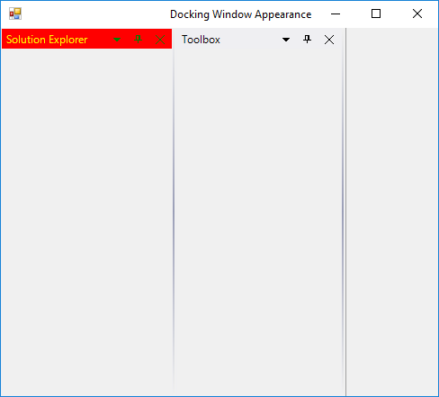


 
[Visual Styles](https://help.syncfusion.com/windowsforms/docking-manager/appearance#visual-styles)



## Change dock provider styles

The docking manager control helps to drag a docked control using the [DragProviderStyle](https://help.syncfusion.com/cr/windowsforms/Syncfusion.Windows.Forms.Tools.DockingManager.html#Syncfusion_Windows_Forms_Tools_DockingManager_DragProviderStyle) property. By setting this property, you can see arrows on four sides of the form when the control is dragged. These arrows guide you where the window should be docked. Keeping the mouse pointer on a particular arrow displays a shadow such as an appearance based on the side of docking.

The following are some of the available docking provider styles:

* Standard (Default value: no arrows appears for this option)
* VS2005
* VS2008
* VS2010
* VS2012
* Whidbey
* Office2016Colorful
* Office2016DarkGray
* Office2016Black
 




this.dockingManager1.DragProviderStyle = Syncfusion.Windows.Forms.Tools.DragProviderStyle.VS2008;





Me.dockingManager1.DragProviderStyle = Syncfusion.Windows.Forms.Tools.DragProviderStyle.VS2008





* VS2005 

* VS2008

 

* VS2010

 

* VS2012

* Whidbey

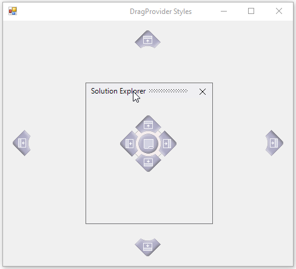 

* Office2016Colorful

 

* Office2016DarkGray

* Office2016Black 

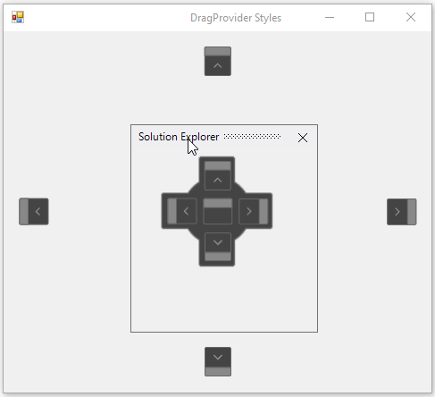

## Right-to-left

`Docking manager` control elements can be aligned in right-to-left layout when the HostControl [RightToLeft](https://help.syncfusion.com/cr/windowsforms/Syncfusion.Windows.Forms.Tools.DockingManager.html#Syncfusion_Windows_Forms_Tools_DockingManager_RightToLeft) value is set to `yes`.





//Enable the Right to Left 

this.dockingManager1.HostControl = this;

this.RightToLeft = RightToLeft.Yes;



l

'Enable the Right to Left 

Me.dockingManager1.HostControl = this

Me.RightToLeft = RightToLeft.Yes





