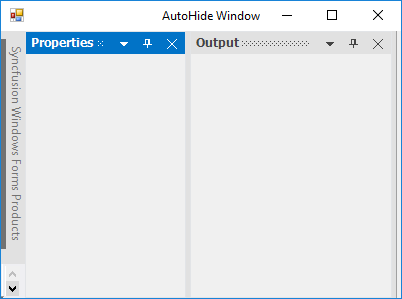

# Auto Hide Window in Windows Forms Docking Manager

The docking manager provides auto hide facility to the docked control. When the auto hide button (pin) is clicked, the docked controls will be hidden and placed along the side of the container control where it was placed.

When mouse is moved over it, the auto hidden control will be displayed. When the auto hide button is clicked again, the control will restore its appearance.

## Configuring window in different sides

The docked controls will be placed at anywhere such as left, right, top, or bottom using the [DockingStyle](https://help.syncfusion.com/cr/windowsforms/Syncfusion.Windows.Forms.Tools.DockingStyle.html) of the particular control. If the control is docked to the left, when clicking the auto hide button, the control will be hidden to the left.

## Enabling/disabling the auto hide functionality

The pin button that performs auto hide functionality can be visible by default. It can be made to invisible by disabling the auto hide functionality using the [AutoHideEnabled](https://help.syncfusion.com/cr/windowsforms/Syncfusion.Windows.Forms.Tools.DockingManager.html#Syncfusion_Windows_Forms_Tools_DockingManager_AutoHideEnabled) property.





//To disable the auto hide functionality.

 this.dockingManager1.AutoHideEnabled = false;





'To disable the auto hide functionality.

 Me.dockingManager1.AutoHideEnabled = False
 




## Auto hide programmatically

The docking manager allows to auto hide the panel by mouse interaction and provides the way to change the panel state programmatically. The [SetAutoHideMode](https://help.syncfusion.com/cr/windowsforms/Syncfusion.Windows.Forms.Tools.DockingManager.html#Syncfusion_Windows_Forms_Tools_DockingManager_SetAutoHideMode_System_Windows_Forms_Control_System_Boolean_) function allows to change the panel state to auto hide state, which is passed as its argument.





// Sets panel1 as AutoHidden window

this.dockingManager1.SetAutoHideMode(panel1, true); //false to remove auto hide state.





'Sets panel1 as AutoHidden window

Me.dockingManager1.SetAutoHideMode(panel1, True) 'false to remove auto hide state.





By using the [GetAutoHideMode](https://help.syncfusion.com/cr/windowsforms/Syncfusion.Windows.Forms.Tools.DockingManager.html#Syncfusion_Windows_Forms_Tools_DockingManager_GetAutoHideMode_System_Windows_Forms_Control_) function, you can know whether the control is in auto hidden state or not.





MessageBox.Show("Panel1 is in AutoHide State:" + this.dockingManager1.GetAutoHideMode(panel1).ToString());





MessageBox.Show("Panel1 is in AutoHide State:" & Me.dockingManager1.GetAutoHideMode(panel1).ToString())





## Change auto hide side 

By default, panels will be auto hidden to side where the container resides. The docking manager provides options to create an auto hide tab control that is independent to the container side. The [DockControlInAutoHideMode](https://help.syncfusion.com/cr/windowsforms/Syncfusion.Windows.Forms.Tools.DockingManager.html#Syncfusion_Windows_Forms_Tools_DockingManager_DockControlInAutoHideMode_System_Windows_Forms_Control_Syncfusion_Windows_Forms_Tools_DockingStyle_System_Int32_) function of docking manager enables docking a control and hides that in the specified edge of HostControl.





this.dockingManager1.DockControlInAutoHideMode(panel1, Syncfusion.Windows.Forms.Tools.DockingStyle.Top, 100);





'Sets panel1 as AutoHidden window

Me.dockingManager1.DockControlInAutoHideMode(panel1, Syncfusion.Windows.Forms.Tools.DockingStyle.Top, 100)





## Auto hide all dock windows on loading

The [SetAutoHideOnLoad](https://help.syncfusion.com/cr/windowsforms/Syncfusion.Windows.Forms.Tools.DockingManager.html#Syncfusion_Windows_Forms_Tools_DockingManager_SetAutoHideOnLoad_System_Windows_Forms_Control_System_Boolean_) function of docking manager is used to auto hide all the child windows while loading the control.





this.dockingManager1.SetAutoHideOnLoad(this.panel1, true);

this.dockingManager1.SetAutoHideOnLoad(this.panel3, true);





Me.dockingManager1.SetAutoHideOnLoad(this.panel1, True);

Me.dockingManager1.SetAutoHideOnLoad(this.panel3, True);





### Scroll auto hidden tabs

When the AutoHidden Tabs overflow onto the side panel, the ScrollButton is added to the side panel. In other words, the scroll bar will be visible in AutoHide tab panel, only when child bounds exceeded to auto hide tab panel bounds. Using the scrollbar, you can select the tabs in auto hide panel by navigating the scroll buttons.

## Display full caption in auto hidden tab

Create a docked window with two ListBoxes, and dock the controls. Tab the controls and set the [FullCaptionsInAutoHideMode](https://help.syncfusion.com/cr/windowsforms/Syncfusion.Windows.Forms.Tools.DockingManager.html#Syncfusion_Windows_Forms_Tools_DockingManager_FullCaptionsInAutoHideMode) property. Setting this property to `true`, will display the full caption text in the auto hidden tab's page. It displays full caption within the application using a scrollbar, so the end user can scroll and view the hidden tab’s full caption.





//To display full caption in AutoHide mode.

this.dockingManager1.FullCaptionsInAutoHideMode = true;





'To display full caption in AutoHide mode.

Me.dockingManager1.FullCaptionsInAutoHideMode = True





## Re-order auto hidden tabs

The docked controls that are auto hidden can be dragged with their tabs, and can be docked or set for floating by setting the [EnableDragAutoHiddenTabs](https://help.syncfusion.com/cr/windowsforms/Syncfusion.Windows.Forms.Tools.DockingManager.html#Syncfusion_Windows_Forms_Tools_DockingManager_EnableDragAutoHiddenTabs) property to `true`.





//To enable dragging for AutoHide mode.

this.dockingManager1.EnableDragAutoHiddenTabs = true;





'To enable dragging for AutoHide mode.

Me.dockingManager1.EnableDragAutoHiddenTabs = True





## Auto hide selection style

The docking manager pops up the content of auto hidden window by hovering the mouse over corresponding tab page. Auto hide animation can be initiated in two ways either by mouse hovering or clicking the auto hidden tab. This behavior of docking manager can be enabled by setting the [AutoHideSelectionStyle](https://help.syncfusion.com/cr/windowsforms/Syncfusion.Windows.Forms.Tools.DockingManager.html#Syncfusion_Windows_Forms_Tools_DockingManager_AutoHideSelectionStyle) property.

### Pop-up auto hidden window by mouse hover

This behavior of docking manager can be enabled by setting the [AutoHideSelectionStyle](https://help.syncfusion.com/cr/windowsforms/Syncfusion.Windows.Forms.Tools.DockingManager.html#Syncfusion_Windows_Forms_Tools_DockingManager_AutoHideSelectionStyle) property to `MouseHover`.





//To set auto hide selection style as Click.

this.dockingManager1.AutoHideSelectionStyle = Syncfusion.Windows.Forms.Tools.AutoHideSelectionStyle.MouseHover;





'To set AutoHide selection style as Click.

Me.dockingManager1.AutoHideSelectionStyle = Syncfusion.Windows.Forms.Tools.AutoHideSelectionStyle.MouseHover





### Pop-up auto hidden window by mouse click

This behavior of docking manager can be enabled by setting the [AutoHideSelectionStyle](https://help.syncfusion.com/cr/windowsforms/Syncfusion.Windows.Forms.Tools.DockingManager.html#Syncfusion_Windows_Forms_Tools_DockingManager_AutoHideSelectionStyle) property to `Click`.





//To set auto hide selection style as Click.

this.dockingManager1.AutoHideSelectionStyle = Syncfusion.Windows.Forms.Tools.AutoHideSelectionStyle.Click;





'To set AutoHide selection style as Click.

Me.dockingManager1.AutoHideSelectionStyle = Syncfusion.Windows.Forms.Tools.AutoHideSelectionStyle.Click





## Auto hide group/active

In docking manager, you can auto hide the active control by using [AutoHideActiveControl](https://help.syncfusion.com/cr/windowsforms/Syncfusion.Windows.Forms.Tools.DockingManager.html#Syncfusion_Windows_Forms_Tools_DockingManager_AutoHideActiveControl) property.





this.dockingManager1.AutoHideActiveControl = false;





Me.dockingManager1.AutoHideActiveControl = False





## Animation speed

The [AnimationStep](https://help.syncfusion.com/cr/windowsforms/Syncfusion.Windows.Forms.Tools.DockingManager.html#Syncfusion_Windows_Forms_Tools_DockingManager_AnimationStep) property in the docking manager helps to control the animation speed of the AutoHidden controls.





DockingManager.AnimationStep = arg.Bounds.Width;





'Prevent the tabbed controls from moving

DockingManager.AnimationStep = arg.Bounds.Width





## Auto hide interval

By using the [AutoHideInterval](https://help.syncfusion.com/cr/windowsforms/Syncfusion.Windows.Forms.Tools.DockingManager.html#Syncfusion_Windows_Forms_Tools_DockingManager_AutoHideInterval) property of docking manager, you can delay the display time of the auto hide window. The default value of this property is `400` millisecond.





this.dockingManager1.AutoHideInterval=3000;





'Prevent the tabbed controls from moving

Me.dockingManager1.AutoHideInterval=3000





## Enable/disable animation

The animation functionality in auto hidden windows can be enabled or disabled by using the [AnimateAutoHiddenWindow](https://help.syncfusion.com/cr/windowsforms/Syncfusion.Windows.Forms.Tools.DockingManager.html#Syncfusion_Windows_Forms_Tools_DockingManager_AnimateAutoHiddenWindow) property of docking manager.





this.dockingManager1.AnimateAutoHiddenWindow = false;





this.dockingManager1.AnimateAutoHiddenWindow = False





## Enable/disable the context menu 

When the docked control is in auto hide mode, an unique context menu will be displayed while right clicking the auto hide tabs, similar to Visual Studio. The [EnableAutoHideTabContextMenu](https://help.syncfusion.com/cr/windowsforms/Syncfusion.Windows.Forms.Tools.DockingManager.html#Syncfusion_Windows_Forms_Tools_DockingManager_EnableAutoHideTabContextMenu) property should be `true`.





this.dockingManager1.EnableAutoHideTabContextMenu = true;





Me.dockingManager1.EnableAutoHideTabContextMenu = True





The following image illustrates the context menu features.

