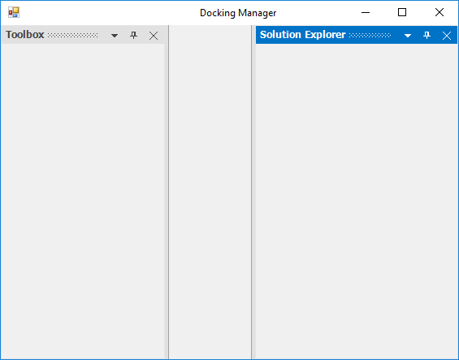
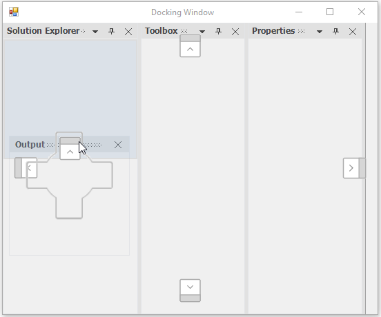

# Dealing with docking child in Windows Forms Docking Manager

This section explains about resizing and positioning of child windows in DockingManager. And also explains customizing the visibility of caption button and context menu of docking child windows.

## Docked Children

The docking manager allows you to dock the control on any of the four sides of the container control, and this provides docking hints when dragging the panel over it. This preview explains how the layout looks after dropping the panel to dock.

### Get order of the docked child

Arrangement of child elements in the `DockingManager` is based on the order in which child has been added. You can get the order of controls that is added as a child of the docking manager using the `DockAreaControllers` property. For instance, the child elements have been iterated from the collection of DockAreaControllers and displayed the DockLabel of child element in the output window.





 for (int i = 0; i < dockingManager1.DockAreaControllers.Count; i++)
 {
      if (dockingManager1.DockAreaControllers[i] is DockHostController)
      {
           Console.WriteLine((dockingManager1.DockAreaControllers[i] as DockHostController).DockLabel);
      }
 }





For i As Integer = 0 To dockingManager1.DockAreaControllers.Count - 1
       If TypeOf dockingManager1.DockAreaControllers(i) Is DockHostController Then
	    Console.WriteLine((TryCast(dockingManager1.DockAreaControllers(i), DockHostController)).DockLabel)
       End If
Next i





## Activate window
 
The docking manager [ActivateControl](https://help.syncfusion.com/cr/windowsforms/Syncfusion.Windows.Forms.Tools.DockingManager.html#Syncfusion_Windows_Forms_Tools_DockingManager_ActivateControl_System_Windows_Forms_Control_) function helps to activate the particular docked control.





// In any event handler (eg:Button_Click)

this.dockingManager1.ActivateControl(this.panel1); 





'In any event handler (eg:Button_Click)

Me.DockingManager1.ActivateControl(Me.panel1) 
 




## Identify whether the window is docking or not

The docking manager [IsFloating](https://help.syncfusion.com/cr/windowsforms/Syncfusion.Windows.Forms.Tools.DockingManager.html#Syncfusion_Windows_Forms_Tools_DockingManager_IsFloating_System_Windows_Forms_Control_) function returns `false` if the control is in docked state and `true` if the control is in floating state.





MessageBox.Show(this.dockingManager1.IsFloating(this.panel1).ToString());





MessageBox.Show(Me.dockingManager1.IsFloating(Me.panel1).ToString());





## Set size for docking children

You can set the size for particular docked controls.

### Desire width

The desired width of dock windows can be set using the [DockControl](https://help.syncfusion.com/cr/windowsforms/Syncfusion.Windows.Forms.Tools.DockingManager.html#Syncfusion_Windows_Forms_Tools_DockingManager_DockControl_System_Windows_Forms_Control_System_Windows_Forms_Control_Syncfusion_Windows_Forms_Tools_DockingStyle_System_Int32_) function as shown in the following code snippets.





this.dockingManager1.DockControl(this.panel1, this, Syncfusion.Windows.Forms.Tools.DockingStyle.Right, 250);





Me.dockingManager1.DockControl(Me.panel1, Me, Syncfusion.Windows.Forms.Tools.DockingStyle.Right, 250)





## Size constraint for dock children

The docking manager provides option to restrict user to resize the dock panel to specified minimum size. The [SetControlMinimumSize](https://help.syncfusion.com/cr/windowsforms/Syncfusion.Windows.Forms.Tools.DockingManager.html#Syncfusion_Windows_Forms_Tools_DockingManager_SetControlMinimumSize_System_Windows_Forms_Control_System_Drawing_Size_) function helps to set the minimum size of docked control.





//Set the minimum size of docked control using the SetControlMinimumSize method

this.dockingManager1.SetControlMinimumSize(panel1,new Size(200, 400));





'Set the minimum size of docked control using the SetControlMinimumSize method

Me.dockingManager1.SetControlMinimumSize(panel1,new Size(200, 400))



 

## Restrict to dock on specific sides

You can restrict the specific [DockAbility](https://help.syncfusion.com/cr/windowsforms/Syncfusion.Windows.Forms.Tools.DockAbility.html) of child window when it is moved to the client area in the docking manager.

### Inner dock ability

The [SetDockAbility](https://help.syncfusion.com/cr/windowsforms/Syncfusion.Windows.Forms.Tools.DockingManager.html#Syncfusion_Windows_Forms_Tools_DockingManager_SetDockAbility_System_Windows_Forms_Control_Syncfusion_Windows_Forms_Tools_DockAbility_) function helps to get or set the DockAbility of docked control using another child window that can be docked inside the docked control. The [GetDockAbility](https://help.syncfusion.com/cr/windowsforms/Syncfusion.Windows.Forms.Tools.DockingManager.html#Syncfusion_Windows_Forms_Tools_DockingManager_GetDockAbility_System_Windows_Forms_Control_) provides the dock ability information of the docked panel.





//Getting the Dock Ability

this.dockingManager1.GetDockAbility(this.panel1);

//Setting the Dock Ability

this.dockingManager1.SetDockAbility(this.panel1, "Top");





//Getting the Dock Ability

Me.dockingManager1.GetDockAbility(Me.panel1)

//Setting the Dock Ability

Me.dockingManager1.SetDockAbility(Me.panel1, "Top")



  

### Outer dock ability
 
The [SetOuterDockAbility](https://help.syncfusion.com/cr/windowsforms/Syncfusion.Windows.Forms.Tools.DockingManager.html#Syncfusion_Windows_Forms_Tools_DockingManager_SetOuterDockAbility_System_Windows_Forms_Control_Syncfusion_Windows_Forms_Tools_DockAbility_) function helps to restrict the DockAbility of child window to any particular side when it is moved to the client area. In the following code snippet, the right, left, tabbed, and fill dock abilities have been restricted.





this.dockingManager1.SetOuterDockAbility(child, Syncfusion.Windows.Forms.Tools.DockAbility.Top | Syncfusion.Windows.Forms.Tools.DockAbility.Bottom);





Me.dockingManager1.SetOuterDockAbility(panel1, Syncfusion.Windows.Forms.Tools.DockAbility.Top Or Syncfusion.Windows.Forms.Tools.DockAbility.Bottom)





## Tooltip for caption buttons

By default, the tooltip will be displayed for caption buttons in a docked control when the mouse is moved over it.

### Change tooltip

The following functions are provided to retrieve and manipulate the tooltip displayed in caption buttons.

 * [SetCloseButtonToolTip](https://help.syncfusion.com/cr/windowsforms/Syncfusion.Windows.Forms.Tools.DockingManager.html#Syncfusion_Windows_Forms_Tools_DockingManager_SetCloseButtonToolTip_System_String_): Sets tooltip for close button in the caption bar of the docked window.

 * [GetCloseButtonToolTip](https://help.syncfusion.com/cr/windowsforms/Syncfusion.Windows.Forms.Tools.DockingManager.html#Syncfusion_Windows_Forms_Tools_DockingManager_GetCloseButtonToolTip): Gets the tooltip for close button in the caption bar of the docked window.

 * [SetAutoHideButtonToolTip](https://help.syncfusion.com/cr/windowsforms/Syncfusion.Windows.Forms.Tools.DockingManager.html#Syncfusion_Windows_Forms_Tools_DockingManager_SetAutoHideButtonToolTip_System_String_): Sets tooltip for AutoHide button in the caption bar of the docked window.

 * [GetAutoHideButtonToolTip](https://help.syncfusion.com/cr/windowsforms/Syncfusion.Windows.Forms.Tools.DockingManager.html#Syncfusion_Windows_Forms_Tools_DockingManager_GetAutoHideButtonToolTip): Gets the tooltip for AutoHide button in the caption bar of the docked window.

 * [SetMenuButtonToolTip](https://help.syncfusion.com/cr/windowsforms/Syncfusion.Windows.Forms.Tools.DockingManager.html#Syncfusion_Windows_Forms_Tools_DockingManager_SetMenuButtonToolTip_System_String_): Sets the tooltip for menu button in the caption bar of the docked window.

 * [GetMenuButtonToolTip](https://help.syncfusion.com/cr/windowsforms/Syncfusion.Windows.Forms.Tools.DockingManager.html#Syncfusion_Windows_Forms_Tools_DockingManager_GetMenuButtonToolTip): Gets the tooltip for AutoHide button in the caption bar of the docked window.

The following code demonstrates the usage of these functions:





this.dockingManager1.SetCloseButtonToolTip("Close"); 

this.dockingManager1.GetCloseButtonToolTip(); 





Me.dockingManager1.SetCloseButtonToolTip("Close")

Me.dockingManager1.GetCloseButtonToolTip()





### Super tooltip

The docking manager displays a SuperToolTip for dock caption buttons by enabling the [EnableSuperTooltip](https://help.syncfusion.com/cr/windowsforms/Syncfusion.Windows.Forms.Tools.DockingManager.html#Syncfusion_Windows_Forms_Tools_DockingManager_EnableSuperToolTip) property. For this, the SuperTooltip control should be dragged and dropped to the form and it should be selected in the [DockingManager.SuperTooltip](https://help.syncfusion.com/cr/windowsforms/Syncfusion.Windows.Forms.Tools.DockingManager.html#Syncfusion_Windows_Forms_Tools_DockingManager_SuperToolTip) property.

A SuperToolTip can be added to the docking manager programmatically using the following code snippet.





private Syncfusion.Windows.Forms.Tools.SuperToolTip superToolTip1 = new Syncfusion.Windows.Forms.Tools.SuperToolTip(this);

this.dockingManager1.ShowToolTips = true;

this.dockingManager1.EnableSuperToolTip = true;

this.dockingManager1.SuperToolTip = this.superToolTip1;





Private superToolTip1 As Syncfusion.Windows.Forms.Tools.SuperToolTip

Me.superToolTip1 = New Syncfusion.Windows.Forms.Tools.SuperToolTip(Me)

Me.dockingManager1.ShowToolTips = True

Me.dockingManager1.EnableSuperToolTip = True

Me.dockingManager1.SuperToolTip = Me.superToolTip1





 

Text for the SuperToolTip and other customizing options can be specified for a particular button by using the CaptionButton Collection Editor.

 

### Change tooltip interval

The [ToolTipInterval](https://help.syncfusion.com/cr/windowsforms/Syncfusion.Windows.Forms.Tools.DockingManager.html#Syncfusion_Windows_Forms_Tools_DockingManager_ToolTipInterval) property is used to get or set the interval of showing the tooltip in docked, tabbed, and auto hide windows. Its default value is `5000`.





this.dockingManager1.ToolTipInterval = 1000;





Me.dockingManager1.ToolTipInterval = 1000



 

### Balloon style tooltip

The [UseBalloonStyleToolTip](https://help.syncfusion.com/cr/windowsforms/Syncfusion.Windows.Forms.Tools.DockingManager.html#Syncfusion_Windows_Forms_Tools_DockingManager_UseBalloonStyleToolTip) property helps to set the BalloonStyleToolTip for docked, tabbed, and auto hide windows.





this.dockingManager1.UseBalloonStyleToolTip = true;





Me.dockingManager1.UseBalloonStyleToolTip = True





 

### Show/hide tooltip

You can show or hide the tooltip in docked, tabbed, and auto hide windows using the [ShowToolTips](https://help.syncfusion.com/cr/windowsforms/Syncfusion.Windows.Forms.Tools.DockingManager.html#Syncfusion_Windows_Forms_Tools_DockingManager_ShowToolTips) property. The default value of this property is `true`. To hide the tooltip, set the ShowToolTips property to `false`.

N> The [EnableSuperTooltip](https://help.syncfusion.com/cr/windowsforms/Syncfusion.Windows.Forms.Tools.DockingManager.html#Syncfusion_Windows_Forms_Tools_DockingManager_EnableSuperToolTip) property should be set to `false` to effect the above default tooltip.

## Remove particular caption button

You can remove the particular caption button by using [CaptionButton](https://help.syncfusion.com/cr/windowsforms/Syncfusion.Windows.Forms.Tools.DockingManager.html#Syncfusion_Windows_Forms_Tools_DockingManager_CaptionButtons) collection. The following code example illustrates how to remove close button in the docking manager. The following CaptionButton text can be used for removing particular caption button in the docking child window.

<table>
<tr>
<th>
CaptionButton</th><th>
Corresponding text</th></tr>
<tr>
<td>
Close</td>
<td> 
CloseButton </td></tr>
<tr>
<td>
Pin
</td><td>
PinButton
</td></tr>
<tr>
<td>
Menu
</td><td>
MenuButton
</td></tr>
<tr>
<td>
Maximize
</td><td>
MaximizeButton
</td></tr>
<tr>
<td>
Restore
</td><td>
RestoreButton
</td></tr>
</table>





//Hide the CloseButton for all the Controls that are DockEnabled.

for (int i = 0; i < this.dockingManager1.CaptionButtons.Count; i++)
{
   if (this.dockingManager1.CaptionButtons[i].Name == "CloseButton")
   {
      this.dockingManager1.CaptionButtons.RemoveAt(i);
   }
}





Dim i As Integer = 0

Do While i < Me.dockingManager1.CaptionButtons.Count

If Me.dockingManager1.CaptionButtons(i).Name = "CloseButton" Then

Me.dockingManager1.CaptionButtons.RemoveAt(i)

End If

i += 1

Loop

End Sub





 

## Remove context menu for particular control

The [SetMenuButtonVisibility](https://help.syncfusion.com/cr/windowsforms/Syncfusion.Windows.Forms.Tools.DockingManager.html#Syncfusion_Windows_Forms_Tools_DockingManager_SetMenuButtonVisibility_System_Windows_Forms_Control_System_Boolean_) function helps to show/hide the menu button in the caption bar of the particular window. The [GetMenuButtonVisibility](https://help.syncfusion.com/cr/windowsforms/Syncfusion.Windows.Forms.Tools.DockingManager.html#Syncfusion_Windows_Forms_Tools_DockingManager_GetMenuButtonVisibility_System_Windows_Forms_Control_) function returns a bool value according to visibility of the menu button.





this.dockingManager1.SetMenuButtonVisibility(this.panel1, false); //true to show again

this.dockingManager1.GetMenuButtonVisibility(this.panel1); //true when button is visible, false otherwise.





Me.dockingManager1.SetMenuButtonVisibility(Me.panel1, False) 'true to show again

Me.dockingManager1.GetMenuButtonVisibility(Me.panel1) 'true when button is visible, false otherwise.





## Remove particular menu item from context menu

Context menu items in the dock window caption can be customized using the [DockContextMenu](https://help.syncfusion.com/cr/windowsforms/Syncfusion.Windows.Forms.Tools.DockingManager.html) event. The [DockContextMenuEventArgs](https://help.syncfusion.com/cr/windowsforms/Syncfusion.Windows.Forms.Tools.DockContextMenuEventArgs.html) allows to remove the menu items using its ContextMenu option.


 
[Removed menu button from caption in particular dock window](https://help.syncfusion.com/windowsforms/dockingmanager/dock-window#remove-specific-default-menu-item-from-context-menu)


