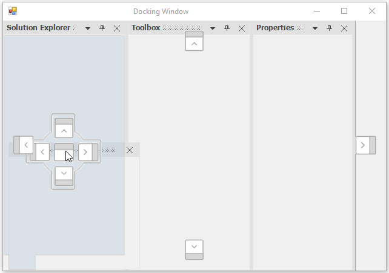
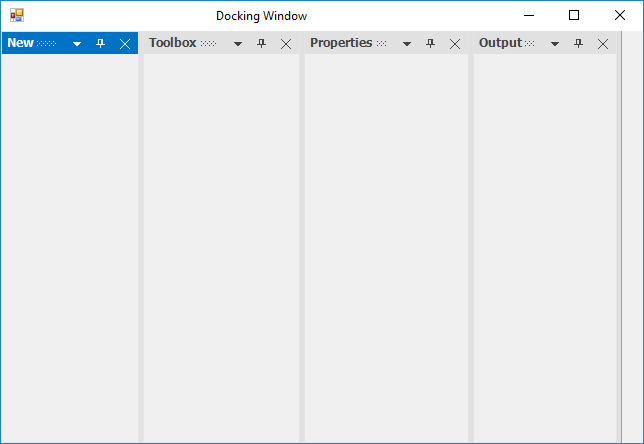
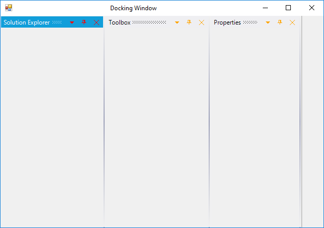
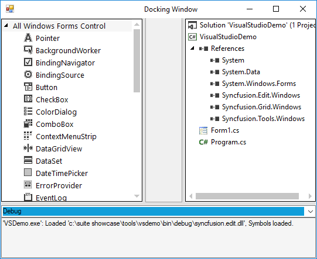
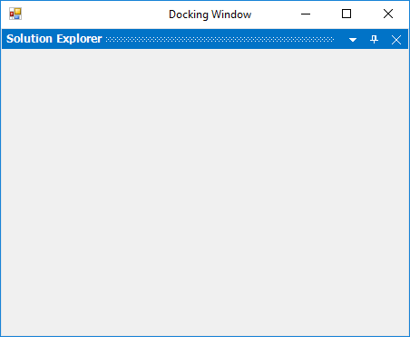
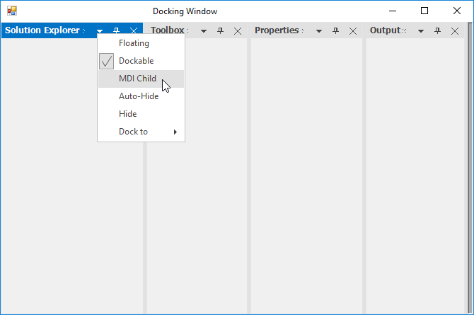

# Dock Window in Windows Forms Docking Manager

The docking manager allows you to dock the control on any of the four sides of the container control, and provides docking hints while dragging the panel over it. This preview will provide information about how the layout will look after dropping the panel to dock.

## Enable/disable dock functionality

The docking functionality can be enabled or disabled by setting the Boolean value as `true` or `false` in the [SetEnableDocking](https://help.syncfusion.com/cr/windowsforms/Syncfusion.Windows.Forms.Tools.DockingManager.html#Syncfusion_Windows_Forms_Tools_DockingManager_SetEnableDocking_System_Windows_Forms_Control_System_Boolean_) function.





//To enable the docking functionality.

this.dockingManager1.SetEnableDocking(this.panel1, true);

this.dockingManager1.SetEnableDocking(this.panel2, true);

this.dockingManager1.SetEnableDocking(this.panel3, true);

this.dockingManager1.SetEnableDocking(this.panel4, true);





'To enable the docking functionality.

Me.dockingManager1.SetEnableDocking(Me.panel1, True)

Me.dockingManager1.SetEnableDocking(Me.panel2, True)

Me.dockingManager1.SetEnableDocking(Me.panel3, True)

Me.dockingManager1.SetEnableDocking(Me.panel4, True)
 




## Change dock side of children

The docking manager allows you to specify the docking type and bounds of the docked control using the [DockControl](https://help.syncfusion.com/cr/windowsforms/Syncfusion.Windows.Forms.Tools.DockingManager.html#Syncfusion_Windows_Forms_Tools_DockingManager_DockControl_System_Windows_Forms_Control_System_Windows_Forms_Control_Syncfusion_Windows_Forms_Tools_DockingStyle_System_Int32_) function.

The following are the five sides that can be docked by the control:

* Left
* Right
* Top
* Bottom
* Tabbed
* Fill





this.dockingManager1.DockControl(this.panel1, this, Syncfusion.Windows.Forms.Tools.DockingStyle.Bottom, 100);

this.dockingManager1.DockControl(this.panel2, this, Syncfusion.Windows.Forms.Tools.DockingStyle.Right, 100);
            
this.dockingManager1.DockControl(this.panel3, this.panel2, Syncfusion.Windows.Forms.Tools.DockingStyle.Tabbed, 100);
            
this.dockingManager1.DockControl(this.panel4, this, Syncfusion.Windows.Forms.Tools.DockingStyle.Left, 100);





Me.dockingManager1.DockControl(Me.panel1, Me, Syncfusion.Windows.Forms.Tools.DockingStyle.Bottom, 100)

Me.dockingManager1.DockControl(Me.panel2, Me, Syncfusion.Windows.Forms.Tools.DockingStyle.Right, 100)
            
Me.dockingManager1.DockControl(Me.panel3, Me.panel2, Syncfusion.Windows.Forms.Tools.DockingStyle.Tabbed, 100)
            
Me.dockingManager1.DockControl(Me.panel4, Me, Syncfusion.Windows.Forms.Tools.DockingStyle.Left, 100)





## Dock window to another window

Provides support to dock a window inside another window with the help of drag providers. This can be done programmatically by using the [DockControl](https://help.syncfusion.com/cr/windowsforms/Syncfusion.Windows.Forms.Tools.DockingManager.html#Syncfusion_Windows_Forms_Tools_DockingManager_DockControl_System_Windows_Forms_Control_System_Windows_Forms_Control_Syncfusion_Windows_Forms_Tools_DockingStyle_System_Int32_) function.




            
this.dockingManager1.DockControl(this.panel4, this.panel1, Syncfusion.Windows.Forms.Tools.DockingStyle.Tabbed, 100);




            
Me.dockingManager1.DockControl(Me.panel4, Me.panel1, Syncfusion.Windows.Forms.Tools.DockingStyle.Tabbed, 100)





## Detect dock style

Docking style that is assigned to the control can be detect at run time using the [GetDockStyle](https://help.syncfusion.com/cr/windowsforms/Syncfusion.Windows.Forms.Tools.DockingManager.html#Syncfusion_Windows_Forms_Tools_DockingManager_GetDockStyle_System_Windows_Forms_Control_) function.





MessageBox.Show("Dock style :" + this.dockingManager1.GetDockStyle(this.panel1));





MessageBox.Show("Dock style :" + Me.dockingManager1.GetDockStyle(Me.panel1))



  

## Change dock window header

The [SetDockLabel](https://help.syncfusion.com/cr/windowsforms/Syncfusion.Windows.Forms.Tools.DockingManager.html#Syncfusion_Windows_Forms_Tools_DockingManager_SetDockLabel_System_Windows_Forms_Control_System_String_) function helps to set the label for a child window.





// To set the label for the docked controls

this.dockingManager1.SetDockLabel(panel1, "New");





' To set the label for the docked controls

Me.dockingManager1.SetDockLabel(panel1, "New");





## Change dock window size

Dock panel size can be resized at run time using the splitters between the dock panels. The docking manager provides a way to change the size of dock panels by programmatically. The [SetControlSize](https://help.syncfusion.com/cr/windowsforms/Syncfusion.Windows.Forms.Tools.DockingManager.html#Syncfusion_Windows_Forms_Tools_DockingManager_SetControlSize_System_Windows_Forms_Control_System_Drawing_Size_) function of docking manager helps to set the size of docked control. The [GetControlSize](https://help.syncfusion.com/cr/windowsforms/Syncfusion.Windows.Forms.Tools.DockingManager.html#Syncfusion_Windows_Forms_Tools_DockingManager_GetControlSize_System_Windows_Forms_Control_) function of docking manager helps to get the size of dock panel.





//Get the size of docked or Floating control using the GetControlSize function.

this.dockingManager1.GetControlSize(this.panel2);

Console.Write("Size" + this.dockingManager1.GetControlSize(this.panel2));

//Set the size of docked or Floating control using the GetControlSize function.

this.dockingManager1.SetControlSize(this.panel1, new Size(200, 200));





'Get the size of docked or Floating control using the GetControlSize function.

Me.dockingManager1.GetControlSize(this.panel2)

Console.Write("Size" + Me.dockingManager1.GetControlSize(Me.panel2))

'Set the size of docked or Floating control using the GetControlSize function.

Me.dockingManager1.SetControlSize(this.panel1, new Size(200, 200))



 

## Add icon in header of dock window

The caption icons/images can be set by using the [SetDockIcon](https://help.syncfusion.com/cr/windowsforms/Syncfusion.Windows.Forms.Tools.DockingManager.html#Syncfusion_Windows_Forms_Tools_DockingManager_SetDockIcon_System_Windows_Forms_Control_System_Drawing_Icon_) function of the docked control. This behavior can be enabled or disabled by using the [ShowCaptionImages](https://help.syncfusion.com/cr/windowsforms/Syncfusion.Windows.Forms.Tools.DockingManager.html#Syncfusion_Windows_Forms_Tools_DockingManager_ShowCaptionImages) property. Its default value is `true`. To hide the caption image, set the ShowCaptionImages property to `false`.

<table>
<tr>
<th>
Functions</th><th>
Description</th></tr>
<tr>
<td>
SetDockIcon(Control, Icon)</td><td>
Sets the icon or image for the docking window by passing the image icon as a parameter for this function. Control represents the dock enabled control, and the image icon represents the docking window.</td></tr>
<tr>
<td>
SetDockIcon(Control, Int32)</td><td>
This overloaded function returns the index of image associated with the docking window. Control indicates the docking window, and the Int32 represents a zero-based index to the ImageList property value.</td></tr>
</table>





System.Drawing.Icon icon = new System.Drawing.Icon(GetIconFile(GetIconFile(@"..\\..\\\$this.Icon.ico")));

private string GetIconFile(string bitmapName)
{
   for (int n = 0; n < 10; n++)
   {
       if (System.IO.File.Exists(bitmapName))
          return bitmapName;

       bitmapName = @"..\" + bitmapName;
   }

   return bitmapName;
}

this.dockingManager1.ShowCaptionImages = true;

this.dockingManager1.SetDockIcon(this.panel1, icon);





Dim icon As System.Drawing.Icon = New System.Drawing.Icon(GetIconFile(GetIconFile("..\\..\\\$this.Icon.ico")))

Private Function GetIconFile(ByVal bitmapName As String) As String
	 
   For n As Integer = 0 To 9
				
      If System.IO.File.Exists(bitmapName) Then

					Return bitmapName

			End If

			bitmapName = "..\" & bitmapName
			
   Next n

	 Return bitmapName

End Function

Me.dockingManager1.ShowCaptionImages = True

Me.DockingManager1.SetDockIcon(Me.panel1, icon)





## Change caption label alignment

The [DockLabelAlignment](https://help.syncfusion.com/cr/windowsforms/Syncfusion.Windows.Forms.Tools.DockingManager.html#Syncfusion_Windows_Forms_Tools_DockingManager_DockLabelAlignment) property helps to align the caption label to left, right, and center position in the docking manager.





this.dockingManager1.DockLabelAlignment = DockLabelAlignmentStyle.Right;





Me.dockingManager1.DockLabelAlignment = DockLabelAlignmentStyle.Right



  

## Change visibility of caption buttons

The docking manager has following functions to retrieve and manipulate the buttons visibility in the CaptionBar.

  * [SetCloseButtonVisibility](https://help.syncfusion.com/cr/windowsforms/Syncfusion.Windows.Forms.Tools.DockingManager.html#Syncfusion_Windows_Forms_Tools_DockingManager_SetCloseButtonVisibility_System_Windows_Forms_Control_System_Boolean_): Shows/hides the close button in the caption bar of the particular window.

  * [GetCloseButtonVisibility](https://help.syncfusion.com/cr/windowsforms/Syncfusion.Windows.Forms.Tools.DockingManager.html#Syncfusion_Windows_Forms_Tools_DockingManager_GetCloseButtonVisibility_System_Windows_Forms_Control_): Returns a bool value according to visibility of the close button.

  * [SetAutoHideButtonVisibility](https://help.syncfusion.com/cr/windowsforms/Syncfusion.Windows.Forms.Tools.DockingManager.html#Syncfusion_Windows_Forms_Tools_DockingManager_SetAutoHideButtonVisibility_System_Windows_Forms_Control_System_Boolean_): Shows/hides the AutoHide button in the caption bar of the particular window.

  * [GetAutoHideButtonVisibility](https://help.syncfusion.com/cr/windowsforms/Syncfusion.Windows.Forms.Tools.DockingManager.html#Syncfusion_Windows_Forms_Tools_DockingManager_GetAutoHideButtonVisibility_System_Windows_Forms_Control_): Returns a bool value according to visibility of the AutoHide button.

  * [SetMenuButtonVisibility](https://help.syncfusion.com/cr/windowsforms/Syncfusion.Windows.Forms.Tools.DockingManager.html#Syncfusion_Windows_Forms_Tools_DockingManager_SetMenuButtonVisibility_System_Windows_Forms_Control_System_Boolean_): Shows/hides the menu button in the caption bar of the particular window.

  * [GetMenuButtonVisibility](https://help.syncfusion.com/cr/windowsforms/Syncfusion.Windows.Forms.Tools.DockingManager.html#Syncfusion_Windows_Forms_Tools_DockingManager_GetMenuButtonVisibility_System_Windows_Forms_Control_): Returns a bool value according to the visibility of menu button.

The following code demonstrates the usage of these functions:





this.dockingManager1.SetCloseButtonVisibility(this.panel1, false); //true to show again

this.dockingManager1.GetCloseButtonVisibility(this.panel1); //true when button is visible, false otherwise.





Me.dockingManager1.SetCloseButtonVisibility(Me.panel1, False) 'true to show again

Me.dockingManager1.GetCloseButtonVisibility(Me.panel1) 'true when button is visible, false otherwise.





## Show/hide dock windows

The [SetDockVisibility](https://help.syncfusion.com/cr/windowsforms/Syncfusion.Windows.Forms.Tools.DockingManager.html#Syncfusion_Windows_Forms_Tools_DockingManager_SetDockVisibility_System_Windows_Forms_Control_System_Boolean_) function helps to set the visibility of docked control, and the [GetDockVisibility](https://help.syncfusion.com/cr/windowsforms/Syncfusion.Windows.Forms.Tools.DockingManager.html#Syncfusion_Windows_Forms_Tools_DockingManager_GetDockVisibility_System_Windows_Forms_Control_) helps to identify the visibility of docked control.





this.dockingManager1.SetDockVisibility(this.panel1, false);

Console.Write("DockWindow Visibility" + this.dockingManager1.GetDockVisibility(this.panel1));





Me.dockingManager1.SetDockVisibility(Me.panel1, False)

Console.Write("DockWindow Visibility" + Me.dockingManager1.GetDockVisibility(Me.panel1))



  

## Add custom buttons in caption

The Custom Caption Collection Editor can be accessed by using the DockingManager. [CaptionButtons](https://help.syncfusion.com/cr/windowsforms/Syncfusion.Windows.Forms.Tools.DockingManager.html#Syncfusion_Windows_Forms_Tools_DockingManager_CaptionButtons) property allows you to customize the default buttons and to add new custom caption buttons. 

In the `CaptionButtons` Collection Editor, you can add the new caption button by clicking Add.

This can also be done programmatically by using the following code examples.





 this.dockingManager1.ImageList = imageList;

Syncfusion.Windows.Forms.Tools.CaptionButton captionButton = new Syncfusion.Windows.Forms.Tools.CaptionButton();

Syncfusion.Windows.Forms.Tools.ToolTipInfo toolTipInfo = new Syncfusion.Windows.Forms.Tools.ToolTipInfo();

captionButton.ImageIndex = 3;

captionButton.Name = "Custom Button";

captionButton.Type = Syncfusion.Windows.Forms.Tools.CaptionButtonType.Custom;

captionButton.SuperToolTipInfo = toolTipInfo;

captionButton.TransparentImageColor = System.Drawing.Color.Transparent;

this.dockingManager1.CaptionButtons.Add(captionButton);

Syncfusion.Windows.Forms.Tools.CaptionButton captionButton1 = new Syncfusion.Windows.Forms.Tools.CaptionButton();

Syncfusion.Windows.Forms.Tools.ToolTipInfo toolTipInfo1 = new Syncfusion.Windows.Forms.Tools.ToolTipInfo();

captionButton1.ImageIndex = 0;

captionButton1.Name = "CloseButton";

captionButton1.Type = Syncfusion.Windows.Forms.Tools.CaptionButtonType.Close;

captionButton1.SuperToolTipInfo = toolTipInfo1;

captionButton1.TransparentImageColor = System.Drawing.Color.Transparent;

this.dockingManager1.CaptionButtons.Add(captionButton1);





Me.dockingManager1.ImageList = imageList

Dim captionButton As Syncfusion.Windows.Forms.Tools.CaptionButton = New Syncfusion.Windows.Forms.Tools.CaptionButton()

Dim toolTipInfo As Syncfusion.Windows.Forms.Tools.ToolTipInfo = new Syncfusion.Windows.Forms.Tools.ToolTipInfo()

captionButton.ImageIndex = 3 

captionButton.Name = "Custom Button" 

captionButton.Type = Syncfusion.Windows.Forms.Tools.CaptionButtonType.Custom

captionButton.SuperToolTipInfo = toolTipInfo

captionButton.TransparentImageColor = System.Drawing.Color.Transparent 

Me.dockingManager1.CaptionButtons.Add(captionButton)

Dim captionButton1 As Syncfusion.Windows.Forms.Tools.CaptionButton = New Syncfusion.Windows.Forms.Tools.CaptionButton()

Dim toolTipInfo1 As Syncfusion.Windows.Forms.Tools.ToolTipInfo = new Syncfusion.Windows.Forms.Tools.ToolTipInfo()

captionButton1.ImageIndex = 0

captionButton1.Name = "CloseButton" 

captionButton1.Type = Syncfusion.Windows.Forms.Tools.CaptionButtonType.Close

captionButton1.SuperToolTipInfo = toolTipInfo1

captionButton1.TransparentImageColor = System.Drawing.Color.Transparent 

Me.dockingManager1.CaptionButtons.Add(captionButton1)





N> Refer to the following sample link that demonstrates how to add the Custom Caption Buttons:
C:\Users\&lt;User&gt;\AppData\Local\Syncfusion\EssentialStudio\Version Number\Windows\Tools.Windows\Samples\Docking Manager\Custom Captions\CS

### Customize caption buttons

The docking manager allows to customize the default caption buttons. The `ForeColor` of Active and Inactive window caption button can be customized by using the [ActiveCaptionButtonForeColor](https://help.syncfusion.com/cr/windowsforms/Syncfusion.Windows.Forms.Tools.DockingManager.html#Syncfusion_Windows_Forms_Tools_DockingManager_ActiveCaptionButtonForeColor) and [InActiveCaptionButtonForeColor](https://help.syncfusion.com/cr/windowsforms/Syncfusion.Windows.Forms.Tools.DockingManager.html#Syncfusion_Windows_Forms_Tools_DockingManager_InActiveCaptionButtonForeColor) properties.





this.dockingManager1.ActiveCaptionButtonForeColor = System.Drawing.Color.Red;

this.dockingManager1.InActiveCaptionButtonForeColor = System.Drawing.Color.Green;





Me.dockingManager1.ActiveCaptionButtonForeColor = System.Drawing.Color.Red

Me.dockingManager1.InActiveCaptionButtonForeColor = System.Drawing.Color.Green





## Change header visibility of dock window

The docking manager allows to change the visibility of caption for dock panels. The [ShowCaption](https://help.syncfusion.com/cr/windowsforms/Syncfusion.Windows.Forms.Tools.DockingManager.html#Syncfusion_Windows_Forms_Tools_DockingManager_ShowCaption) property helps to show or hide the caption of the DockPanel. Its default value is `true`. You can hide the caption, by setting the ShowCaption property to `false`.





//To disable the caption of the dock window.

 this.dockingManager1.ShowCaption = false;





'To disable the caption of the dock window.

Me.dockingManager1.ShowCaption = False
 




## Maximize and restore

The docking manager supports to maximize and restore the dock windows by using the maximize button, so that a clear view of contents can be obtained. This can be enabled by setting the `MaximizeButtonEnabled` property to `true`.





 this.dockingManager1.MaximizeButtonEnabled = true;





Me.dockingManager1.MaximizeButtonEnabled = True
 




N> The maximize button will be visible only if any other control is docked to the bottom of the former control.

## Occupy whole window

The [DockToFill](https://help.syncfusion.com/cr/windowsforms/Syncfusion.Windows.Forms.Tools.DockingManager.html#Syncfusion_Windows_Forms_Tools_DockingManager_DockToFill) property allows users to implement a unique docking layout where a non-MDIContainer form or ContainerControl's entire client region is occupied by dockable controls.





this.dockingManager1.DockToFill = true;





Me.dockingManager1.DockToFill = True;





## Enable/disable the context menu

A context menu will be displayed whenever users right-click the caption bar or click the menu button in the caption bar. You can show or hide the context menu of the docked window by using the [EnableContextMenu](https://help.syncfusion.com/cr/windowsforms/Syncfusion.Windows.Forms.Tools.DockingManager.html#Syncfusion_Windows_Forms_Tools_DockingManager_EnableContextMenu) property of docking manager. The default value of this property is `true`. To hide the context menu in docked windows, set the EnableContextMenu property to `false`.





this.dockingManager1.EnableContextMenu = true;





Me.dockingManager1.EnableContextMenu = True





 

N> If the `MDIContainer` property of the form is set to `true`, then the context menu will include MDI child option.

 

## Remove specific default menu item from context menu

Context menu items in the dock window caption can be customized using the [DockContextMenu](https://help.syncfusion.com/cr/windowsforms/Syncfusion.Windows.Forms.Tools.DockingManager.html) event of the docking manager. The [DockContextMenuEventArgs](https://help.syncfusion.com/cr/windowsforms/Syncfusion.Windows.Forms.Tools.DockContextMenuEventArgs.html) allows to remove the menu items using its ContextMenu option. So, you can add/remove the ContextMenuItem by passing the corresponding BarItem to add/remove function.

The following code example demonstrates removing the default menu items such as “Hide” and “Dock to”. The ContextMenuItemText is used to remove the default menu items from the context menu.

<table>
<tr>
<th>
ContextMenuItem</th><th>
Corresponding BarItem text</th></tr>
<tr>
<td>
Floating</td>
<td> 
&Floating </td></tr>
<tr>
<td>
Dockable
</td><td>
Doc&kable
</td></tr>
<tr>
<td>
MDI Child
</td><td>
&MDI Child
</td></tr>
<tr>
<td>
Auto-Hide
</td><td>
&Auto-Hide
</td></tr>
<tr>
<td>
Hide
</td><td>
&Hide
</td></tr>
<tr>
<td>
Dock to
</td><td>
Dock to
</td></tr>
</table>





// Remove ContextMenuItem

this.dockingManager1.DockContextMenu += DockingManager1_DockContextMenu;
  
private void DockingManager1_DockContextMenu(object sender, DockContextMenuEventArgs arg)
{

BarItem item = arg.ContextMenu.ParentBarItem.Items[4] as BarItem;

BarItem item1 = arg.ContextMenu.ParentBarItem.Items[5] as BarItem;

if (item != null && item.Text == "&Hide")
{
    arg.ContextMenu.ParentBarItem.Items.Remove(item);
}

if (item1 != null && item1.Text == "Dock to")
{
    arg.ContextMenu.ParentBarItem.Items.Remove(item1);
}

}





AddHandler Me.dockingManager1.DockContextMenu, AddressOf DockingManager1_DockContextMenu
  
'Remove ContextMenuItem

Dim item As BarItem = TryCast(arg.ContextMenu.ParentBarItem.Items(4), BarItem)

Dim item1 As BarItem = TryCast(arg.ContextMenu.ParentBarItem.Items(5), BarItem)

If item IsNot Nothing AndAlso item.Text = "&Hide" Then

arg.ContextMenu.ParentBarItem.Items.Remove(item)

End If

If item1 IsNot Nothing AndAlso item1.Text = "Dock to" Then

arg.ContextMenu.ParentBarItem.Items.Remove(item1)

End If





 

## Restrict resize

The docking manager provides option to restrict user for resizing the dock panel to specified minimum size. The [SetControlMinimumSize](https://help.syncfusion.com/cr/windowsforms/Syncfusion.Windows.Forms.Tools.DockingManager.html#Syncfusion_Windows_Forms_Tools_DockingManager_SetControlMinimumSize_System_Windows_Forms_Control_System_Drawing_Size_) function helps to set the minimum size of docked control.





//Set the minimum size of docked control using the SetControlMinimumSize method

this.dockingManager1.SetControlMinimumSize(panel1,new Size(200, 400));





'Set the minimum size of docked control using the SetControlMinimumSize method

Me.dockingManager1.SetControlMinimumSize(panel1,new Size(200, 400))



 

### Restrict to resize specific window

[FreezeResizing](https://help.syncfusion.com/cr/windowsforms/Syncfusion.Windows.Forms.Tools.DockingManager.html#Syncfusion_Windows_Forms_Tools_DockingManager_FreezeResizing) function helps to restrict the sizing of docking child windows.





this.dockingManager1.FreezeResizing = true;





Me.dockingManager1.FreezeResizing = True





## Customize resize splitter

The splitter of the dock window can be customized using the [SplitterWidth](https://help.syncfusion.com/cr/windowsforms/Syncfusion.Windows.Forms.Tools.DockingManager.html#Syncfusion_Windows_Forms_Tools_DockingManager_SplitterWidth) and [MetroSplitterBackColor](https://help.syncfusion.com/cr/windowsforms/Syncfusion.Windows.Forms.Tools.DockingManager.html#Syncfusion_Windows_Forms_Tools_DockingManager_MetroSplitterBackColor) properties depends upon its values respectively.





 this.dockingManager1.SplitterWidth = 10;
 
 this.dockingManager1.MetroSplitterBackColor = Color.Red;





 Me.dockingManager1.SplitterWidth = 10
 
 Me.dockingManager1.MetroSplitterBackColor = Color.Red





 

N> The MetroSplitterBackColor property effects only when the [DockingManager.VisualStyle](https://help.syncfusion.com/cr/windowsforms/Syncfusion.Windows.Forms.Tools.DockingManager.html#Syncfusion_Windows_Forms_Tools_DockingManager_VisualStyle) property is set to Metro.

