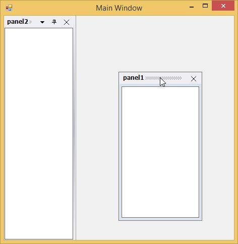

# How to make a docked control float only?

The docked control can also be only floating and cannot be docked, by calling the `SetFloatOnly` method.

<table>
<tr>
<th>
Parameter</th><th>
Description</th></tr>
<tr>
<td>
SetFloatOnly</td><td>
Make the docked control a float only control.{{ 'Ctrl' | markdownify }} - The control for which docking is enabled.{{ 'bFloating' | markdownify }} - Represents a Boolean value, `true`, to disabled docking.</td></tr>
</table>





this.dockingManager1.SetFloatOnly(this.listBox2, true);





Me.dockingManager1.SetFloatOnly(Me.listBox2, True);





  

