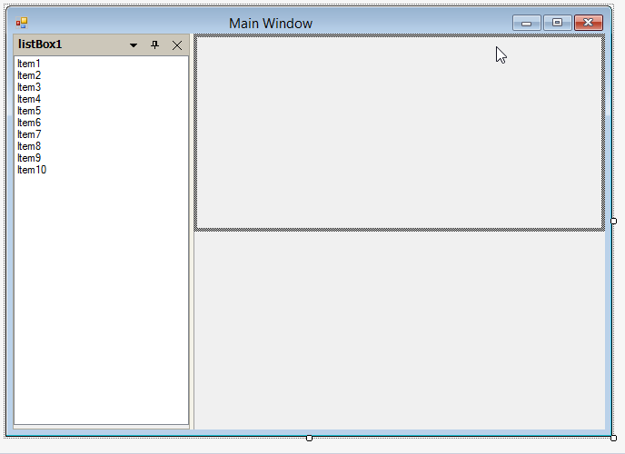
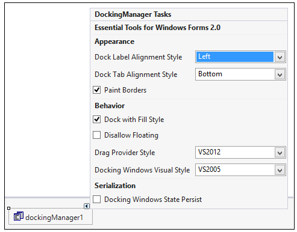

# What are all the design time features available in Docking Manager

## Dragging and docking at DesignTime
DockingManager supports dragging and docking of the dockable controls at the design time itself. It also lets you float the controls.

 

## Property settings using task window
The Task Window of the DockingManager at design time lets you apply certain Appearance and behavior settings.

 