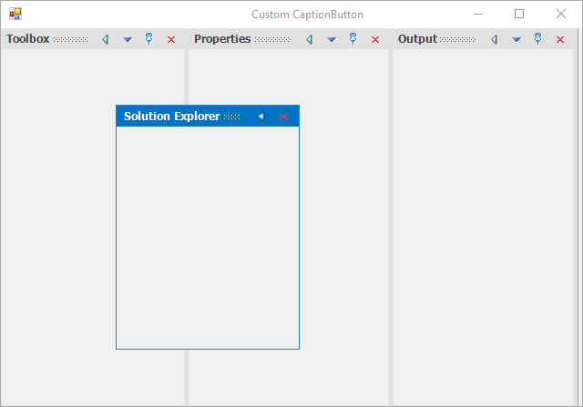
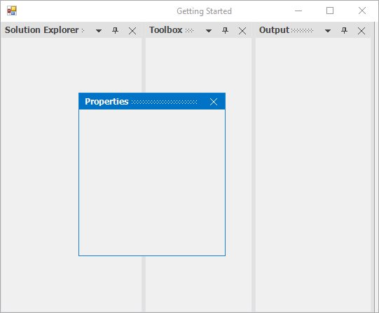

# Floating Window in Windows Forms Docking Manager

DockPanels can be floated by clicking and dragging the the panel header using mouse interaction. Floating window can be dragged over any place in the screen. Docking hints will be displayed while dragging the floating window over the docking manager or any other dock panels.

## Enabling/disabling the float functionality

By default, all dock panels can be floated in the docking manager. The `DockingManager` provides option to restrict users for creating float windows. The [DisallowFloating](https://help.syncfusion.com/cr/windowsforms/Syncfusion.Windows.Forms.Tools.DockingManager.html#Syncfusion_Windows_Forms_Tools_DockingManager_DisallowFloating) property helps to enable or disable the floating functionality. The default value of this property is `false`. You can restrict the creation of float window by setting the value of DisallowFloating property to `true`. The dock panel will be docked again at the existing position when dragging it to create a float window when the `DisallowFloating` property is set to `true`.





//To restrict floating window creation

this.dockingManager1.DisallowFloating = true;





'To restrict floating window creation

Me.dockingManager1.DisallowFloating = true





## Disable float for specific child

The [SetAllowFloating](https://help.syncfusion.com/cr/windowsforms/Syncfusion.Windows.Forms.Tools.DockingManager.html#Syncfusion_Windows_Forms_Tools_DockingManager_SetAllowFloating_System_Windows_Forms_Control_System_Boolean_) function helps to disable floating functionality of the specific child.





//To restrict floating window creation for specific child.

this.dockingManager1.SetAllowFloating(panel1, false);





'To restrict floating window creation for specific child.

Me.dockingManager1.SetAllowFloating(panel1, False)





## Changing dock state to float by programmatically

The docking manager provides option to float the particular control programmatically by using [FloatControl](https://help.syncfusion.com/cr/windowsforms/Syncfusion.Windows.Forms.Tools.DockingManager.html#Syncfusion_Windows_Forms_Tools_DockingManager_FloatControl_System_Windows_Forms_Control_System_Drawing_Rectangle_) function. Using this function, you can float a single control even if it is tabbed with many controls.





//To set ListBox state as floating at the desired location.

Rectangle rectangle = this.Bounds;

this.dockingManager1.FloatControl(this.panel3, new Rectangle(rectangle.Right - 300, rectangle.Bottom - 300, 200, 200));





'To set ListBox state as floating at the desired location.

Dim rectangle As Rectangle = Me.Bounds 

Me.dockingManager1.FloatControl(Me.panel3, New Rectangle(rectangle.Right - 300, rectangle.Bottom - 300, 200, 200))





## Float by user interaction

The docked window can be moved to float state by dragging the window or double-clicking the caption of dock panels.

### Drag float window

The docked window can be moved to `Float` state by clicking its caption and dragging it using the mouse interaction.

### Double-click on caption

The dock panels state can be changed from dock to float and vice-versa by double-clicking the caption in docking manager by default. The docking manager provides option to disable this functionality by setting the [EnableDoubleClickOnCaption](https://help.syncfusion.com/cr/windowsforms/Syncfusion.Windows.Forms.Tools.DockingManager.html#Syncfusion_Windows_Forms_Tools_DockingManager_EnableDoubleClickOnCaption) property to `false`.





//To disable the Re-docking the floating window on caption double click.
 
this.dockingManager1.EnableDoubleClickOnCaption = false;





'To disable the Re-docking the floating window on caption double click.
 
Me.dockingManager1.EnableDoubleClickOnCaption = False





## Maximize float window

In docking manager, you can maximize the float window by double-clicking its caption bar.

### Maximize the float window on double-click caption

By using the [OnCaptionDoubleClick](https://help.syncfusion.com/cr/windowsforms/Syncfusion.Windows.Forms.Tools.DockingManager.html) event, you can maximize the float window while double-clicking the CaptionBar. Use the [EnableDoubleClickOnCaption](https://help.syncfusion.com/cr/windowsforms/Syncfusion.Windows.Forms.Tools.DockingManager.html#Syncfusion_Windows_Forms_Tools_DockingManager_EnableDoubleClickOnCaption) property to enable or disable the state transition while double-clicking the CaptionBar.





this.dockingManager1.EnableDoubleClickOnCaption = true;
this.dockingManager1.DockControlDeactivated += new DockActivationChangedEventHandler(dockingManager1_DockControlDeactivated);
this.dockingManager1.DockControlActivated += new DockActivationChangedEventHandler(dockingManager1_DockControlActivated);
this.dockingManager1.DockStateChanged += new DockStateChangeEventHandler(dockingManager1_DockStateChanged);
this.dockingManager1.OnCaptionDoubleClick += new Syncfusion.Windows.Forms.Tools.DockMouseSelectionEventHandler(dockingManager1_OnCaptionDoubleClick);

//Triggers when control lost its focus.
  void dockingManager1_DockControlDeactivated(object sender, DockActivationChangedEventArgs arg)
  {
    if (dockingManager1.IsFloating(arg.Control))
      dockingManager1.EnableDoubleClickOnCaption = false;
  }
  
  //Triggers when the control got the Focus.
  void dockingManager1_DockControlActivated(object sender, DockActivationChangedEventArgs arg)
  {
    if (!(dockingManager1.IsFloating(arg.Control)))
      dockingManager1.EnableDoubleClickOnCaption = true;
    else
      dockingManager1.EnableDoubleClickOnCaption = false;
  
  }
  
  //Triggers when the dock state changed(Dock state or Floating state or tabbed docking)
  void dockingManager1_DockStateChanged(object sender, DockStateChangeEventArgs arg)
  {
    if (dockingManager1.IsFloating(arg.Controls[0]))
      dockingManager1.EnableDoubleClickOnCaption = false;
    else
      dockingManager1.EnableDoubleClickOnCaption = true;
  }
  
  //Event triggers on double click on the caption bar.
  void dockingManager1_OnCaptionDoubleClick(object sender, Syncfusion.Windows.Forms.Tools.DockControlMouseSelection arg)
  {
    if (this.dockingManager1.IsFloating(arg.Control))
    {
      Control ctrl = arg.Control;
      if ((arg.Control.TopLevelControl as FloatingForm).WindowState != FormWindowState.Maximized)
        (arg.Control.TopLevelControl as FloatingForm).WindowState = FormWindowState.Maximized;
      else
        (arg.Control.TopLevelControl as FloatingForm).WindowState = FormWindowState.Normal;
    }
  }





Me.dockingManager1.EnableDoubleClickOnCaption = True
AddHandler dockingManager1.DockControlDeactivated, AddressOf dockingManager1_DockControlDeactivated
AddHandler dockingManager1.DockControlActivated, AddressOf dockingManager1_DockControlActivated
AddHandler dockingManager1.DockStateChanged, AddressOf dockingManager1_DockStateChanged
AddHandler dockingManager1.OnCaptionDoubleClick, AddressOf dockingManager1_OnCaptionDoubleClick

  Private Sub dockingManager1_DockControlDeactivated(ByVal sender As Object, ByVal arg As DockActivationChangedEventArgs)
      If dockingManager1.IsFloating(arg.Control) Then
        dockingManager1.EnableDoubleClickOnCaption = False
      End If
   End Sub
  
   'Triggers when the control got the Focus.
   Private Sub dockingManager1_DockControlActivated(ByVal sender As Object, ByVal arg As DockActivationChangedEventArgs)
      If Not(dockingManager1.IsFloating(arg.Control)) Then
        dockingManager1.EnableDoubleClickOnCaption = True
      Else
        dockingManager1.EnableDoubleClickOnCaption = False
      End If
   End Sub
  
   'Triggers when the dock state changed(Dock state or Floating state or tabbed docking)
   Private Sub dockingManager1_DockStateChanged(ByVal sender As Object, ByVal arg As DockStateChangeEventArgs)
      If dockingManager1.IsFloating(arg.Controls(0)) Then
                   dockingManager1.EnableDoubleClickOnCaption = False
      Else
        dockingManager1.EnableDoubleClickOnCaption = True
      End If
   End Sub
  
   'Event triggers on double click on the caption bar.
   Private Sub dockingManager1_OnCaptionDoubleClick(ByVal sender As Object, ByVal arg As Syncfusion.Windows.Forms.Tools.DockControlMouseSelection)
      If Me.dockingManager1.IsFloating(arg.Control) Then
        Dim ctrl As Control = arg.Control
        If (TryCast(arg.Control.TopLevelControl, FloatingForm)).WindowState <> FormWindowState.Maximized Then
          TryCast(arg.Control.TopLevelControl, FloatingForm).WindowState = FormWindowState.Maximized
                   Else
          TryCast(arg.Control.TopLevelControl, FloatingForm).WindowState = FormWindowState.Normal
                   End If
      End If
   End Sub





## Restrict to dock on specific sides

Users can restrict the specific [DockAbility](https://help.syncfusion.com/cr/windowsforms/Syncfusion.Windows.Forms.Tools.DockAbility.html) of child window when it is moved to the client area in docking manager by using the [SetOuterDockAbility](https://help.syncfusion.com/cr/windowsforms/Syncfusion.Windows.Forms.Tools.DockingManager.html#Syncfusion_Windows_Forms_Tools_DockingManager_SetOuterDockAbility_System_Windows_Forms_Control_Syncfusion_Windows_Forms_Tools_DockAbility_) function. Here, the right, left, tabbed, and fill dock ability have been restricted.





this.dockingManager1.SetOuterDockAbility(panel1, Syncfusion.Windows.Forms.Tools.DockAbility.Top | Syncfusion.Windows.Forms.Tools.DockAbility.Bottom);





Me.dockingManager1.SetOuterDockAbility(panel1, Syncfusion.Windows.Forms.Tools.DockAbility.Top Or Syncfusion.Windows.Forms.Tools.DockAbility.Bottom)





## Show custom buttons in float window

The docking manager provides support to add custom buttons to the caption bar when an item is in floating state. To enable custom button for caption bar while floating, set the [ShowCustomButtonsInFloating](https://help.syncfusion.com/cr/windowsforms/Syncfusion.Windows.Forms.Tools.DockingManager.html#Syncfusion_Windows_Forms_Tools_DockingManager_ShowCustomButtonsInFloating) property to `true`.





this.dockingManager1.ShowCustomButtonsInFloating = true;





me.dockingManager1.ShowCustomButtonsInFloating = True





 

N> This feature is not applicable for VS2005 (default) Visual Style.

## Change border size of float window

The border thickness of the float window can be changed using the  [MetroBorderWidth](https://help.syncfusion.com/cr/windowsforms/Syncfusion.Windows.Forms.Tools.DockingManager.html#Syncfusion_Windows_Forms_Tools_DockingManager_MetroBorderWidth) property. The default value of this property is `one`. This property is applicable only if the Visual Style of the docking manager is `Metro`.





this.dockingManager1.MetroBorderWidth = 4;





Me.dockingManager1.MetroBorderWidth = 4





## Change float window location

FloatWindow location can be changed by drag and drop through the mouse interaction. 

### Change location programmatically

The docking manager provides option to change the FloatWindow location by programmatically. To position the FloatWindow at the desired location with the required rectangle bounds, call [FloatControl](https://help.syncfusion.com/cr/windowsforms/Syncfusion.Windows.Forms.Tools.DockingManager.html#Syncfusion_Windows_Forms_Tools_DockingManager_FloatControl_System_Windows_Forms_Control_System_Drawing_Rectangle_) function of the docking manager.





//To set properties window state as floating at the desired location.

Rectangle rectangle = this.Bounds;

this.dockingManager1.FloatControl(this.panel3, new Rectangle(rectangle.Right - 300, rectangle.Bottom - 300, 200, 200));





'To set properties window state as floating at the desired location.

Dim rectangle As Rectangle = Me.Bounds 

Me.dockingManager1.FloatControl(Me.panel3, New Rectangle(rectangle.Right - 300, rectangle.Bottom - 300, 200, 200))





## Listen to keyboard events

The [ForwardMenuShortcuts](https://help.syncfusion.com/cr/windowsforms/Syncfusion.Windows.Forms.Tools.DockingManager.html#Syncfusion_Windows_Forms_Tools_DockingManager_ForwardMenuShortcuts) property helps to get or set a value indicating whether the HostForm can listen the keyboard event, when the docked control is in `floating` state.





// True, Enable the HostForm to Listen the keyboard event, when the docked window in Floating State.

this.dockingManager1.ForwardMenuShortcuts=true;





'True, Enable the HostForm to Listen the keyboard event, when the docked window in Floating State.

Me.DockingManager1.ForwardMenuShortcuts=True





## Restricting re-dock float window

By default, the docking manager allows panel to change its state to any state. To maintain some panels to be in float state always, the docking manager provides a way using the `SetFloatOnly` function. This helps to set the specified window in float state always. The window cannot be docked again.

The [GetFloatOnly](https://help.syncfusion.com/cr/windowsforms/Syncfusion.Windows.Forms.Tools.DockingManager.html#Syncfusion_Windows_Forms_Tools_DockingManager_GetFloatOnly_System_Windows_Forms_Control_) function helps to get the information whether the specified window is always in float state or not.





this.dockingManager1.SetFloatOnly(this.panel1, true);

Console.Write("IsAlways in FloatState:" + this.dockingManager1.SetFloatOnly(this.panel1, true));





Me.dockingManager1.SetFloatOnly(this.panel1, True)

Console.Write("IsAlways in FloatState:" + Me.dockingManager1.SetFloatOnly(Me.panel1, True))




