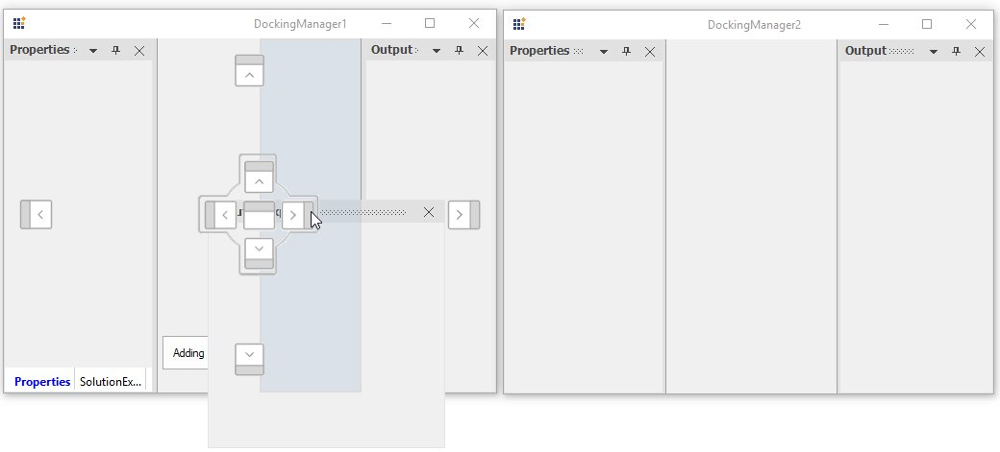
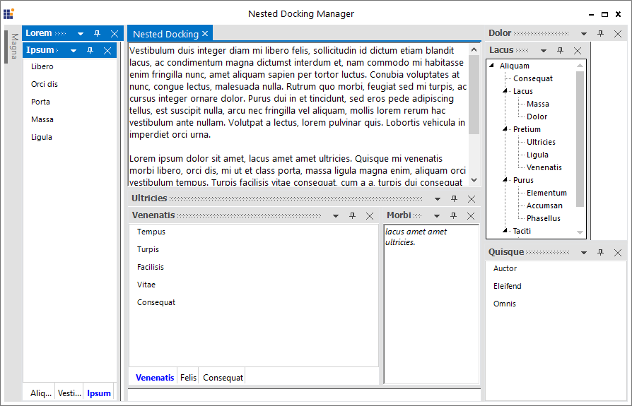

# Linked and Nested WinForms Docking Control in WinForms Docking Control

The dock panels from a WinForms Docking Control cannot be dragged and dropped to another by default. But, the linked manager support allows to drag and drop the windows from one WinForms Docking Control to another by setting the `TargetDockingManager` list.

## Enable linked manager

To add TargetManager list, call the [AddToTargetManagersList](https://help.syncfusion.com/cr/windowsforms/Syncfusion.Windows.Forms.Tools.DockingManager.html#Syncfusion_Windows_Forms_Tools_DockingManager_AddToTargetManagersList_Syncfusion_Windows_Forms_Tools_DockingManager_) function with valid WinForms Docking Control instance as argument. When only one WinForms Docking Control has TargetManagerList, the window that is dropped to the TargetManager cannot be dragged back to its owner.

For example: `DockingManager1` and `DockingManager2` are the WinForms Docking Control instance and the docking manager2 is added to TargetManagerList of docking manager1, but the docking manager2 is not aware of its TargetManager.

Here, the windows from docking manager1 are only allowed to be dragged and dropped in the docking manager2.





Form2 ChildWindow = new Form2();

ChildWindow.Show();

//To add ChildForm's WinForms Docking Control to the MainForm's TargetManagerList. 

this.dockingManager1.AddToTargetManagersList(ChildWindow.dockingManager2);





'To set the docked controls, that transformed to child controls.

Dim childWindow As New Form2()

ChildWindow.Show()

'To add ChildForm's WinForms Docking Control to the MainForm's TargetManagerList.

Me.dockingManager1.AddToTargetManagersList(ChildWindow.dockingManager1)





## Remove linked manager

To remove WinForms Docking Control from the TargetManagerList, call the [RemoveFromTargetManagersList](https://help.syncfusion.com/cr/windowsforms/Syncfusion.Windows.Forms.Tools.DockingManager.html#Syncfusion_Windows_Forms_Tools_DockingManager_RemoveFromTargetManagersList_Syncfusion_Windows_Forms_Tools_DockingManager_) function with a valid WinForms Docking Control instance as an argument. For example, to remove the docking manager1 from the TargetManagersList of docking manager2, use the following code snippets:





//To remove ChildForm's WinForms Docking Control to the MainForm's TargetManagerList. 

this.dockingManager1.RemoveFromTargetManagersList(ChildWindow.dockingManager2);





'To remove ChildForm's WinForms Docking Control to the MainForm's TargetManagerList. 

Me.dockingManager1.RemoveFromTargetManagersList(ChildWindow.dockingManager2);





## Dock child control between two WinForms Docking Controls

The WinForms Docking Control supports to dock its child control into another. It can be achieved by using [AddToTargetManagersList](https://help.syncfusion.com/cr/windowsforms/Syncfusion.Windows.Forms.Tools.DockingManager.html#Syncfusion_Windows_Forms_Tools_DockingManager_AddToTargetManagersList_Syncfusion_Windows_Forms_Tools_DockingManager_) and [RemoveFromTargetManagersList](https://help.syncfusion.com/cr/windowsforms/Syncfusion.Windows.Forms.Tools.DockingManager.html#Syncfusion_Windows_Forms_Tools_DockingManager_RemoveFromTargetManagersList_Syncfusion_Windows_Forms_Tools_DockingManager_) functions.

**AddToTargetManagerList**

This function helps to interconnect two WinForms Docking Controls, so that its child controls can be docked between them.

**RemoveFromTargetManagersList**

This function helps to remove interconnection between two WinForms Docking Controls.





//To set the docked controls that transformed to child controls.

Form2 ChildWindow = new Form2();

ChildWindow.Show();

this.dockingManager1.AddToTargetManagersList(ChildWindow.dockingManager1);

ChildWindow.dockingManager1.AddToTargetManagersList(this.dockingManager1);
  
//To remove WinForms Docking Control from MainForm's TargetManagerList. 

ChildWindow.dockingManager1.RemoveFromTargetManagersList(this.dockingManager1);

this.dockingManager1.RemoveFromTargetManagersList(ChildWindow.dockingManager1);





'To set the docked controls, that transformed to child controls.

Dim childWindow As New Form2()

ChildWindow.Show()

Me.dockingManager1.AddToTargetManagersList(ChildWindow.dockingManager1)

ChildWindow.dockingManager1.AddToTargetManagersList(Me.dockingManager1)
  
'To remove WinForms Docking Control from MainForm's TargetManagerList. 

ChildWindow.dockingManager1.RemoveFromTargetManagersList(Me.dockingManager1)

Me.dockingManager1.RemoveFromTargetManagersList(ChildWindow.dockingManager1)





N> A sample that demonstrates LinkedManager behavior is available in the following sample installation path:
C:\Users\&lt;User&gt;\AppData\Local\Syncfusion\EssentialStudio\Version Number\Windows\Tools.Windows\Samples\Docking Manager\LinkedManager

## Nested WinForms Docking Control

The WinForms Docking Control provides NestedDockingManager support, which allows it to be added as a child window to another.

In nested WinForms Docking Control, the whole container can be dragged and dropped inside its parent, and DockWindows within it cannot be dragged and dropped on the owner.

N> A sample that demonstrates nested docking behavior is available in the following sample installation path:
C:\Users\&lt;User&gt;\AppData\Local\Syncfusion\EssentialStudio\Version Number\Windows\Tools.Windows\Samples\Docking Manager\NestedDocking
