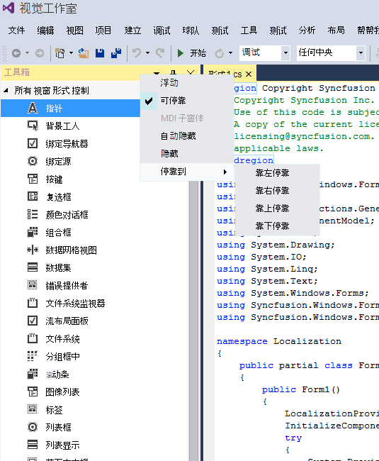

# Localization in Windows Forms Docking Manager

Localization is the process of translating the application resources into different languages for specific cultures. `DockingManager` supports complete localization to any desired language of header and context menus of docking child windows. It can be localized by using [ILocalizationProvider](https://help.syncfusion.com/cr/windowsforms/Syncfusion.Windows.Forms.ILocalizationProvider.html).

The following steps help to localize the header and context menus of docking child windows in the docking manager:

**Step 1:** Include the required namespaces at the beginning of the file.





using Syncfusion.Windows.Forms;
using Syncfusion.Windows.Forms.Tools;





Imports Syncfusion.Windows.Forms
Imports Syncfusion.Windows.Forms.Tools





**Step 2:** Initialize the [LocalizationProvider](https://help.syncfusion.com/cr/windowsforms/Syncfusion.Windows.Forms.LocalizationProvider.html) class inherited from the [ILocalizationProvider](https://help.syncfusion.com/cr/windowsforms/Syncfusion.Windows.Forms.ILocalizationProvider.html) interface before the InitializeComponent is called in the constructor of an application.





LocalizationProvider.Provider = new Localizer();





LocalizationProvider.Provider = New Localizer()



  

**Step 3:** Add the GetLocalizedString function in the [LocalizationProvider](https://help.syncfusion.com/cr/windowsforms/Syncfusion.Windows.Forms.LocalizationProvider.html) class in which the localization content is provided for required components that are used in the docking manager.

For example: Header and ContextMenu of docking child windows are localized in Chinese Language.

**Localize header of child window**

[SetDockLabel](https://help.syncfusion.com/cr/windowsforms/Syncfusion.Windows.Forms.Tools.DockingManager.html#Syncfusion_Windows_Forms_Tools_DockingManager_SetDockLabel_System_Windows_Forms_Control_System_String_) helps to localize the label for a child window. 





// To set the label for the docked controls

this.dockingManager.SetDockLabel(panel1, "解 探险者");

this.dockingManager.SetDockLabel(panel2, "工具箱");

this.dockingManager.SetDockLabel(panel3, "属性");

this.dockingManager.SetDockLabel(panel4, "产量");





' To set the label for the docked controls

Me.dockingManager.SetDockLabel(panel1, "解 探险者");

Me.dockingManager.SetDockLabel(panel2, "工具箱");

Me.dockingManager.SetDockLabel(panel3, "属性");

Me.dockingManager.SetDockLabel(panel4, "产量");





 

**Localize ContextMenu options**

The following code example illustrates how to localize the context menus of docking child windows in the docking manager.





public string GetLocalizedString(System.Globalization.CultureInfo culture, string name,object obj)

{

switch (name)
{

 case ToolsResourceIdentifiers.DockableMenuItemText:
 return "可停靠";

 case ToolsResourceIdentifiers.AutoHideMenuItemText:
 return "自动隐藏";

 case ToolsResourceIdentifiers.FloatingMenuItemText:
 return "浮动";

 case ToolsResourceIdentifiers.MDIChildMenuItemText:
 return "MDI 子窗体";

 case ToolsResourceIdentifiers.HideMenuItemText:
 return "隐藏";

 case ToolsResourceIdentifiers.MenuItemDockToLeft:
 return "靠左停靠";

 case ToolsResourceIdentifiers.MenuItemDockToRight:
 return "靠右停靠";

 case ToolsResourceIdentifiers.MenuItemDockToTop:
  return "靠上停靠";

  case ToolsResourceIdentifiers.MenuItemDockToBottom:
  return "靠下停靠";

  case ToolsResourceIdentifiers.MenuItemDockTo:
  return "停靠到";

  default:
  return string.Empty;

}

}





Public Function GetLocalizedString(ByVal culture AsSystem.Globalization.CultureInfo, ByVal name As String, ByVal obj As Object) AsString

Select Case name

Case ToolsResourceIdentifiers.DockableMenuItemText:
Return "可停靠";

Case ToolsResourceIdentifiers.AutoHideMenuItemText:
Return "自动隐藏";

Case ToolsResourceIdentifiers.FloatingMenuItemText:
Return "漂浮的";

Case ToolsResourceIdentifiers.MDIChildMenuItemText:
Return "MDI 子";

Case ToolsResourceIdentifiers.HideMenuItemText:
Return "隐藏";

Case ToolsResourceIdentifiers.MenuItemDockToLeft:
Return "剩下";

Case ToolsResourceIdentifiers.MenuItemDockToRight:
Return "对";

Case ToolsResourceIdentifiers.MenuItemDockToTop:
Return "最佳";

Case ToolsResourceIdentifiers.MenuItemDockToBottom:
Return "底部";

Case ToolsResourceIdentifiers.MenuItemDockTo:
Return "码头";

Case Else

Return String.Empty

End Select

End Function





 

N> Refer to the following sample link that demonstrates the localization support in the docking manager.
C:\Users\&lt;User&gt;\AppData\Local\Syncfusion\Essential Studio\Version Number\Windows\Tools.Windows\Samples\Docking manager\Localization
