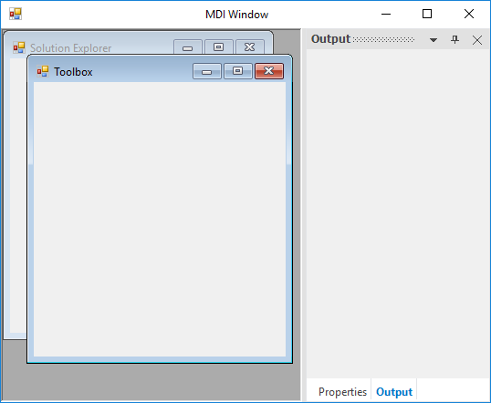
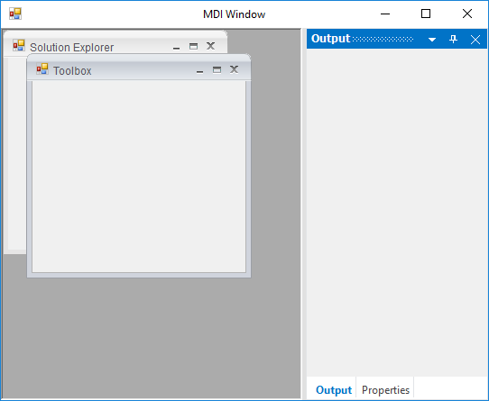

# MDI Window in Windows Forms Docking Manager

Provides support for residing multiple windows under a single parent window in the docking manager.

## Enable MDI container

To enable MDI functionalities in the docking manager, the `IsMdIContainer` property of its parent form should be `true`.

## Make MDI child

[SetAsMDIChild](https://help.syncfusion.com/cr/windowsforms/Syncfusion.Windows.Forms.Tools.DockingManager.html#Syncfusion_Windows_Forms_Tools_DockingManager_SetAsMDIChild_System_Windows_Forms_Control_System_Boolean_) function helps to set the docking window to the MDIChild window in the docking manager. You can set the docked control as an MDI child by using the `MDI Child` option in the context menu.

 





//To set as MDI Child window

this.dockingManager1.SetAsMDIChild(panel1, true);

this.dockingManager1.SetAsMDIChild(panel2, true);





'To set as MDI Child window

Me.dockingManager1.SetAsMDIChild(panel1, True)

Me.dockingManager1.SetAsMDIChild(panel2, True)





 

N> A sample that demonstrates MDI child transition is available in the following sample installation path.
C:\Users\&lt;User&gt;\AppData\Local\Syncfusion\EssentialStudio\Version Number\Windows\Tools.Windows\Samples\Docking Manager\MDI\CS

## Make tabbed MDI child using client control

[SetAsMDIChild](https://help.syncfusion.com/cr/windowsforms/Syncfusion.Windows.Forms.Tools.DockingManager.html#Syncfusion_Windows_Forms_Tools_DockingManager_SetAsMDIChild_System_Windows_Forms_Control_System_Boolean_) function helps to set the docking window to the tabbed MDIChild window in the docking manager using the [TabbedMDIManager](https://help.syncfusion.com/cr/windowsforms/Syncfusion.Windows.Forms.Tools.TabbedMDIManager.html) control. You can set the docked control as an MDI child easily by using the `Tabbed document` option in the context menu. To enable this option, attach the parent form of docking manager to MDI container of TabbedMDIManager by using [AttachToMdiContainer](https://help.syncfusion.com/cr/windowsforms/Syncfusion.Windows.Forms.Tools.TabbedMDIManager.html#Syncfusion_Windows_Forms_Tools_TabbedMDIManager_AttachToMdiContainer_System_Windows_Forms_Form_).

 





//Initialize the TabbedMDI Manager

TabbedMDIManager tabbedMDI = new TabbedMDIManager();

//Attach the Form to TabbedMDI Manager.

tabbedMDI.AttachToMdiContainer(this);

tabbedMDI.TabStyle = typeof(Syncfusion.Windows.Forms.Tools.TabRendererOffice2016Colorful);
  
//To set as MDI Child window

this.dockingManager1.SetAsMDIChild(panel1, true);

this.dockingManager1.SetAsMDIChild(panel2, true);





'Initialize the TabbedMDI Manager

Dim tabbedMDI As New TabbedMDIManager()

'Attach the Form to TabbedMDI Manager.

tabbedMDI.AttachToMdiContainer(Me)

Me.tabbedMDIManager.TabStyle = GetType(Syncfusion.Windows.Forms.Tools.TabRendererOffice2016Colorful)
  
'To set as MDI Child window

Me.dockingManager1.SetAsMDIChild(panel1, True)

Me.dockingManager1.SetAsMDIChild(panel2, True)





 

N> A sample that demonstrates MDI child transition as tabbed is available in the following sample installation path:
C:\Users\&lt;User&gt;\AppData\Local\Syncfusion\EssentialStudio\Version Number\Windows\Tools.Windows\Samples\Docking Manager\SDI\CS

## Add icon in caption

[SetMDIChildIcon](https://help.syncfusion.com/cr/windowsforms/Syncfusion.Windows.Forms.Tools.DockingManager.html#Syncfusion_Windows_Forms_Tools_DockingManager_SetMDIChildIcon_System_Windows_Forms_Control_System_Drawing_Icon_) function helps to set custom icons in the caption bar of MDIChild window in the docking manager.





System.Drawing.Icon icon = new System.Drawing.Icon(GetIconFile(GetIconFile(@"..\\..\\\$this.Icon.ico")));
          
//To set icon in MDI Child window
this.dockingManager1.SetMDIChildIcon(panel2, icon);

this.dockingManager1.SetAsMDIChild(panel1, true);

this.dockingManager1.SetAsMDIChild(panel2, true);

private string GetIconFile(string bitmapName)
{
   for (int n = 0; n < 10; n++)
   {
       if (System.IO.File.Exists(bitmapName))
          return bitmapName;

       bitmapName = @"..\" + bitmapName;
   }

   return bitmapName;
}





Dim icon As System.Drawing.Icon = New System.Drawing.Icon(GetIconFile(GetIconFile("..\\..\\\$this.Icon.ico")))

'To set icon in MDI Child window
Me.dockingManager1.SetMDIChildIcon(panel2, icon)

Me.dockingManager1.SetAsMDIChild(panel1, True)

Me.dockingManager1.SetAsMDIChild(panel2, True)

Private Function GetIconFile(ByVal bitmapName As String) As String
	 
   For n As Integer = 0 To 9
				
      If System.IO.File.Exists(bitmapName) Then

					Return bitmapName

			End If

			bitmapName = "..\" & bitmapName
			
   Next n

	 Return bitmapName

End Function





 

## Change MDI window size

[SetAsMDIChild](https://help.syncfusion.com/cr/windowsforms/Syncfusion.Windows.Forms.Tools.DockingManager.html#Syncfusion_Windows_Forms_Tools_DockingManager_SetAsMDIChild_System_Windows_Forms_Control_System_Boolean_) function helps to change the size of MDI window in the docking manager.





this.dockingManager1.SetAsMDIChild(panel1, true, new Rectangle(200, 400, 250, 250));

this.dockingManager1.SetAsMDIChild(panel2, true, new Rectangle(200, 400, 250, 250));





Me.dockingManager1.SetAsMDIChild(panel1,True, New Rectangle(200, 400, 250, 250))

Me.dockingManager1.SetAsMDIChild(panel2,True, New Rectangle(200, 400, 250, 250))





 

## Change MDI window to dock window

The MDI window can be moved to dock state by using its ContextMenu option. This can also be done programmatically by using the [SetAsMDIChild](https://help.syncfusion.com/cr/windowsforms/Syncfusion.Windows.Forms.Tools.DockingManager.html#Syncfusion_Windows_Forms_Tools_DockingManager_SetAsMDIChild_System_Windows_Forms_Control_System_Boolean_) function.





//Sets the MDI child form to the normal Docking window.

this.dockingManager1.SetAsMDIChild(this.panel1,false);





'Sets the MDI child form to the normal Docking window.

Me.dockingManager1.SetAsMDIChild(Me.panel1,False)



	 

## Office 2007 style MDI child form

The MDI child form looks and functions as Office2007. It can be enabled using the [Office2007MdiChildForm](https://help.syncfusion.com/cr/windowsforms/Syncfusion.Windows.Forms.Tools.DockingManager.html#Syncfusion_Windows_Forms_Tools_DockingManager_Office2007MdiChildForm) property.

### Change color scheme for Office 2007 style MDI window

Color schemes are supported and specified by using the [Office2007MdiColorScheme](https://help.syncfusion.com/cr/windowsforms/Syncfusion.Windows.Forms.Tools.DockingManager.html#Syncfusion_Windows_Forms_Tools_DockingManager_Office2007MdiColorScheme) property.





this.dockingManager1.Office2007MdiChildForm = true;

//Sets the Silver Color scheme.

this.dockingManager1.Office2007MdiColorScheme = Office2007Theme.Silver;





Me.dockingManager1.Office2007MdiChildForm = True

'Sets the Silver Color scheme.

Me.dockingManager1.Office2007MdiColorScheme = Office2007Theme.Silver





 

## Identify control is in MDI mode or not

The docking manager [IsMDIMode](https://help.syncfusion.com/cr/windowsforms/Syncfusion.Windows.Forms.Tools.DockingManager.html#Syncfusion_Windows_Forms_Tools_DockingManager_IsMDIMode_System_Windows_Forms_Control_) function is used to determine the MDI state of a docked window. This function takes the control as its argument and returns `true` when the specified control is in MDI child mode. Otherwise, it returns `false`.





MessageBox.Show(this.dockingManager1.IsMDIMode(this.panel1).ToString());





MessageBox.Show(Me.dockingManager1.IsMDIMode(Me.panel1).ToString())



  

