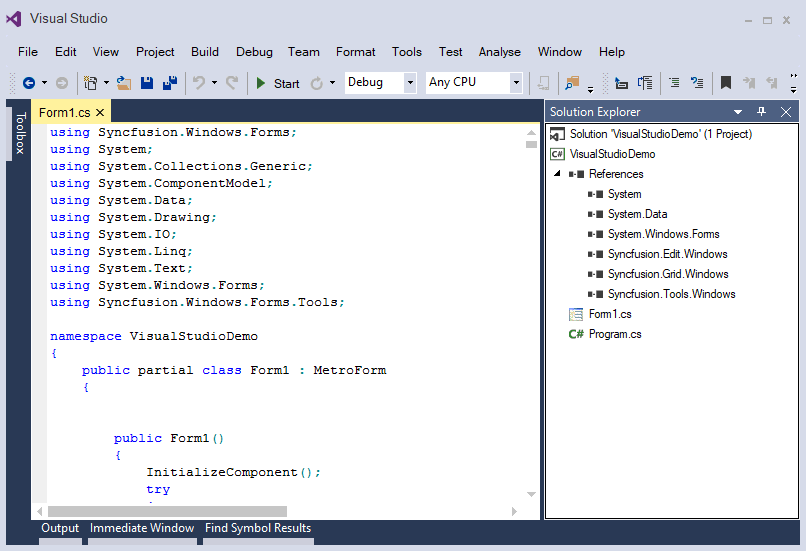

# Windows Forms Docking Manager Overview

The `DockingManager` control implements an architecture that allows panels to be docked at any part of form. The dock panels containing child elements can be interactively dragged to any area within screen and can be resized at run time. Panels can be docked to form edges or each other panels. Dock panels can also be floated, tabbed, and auto hidden.

## Key features

* [DockState](https://help.syncfusion.com/windowsforms/dockingmanager/getting-started#change-dock-state-of-child): Supports different dock states such as docking, floating, auto hide, and tabbed.
* [Dock ability](https://help.syncfusion.com/windowsforms/dockingmanager/dealing-with-docking-child#restrict-to-dock-on-specific-sides): Provides extensive support to dock the elements at any side relative to form or other dock panels and allows users to restrict only dock at specific side.
* [MDI](https://help.syncfusion.com/windowsforms/dockingmanager/mdi-window): Allows multiple windows to reside under a single parent window in the docking manager.
* [Serialization](https://help.syncfusion.com/windowsforms/dockingmanager/serialization): Allows to save and restore dock panels states in different formats such as binary and XML.
* [Nested layout](https://help.syncfusion.com/windowsforms/dockingmanager/linked-and-nested-dockingmanager#nested-dockingmanager): Provides complete support to add the docking manager as a child window to another docking manager.
* [Linked manager](https://help.syncfusion.com/windowsforms/dockingmanager/linked-and-nested-dockingmanager#enable-linked-manager): Supports to drag and drop the dock panels between different docking managers.
* [Drag providers](https://help.syncfusion.com/windowsforms/dockingmanager/appearance#change-dock-provider-styles): Supports various styles of drag providers.
* [ContextMenu support](https://help.syncfusion.com/windowsforms/dockingmanager/dock-window#enable--disable-the-context-menu): Provides built-in ContextMenu support for caption bar, tabbed controls, and auto hidden tabs to change the states.
* [Theming](https://help.syncfusion.com/windowsforms/dockingmanager/appearance#visual-styles): Supports several built-in themes such as Metro, Office2016, etc.
* [Custom caption](https://help.syncfusion.com/windowsforms/dockingmanager/dock-window#add-custom-buttons-in-caption): Supports to add custom controls in the caption of dock panels.
* [Customization](https://help.syncfusion.com/windowsforms/dockingmanager/appearance): Supports to customize the appearance of dock, float, auto hide, and tabbed windows.
* [Design-time](https://help.syncfusion.com/windowsforms/docking-manager/tabbed-window#tabbed-at-design-time): Supports to drag, drop, and float the windows in design time.
* [Localization](https://help.syncfusion.com/windowsforms/dockingmanager/localization): Supports complete localization to any desired language of header and context menus of docking child windows.

