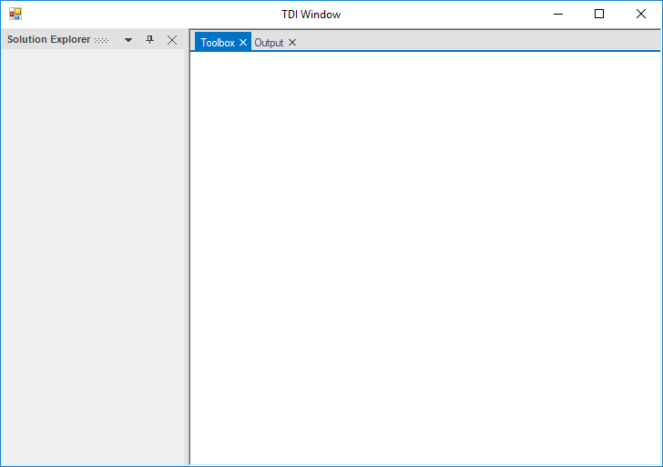
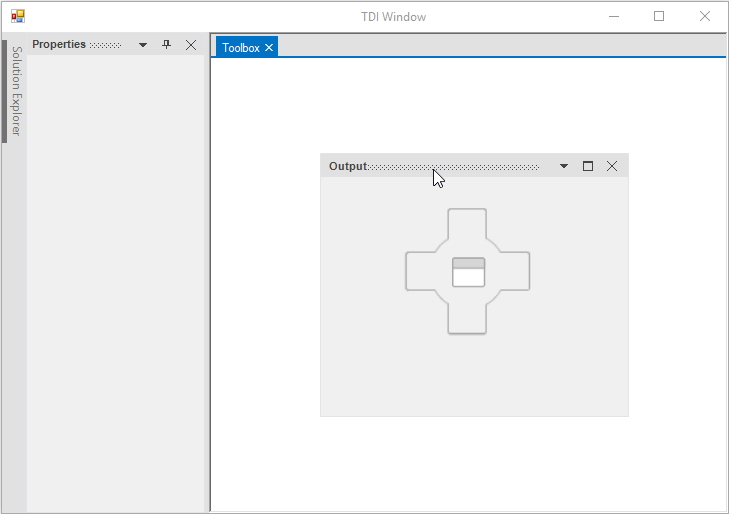
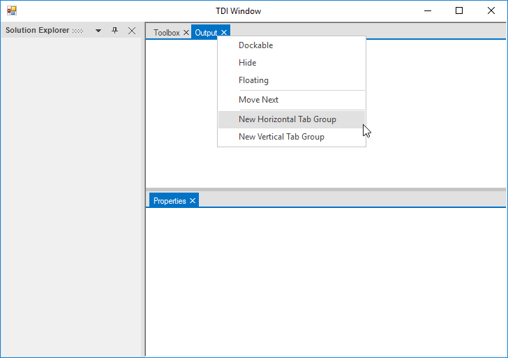
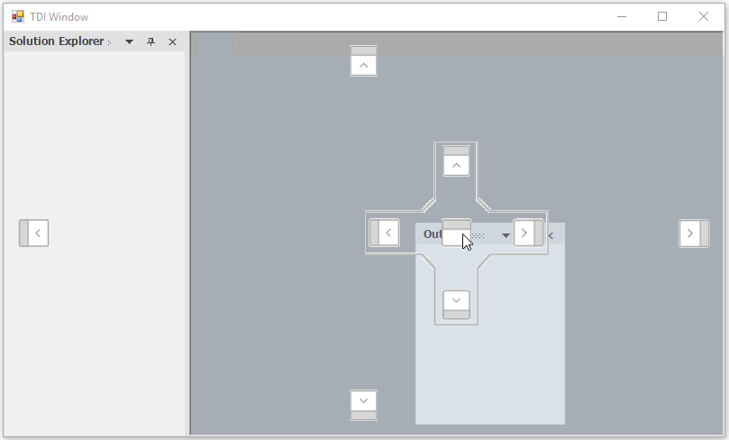
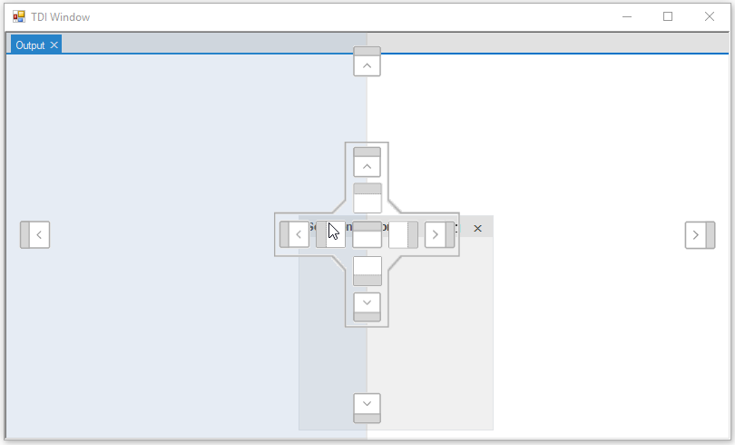
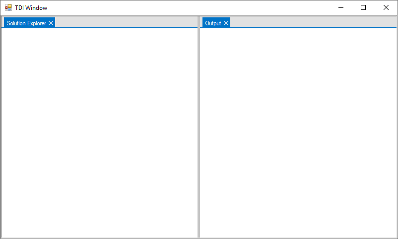
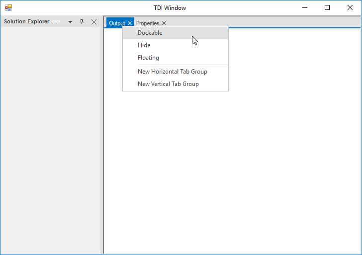

# TDI Window in Windows Forms Docking Manager

Provides support for adding tabbed document windows in the docking manager. To enable the document mode in docking manager, set the [EnableDocumentMode](https://help.syncfusion.com/cr/windowsforms/Syncfusion.Windows.Forms.Tools.DockingManager.html#Syncfusion_Windows_Forms_Tools_DockingManager_EnableDocumentMode) property to true.

## Add child view as tabbed document

[DockAsDocument](https://help.syncfusion.com/cr/windowsforms/Syncfusion.Windows.Forms.Tools.DockingManager.html#Syncfusion_Windows_Forms_Tools_DockingManager_DockAsDocument_System_Windows_Forms_Control_) function helps to add the child window as a document tab in docking manager. The document window should be added after dock layout has been loaded. The `NewDockStateEndLoad` event is recommended to add tabbed documents in docking manager.





  // Invoking the NewDockStateEndLoad event.
   this.dockingManager1.NewDockStateEndLoad += DockingManager1_NewDockStateEndLoad

        private void DockingManager1_NewDockStateEndLoad(object sender, EventArgs e)
        {
          //To add TDI child 
            this.dockingManager1.DockAsDocument(this.panel1);
            this.dockingManager1.DockAsDocument(this.panel2);
        }





'Invoking the NewDockStateEndLoad event.
Me.dockingManager1.NewDockStateEndLoad += DockingManager1_NewDockStateEndLoad
 
Private Sub DockingManager1_NewDockStateEndLoad(ByVal sender As Object, ByVal e As EventArgs)

   'To add TDI child
			Me.dockingManager1.DockAsDocument(Me.panel1)
			Me.dockingManager1.DockAsDocument(Me.panel2)
      
		End Sub





 

 

## Document window behavior

[SetWindowMode](https://help.syncfusion.com/cr/windowsforms/Syncfusion.Windows.Forms.Tools.DockingManager.html#Syncfusion_Windows_Forms_Tools_DockingManager_SetWindowMode_System_Windows_Forms_Control_Syncfusion_Windows_Forms_Tools_WindowMode_) function helps to specify the window mode of docking child that defines dockability for specific child in DockingManager. It decides whether the docking child can be docked as `Tool` window or `Document` window.

### Window mode

* Tool - Allows docking child to change its state to dock, float, auto-hidden, or MDI/TDI.

* Document - Allows docking child to move to float state only.





 //To set Docking child as Tool window mode

   this.dockingManager1.SetWindowMode(this.panel1, Syncfusion.Windows.Forms.Tools.WindowMode.Tool);





'To set Docking child as Tool window mode

Me.dockingManager1.SetWindowMode(this.panel1, Syncfusion.Windows.Forms.Tools.WindowMode.Tool)





 





//To set Docking child as Document window mode

this.dockingManager1.SetWindowMode(this.panel2,Syncfusion.Windows.Forms.Tools.WindowMode.Document);





 'To set Docking child as Document window mode

 Me.dockingManager1.SetWindowMode(this.panel2,Syncfusion.Windows.Forms.Tools.WindowMode.Document)





 

### Identify whether the control is tool window or document window

The [GetWindowMode](https://help.syncfusion.com/cr/windowsforms/Syncfusion.Windows.Forms.Tools.DockingManager.html#Syncfusion_Windows_Forms_Tools_DockingManager_GetWindowMode_System_Windows_Forms_Control_) function of docking manager is used to determine window mode of docking child. This function takes the control as its argument and returns `WindowMode` whether the specified control is `Tool` or `Document`.





MessageBox.Show(this.dockingManager1.GetWindowMode(this.panel1).ToString());





 MessageBox.Show(this.dockingManager1.GetWindowMode(this.panel1).ToString());





## Freeze to document state

The [FreezeToDocumentState](https://help.syncfusion.com/cr/windowsforms/Syncfusion.Windows.Forms.Tools.DockingManager.html#Syncfusion_Windows_Forms_Tools_DockingManager_FreezeToDocumentState_System_Windows_Forms_Control_System_Boolean_) function of docking manager helps to freeze the docking window state in Document and docking manager will not allows to move the child window to any other state.





this.dockingManager1.FreezeToDocumentState(panel1, true);

this.dockingManager1.FreezeToDocumentState(panel2, true);





Me.dockingManager1.FreezeToDocumentState(panel1, true)

Me.dockingManager1.FreezeToDocumentState(panel2, true)





### Identify whether the control is frozen to document state

The docking manager [IsFrozenToDocumentState](https://help.syncfusion.com/cr/windowsforms/Syncfusion.Windows.Forms.Tools.DockingManager.html#Syncfusion_Windows_Forms_Tools_DockingManager_IsFrozenToDocumentState_System_Windows_Forms_Control_) function is used to determine the frozen state of a document window. This function takes the control as its argument and returns true if the specified control is frozen to document state. Else, it returns false.





MessageBox.Show(this.dockingManager1.IsFrozenToDocumentState(this.panel1).ToString());





 MessageBox.Show(this.dockingManager1.IsFrozenToDocumentState(this.panel1).ToString());





## Creating Document Tab Group

The DockingManger allows to create document tab groups like Visual Studio. The document tab groups can be grouped using the drag-and-drop operations and also using the options in context menu items.

### Create tab group using context menu option

In docking manager, a new tab group can be created at horizontal or vertical side in the document area using the `ContextMenu` option.

 

 

### TabGroup creation through mouse interaction

Like Visual Studio, the DragProvider of DockingManager contains eight dock hints to create DocumentTab group through drag provider. Out of eight dock hints, four outer dock hints are used to create a dock window and four inner dock hints are used to create a document window. A new tab group can be created at the top, left, right, or bottom of the document area through mouse interactions. This feature is not supported in `VS2005`, `VS2008`, and `Whidbey` styles.

If there is no active document available in the DockingManager, only the center dock hint will be visible in DragProvider.

 

The following screenshot illustrates the preview of the document that is to be created.

 

The following screenshot illustrates the document that is documented at the left of the document area.

The DocumentTab group has been created at the left.

N> Similarly document tabs can be created in all four directions (Left, Top, Right, Bottom)

The docking direction (DockHints) can be restricted by setting `DockAbility` to each docking child. More details about `DockAbility` has been explained in [Dealing with docking child](https://help.syncfusion.com/windowsforms/dockingmanager/dealing-with-docking-child#restrict-to-dock-on-specific-sides) section.

## Disable tab group creation

Tab group creation can be enabled or disabled using the [EnableTabGroup](https://help.syncfusion.com/cr/windowsforms/Syncfusion.Windows.Forms.Tools.DocumentWindowSettings.html#Syncfusion_Windows_Forms_Tools_DocumentWindowSettings_EnableTabGroup) property of docking manager. To disable tab group creation, set the `EnableTabGroup` to `False`. So, the docking manager will not display “New Horizontal Tab Group” and “New Vertical Tab Group” context menu items when right-click the document header.





//To disable Document tab group creation

this.dockingManager1.DocumentWindowSettings.EnableTabGroup = false;





'To disable Document tab group creation

Me.dockingManager1.DocumentWindowSettings.EnableTabGroup = false





## Change document window state

TDI window can be moved to dock or float state using its contextMenu option.

### Move to dock state

TDI window can be moved to dock state using dock menu item in the contextMenu option.

 

### Move to float state

TDI window can be moved to float state by floating menu item in the contextMenu option. This can also be done by dragging its TDI tab header.

 

### Restrict dragging document window 

The document tab window of docking manager can moved to the float state while dragging its tab header. This functionality can be enabled or disabled using the [AllowDragging](https://help.syncfusion.com/cr/windowsforms/Syncfusion.Windows.Forms.Tools.DocumentWindowSettings.html#Syncfusion_Windows_Forms_Tools_DocumentWindowSettings_AllowDragging) property. By default, this property is set to `true`.





//To disable document window dragging behavior

this.dockingManager1.DocumentWindowSettings.AllowDragging = false;





'To disable document window dragging behavior

Me.dockingManager1.DocumentWindowSettings.AllowDragging = false





## Document tab reordering

The docking manager allows to reorder the document tab by selecting and dragging to the desired index in document tab panel. The re-ordering behavior of document tabs can be enabled or disabled using the [AllowTabsMoving](https://help.syncfusion.com/cr/windowsforms/Syncfusion.Windows.Forms.Tools.DockingManager.html#Syncfusion_Windows_Forms_Tools_DockingManager_AllowTabsMoving) property. By default, this property is set to `true`.





// To restrict the document tabs reordering

this.dockingManager1.AllowTabsMoving = false;





'To restrict the document tabs reordering

Me.dockingManager1.AllowTabsMoving = false





## Closing TDI tab item using mouse middle click

You can close the tab items of `DocumentContainer` and tabbed windows in `DockingManager` by clicking the mouse middle button on the tab item header. You can enable it by using the [CloseTabOnMiddleClick](https://help.syncfusion.com/cr/windowsforms/Syncfusion.Windows.Forms.Tools.DockingManager.html#Syncfusion_Windows_Forms_Tools_DockingManager_CloseTabOnMiddleClick) property value as `true`. The default value of  `CloseTabOnMiddleClick` is `false`.




 this.dockingManager1.CloseTabOnMiddleClick = true;




Me.dockingManager1.CloseTabOnMiddleClick = true




## Show or hide close button 

 The visibility of common close button to close the selected tab in document window can be changed by [ShowCloseButton](https://help.syncfusion.com/cr/windowsforms/Syncfusion.Windows.Forms.Tools.DocumentWindowSettings.html#Syncfusion_Windows_Forms_Tools_DocumentWindowSettings_ShowCloseButton) property. By default, this property is set to `false`.





// To show the common close button

 this.dockingManager1.DocumentWindowSettings.ShowCloseButton = true;





'To show the common close button

 Me.dockingManager1.DocumentWindowSettings.ShowCloseButton = true





 

## Show or hide Tablist

The visibility of menu button that lists all available document tabs in a drop-down list can be changed using the [ShowTablist](https://help.syncfusion.com/cr/windowsforms/Syncfusion.Windows.Forms.Tools.DocumentWindowSettings.html#Syncfusion_Windows_Forms_Tools_DocumentWindowSettings_ShowTabList) property. By default, this property is set to `false`.





// To show  Tablist

  this.dockingManager1.DocumentWindowSettings.ShowTabList = true;





'To show  Tablist
 Me.dockingManager1.DocumentWindowSettings.ShowTabList = true





 
