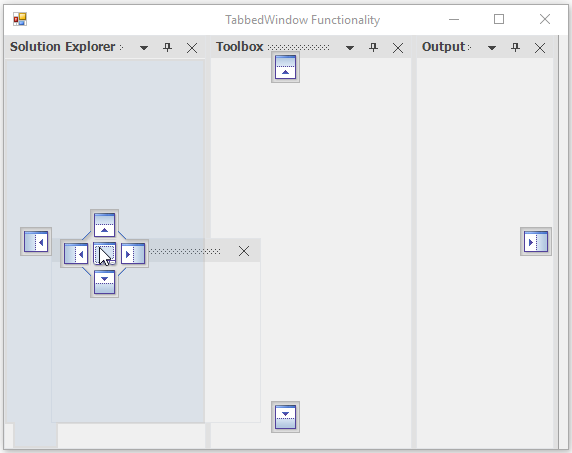
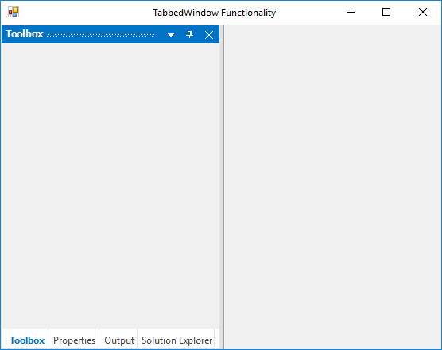
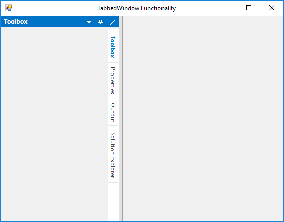

# Tabbed Window in Windows Forms Docking Manager

Allows end users to group dock or float windows in tabs. Dock hints let you dock a window over or beside an already docked window. The appearance of tabs and panels in a group of dock or float windows can be fully customized.

## Tabbed to Another Window Programmatically

The docking manager provides a [DockControl](https://help.syncfusion.com/cr/windowsforms/Syncfusion.Windows.Forms.Tools.DockingManager.html#Syncfusion_Windows_Forms_Tools_DockingManager_DockControl_System_Windows_Forms_Control_System_Windows_Forms_Control_Syncfusion_Windows_Forms_Tools_DockingStyle_System_Int32_) function that helps to dock a panel at the required side using the [DockingStyle](https://help.syncfusion.com/cr/windowsforms/Syncfusion.Windows.Forms.Tools.DockingStyle.html) argument.

The DockingStyle tabbed option is used to tab a panel with another panel. The tabbing windows should be aware of the parent control name. Set the `Output` window parent as `SolutionExplorer` to tab it on the `SolutionExplorer` window.




// To set the DockingStyle for the docked controls
            
this.dockingManager1.DockControl(this.panel4, panel1, Syncfusion.Windows.Forms.Tools.DockingStyle.Tabbed, 200);

this.dockingManager1.DockControl(this.panel3, panel1, Syncfusion.Windows.Forms.Tools.DockingStyle.Tabbed, 200);

this.dockingManager1.DockControl(this.panel2, panel1, Syncfusion.Windows.Forms.Tools.DockingStyle.Tabbed, 200);





'To set the DockingStyle for the docked controls

Me.dockingManager1.DockControl(Me.panel4, panel1, Syncfusion.Windows.Forms.Tools.DockingStyle.Tabbed, 200)

Me.dockingManager1.DockControl(Me.panel3, panel1, Syncfusion.Windows.Forms.Tools.DockingStyle.Tabbed, 200)

Me.dockingManager1.DockControl(Me.panel2, panel1, Syncfusion.Windows.Forms.Tools.DockingStyle.Tabbed, 200)





## Tabbed to another window by user interaction

The child window can be arranged as tabbed windows by using either of the following ways:

* At design time
* At run time

### Tabbed at run time

The docking manager allows you to drag and drop the docked controls at run time using different DragProviderStyle. This style displays a dock hint, which allows to decide whether you can drop the control in that location.

### Tabbed at design time

The docked controls can be tabbed in the designer by dragging into another. The docking manager allows to tab the controls using different `DragProviderStyle`.

## Tab alignments

The tabs of the docked window are placed at the bottom by default. To place the tabs of docked window at different sides, set the [DockTabAlignment](https://help.syncfusion.com/cr/windowsforms/Syncfusion.Windows.Forms.Tools.DockingManager.html#Syncfusion_Windows_Forms_Tools_DockingManager_DockTabAlignment) property with desired values such as top, bottom, left, and right.





//To set the Tab alignment as Right.

this.dockingManager1.DockTabAlignment = Syncfusion.Windows.Forms.Tools.DockTabAlignmentStyle.Right;





'To set the Tab alignment as Right.

Me.dockingManager1.DockTabAlignment = Syncfusion.Windows.Forms.Tools.DockTabAlignmentStyle.Right;
 




* Setting DockTabAlignment as bottom.

* Setting DockTabAlignment as left.

* Setting DockTabAlignment as right.

* Setting DockTabAlignment as top.

## Prevent tabbing

You can restrict the specific [DockAbility](https://help.syncfusion.com/cr/windowsforms/Syncfusion.Windows.Forms.Tools.DockAbility.html) of child window when it is moved to the client area in the docking manager. This can be achieved by [SetDockAbility](https://help.syncfusion.com/cr/windowsforms/Syncfusion.Windows.Forms.Tools.DockingManager.html#Syncfusion_Windows_Forms_Tools_DockingManager_SetDockAbility_System_Windows_Forms_Control_Syncfusion_Windows_Forms_Tools_DockAbility_) function. Here, the tabbed, left, right, and bottom ability have been restricted.





this.dockingManager1.SetDockAbility(panel1, "Top");





this.dockingManager1.SetDockAbility(panel1, "Top");





## Tab reordering

The docking manager allows to reorder the tab by selecting and dragging to the desired index in `DockTabControl`. Tabs reordering behavior can be enabled or disabled by using the [AllowTabsMoving](https://help.syncfusion.com/cr/windowsforms/Syncfusion.Windows.Forms.Tools.DockingManager.html#Syncfusion_Windows_Forms_Tools_DockingManager_AllowTabsMoving) property.





// Prevent the tabbed controls from moving

this.dockingManager1.AllowTabsMoving = true;





'Prevent the tabbed controls from moving

Me.dockingManager1.AllowTabsMoving = True





### Restrict reorder tabs

To prevent the tab reorder within the tab group, set the [AllowTabsMoving](https://help.syncfusion.com/cr/windowsforms/Syncfusion.Windows.Forms.Tools.DockingManager.html#Syncfusion_Windows_Forms_Tools_DockingManager_AllowTabsMoving) value to `false`.

## Show/hide scroll buttons in tab panel

When the Dock Tabs overflow onto the tab panel, the ScrollButton is added to the tab panel. This scroll button can be enabled or disabled by using the [ShowDockTabScrollButton](https://help.syncfusion.com/cr/windowsforms/Syncfusion.Windows.Forms.Tools.DockingManager.html#Syncfusion_Windows_Forms_Tools_DockingManager_ShowDockTabScrollButton) property.





//Enable scroll button on dock tab panel.

this.dockingManager1.ShowDockTabScrollButton = true;





'Enable scroll button on dock tab panel.

Me.dockingManager1.ShowDockTabScrollButton = true





## Change tab index by programmatically

By using the [SetTabPosition](https://help.syncfusion.com/cr/windowsforms/Syncfusion.Windows.Forms.Tools.DockingManager.html#Syncfusion_Windows_Forms_Tools_DockingManager_SetTabPosition_System_Windows_Forms_Control_System_Int32_) function of docking manager, you can set the tab position of the control, which is passed as its argument.





//Set the tab position for particular control.

this.dockingManager1.SetTabPosition(panel1, 2);





'Set the tab position for particular control.

Me.dockingManager1.SetTabPosition(Panel1, 2)





### Tab index

By using [GetTabPosition](https://help.syncfusion.com/cr/windowsforms/Syncfusion.Windows.Forms.Tools.DockingManager.html#Syncfusion_Windows_Forms_Tools_DockingManager_GetTabPosition_System_Windows_Forms_Control_) function, you can get the tab position of the control, which is passed as its argument.





/Getting the tab position

this.dockingManager1.GetTabPosition(panel1);





'Getting the tab position

Me.dockingManager1.GetTabPosition(panel1)





## Identify the tabbed state for control

The [IsTabbed](https://help.syncfusion.com/cr/windowsforms/Syncfusion.Windows.Forms.Tools.DockingManager.html#Syncfusion_Windows_Forms_Tools_DockingManager_IsTabbed_System_Windows_Forms_Control_) function of docking manager returns `true` if the control is in tabbed state and returns `false` if the control is in other states.





this.dockingManager1.IsTabbed(this.panel1);





Me.DockingManager1.IsTabbed(this.panel1)





## Check two controls in same tab group

The [IsSameTabbedGroup](https://help.syncfusion.com/cr/windowsforms/Syncfusion.Windows.Forms.Tools.DockingManager.html#Syncfusion_Windows_Forms_Tools_DockingManager_IsSameTabbedGroup_System_Windows_Forms_Control_System_Windows_Forms_Control_) function of docking manager is used to determine whether the two tabbed controls are belong to the same tab group.





this.dockingManager1.IsSameTabbedGroup(this.panel1, this.panel2);





Me.DockingManager1.IsSameTabbedGroup(this.panel1, this.panel2)




