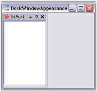

# Appearance Settings

The look and feel of the docked controls can be controlled through the appearance properties of DockingManager. Those properties are discussed in detail in the below topics.

## Foreground Settings

This section will walk you through the foreground settings of the Dock tabs, caption area and AutoHidden tabs.

### Dock Tab and Label Settings

The docking Manager provides tab and label settings for the docked windows. These settings allows you to control the appearance of the dock tabs.

#### Foreground Settings for the Dock Tabs

The font style and the height of the tab controls in a tabbed docking group can be controlled by using the following properties respectively.

<table>
<tr>
<th>
DockingManager Property</th><th>
Description</th></tr>
<tr>
<td>
DockTabFont </td><td>
Gets or sets the font for the tab control used in the  tabbed docking group.</td></tr>
<tr>
<td>
DockTabHeight</td><td>
Gets or sets the height for the tab control used in the tabbed docking group.</td></tr>
<tr>
<td>
DockTabForeColor</td><td>
Gets or sets the forecolor of the Docked tab control. This property is not applicable when the visual style is set to Metro.</td></tr>
</table>



this.dockingManager1.DockTabFont = new System.Drawing.Font("Arial", 9F, ((System.Drawing.FontStyle)((System.Drawing.FontStyle.Bold | System.Drawing.FontStyle.Underline))), System.Drawing.GraphicsUnit.Point, ((System.Byte)(0)));

this.dockingManager1.DockTabHeight = 30;




Me.DockingManager1.DockTabFont = New System.Drawing.Font("Arial", 9.0!, CType((System.Drawing.FontStyle.Bold Or System.Drawing.FontStyle.Underline), System.Drawing.FontStyle), System.Drawing.GraphicsUnit.Point, CType(0, Byte))

Me.DockingManager1.DockTabHeight = 30


  

N> ResetDockTabFont and ResetDockTabHeight methods lets you reset the above settings.



//Specifies the forecolor of the Docked tab Control.

this.dockingManager1.DockTabForeColor = System.Drawing.Color.Red;





'Specifies the forecolor of the Docked tab Control.

Me.dockingManager1.DockTabForeColor = System.Drawing.Color.Red



  

 Fore color of the docked tab is set as Red.

N> ResetDockTabFont, ResetDockTabHeight and ResetDockTabForeColor methods allows you to reset the above settings.



//Restoring to default settings

this.dockingManager1.ResetDockTabFont();

this.dockingManager1.ResetDockTabHeight();

this.dockingManager1.ResetDockTabForeColor();





'Restoring to default settings

Me.dockingManager1.ResetDockTabFont()

Me.dockingManager1.ResetDockTabHeight()

Me.dockingManager1.ResetDockTabForeColor()





Tabbing the Docked controls in [Tabbed Docking](/windowsforms/dockingmanager/Docking-Styles.html#tabbed-docking)



### AutoHidden Tabs

The font style for the [autohidden tabs](#autohidden-tabs) can be specified in AutoHideTabFont property.

<table>
<tr>
<th>
DockingManager Property</th><th>
Description</th></tr>
<tr>
<td>
AutoHideTabFont</td><td>
Gets or sets the tab for the autohide tab control.</td></tr>
</table>

N> This setting will effect only with DockingManager.VisualStyle property set as Default.



//Setting Auto hide tab Font style

this.dockingManager1.AutoHideTabFont = new System.Drawing.Font("Arial", 9.75F, ((System.Drawing.FontStyle)(((System.Drawing.FontStyle.Bold | System.Drawing.FontStyle.Italic) 

| System.Drawing.FontStyle.Underline))), System.Drawing.GraphicsUnit.Point, ((System.Byte)(0)));




'Setting Auto hide tab Font style

Me.DockingManager1.AutoHideTabFont = New System.Drawing.Font("Arial", 9.75!, CType(((System.Drawing.FontStyle.Bold Or System.Drawing.FontStyle.Italic) _

Or System.Drawing.FontStyle.Underline), System.Drawing.FontStyle), System.Drawing.GraphicsUnit.Point, CType(0, Byte))



  

The height for the auto hidden tabs can be specified in AutoHideTabHeight property.

<table>
<tr>
<th>
DockingManager Property</th><th>
Description</th></tr>
<tr>
<td>
AutoHideTabHeight</td><td>
Gets or sets the height of the autohide tab control.</td></tr>
</table>

N> This setting will effect only with DockingManager.VisualStyle property set as Default.



//Setting Auto hide tab height

this.dockingManager1.AutoHideTabHeight = 35;




'Setting Auto hide tab height

Me.DockingManager1.AutoHideTabHeight = 35


  


 
[Visual Styles](#visual-styles)



### Active and Inactive caption

#### Active Caption Settings

Caption FontStyle and foreground settings, for an active docked control, can be controlled by ActiveCaptionFont and ActiveCaptionForeGround properties.

<table>
<tr>
<th>
DockingManager Property</th><th>
Description</th></tr>
<tr>
<td>
ActiveCaptionFont</td><td>
Gets or sets the font for the active caption.</td></tr>
<tr>
<td>
ActiveCaptionForeGround</td><td>
Indicates the color of the caption text in the active state.</td></tr>
</table>

N> These settings will effect only with DockingManager.VisualStyle property set as Default.



this.dockingManager1.ActiveCaptionFont = new System.Drawing.Font("Trebuchet MS", 9.75F, System.Drawing.FontStyle.Bold, System.Drawing.GraphicsUnit.Point, ((System.Byte)(0)));

this.dockingManager1.ActiveCaptionForeGround = System.Drawing.Color.Red;




Me.dockingManager1.ActiveCaptionFont = New System.Drawing.Font("Trebuchet MS", 9.75!, System.Drawing.FontStyle.Bold, System.Drawing.GraphicsUnit.Point, CType(0, Byte))

Me.DockingManager1.ActiveCaptionForeGround = System.Drawing.Color.Red



  

#### Inactive Caption settings

By setting the InactiveCaptionFont and InactiveCaptionForeGround properties, the caption foreground appearance of the inactive controls among the docked controls can be customized.

<table>
<tr>
<th>
DockingManager Property</th><th>
Description</th></tr>
<tr>
<td>
InactiveCaptionFont</td><td>
Gets or sets the font of the inactive caption.</td></tr>
<tr>
<td>
InactiveCaptionForeGround</td><td>
Indicates the color of the caption text in inactive state.</td></tr>
</table>

N> These settings will effect only with DockingManager.VisualStyle property set as Default.


this.dockingManager1.InActiveCaptionFont = new System.Drawing.Font("Arial", 11.25F, System.Drawing.FontStyle.Bold, System.Drawing.GraphicsUnit.Point, ((System.Byte)(0)));

this.dockingManager1.InActiveCaptionForeGround = System.Drawing.Color.Blue;




Me.DockingManager1.InActiveCaptionFont = New System.Drawing.Font("Arial", 11.25!, System.Drawing.FontStyle.Bold, System.Drawing.GraphicsUnit.Point, CType(0, Byte))

Me.DockingManager1.InActiveCaptionForeGround = System.Drawing.Color.MediumSlateBlue


  

The Docking Manager provides the [ProvideGraphicsItems](/windowsforms/dockingmanager/Docking-Events.html#providegraphicsitems-event) event that can be handled for custom rendering the docking window caption area. This event is fired whenever a docking window’s caption needs to be painted and the ProvideGraphicsItemsEventArgs provides the control being drawn and allows you to specify the new set of graphics objects to use.

#### DockingManager custom styling with Metro VisualStyle

In the DockingManager, the Metro visual style has a default caption color and button color. The menu color and button color can be customized by using the properties MetroCaptionColor and MetroButtonColor, which are present in the caption bar of the docking manager.

<table>
<tr>
<th>
Property</th><th>
Description</th></tr>
<tr>
<td>
MetroCaptionColor</td><td>
Gets or sets the color value of a caption in metro style DockingManager.</td></tr>
<tr>
<td>
MetroButtonColor</td><td>
Gets or sets the color value of a metro button in metro style DockingManager.</td></tr>
</table>



//Gets or sets the color value of caption in metro style DockingManager.

this.dockingMgr.MetroCaptionColor = Color.Red;




//Gets or sets the color value of caption in metro style DockingManager.

Me.dockingMgr.MetroCaptionColor = Color.Red





//Gets or sets the color value of button in metro style DockingManager.

this.dockingMgr.MetroButtonColor = Color.Red;





//Gets or sets the color value of button in metro style DockingManager.

Me.dockingMgr.MetroButtonColor = Color.Red



 
[Visual Styles](#visual-styles)



## Background Settings

This section will discuss the background settings for the caption area of the docked controls.

### Active and Inactive caption

#### Active Caption Settings

Caption background appearance for the active docked control can be controlled through ActiveCaptionBackground property.

<table>
<tr>
<th>
DockingManager Property</th><th>
Description</th></tr>
<tr>
<td>
ActiveCaptionBackground</td><td>
Sets background for the caption area using BrushInfo object.</td></tr>
</table>

N> This setting will effect only with DockingManager.VisualStyle property set as Default.



this.dockingManager1.ActiveCaptionBackground = new Syncfusion.Drawing.BrushInfo(Syncfusion.Drawing.PatternStyle.Percent20, System.Drawing.SystemColors.InactiveCaptionText, System.Drawing.Color.FromArgb(((System.Byte)(255)), ((System.Byte)(224)), ((System.Byte)(192))));





Me.DockingManager1.ActiveCaptionBackground = New Syncfusion.Drawing.BrushInfo(Syncfusion.Drawing.PatternStyle.Percent20, System.Drawing.SystemColors.InactiveCaptionText, System.Drawing.Color.FromArgb(CType(255, Byte), CType(224, Byte), CType(192, Byte)))


  

### InactiveCaption settings

By setting the InactiveCaptionBackground properties, the caption appearance of the inactive control in the docked controls can be customized.

<table>
<tr>
<th>
DockingManager Property</th><th>
Description</th></tr>
<tr>
<td>
InactiveCaptionBackground</td><td>
Sets caption background of the inactive docked control using BrushInfo object.</td></tr>
</table>

N> This setting will effect only with DockingManager.VisualStyle property set as Default. 



this.dockingManager1.InActiveCaptionBackground = new Syncfusion.Drawing.BrushInfo(Syncfusion.Drawing.GradientStyle.Horizontal, System.Drawing.Color.Ivory, System.Drawing.SystemColors.Control);





Me.DockingManager1.InActiveCaptionBackground = New Syncfusion.Drawing.BrushInfo(Syncfusion.Drawing.GradientStyle.Horizontal, System.Drawing.Color.Ivory, System.Drawing.SystemColors.Control)



 
[Visual Styles](#visual-styles)



### Border for the Docked Control

Border color of the docked controls can be specified in the BorderColor property. 

N> that you will have to enable PaintBorders property to effect this setting.

<table>
<tr>
<th>
DockingManager Property</th><th>
Description</th></tr>
<tr>
<td>
BorderColor</td><td>
Used to set the border color for the docked control.</td></tr>
<tr>
<td>
Paint Borders</td><td>
Determines whether to paint the docked control's borders.</td></tr>
</table>



//Setting Border color

this.dockingManager1.BorderColor = System.Drawing.Color.Blue;

this.DockingManager1.PaintBorders = true;




'Setting border color

Me.DockingManager1.BorderColor = System.Drawing.Color.Blue

Me.DockingManager1.PaintBorders = True


  

### HostFormClientBorder

<table>
<tr>
<th>
DockingManager Property</th><th>
Description</th></tr>
<tr>
<td>
HostFormClientBorder</td><td>
Gets or sets a value indicating whether a border is drawn around the host form's client rectangle.</td></tr>
</table>



this.DockingManager1.HostFormClientBorder = false;




Me.DockingManager1.HostFormClientBorder = False



  

### Splitter Width

The width of the splitter between the docking windows can be set by using the SplitterWidth property.

<table>
<tr>
<th>
DockingManager Property</th><th>
Description</th></tr>
<tr>
<td>
SplitterWidth</td><td>
Gets or sets the value indicating the width of splitters between the docking window.</td></tr>
</table>



this.dockingManager1.SplitterWidth = 20;




Me.dockingManager1.SplitterWidth = 20


  

### Visual Styles

Docking manager supports various styles that adds appealing visual styles to your application. Below are the visual styles implemented in docking.

* Default (VS 2003)
* OfficeXP
* Office 2003
* VS 2005
* Office 2007 (Blue, Silver, Black)
* Office 2007 outlook
* Visual Studio 2010 
* Metro Theme

Visual styles for the windows can be customized by using the below code snippet.



//Set the visual Style of the docked controls

this.dockingManager.VisualStyle = Syncfusion.Windows.Forms.VisualStyle.Office2003;





' Set the visual Style of the docked controls

Me.dockingManager.VisualStyle = Syncfusion.Windows.Forms.VisualStyle.Office2003


  

####  Office2007 Color Schemes

DockingManager supports all the three color schemes in Office2007 visual style. This can be controlled using Office2007Theme property. 



this.dockingManager1.Office2007Theme = Syncfusion.Windows.Forms.Office2007Theme.Silver;





Me.dockingManager1.Office2007Theme = Syncfusion.Windows.Forms.Office2007Theme.Silver


  

#### Custom Color Schemes

Custom colors can also be applied DockingManager for Office2007 style, using the below code snippet.



dockingManager1.Office2007Theme = Office2007Theme.Managed;

Office2007Colors.ApplyManagedColors(this, Color.Red);





dockingManager1.Office2007Theme = Office2007Theme.Managed;

Office2007Colors.ApplyManagedColors(Me, Color.Red);


  

#### Windows Color Schemes

Windows color schemes like Blue, Silver and OliveGreen can be applied to the controls when Default or Office2003 styles are selected. XP themes can be enabled for the docked controls using ThemesEnabled property.



this.dockingManager1.ThemesEnabled = true;





Me.dockingManager1.ThemesEnabled = True



  

* Visual Studio 2010
* Metro Theme

  



Foreground settings for [Active and Inactive caption](#active-and-inactive-caption), Background settings for [Active and Inactive caption](#active-and-inactive-caption-1)

