# Appearance 

The UI for Dock, Float and AutoHide windows of DockingManager can be changed using different Style. We can customize the appearance of Docked, Float, Tabbed and AutoHide window in the DockingManager.

## Visual Styles

VisualStyles provides rich and professional look and feel UI for the Dock windows. Some of the available VisualStyles are as follows:

* Default
* Metro
* Office2003
* Office2007
* Office2007Outlook
* Office2010
* OfficeXP
* VS2003
* VS2005
* Office2007
* Office2010
* Office2016Colorful
* Office2016White
* Office2016DarkGray
* Office2016Black

The visual style can be applied for the DockingManager using [VisualStyle](https://help.syncfusion.com/cr/cref_files/windowsforms/tools/Syncfusion.Tools.Windows~Syncfusion.Windows.Forms.Tools.DockingManager~VisualStyle.html) property. The following code example illustrates how to change the visual style for DockingManager.

**Default**

This option helps to set the Default style.

#####  Code Sample





// Default

this.dockingManager1.VisualStyle = Syncfusion.Windows.Forms.VisualStyle.Default;





'Default

Me.dockingManager1.VisualStyle = Syncfusion.Windows.Forms.VisualStyle.Default





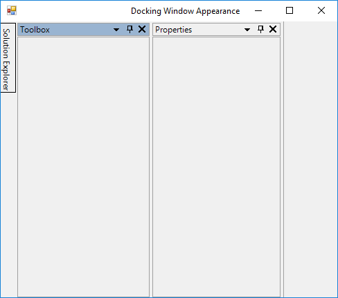

**Metro**

This option helps to set the Metro style.

#####  Code Sample





// Metro

this.dockingManager1.VisualStyle = Syncfusion.Windows.Forms.VisualStyle.Metro;





'Metro

Me.dockingManager1.VisualStyle = Syncfusion.Windows.Forms.VisualStyle.Metro





**Office2003**

This option helps to set the Office2003 style.

#####  Code Sample





// Office2003

this.dockingManager1.VisualStyle = Syncfusion.Windows.Forms.VisualStyle.Office2003;





'Office2003

Me.dockingManager1.VisualStyle = Syncfusion.Windows.Forms.VisualStyle.Office2003





**Office2007**

This option helps to set the Office2007 style.

#####  Code Sample





// Office2007

this.dockingManager1.VisualStyle = Syncfusion.Windows.Forms.VisualStyle.Office2007;





'Office2007

Me.dockingManager1.VisualStyle = Syncfusion.Windows.Forms.VisualStyle.Office2007





**Office2007Outlook**

This option helps to set the Office2007Outlook style.

#####  Code Sample





// Office2007Outlook

this.dockingManager1.VisualStyle = Syncfusion.Windows.Forms.VisualStyle.Office2007Outlook;





'Office2007Outlook

Me.dockingManager1.VisualStyle = Syncfusion.Windows.Forms.VisualStyle.Office2007Outlook





**Office2010**

This option helps to set the Office2010 style.

#####  Code Sample





// Office2010

this.dockingManager1.VisualStyle = Syncfusion.Windows.Forms.VisualStyle.Office2010;





'Office2010

Me.dockingManager1.VisualStyle = Syncfusion.Windows.Forms.VisualStyle.Office2010





**OfficeXP**

This option helps to set the OfficeXP style.

#####  Code Sample





// OfficeXP

this.dockingManager1.VisualStyle = Syncfusion.Windows.Forms.VisualStyle.OfficeXP;





'OfficeXP

Me.dockingManager1.VisualStyle = Syncfusion.Windows.Forms.VisualStyle.OfficeXP





**VS2005**

This option helps to set the VS2005 style.

#####  Code Sample





// VS2005

this.dockingManager1.VisualStyle = Syncfusion.Windows.Forms.VisualStyle.VS2005;





'VS2005

Me.dockingManager1.VisualStyle = Syncfusion.Windows.Forms.VisualStyle.VS2005





**VS2010**

This option helps to set the VS2010 style.

#####  Code Sample





// VS2010

this.dockingManager1.VisualStyle = Syncfusion.Windows.Forms.VisualStyle.VS2010;





'VS2010

Me.dockingManager1.VisualStyle = Syncfusion.Windows.Forms.VisualStyle.VS2010





**Office2016Colorful**

This option helps to set the Office2016Colorful style.

#####  Code Sample





// Office2016Colorful

this.dockingManager1.VisualStyle = Syncfusion.Windows.Forms.VisualStyle.Office2016Colorful;





'Office2016Colorful

Me.dockingManager1.VisualStyle = Syncfusion.Windows.Forms.VisualStyle.Office2016Colorful





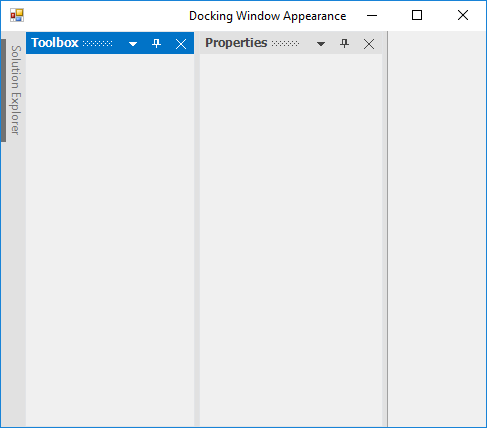

**Office2016White**

This option helps to set the Office2016White style.

#####  Code Sample





// Office2016White

this.dockingManager1.VisualStyle = Syncfusion.Windows.Forms.VisualStyle.Office2016White;





'Office2016White

Me.dockingManager1.VisualStyle = Syncfusion.Windows.Forms.VisualStyle.Office2016White





**Office2016DarkGray**

This option helps to set the Office2016DarkGray style.

#####  Code Sample





// Office2016DarkGray

this.dockingManager1.VisualStyle = Syncfusion.Windows.Forms.VisualStyle.Office2016DarkGray;





'Office2016DarkGray

Me.dockingManager1.VisualStyle = Syncfusion.Windows.Forms.VisualStyle.Office2016DarkGray





**Office2016Black**

This option helps to set the Office2016Black style.

#####  Code Sample





// Office2016Black

this.dockingManager1.VisualStyle = Syncfusion.Windows.Forms.VisualStyle.Office2016Black;





'Office2016Black

Me.dockingManager1.VisualStyle = Syncfusion.Windows.Forms.VisualStyle.Office2016Black





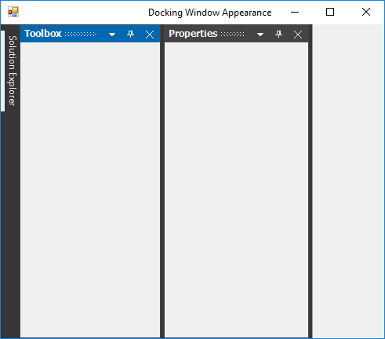

## Office 2007 color scheme

DockingManager supports all the three-color schemes in Office2007 visual style. This can be controlled using [Office2007Theme](https://help.syncfusion.com/cr/cref_files/windowsforms/tools/Syncfusion.Tools.Windows~Syncfusion.Windows.Forms.Tools.DockingManager~Office2007Theme.html) property. 





this.dockingManager1.Office2007Theme = Syncfusion.Windows.Forms.Office2007Theme.Silver;





Me.dockingManager1.Office2007Theme = Syncfusion.Windows.Forms.Office2007Theme.Silver





## Office 2010 color scheme

DockingManager supports all the three-color schemes in Office2010 visual style. This can be controlled using [Office2010Theme](https://help.syncfusion.com/cr/cref_files/windowsforms/tools/Syncfusion.Tools.Windows~Syncfusion.Windows.Forms.Tools.DockingManager~Office2010Theme.html) property. 





this.dockingManager1.Office2010Theme = Syncfusion.Windows.Forms.Office2010Theme.Black;





Me.dockingManager1.Office2010Theme = Syncfusion.Windows.Forms.Office2010Theme.Black





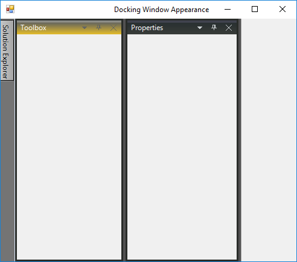

## Custom Color Schemes

Custom colors can also be applied for `Office2007` and `Office2010` style in DockingManager.

### Custom Office 2007 color scheme

Custom colors can also be applied for Office2007 by setting `Managed` style of [Office2007Theme](https://help.syncfusion.com/cr/cref_files/windowsforms/tools/Syncfusion.Tools.Windows~Syncfusion.Windows.Forms.Tools.DockingManager~Office2007Theme.html).





dockingManager1.Office2007Theme = Office2007Theme.Managed;

Office2007Colors.ApplyManagedColors(this, Color.Red);





dockingManager1.Office2007Theme = Office2007Theme.Managed

Office2007Colors.ApplyManagedColors(Me, Color.Red)





### Custom Office 2010 color scheme

Custom colors can also be applied for Office2010 by setting `Managed` style of [Office2010Theme](https://help.syncfusion.com/cr/cref_files/windowsforms/tools/Syncfusion.Tools.Windows~Syncfusion.Windows.Forms.Tools.DockingManager~Office2010Theme.html).





dockingManager1.Office2010Theme = Office2010Theme.Managed;

Office2010Colors.ApplyManagedColors(this, Color.Green);





dockingManager1.Office2010Theme = Office2010Theme.Managed

Office2010Colors.ApplyManagedColors(Me, Color.Green)





## Customize dock window

In DockingManager, we can customize background, foreground and font of docked or dockable window.

### Customize caption

The Dock and Float window caption bar BackColor, ForeColor and Font Style can be customized by using the following properties of DockingManager. This customization applies for both active and inactive docked or dockable window.

<table>
<tr>
<th>
DockingManager Property</th><th>
Description</th></tr>
<tr>
<td>
{{ '[ActiveCaptionBackground](https://help.syncfusion.com/cr/cref_files/windowsforms/tools/Syncfusion.Tools.Windows~Syncfusion.Windows.Forms.Tools.DockingManager~ActiveCaptionBackground.html)' | markdownify }}</td><td>
Sets background for the caption area using BrushInfo object</td></tr>
<tr>
<td>
{{ '[InActiveCaptionBackground](https://help.syncfusion.com/cr/cref_files/windowsforms/tools/Syncfusion.Tools.Windows~Syncfusion.Windows.Forms.Tools.DockingManager~InActiveCaptionBackground.html)' | markdownify }}</td><td>
Sets caption background of the inactive docked control using BrushInfo object</td></tr>
<tr>
<td>
{{ '[ActiveCaptionForeGround](https://help.syncfusion.com/cr/cref_files/windowsforms/tools/Syncfusion.Tools.Windows~Syncfusion.Windows.Forms.Tools.DockingManager~ActiveCaptionForeGround.html)' | markdownify }}</td><td>
Indicates the color of the caption text in the active state</td></tr>
<tr>
<td>
{{ '[InActiveCaptionForeGround](https://help.syncfusion.com/cr/cref_files/windowsforms/tools/Syncfusion.Tools.Windows~Syncfusion.Windows.Forms.Tools.DockingManager~InActiveCaptionForeGround.html)' | markdownify }}</td><td>
Indicates the color of the caption text in inactive state</td></tr>
<tr>
<td>
{{ '[ActiveCaptionFont](https://help.syncfusion.com/cr/cref_files/windowsforms/tools/Syncfusion.Tools.Windows~Syncfusion.Windows.Forms.Tools.DockingManager~ActiveCaptionFont.html)' | markdownify }}</td><td>
Gets or sets the font for the active caption</td></tr>
<tr>
<td>
{{ '[InActiveCaptionFont](https://help.syncfusion.com/cr/cref_files/windowsforms/tools/Syncfusion.Tools.Windows~Syncfusion.Windows.Forms.Tools.DockingManager~InActiveCaptionFont.html)' | markdownify }}</td><td>
Gets or sets the font of the inactive caption</td></tr>
</table>

N> These settings will effect only with [DockingManager.VisualStyle](https://help.syncfusion.com/cr/cref_files/windowsforms/tools/Syncfusion.Tools.Windows~Syncfusion.Windows.Forms.Tools.DockingManager~VisualStyle.html) property set as Default.





this.dockingManager1.ActiveCaptionBackground = new Syncfusion.Drawing.BrushInfo(Syncfusion.Drawing.PatternStyle.Percent20, System.Drawing.Color.Red, System.Drawing.Color.Red);

this.dockingManager1.InActiveCaptionBackground = new Syncfusion.Drawing.BrushInfo(Syncfusion.Drawing.GradientStyle.Horizontal, System.Drawing.Color.Green, System.Drawing.Color.Green);

this.dockingManager1.ActiveCaptionForeGround = System.Drawing.Color.Yellow;

this.dockingManager1.InActiveCaptionForeGround = System.Drawing.Color.Violet;

this.dockingManager1.ActiveCaptionFont = new System.Drawing.Font("Trebuchet MS", 9.75F, System.Drawing.FontStyle.Bold, System.Drawing.GraphicsUnit.Point, ((System.Byte)(0)));

this.dockingManager1.InActiveCaptionFont = new System.Drawing.Font("Arial", 11.25F, System.Drawing.FontStyle.Bold, System.Drawing.GraphicsUnit.Point, ((System.Byte)(0)));





this.dockingManager1.ActiveCaptionBackground = new Syncfusion.Drawing.BrushInfo(Syncfusion.Drawing.PatternStyle.Percent20, System.Drawing.Color.Red, System.Drawing.Color.Red);

Me.dockingManager1.InActiveCaptionBackground = new Syncfusion.Drawing.BrushInfo(Syncfusion.Drawing.GradientStyle.Horizontal, System.Drawing.Color.Green, System.Drawing.Color.Green);

Me.DockingManager1.ActiveCaptionForeGround = System.Drawing.Color.Yellow

Me.DockingManager1.InActiveCaptionForeGround = System.Drawing.Color.Violet

Me.dockingManager1.ActiveCaptionFont = New System.Drawing.Font("Trebuchet MS", 9.75!, System.Drawing.FontStyle.Bold, System.Drawing.GraphicsUnit.Point, CType(0, Byte))

Me.DockingManager1.InActiveCaptionFont = New System.Drawing.Font("Arial", 11.25!, System.Drawing.FontStyle.Bold, System.Drawing.GraphicsUnit.Point, CType(0, Byte))





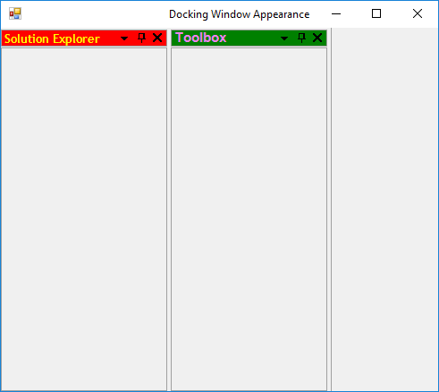

### Customize border

Border color of the docked controls can be customized by using [BorderColor](https://help.syncfusion.com/cr/cref_files/windowsforms/tools/Syncfusion.Tools.Windows~Syncfusion.Windows.Forms.Tools.DockingManager~BorderColor.html) property of DockingManager. 

N> [PaintBorders](https://help.syncfusion.com/cr/cref_files/windowsforms/tools/Syncfusion.Tools.Windows~Syncfusion.Windows.Forms.Tools.DockingManager~PaintBorders.html) property must be enabled to effect this setting.





//Setting Border color

this.dockingManager1.BorderColor = System.Drawing.Color.Red;

this.dockingManager1.PaintBorders = true;





'Setting border color

Me.dockingManager1.BorderColor = System.Drawing.Color.Red

Me.dockingManager1.PaintBorders = True





### HostFormClientBorder

By using [HostFormClientBorder](https://help.syncfusion.com/cr/cref_files/windowsforms/tools/Syncfusion.Tools.Windows~Syncfusion.Windows.Forms.Tools.DockingManager~HostFormClientBorder.html) property of DockingManager, we can enable or disable border Which was drawn around the host form's client rectangle. Default value of **HostFormClientBorder** is `true`, to disable the border of HostForm turn its value to `false`.





this.dockingManager1.HostFormClientBorder = false;





Me.dockingManager1.HostFormClientBorder = False





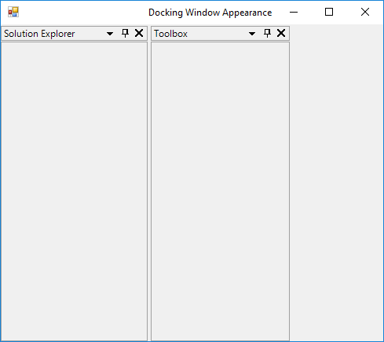

## Customize tabs in dock window

The DockingManager provides tab and label settings for the docked windows. These settings allow you to control the appearance of the dock tabs.

### Foreground settings for the dock tabs

The font style and the height of the tab controls in a tabbed docking group can be controlled by using the following properties respectively.

<table>
<tr>
<th>
DockingManager property</th><th>
Description</th></tr>
<tr>
<td>
{{ '[DockTabFont](https://help.syncfusion.com/cr/cref_files/windowsforms/tools/Syncfusion.Tools.Windows~Syncfusion.Windows.Forms.Tools.DockingManager~DockTabFont.html)' | markdownify }} </td><td>
This property helps to customize the font for the tab control used in the tabbed docking group</td></tr>
<tr>
<td>
{{ '[DockTabHeight](https://help.syncfusion.com/cr/cref_files/windowsforms/tools/Syncfusion.Tools.Windows~Syncfusion.Windows.Forms.Tools.DockingManager~DockTabHeight.html)' | markdownify }}</td><td>
This property helps to customize the tab control used in the tabbed docking group</td></tr>
<tr>
<td>
{{ '[DockTabForeColor](https://help.syncfusion.com/cr/cref_files/windowsforms/tools/Syncfusion.Tools.Windows~Syncfusion.Windows.Forms.Tools.DockingManager~DockTabForeColor.html)' | markdownify }}</td><td>
This property helps to customize header foreground color of inactive tab item in dock window</td></tr>
<tr>
<td>
{{ '[ActiveDockTabForeColor](https://help.syncfusion.com/cr/cref_files/windowsforms/tools/Syncfusion.Tools.Windows~Syncfusion.Windows.Forms.Tools.DockingManager~ActiveDockTabForeColor.html)' | markdownify }}</td><td>
This property helps to customize header foreground color of active tab item in dock window</td></tr>
<tr>
<td>
{{ '[DockTabBackColor](https://help.syncfusion.com/cr/cref_files/windowsforms/tools/Syncfusion.Tools.Windows~Syncfusion.Windows.Forms.Tools.DockingManager~DockTabBackColor.html)' | markdownify }}</td><td>
This property helps to customize header background color of inactive tab item in dock window</td></tr>
<tr>
<td>
{{ '[ActiveDockTabBackColor](https://help.syncfusion.com/cr/cref_files/windowsforms/tools/Syncfusion.Tools.Windows~Syncfusion.Windows.Forms.Tools.DockingManager~ActiveDockTabBackColor.html)' | markdownify }}</td><td>
This property helps to customize header background color of active tab item in dock window</td></tr>
<tr>
<td>
{{ '[DockTabPanelBackColor](https://help.syncfusion.com/cr/cref_files/windowsforms/tools/Syncfusion.Tools.Windows~Syncfusion.Windows.Forms.Tools.DockingManager~DockTabPanelBackColor.html)' | markdownify }}</td><td>
This property helps to customize tab panel background color of tabbed dock window</td></tr>
<tr>
<td>
{{ '[DockTabSeparatorColor](https://help.syncfusion.com/cr/cref_files/windowsforms/tools/Syncfusion.Tools.Windows~Syncfusion.Windows.Forms.Tools.DockingManager~DockTabSeparatorColor.html)' | markdownify }}</td><td>
This property helps to customize separator between the tabs in dock window</td></tr>
</table>





this.dockingManager1.DockTabFont = new System.Drawing.Font("Arial", 9F, ((System.Drawing.FontStyle)((System.Drawing.FontStyle.Italic | System.Drawing.FontStyle.Underline))), System.Drawing.GraphicsUnit.Point, ((System.Byte)(0)));

this.dockingManager1.DockTabHeight = 30;





Me.DockingManager1.DockTabFont = New System.Drawing.Font("Arial", 9.0!, CType((System.Drawing.FontStyle.Italic Or System.Drawing.FontStyle.Underline), System.Drawing.FontStyle), System.Drawing.GraphicsUnit.Point, CType(0, Byte))

Me.DockingManager1.DockTabHeight = 30









//Specifies the fore color of the Docked tab Control.

this.dockingManager1.DockTabForeColor = System.Drawing.Color.Red;





'Specifies the fore color of the Docked tab Control.

Me.dockingManager1.DockTabForeColor = System.Drawing.Color.Red





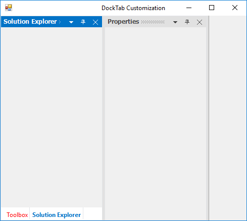





this.dockingManager1.ActiveDockTabForeColor = System.Drawing.Color.Purple;





Me.dockingManager1.ActiveDockTabForeColor = System.Drawing.Color.Purple









this.dockingManager1.DockTabBackColor = System.Drawing.Color.Yellow;





Me.dockingManager1.DockTabBackColor = System.Drawing.Color.Yellow





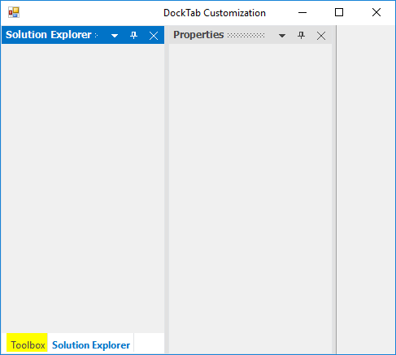





this.dockingManager1.ActiveDockTabBackColor = System.Drawing.Color.Green;





Me.dockingManager1.ActiveDockTabBackColor = System.Drawing.Color.Green





 





this.dockingManager1.DockTabPanelBackColor = System.Drawing.Color.Purple;





Me.dockingManager1.DockTabPanelBackColor = System.Drawing.Color.Purple









this.dockingManager1.DockTabSeparatorColor = System.Drawing.Color.Red;





Me.dockingManager1.DockTabSeparatorColor = System.Drawing.Color.Red





 

N> [ResetDockTabFont](https://help.syncfusion.com/cr/cref_files/windowsforms/tools/Syncfusion.Tools.Windows~Syncfusion.Windows.Forms.Tools.DockingManager~ResetDockTabFont.html), [ResetDockTabHeight](https://help.syncfusion.com/cr/cref_files/windowsforms/tools/Syncfusion.Tools.Windows~Syncfusion.Windows.Forms.Tools.DockingManager~ResetDockTabHeight.html) and [ResetDockTabForeColor](https://help.syncfusion.com/cr/cref_files/windowsforms/tools/Syncfusion.Tools.Windows~Syncfusion.Windows.Forms.Tools.DockingManager~ResetDockTabForeColor.html) functions allows you to reset the above settings.





//Restoring to default settings

this.dockingManager1.ResetDockTabFont();

this.dockingManager1.ResetDockTabHeight();

this.dockingManager1.ResetDockTabForeColor();





'Restoring to default settings

Me.dockingManager1.ResetDockTabFont()

Me.dockingManager1.ResetDockTabHeight()

Me.dockingManager1.ResetDockTabForeColor()





## Customize auto hide window

In DockingManager, we can customize the AutoHidden window tabs foreground, font and tab panel background color.

### customize auto hide tab

The Font style for the auto hidden tabs can be customized by using [AutoHideTabFont](https://help.syncfusion.com/cr/cref_files/windowsforms/tools/Syncfusion.Tools.Windows~Syncfusion.Windows.Forms.Tools.DockingManager~AutoHideTabFont.html) property of DockingManager. The height of AutoHidden tab control can be customized by using the [AutoHideTabHeight](https://help.syncfusion.com/cr/cref_files/windowsforms/tools/Syncfusion.Tools.Windows~Syncfusion.Windows.Forms.Tools.DockingManager~AutoHideTabHeight.html) property.

N> This setting will effect only with [DockingManager.VisualStyle](https://help.syncfusion.com/cr/cref_files/windowsforms/tools/Syncfusion.Tools.Windows~Syncfusion.Windows.Forms.Tools.DockingManager~VisualStyle.html) property set as Default.





//Setting Auto hide tab Font style

this.dockingManager1.AutoHideTabFont = new System.Drawing.Font("Arial", 9.75F, ((System.Drawing.FontStyle)(((System.Drawing.FontStyle.Bold | System.Drawing.FontStyle.Italic) 

| System.Drawing.FontStyle.Underline))), System.Drawing.GraphicsUnit.Point, ((System.Byte)(0)));

//Setting Auto hide tab height

this.dockingManager1.AutoHideTabHeight = 35;





'Setting Auto hide tab Font style

Me.DockingManager1.AutoHideTabFont = New System.Drawing.Font("Arial", 9.75!, CType(((System.Drawing.FontStyle.Bold Or System.Drawing.FontStyle.Italic) _

Or System.Drawing.FontStyle.Underline), System.Drawing.FontStyle), System.Drawing.GraphicsUnit.Point, CType(0, Byte))

Me.DockingManager1.AutoHideTabHeight = 35





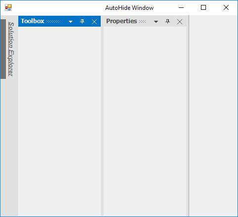

The fore color of the auto hidden tabs can be customized by using the [AutoHideTabForeColor](https://help.syncfusion.com/cr/cref_files/windowsforms/tools/Syncfusion.Tools.Windows~Syncfusion.Windows.Forms.Tools.DockingManager~AutoHideTabForeColor.html) property.





//Setting Auto hide tab fore color

this.dockingManager1.AutoHideTabForeColor = System.Drawing.Color.Red;





'Setting Auto hide tab fore color

Me.dockingManager1.AutoHideTabForeColor = System.Drawing.Color.Red





## customize auto hide panel

The background color of the Auto Hide window can be customized using the property named [TabPanelBackcolor](https://help.syncfusion.com/cr/cref_files/windowsforms/tools/Syncfusion.Tools.Windows~Syncfusion.Windows.Forms.Tools.TabControlAdv~TabPanelBackColor.html) in AHTabControl. All the auto hide TabControl can be get from the [GetAHTabControl](https://help.syncfusion.com/cr/cref_files/windowsforms/tools/Syncfusion.Tools.Windows~Syncfusion.Windows.Forms.Tools.MainFormController~GetAHTabControl.html) function of MainFormController by specifying side of auto hide TabControl. The following code used to customize the back color.





DockHost dockHost = this.dockingManager1.ControlsArray[0].Parent as DockHost; 

DockHostController dockHostController = dockHost.InternalController as DockHostController; 
 
MainFormController mainFormController = dockHostController.ParentController.ToplevelController as MainFormController; 
         
AHTabControl ahTabCtrlLeft = mainFormController.GetAHTabControl(DockingStyle.Left); 

ahTabCtrlLeft.TabPanelBackColor = Color.Yellow; 

AHTabControl ahTabCtrlBottom = mainFormController.GetAHTabControl(DockingStyle.Bottom); 

ahTabCtrlBottom.TabPanelBackColor = Color.Green; 

AHTabControl ahTabCtrlRight = mainFormController.GetAHTabControl(DockingStyle.Right); 

ahTabCtrlRight.TabPanelBackColor = Color.Gray; 

AHTabControl ahTabCtrlTop = mainFormController.GetAHTabControl(DockingStyle.Top); 

ahTabCtrlTop.TabPanelBackColor = Color.YellowGreen; 





Dim dockHost As DockHost = TryCast(Me.panel1.Parent, DockHost)

Dim dockHostController As DockHostController = TryCast(dockHost.InternalController, DockHostController)

Dim mainFormController As MainFormController = TryCast(dockHostController.ParentController.ToplevelController, MainFormController)

Dim ahTabCtrlBottom As AHTabControl = mainFormController.GetAHTabControl(DockingStyle.Bottom)

ahTabCtrlBottom.TabPanelBackColor = Color.Red

Dim ahTabCtrlLeft As AHTabControl = mainFormController.GetAHTabControl(DockingStyle.Left)

ahTabCtrlLeft.TabPanelBackColor = Color.Green

Dim ahTabCtrlRight As AHTabControl = mainFormController.GetAHTabControl(DockingStyle.Right)

ahTabCtrlRight.TabPanelBackColor = Color.Yellow

Dim ahTabCtrlTop As AHTabControl = mainFormController.GetAHTabControl(DockingStyle.Top)

ahTabCtrlTop.TabPanelBackColor = Color.Gray





## Customization with metro Style

In the DockingManager, we can customize default caption color and button color of docked or dockable windows for metro style. 

### Change the metro style floating window border width

The border width for the floating form can be set according to their user requirement by using [MetroBorderWidth](https://help.syncfusion.com/cr/cref_files/windowsforms/tools/Syncfusion.Tools.Windows~Syncfusion.Windows.Forms.Tools.DockingManager~MetroBorderWidth.html) property.





//Setting border width of the floating form

this.dockingManager1.MetroBorderWidth = 10;





'Setting border width of the floating form

Me.dockingManager1.MetroBorderWidth = 10





### Show / hide dotted lines metro style caption

The menu color and button color can be customized by using the properties [MetroCaptionColor](https://help.syncfusion.com/cr/cref_files/windowsforms/tools/Syncfusion.Tools.Windows~Syncfusion.Windows.Forms.Tools.DockingManager~MetroCaptionColor.html) and [MetroButtonColor](https://help.syncfusion.com/cr/cref_files/windowsforms/tools/Syncfusion.Tools.Windows~Syncfusion.Windows.Forms.Tools.DockingManager~MetroButtonColor.html) which are present in the caption bar of the DockingManager. The backcolor of active docked or dockable windows can be customized by [MetroColor](https://help.syncfusion.com/cr/cref_files/windowsforms/tools/Syncfusion.Tools.Windows~Syncfusion.Windows.Forms.Tools.DockingManager~MetroColor.html) property of DockingManager. And also we can enable or disable the dotted lines on the caption bar by using [ShowMetroCaptionDottedLines](https://help.syncfusion.com/cr/cref_files/windowsforms/tools/Syncfusion.Tools.Windows~Syncfusion.Windows.Forms.Tools.DockingManager~ShowMetroCaptionDottedLines.html) property.





//Gets or sets the color value of caption in metro style DockingManager.

this.dockingManager1.MetroCaptionColor = Color.Yellow;

//Gets or sets the color value of button in metro style DockingManager.

this.dockingManager1.MetroButtonColor = Color.Green;

//Setting active docked control back color

this.dockingManager1.MetroColor = System.Drawing.Color.Red;

//Helps to disable the dotted lines showing on the CaptionBar

this.dockingManager1.ShowMetroCaptionDottedLines = false;





'Gets or sets the color value of caption in metro style DockingManager.

Me.dockingManager1.MetroCaptionColor = Color.Yellow

'Gets or sets the color value of button in metro style DockingManager.

Me.dockingManager1.MetroButtonColor = Color.Green

'Setting active docked control back color

Me.dockingManager1.MetroColor = System.Drawing.Color.Red

'Helps to disable the dotted lines showing on the CaptionBar

Me.dockingManager1.ShowMetroCaptionDottedLines = False






 
[Visual Styles](/windowsforms/dockingmanager/styling)



## Change dock provider styles

While dragging and dropping a docked control, DockingManager guides you through the process, using [DragProviderStyle](https://help.syncfusion.com/cr/cref_files/windowsforms/tools/Syncfusion.Tools.Windows~Syncfusion.Windows.Forms.Tools.DockingManager~DragProviderStyle.html) property. On setting this property, you will be able to see arrows on four sides of the form, when a control is dragged. These arrows will guide you where to dock the window. Keeping the mouse point on a particular arrow will display a shadow like appearance based on the side of docking.

There are six docking provider Styles. They are, 

* Standard (Default value - no arrows appears for this option), 
* VS2005
* VS2008
* VS2010 
* VS2012
* Whidbey 
 




this.dockingManager1.DragProviderStyle = Syncfusion.Windows.Forms.Tools.DragProviderStyle.VS2008;





Me.dockingManager1.DragProviderStyle = Syncfusion.Windows.Forms.Tools.DragProviderStyle.VS2008





* VS2005 

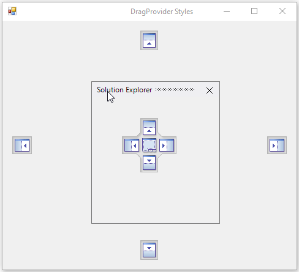

* VS2008

 

* VS2010

 

* VS2012

* Whidbey

 

* Office2016Colorful

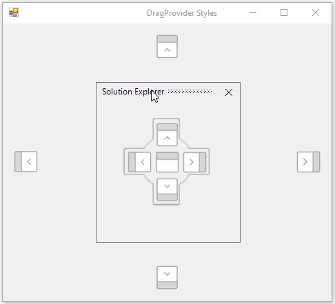 

* Office2016DarkGray

* Office2016Black 

## Right-to-left

`DockingManager` control elements can be aligned in right-to-left layout. The DockingManager control is laid out from the right to left when the HostControl [RightToLeft](https://help.syncfusion.com/cr/cref_files/windowsforms/tools/Syncfusion.Tools.Windows~Syncfusion.Windows.Forms.Tools.DockingManager~RightToLeft.html) value is set to `Yes`. 





//Enable the Right to Left 

this.dockingManager1.HostControl = this;

this.RightToLeft = RightToLeft.Yes;



l

'Enable the Right to Left 

Me.dockingManager1.HostControl = this

Me.RightToLeft = RightToLeft.Yes





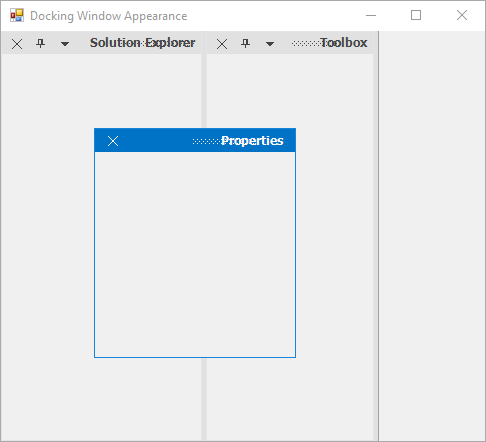  