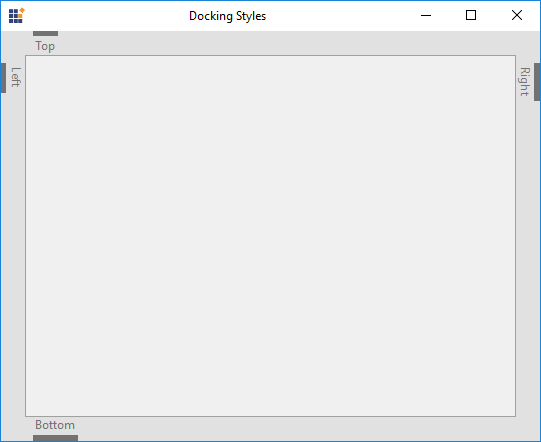
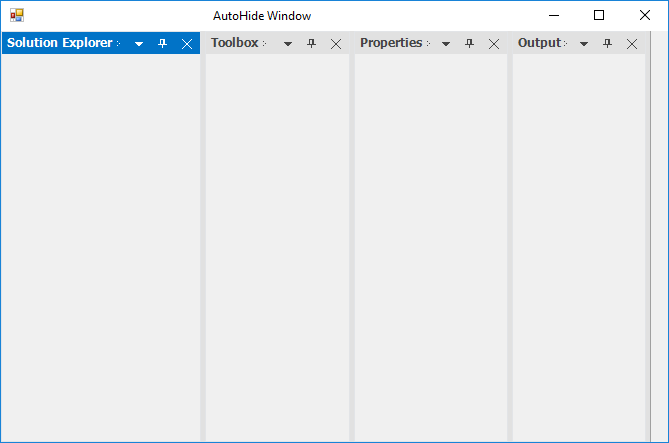
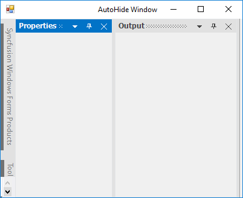

# Auto Hide Window

DockingManager provides auto hide facility to the docked control. When the auto hide button (pin) is clicked, the docked controls will be hidden, and will be placed along the side of the container control on which it was placed.  

When mouse is moved over it, the auto hidden control will be displayed. When the auto hide button is clicked again the control will restore its appearance.

## Configuring window in different sides

The side to which the Docked controls will collapse based on the [DockingStyle](https://help.syncfusion.com/cr/cref_files/windowsforms/tools/Syncfusion.Tools.Windows~Syncfusion.Windows.Forms.Tools.DockingStyle.html) of the particular control. If the control is docked to the left, while clicking the auto hide button it will be hidden to the left side.

## Enabling / disabling the auto hide functionality

The Pin button that performs auto hide functionality can be visible by default. It can be invisible to disable the Auto Hide functionality through [AutoHideEnabled](https://help.syncfusion.com/cr/cref_files/windowsforms/tools/Syncfusion.Tools.Windows~Syncfusion.Windows.Forms.Tools.DockingManager~AutoHideEnabled.html) property.





//To disable the auto hide functionality.

 this.dockingManager1.AutoHideEnabled = false;





'To disable the auto hide functionality.

 Me.dockingManager1.AutoHideEnabled = False
 




## Auto hide programmatically

DockingManager allows to auto hide the panel by mouse interaction and also provides the way to change the panel state by programmatically. [SetAutoHideMode](https://help.syncfusion.com/cr/cref_files/windowsforms/tools/Syncfusion.Tools.Windows~Syncfusion.Windows.Forms.Tools.DockingManager~SetAutoHideMode.html) function of DockingManager helps to change the panel state to auto hide state which was passed as its argument.





// Sets panel1 as AutoHidden window

this.dockingManager1.SetAutoHideMode(panel1, true); //false to remove auto hide state.





'Sets panel1 as AutoHidden window

Me.dockingManager1.SetAutoHideMode(panel1, True) 'false to remove auto hide state.





By using [GetAutoHideMode](https://help.syncfusion.com/cr/cref_files/windowsforms/tools/Syncfusion.Tools.Windows~Syncfusion.Windows.Forms.Tools.DockingManager~GetAutoHideMode.html) function of DockingManager, we can get whether the control was in auto hidden state or not.





MessageBox.Show("Panel1 is in AutoHide State:" + this.dockingManager1.GetAutoHideMode(panel1).ToString());





MessageBox.Show("Panel1 is in AutoHide State:" & Me.dockingManager1.GetAutoHideMode(panel1).ToString())





## Change auto hide side 

By default, panels will be auto hidden to side where the container resides. DockingManager also provides options to create auto hide tab control independent to container side. [DockControlInAutoHideMode](https://help.syncfusion.com/cr/cref_files/windowsforms/tools/Syncfusion.Tools.Windows~Syncfusion.Windows.Forms.Tools.DockingManager~DockControlInAutoHideMode.html) function of DockingManager which enables docking for a control and hides that in specified edge of the HostControl.





this.dockingManager1.DockControlInAutoHideMode(panel1, Syncfusion.Windows.Forms.Tools.DockingStyle.Top, 100);





'Sets panel1 as AutoHidden window

Me.dockingManager1.DockControlInAutoHideMode(panel1, Syncfusion.Windows.Forms.Tools.DockingStyle.Top, 100)





## Auto hide all dock windows on loading

The [SetAutoHideOnLoad](https://help.syncfusion.com/cr/cref_files/windowsforms/tools/Syncfusion.Tools.Windows~Syncfusion.Windows.Forms.Tools.DockingManager~SetAutoHideOnLoad.html) function of DockingManager is used to auto hide all the child windows while loading the control. 





this.dockingManager1.SetAutoHideOnLoad(this.panel1, true);

this.dockingManager1.SetAutoHideOnLoad(this.panel3, true);





Me.dockingManager1.SetAutoHideOnLoad(this.panel1, True);

Me.dockingManager1.SetAutoHideOnLoad(this.panel3, True);





## Scroll auto hidden tabs

When the AutoHidden Tabs overflow onto the side panel, ScrollButton is added to the side panel. In other words, scroll bar will be visible in AutoHide tab panel, only when child bounds exceeded to auto hide tab panel bounds. By using the scrollbar, we can select the tabs in auto hide panel by navigating the scroll buttons.

## Display full caption in auto hidden tab

Create a docked window with two ListBoxes. Dock the controls. Tab the controls and set the [FullCaptionsInAutoHideMode](https://help.syncfusion.com/cr/cref_files/windowsforms/tools/Syncfusion.Tools.Windows~Syncfusion.Windows.Forms.Tools.DockingManager~FullCaptionsInAutoHideMode.html) property. Setting this property to `true`, will display the full caption text in the auto hidden tab's page. It displays full caption within the application if necessary with a scrollbar, so that end user can scroll and view the hidden tab’s full caption.





//To display full caption in AutoHide mode.

this.dockingManager1.FullCaptionsInAutoHideMode = true;





'To display full caption in AutoHide mode.

Me.dockingManager1.FullCaptionsInAutoHideMode = True





## Re-order auto hidden tabs

The docked controls that are auto hidden can be dragged with their tabs, and can be docked or set to floating by setting [EnableDragAutoHiddenTabs](https://help.syncfusion.com/cr/cref_files/windowsforms/tools/Syncfusion.Tools.Windows~Syncfusion.Windows.Forms.Tools.DockingManager~EnableDragAutoHiddenTabs.html) property to `true`.





//To enable dragging for AutoHide mode.

this.dockingManager1.EnableDragAutoHiddenTabs = true;





'To enable dragging for AutoHide mode.

Me.dockingManager1.EnableDragAutoHiddenTabs = True





## Auto Hide Selection Style

DockingManager popup the content of auto hidden window on mouse hover the corresponding tab page. Auto hide animation can be initiated in two ways either by mouse hovering or clicking on the auto hidden tab. This behavior of DockingManager can be enabled by setting the [AutoHideSelectionStyle](https://help.syncfusion.com/cr/cref_files/windowsforms/tools/Syncfusion.Tools.Windows~Syncfusion.Windows.Forms.Tools.DockingManager~AutoHideSelectionStyle.html) property.

### Popup auto hidden window by mouse hover

This behavior of DockingManager can be enabled by setting the [AutoHideSelectionStyle](https://help.syncfusion.com/cr/cref_files/windowsforms/tools/Syncfusion.Tools.Windows~Syncfusion.Windows.Forms.Tools.DockingManager~AutoHideSelectionStyle.html) property to `MouseHover`.





//To set auto hide selection style as Click.

this.dockingManager1.AutoHideSelectionStyle = Syncfusion.Windows.Forms.Tools.AutoHideSelectionStyle.MouseHover;





'To set AutoHide selection style as Click.

Me.dockingManager1.AutoHideSelectionStyle = Syncfusion.Windows.Forms.Tools.AutoHideSelectionStyle.MouseHover





### Popup auto hidden window by mouse click

This behavior of DockingManager can be enabled by setting the [AutoHideSelectionStyle](https://help.syncfusion.com/cr/cref_files/windowsforms/tools/Syncfusion.Tools.Windows~Syncfusion.Windows.Forms.Tools.DockingManager~AutoHideSelectionStyle.html) property to `Click`.





//To set auto hide selection style as Click.

this.dockingManager1.AutoHideSelectionStyle = Syncfusion.Windows.Forms.Tools.AutoHideSelectionStyle.Click;





'To set AutoHide selection style as Click.

Me.dockingManager1.AutoHideSelectionStyle = Syncfusion.Windows.Forms.Tools.AutoHideSelectionStyle.Click





## AutoHide group / active

In DockingManager, we can auto hide the active control by using [AutoHideActiveControl](https://help.syncfusion.com/cr/cref_files/windowsforms/tools/Syncfusion.Tools.Windows~Syncfusion.Windows.Forms.Tools.DockingManager~AutoHideActiveControl.html).





this.dockingManager1.AutoHideActiveControl = false;





Me.dockingManager1.AutoHideActiveControl = False





## Animation speed

The [AnimationStep](https://help.syncfusion.com/cr/cref_files/windowsforms/tools/Syncfusion.Tools.Windows~Syncfusion.Windows.Forms.Tools.DockingManager~AnimationStep.html) property in DockingManager helps to control the animation speed of the AutoHidden controls.





DockingManager.AnimationStep = arg.Bounds.Width;





'Prevent the tabbed controls from moving

DockingManager.AnimationStep = arg.Bounds.Width





## AutoHide interval

By using the [AutoHideInterval](https://help.syncfusion.com/cr/cref_files/windowsforms/tools/Syncfusion.Tools.Windows~Syncfusion.Windows.Forms.Tools.DockingManager~AutoHideInterval.html) property of DockingManager, we can delay the display of showing or hiding the auto hide window. It's default value is `400` millisecond.





this.dockingManager1.AutoHideInterval=3000;





'Prevent the tabbed controls from moving

Me.dockingManager1.AutoHideInterval=3000





## Enable / disable animation

Animation functionality in auto hidden windows can be enabled or disabled by using the [AnimateAutoHiddenWindow](https://help.syncfusion.com/cr/cref_files/windowsforms/tools/Syncfusion.Tools.Windows~Syncfusion.Windows.Forms.Tools.DockingManager~AnimateAutoHiddenWindow.html) property of DockingManager.





this.dockingManager1.AnimateAutoHiddenWindow = false;





this.dockingManager1.AnimateAutoHiddenWindow = False





## Enable / disable the context menu 

When the docked control is in auto hide mode, an unique context menu will be displayed while right clicking the auto hide tabs, similar to Visual Studio. [EnableAutoHideTabContextMenu](https://help.syncfusion.com/cr/cref_files/windowsforms/tools/Syncfusion.Tools.Windows~Syncfusion.Windows.Forms.Tools.DockingManager~EnableAutoHideTabContextMenu.html) property should be `true`. 





this.dockingManager1.EnableAutoHideTabContextMenu = true;





Me.dockingManager1.EnableAutoHideTabContextMenu = True





The below images illustrates context menu features.

