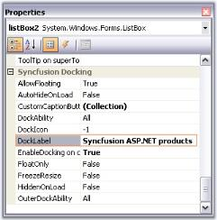
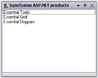

# Caption Bar

 Caption for the docked controls can be enabled using ShowCaption property. By default this property is true. 

  

The following topics will guide the end users on how to effectively use the caption bar settings for the docked controls.

## Label and Image for CaptionBar

### Caption Label

Docking Manager allows you to set the caption label by using the DockLabel property of that particular control through designer and programmatically by using the SetDockLabel method. Alignment of these labels can be specified by using the DockLabelAlignment property. Caption font of the docked controls can be specified by using the DockedCaptionFont property in the DockingManager.

Table 37: DockingManager Property Table

<table>
<tr>
<th>
DockingManager Property</th><th>
Description</th></tr>
<tr>
<td>
DockLabelAlignment</td><td>
Sets the dock label alignment. The different alignments options are, * Left* Right* Center</td></tr>
<tr>
<td>
 DockedCaptionFont</td><td>
Gets or sets the Caption font of the docked controls.</td></tr>
</table>



this.dockingManager.SetDockLabel(this.listBox1, "Syncfusion ASP.NET products");

this.dockingManager1.DockLabelAlignment = Syncfusion.Windows.Forms.Tools.DockLabelAlignmentStyle.Left;

//Specifies the caption font of the docked controls.

this.dockingManager1.DockedCaptionFont = new System.Drawing.Font("Segoe WP Light", 9, System.Drawing.FontStyle.Italic);




Me.dockingManager.SetDockLabel(Me.listBox1, "Syncfusion ASP.NET products")

Me.dockingManager1.DockLabelAlignment = Syncfusion.Windows.Forms.Tools.DockLabelAlignmentStyle.Left

'Specifies the caption font of the docked controls.

Me.dockingManager1.DockedCaptionFont = New System.Drawing.Font("Segoe WP Light", 9, System.Drawing.FontStyle.Italic)



  

  

  

  

### Custom CaptionLabel aligned to left

 

N> DockLabelAlignment can also be set easily using [Task Window](/windowsforms/Tools/DockingPackage/Caption-Bar.html#custom-caption-buttons).

### Image for the Caption

The captions can also hold images which can be enabled using ShowCaptionImages property.



this.dockingManager1.ShowCaptionImages = true;




Me.dockingManager1.ShowCaptionImages = True



The caption icons / the images can be set using this DockIcon property of the docked control.To achieve this through designer, follow the below steps.

* Create a docked window. 
* Add ImageList and add the images to it.
* Select the image list through the ImageList property of the docking manager. 
* Now go to the property of the docked control to which you have to set the dock icon. 
* Give the image index value to the DockIcon property.
* Run the application. 
* The corresponding control will be displayed with the icon that is set. 
* To disable displaying the icon, set the value as -1.

Table 38: DockedControl Property Table

<table>
<tr>
<th>
DockedControl Property</th><th>
Description</th></tr>
<tr>
<td>
DockIcon</td><td>
Index of the image associated with this docking window.</td></tr>
</table>



this.dockingManager1.SetDockIcon(this.listBox1, 2);




Me.DockingManager1.SetDockIcon(Me.ListBox1, 2)



  

### Caption Label with Dock Icon

Methods for setting Caption icons and labels are as follows.

Table 39: Methods Table

<table>
<tr>
<td>
Methods</td><td>
Description</td></tr>
<tr>
<td>
SetDockIcon</td><td>
Sets the Icon or the image for the docking window by passing the image icon as a parameter for this method.Ctrl - Represents the dock enabled control.image - Icon representing the docking window.</td></tr>
<tr>
<td>
SetDockIcon(Overloaded)</td><td>
This overloaded method returns the index of the image associated with the docking window.Ctrl - Indicates the docking window.int - A zero-based index into the ImageList property value.</td></tr>
<tr>
<td>
SetDockLabel</td><td>
Sets the text to be displayed in the docking window caption.Ctrl - Indicates the docking window.strText - A string value representing the text caption.</td></tr>
</table>
 

N>[Background](/windowsforms/Tools/DockingPackage/Appearance-Settings.html#background-settings) and [foreground](/windowsforms/Tools/DockingPackage/Appearance-Settings.html#foreground-settings) appearance of the captions can be customized.



[Caption Buttons](#caption-buttons), [Custom Caption Buttons](#custom-caption-buttons)



## Caption Buttons

The buttons available for the docked control and the properties which controls the visibility of the button are discussed in this section.

  

### Menu Button

The menu button in a docked control can be made visible or hidden by setting the MenuButtonEnabled property to true. Clicking this button will display the [context menu](/windowsforms/Tools/DockingPackage/RunTime-Features.html#context-menu) items.

### Maximize Button

Maximize button can be enabled by using the MaximizeButtonEnabled property. This maximize button allows users to maximize / restore a docking window, so that a clear view of the contents can be made visible.

N> The Maximize button will be visible only if any other control is docked to the bottom of the former control.

### Close Button

The visibility of the Close button can be controlled using the CloseEnabled property.

### AutoHide Button

Setting AutoHideEnabled property shows or hides the auto hide button in the docked control. Clicking this button will [autohide the docked controls](/windowsforms/Tools/DockingPackage/Docking-Styles.html#oncaptiondoubleclick-event).

N> Docking Manager let you customize the above default buttons and also add custom caption buttons. See [Custom Caption Buttons](/windowsforms/Tools/DockingPackage/Caption-Bar.html#custom-caption-buttons) for more details.



[Context Menu](/windowsforms/Tools/DockingPackage/RunTime-Features.html#context-menu), [AutoHiding](/windowsforms/Tools/DockingPackage/Docking-Styles.html#oncaptiondoubleclick-event)



## Custom Caption Buttons

The Custom Caption Collection Editor can be accessed by using the DockingManager. CaptionButtons property allows you to customize the default buttons and also to add new custom caption buttons. 

  

### Add and customize the caption Buttons

In the CaptionButton Collection Editor, click "Add" button to add a new caption button. To customize the caption button, modify the properties of the members in the editor.

  

This can be done programmatically by using the following code examples.



Syncfusion.Windows.Forms.Tools.CaptionButton captionButton = new Syncfusion.Windows.Forms.Tools.CaptionButton();

toolTipInfo = new Syncfusion.Windows.Forms.Tools.ToolTipInfo();

captionButton.ImageIndex = 4;

captionButton.Name = "Custom Button";

captionButton.Type = Syncfusion.Windows.Forms.Tools.CaptionButtonType.Custom;

captionButton.SuperToolTipInfo = toolTipInfo

captionButton.TransparentImageColor = System.Drawing.Color.Transparent;

this.dockingManager1.CaptionButtons.Add(captionButton);




Dim captionButton5 As Syncfusion.Windows.Forms.Tools.CaptionButton = New Syncfusion.Windows.Forms.Tools.CaptionButton()

toolTipInfo = new Syncfusion.Windows.Forms.Tools.ToolTipInfo()

captionButton.ImageIndex = 4 

captionButton.Name = "Custom Button" 

captionButton.Type = Syncfusion.Windows.Forms.Tools.CaptionButtonType.Custom;

captionButton.SuperToolTipInfo = toolTipInfo

captionButton.TransparentImageColor = System.Drawing.Color.Transparent 

Me.dockingManager1.CaptionButtons.Add(captionButton)


Refer to the following sample link that demonstrates how to add the Custom Caption Buttons.

C:\Users\&lt;User&gt;\AppData\Local\Syncfusion\EssentialStudio\Version Number\Windows\Tools.Windows\Samples\Docking Manager\Custom Captions\CS

### Custom Button for Caption Bar in Floating state

This feature enables you to add custom buttons to the caption bar when an item is in its floating state. It is not required to dock the item to use the custom buttons. 

Table 40: Properties Table

<table>
<tr>
<td>
Property </td><td>
Description </td><td>
Type </td><td>
Data Type </td><td>
Reference links </td></tr>
<tr>
<td>
ShowCustomButtonsInFloating</td><td>
Specifies whether the caption button is enabled while floating.  </td><td>
-</td><td>
Boolean </td><td>
NA </td></tr>
</table>

### Enable Custom Button for Caption Bar while Floating

To enable custom button for caption bar while floating, set the ShowCustomButtonsInFloating property to true. This is set to false, by default. 



this.dockingManager1.ShowCustomButtonsInFloating = true;





me.dockingManager1.ShowCustomButtonsInFloating = True



  

N> This feature is not applicable for VS2005 (default) visual style.

### Sample Link:

Refer to the following sample link. 

C:\Users\&lt;User&gt;\AppData\Local\Syncfusion\EssentialStudio\Version Number\Windows\Tools.Windows\Samples\Docking Manager\Custom Captions\CS

